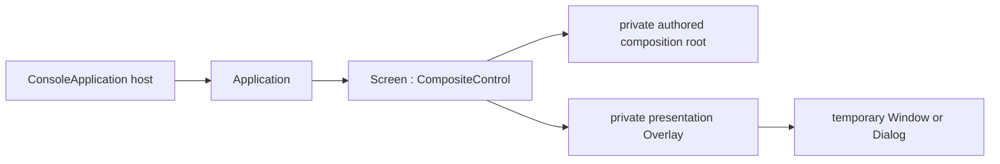

# Screen

## Screen contract

`Screen : CompositeControl` is the abstract application root. A concrete screen
creates its retained control tree in its constructor and installs exactly one
private authored root with `InitializeContent`. The root is parented directly to
the Screen. A separate private presentation `Overlay` owns temporary Windows and
dialogs above that root without entering the authored layout algorithm. The
presented object is the concrete floating surface, not a full-screen proxy. The
empty presentation plane is pointer-transparent; only a presented child claims
its cells, so authored content remains interactive everywhere else. Neither slot
is exposed as a public child collection. A Screen is not a
[`Container`](../controls/container.md#container-contract) and does not expose
`Children`; use a real layout container such as `Dock`, `Grid`, or `Stack` as
the authored root when the screen needs multiple visuals.

Screen uses the global `Control` semantic role unless its implementation selects
another role. With no complete local `Face`, `Border`, or `Shadow`, its
`ActualFace`, `ActualBorder`, and `ActualShadow` come from the active theme.
Assigning a complete local value keeps that developer value authoritative across
later theme changes.



The normal hosting surface is
`SharpVision.ConsoleApplication.CreateBuilder(screen)` or
`ConsoleApplication.RunAsync(screen)`. The host constructs the `Application`,
binds it to the detached screen, and later attaches the retained tree to the UI
dispatcher.

## Construction and lifecycle

Construction is application-independent. It creates every control whose identity
the screen retains and calls `InitializeContent` before the constructor returns.
Composition never runs from measure, render, attachment, or a virtual
base-constructor callback.

The observable lifecycle is:

1. the concrete constructor installs its composition root;
2. `OnAttach` receives the constructed `Application` before startup;
3. the application attaches, measures, arranges, and commits the first frame;
4. `OnStarted` runs after that frame, or after a valid suspended startup; and
5. `OnDispose` runs while disposal releases application-specific resources.

`OnAttach` is the place for application configuration such as theme publication.
`OnStarted` is the place for work that requires the attached tree, including
initial focus. Constructors must not require an `Application`, focus manager,
dispatcher, terminal service, or committed geometry.

Application binding validates the complete composition before publishing the
protected `Application` property. An uninitialized, disposed, owned, or already
attached tree is rejected without changing the binding. If `OnAttach` throws,
the binding is cleared and the screen is not subscribed to
`Application.Started`.

Disposal unsubscribes the started callback, invokes `OnDispose`, clears the
application binding, runs base unavailability cleanup, and then disposes the
owned composition root and temporary presentation surfaces. Cleanup continues
after callback failures and rethrows the earliest failure after state is
consistent.

## Example

```csharp
public sealed class MainScreen : Screen
{
    private readonly TextInput _name;

    public MainScreen()
    {
        _name = new TextInput();
        InitializeContent(new Stack
        {
            Children =
            {
                new Text("Name"),
                _name,
            },
        });
    }

    protected override void OnStarted(Application application)
    {
        _ = application.Focus.Focus(_name);
    }
}
```

## Expected behavior

Prove direct construction-time root ownership, private presentation-slot
ownership, root identity across first layout, attach and started ordering,
missing-composition rejection before application mutation, attach-failure
rollback, exception-complete disposal, application-wide temporary Window
geometry over a non-overlay authored root, and one hosted end-to-end startup
path.
