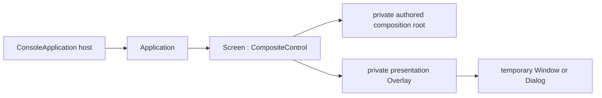

# Screen

## Overview

`Screen : CompositeControl` is the abstract application root. A concrete
screen builds its retained control tree in its constructor and installs
exactly one private authored root with `InitializeContent`. That root is
parented directly to the Screen. A separate private presentation `Overlay`
hosts temporary Windows and dialogs above the root without entering the
authored layout algorithm; what gets presented is the concrete floating
surface itself, not a full-screen proxy. While the presentation plane is
empty it is pointer-transparent — only a presented child claims its cells —
so the authored content stays interactive everywhere else. Neither slot is
exposed as a public child collection. A Screen is not a
[`Container`](../controls/container.md#overview) and has no `Children`
property; when a screen needs multiple visuals, use a real layout container
such as `Dock`, `Grid`, or `Stack` as the authored root.

A Screen uses the global `Control` semantic role unless its implementation
selects another one. With no complete local `Face`, `Border`, or `Shadow`,
its `ActualFace`, `ActualBorder`, and `ActualShadow` come from the active
theme. Assigning a complete local value keeps that developer value
authoritative across later theme changes.



The normal hosting surface is
`SharpVision.ConsoleApplication.CreateBuilder(screen)` or
`ConsoleApplication.RunAsync(screen)`. The host constructs the `Application`,
binds it to the still-detached screen, and later attaches the retained tree to
the UI dispatcher.

## Construction and lifecycle

Construction is application-independent: the constructor creates every
control whose identity the screen retains and calls `InitializeContent`
before returning. Composition never runs from measure, render, attachment, or
a virtual base-constructor callback.

The observable lifecycle is:

1. the concrete constructor installs its composition root;
2. `OnAttach` receives the constructed `Application` before startup;
3. the application attaches, measures, arranges, and commits the first frame;
4. `OnStarted` runs after that frame, or after a valid suspended startup; and
5. `OnDispose` runs while disposal releases application-specific resources.

`OnAttach` is where application configuration such as theme publication
belongs. `OnStarted` is where work that requires the attached tree belongs,
including setting initial focus. Constructors must not depend on an
`Application`, focus manager, dispatcher, terminal service, or committed
geometry.

Application binding validates the complete composition before it publishes
the protected `Application` property. An uninitialized, disposed, owned, or
already-attached tree is rejected without changing the binding. If `OnAttach`
throws, the binding is cleared and the screen is not subscribed to
`Application.Started`.

Disposal unsubscribes the started callback, invokes `OnDispose`, clears the
application binding, runs the base unavailability cleanup, and then disposes
the owned composition root and any temporary presentation surfaces. Cleanup
continues past callback failures and rethrows the earliest failure once state
is consistent.

## Example

```csharp
public sealed class MainScreen : Screen
{
    private readonly TextInput _name;

    public MainScreen()
    {
        _name = new TextInput();
        InitializeContent(new Stack
        {
            Children =
            {
                new Text("Name"),
                _name,
            },
        });
    }

    protected override void OnStarted(Application application)
    {
        _ = application.Focus.Focus(_name);
    }
}
```

## Expected behavior

A Screen owns its root from construction time and keeps the presentation slot
private. The root's identity is stable across the first layout. `OnAttach`
and `OnStarted` run in the documented order, a missing composition is
rejected before any application state is mutated, an attach failure rolls the
binding back, and disposal completes even when callbacks throw. A temporary
Window presented over a non-overlay authored root still receives
application-wide geometry, and the hosted end-to-end startup path behaves as
described above.
