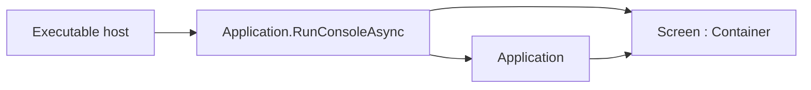

# Screen

## Screen contract

`Screen` is the abstract application-root `Container`. A screen is a normal
control in the tree: it measures, arranges, renders, routes input, and
participates in focus like any other container. Executable hosts pass a detached
screen to `Application.RunConsoleAsync` instead of assembling transport,
terminal policy, and application binding themselves.

Concrete screens derive from `Screen`, build their UI with public layout and
display controls, and override `OnAttach` or `OnStarted` when they need the
running `Application`. There is no separate root wrapper.

Because shipped layout roots such as `Dock` and `Stack` are sealed, a screen
that needs dock layout composes a `Dock` child (or another shipped container)
inside its own `Children` collection.

## Lifecycle

Construction leaves the screen detached. The runtime calls `OnAttach` after the
`Application` is constructed and before `StartAsync`. `OnStarted` runs after the
first committed frame or a valid suspended zero-cell startup. `OnDispose` runs
when the screen control is disposed.

Screens that need the running application, such as for theme publication or
initial focus, use the protected `Application` property from `OnAttach` or
`OnStarted`. Control mutation remains dispatcher-affine after attachment.

## Tests

Prove detached-root validation, attach/started ordering, disposal through the
control lifetime, and one end-to-end `RunConsoleAsync` path through a concrete
screen.
