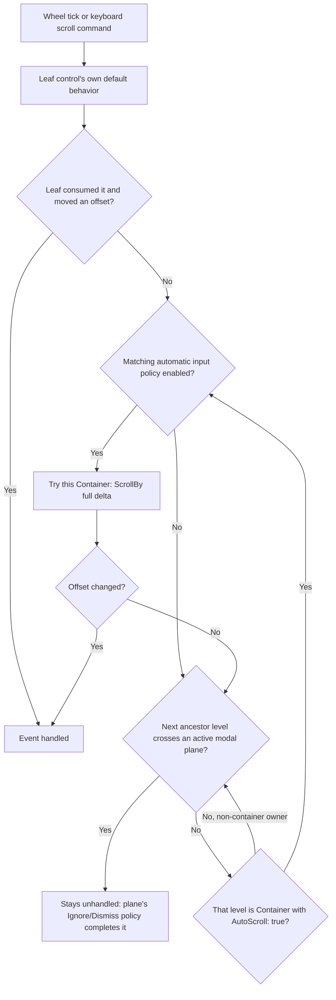

# Scrolling

## Overview

Scrolling is not a dedicated control. `AutoScroll` is an intrinsic, opt-in
property (default `false`) of every
[`Container`](../controls/container.md#overview), following the VCL/WinForms
lineage of `ScrollableControl.AutoScroll`/`TWinControl`: any panel becomes
scrollable by turning on one flag, rather than by wrapping its content in a
dedicated scroll-view control. An armed container owns its content, viewport,
extent, offsets, and independent horizontal and vertical policies: automatic,
always, or hidden. Hidden suppresses the bar but does not by itself forbid
programmatic scrolling.

An auto-sized scrolling axis grows only to its resolved `MaxWidth` or
`MaxHeight`, then exposes the remaining content through scrolling. A percentage
maximum resolves from the current containing viewport on each measure and
resize; under an unbounded discovery pass it remains unbounded so intrinsic or
wrapped content is not truncated before the finite remeasure.

`ScrollBars` selects which axes are eligible to scroll and defaults to
`Vertical`. Eligible axes are measured unbounded so children can report their
natural, intrinsic extent — the WinForms `DisplayRectangle` model — rather than
being clamped to the current viewport. The `ResolveMeasureAxis` step in
`ControlBase.MeasureOverride` clamps `DesiredSize` to the incoming constraint,
so any axis not selected by `ScrollBars` stays bounded and cannot overflow
silently.

The allocation-free
[`ScrollRange`](../../src/SharpVision/Scrolling/ScrollRange.cs) value stores
non-negative inclusive `Minimum` and `Maximum` endpoints, a `Value` contained
between them, and a non-negative `Viewport`. Its constructor rejects an
unordered or out-of-range state before anything is assigned. `Clamp` contains an
arbitrary value, and `Move` applies a signed delta with `long` saturation, so
even `int.MinValue` and `int.MaxValue` commands cannot wrap around.

[`ScrollCause`](../../src/SharpVision/Scrolling/ScrollCause.cs) records whether
a committed change came from the programmatic API, keyboard, pointer, wheel,
bring-into-view, content mutation, or resize. Controls carry that typed cause in
their change events instead of inferring intent from the resulting value.

Composite scrolling controls expose their private container through one
lifecycle-owned forwarding bridge. Explicit public properties retain their own
validation documentation while typed source getters and setters preserve the
container's validation order. Source-driven extent, viewport, offset, line,
page, and policy changes publish the matching owner property once; direct event
bridges preserve `ScrollChanged`. Width-dependent projections use one shared
coordinator that coalesces every internal reflow and arrange into at most one
settled event, so intermediate layout offsets never become public.

## Automatic scrollbar algorithm

1. Begin with always-visible bars and no automatic bars.
2. Compute the candidate viewport after visible bars.
3. Measure content; scrollable axes may be unbounded for intrinsic content, but
   percentage bases remain the candidate viewport.
4. Add an automatic bar when `extent > viewport` on its axis.
5. Recompute because one bar consumes space and may require the other.
6. Stop when visibility is stable; bars only grow during this probe.
7. Clamp offsets to `0..max(0, extent - viewport)` and arrange once.

An exact fit does not count as overflow. A zero extent produces a full-size,
stationary thumb.

`Container` and `TextInput` use the same retained scrollbar-pair controller for
rail ownership, style forwarding, this two-axis feedback loop, bounded tiny
geometry, value-before-maximum synchronization, hit testing, and rendering. They
still own their distinct range policy: editor ranges include the terminal caret
cell and word wrapping disables the horizontal editor rail, while a container
owns nested input propagation and typed scroll causes.

When a private projection depends on the final viewport width, as in `JsonView`
or a wrapped `CodeView`, a bounded synchronous transaction captures the exact
measure constraint, reprojects against the scrollbar-aware width, and remeasures
and rearranges the retained viewport until stable. Four rebuilds are the
defensive maximum; failure to converge throws instead of exposing a transitional
extent. Intermediate scroll transitions are coalesced using the earliest
previous offset and the final offset, extent, viewport, and cause.

A virtualized uniform-row host resolves a percentage row height from that same
final scrollbar-aware viewport, not from the outer allocation. The resolved
positive cell stride is frozen for the complete layout transaction and used for
extent, realization, hit testing, paging, selection reveal, and mutation
compensation. Resize or scrollbar feedback starts a new transaction and remaps
the existing offset by logical row plus its proportional position inside the old
stride, preserving the visible anchor where the new range permits it. A
progressive Table excludes its retained header from the percentage base because
only the data viewport contains virtualized rows.

## Scrollbar presentation

`ScrollBar.Style` is a nullable, complete `ScrollBarStyle`. Hosts that generate
their own bars publish the same nullable `ScrollBarStyle` plus an always-present
`ActualScrollBarStyle`. Null resolves to the library scrollbar mechanics, with
the generated scrollbar receiving the active semantic control profile; a local
complete style wins. A container binds its nullable local style slot to the
horizontal and vertical rails it owns, and composite controls such as
`TextInput` bind the same slot to their editor rails. Popup lists, page
viewports, tables, text editors, and standalone ScrollBars therefore share one
themed presentation by default.

The normal precedence applies: a local complete style wins over the Theme, which
wins over the code-owned fallback. For CLR authoring, start from one of the
shipped presets - `ScrollBarStyle.FullBlock`, `FullLine`, `ThinBlock`, or
`ThinLine` - and use a `with` expression to make a validated member-wise copy.
`Chrome` and `Fill` come from the active theme's root-level `glyphs` family
field rather than a `styles.*` section of ScrollBar's own; see
[scroll-bar.md](../controls/scrolling/scroll-bar.md).

## Thumb geometry

[`ScrollThumb.Resolve`](../../src/SharpVision/Scrolling/ScrollThumb.cs) maps a
range onto a non-negative track using integer arithmetic only. A zero-length
track yields an empty thumb, a stationary range fills the track, and a scrolling
range always gets at least one cell. The proportional length is
`round(track * viewport / (range span + viewport))`, clamped to the track, and
the start is `round(travel * value offset / range span)`. Every product is
computed in `long`, so even an `int.MaxValue` range and viewport are safe.

[`ScrollThumb.ValueAt`](../../src/SharpVision/Scrolling/ScrollThumb.cs) is the
inverse mapping used by dragging. It clamps a requested start to the available
travel, maps both endpoints exactly whenever the track can represent movement,
and rounds to the nearest range value. Resizing always recomputes geometry from
the immutable range; it never rescales a previously rounded thumb.

`ScrollBarVisibility.Hidden`, `Auto`, and `Always` define the layout policy:
`Hidden` reserves no space, `Auto` participates in the stability probe described
above, and `Always` reserves space even when the range is stationary.

## Interaction

Line, page, home, and end commands, wheel and pixel deltas, buttons, track
clicks, thumb dragging, and programmatic bring-into-view all go through typed
scroll commands. Unused delta walks up `ControlBase.Parent` through any owner
role and lands on the nearest ancestor whose runtime type is `Container` and
whose `AutoScroll` is true; a non-container composition or presentation owner
never interrupts that search. Pointer capture owns thumb dragging and is
released on disable, detach, close, or cancellation.

An armed [`Container`](../controls/container.md#overview) implements the
automatic algorithm with two privately owned framework-part
[`ScrollBar`](../../src/SharpVision/Controls/Scrolling/ScrollBar.cs) controls,
configured through their public orientation, chrome, and fill APIs. The
reservation probe runs against `ScrollBars` and the per-axis
`HorizontalBarVisibility`/`VerticalBarVisibility`: an automatic bar on one axis
can consume space that pushes the other axis over its threshold, so both bars
can induce each other before the probe stabilizes. After visibility stabilizes,
the horizontal rail owns the shared bottom-right corner when both bars are
visible; it extends through the vertical reservation while the vertical rail
stops at the viewport edge, leaving no unpainted or untargetable seam. Content
is then translated by the committed offsets and rendered through a canvas
hard-clipped to the viewport. Intrinsic shadow overflow never contributes to
`Extent`, changes scrollbar visibility, enlarges an offset range, or escapes
that viewport.

Wheel input first offers the leaf control its normal default behavior, and only
then bubbles outward through nested armed containers, stopping at an active
[modal plane](modality.md#modal-route-boundaries); if nothing along that walk
changes an offset, the wheel event stays unhandled so the plane's Ignore or
Dismiss policy can complete it. `IsWheelScrollingEnabled` defaults to `true` and
controls only this automatic container behavior. When false, the record bypasses
that container untouched and can continue through normal routed ancestry;
programmatic changes and generated scrollbar interaction remain available.

Keyboard arrows, PageUp/PageDown, and Home/End drive the same typed commands and
share the identical ancestry walk: an unconsumed remainder — arrows on an axis
already at its endpoint, or a page/endpoint command with nothing left to move —
propagates outward to the nearest enclosing armed container exactly like wheel
input, and the key is left unhandled only once no container along that walk
moved an offset. PageUp/PageDown and Home/End prefer the vertical axis; on a
container armed for horizontal scrolling only, they drive the horizontal offset
instead, so a horizontal-only container still has a fast-travel key rather than
swallowing all four for no effect. `IsKeyboardScrollingEnabled` independently
controls this automatic key handling and also defaults to `true`; disabling it
leaves matching keys available to routed ancestors without disarming the
viewport. `BringIntoView(ControlBase)` accepts any descendant reached through
owned `ControlBase.Parent` edges and makes the smallest two-axis offset change
that exposes the descendant's arranged bounds. When an armed container sits
between the receiver and the descendant, it reveals through each intervening
`Container { AutoScroll: true }` first, innermost to outermost, before computing
its own offset; the return value reports whether the descendant's complete
bounds are actually contained within the receiver's own viewport afterward, not
merely whether some offset changed, so a boundary clamp that still leaves it
partially hidden reports `false`. The same `false` result covers a
`ScrollChanged` subscriber disposing the container or an intervening ancestor
mid-walk. Content and resize changes clamp offsets before the typed
`ScrollChanged` event is raised (carrying the previous and committed offsets,
`Extent`, `Viewport`, and the typed `ScrollCause`) and before the translated
arrangement runs.

When a descendant is larger than the viewport, full containment is impossible.
`BringIntoView` exposes the nearest edge when the target is wholly outside, then
preserves any already-visible slice on later arranged passes. It does not
alternate between top/bottom or left/right alignment, and still returns `false`
to report that the complete bounds cannot fit.

Horizontal clipping is grapheme-safe. Hit testing uses viewport coordinates
after the offset is applied and never targets clipped content.

## Expected behavior

| Scope              | Observable evidence                                                                                                                                                                                                          |
| ------------------ | ---------------------------------------------------------------------------------------------------------------------------------------------------------------------------------------------------------------------------- |
| Bar composition    | No bars, one bar, or both bars — including the case where one bar induces the other — hold across every visibility policy, exact fits, and zero or tiny viewports, with bars appearing and disappearing correctly on resize. |
| Input and geometry | Content changes, offset clamping, and thumb math stay correct across every input method, including independent keyboard/wheel policy, nested propagation between armed containers, and pointer capture during dragging.      |
| Rendered state     | Focus, the disabled state, Unicode-safe clipping, and the final rendered frames stay consistent with the committed scroll state.                                                                                             |

The pure geometry additionally holds across 20,000 deterministic randomized
cases with seed `0x005C7011`: containment, repeatability, monotonic endpoint
position, exactly invertible endpoints, and a value round-trip error no larger
than one value step representable by the current track.
