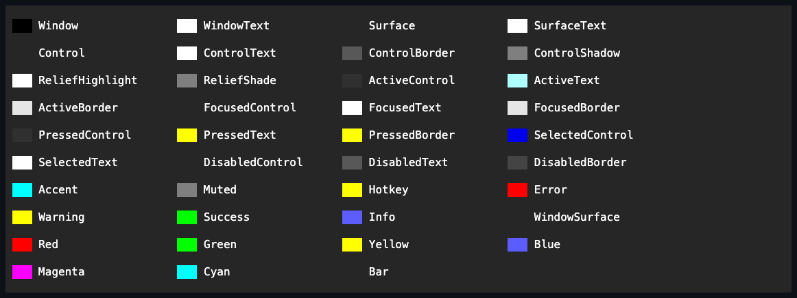
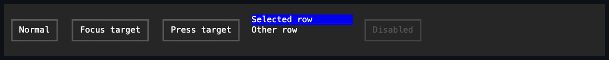
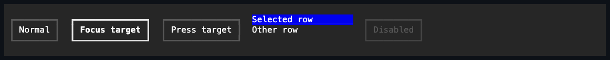
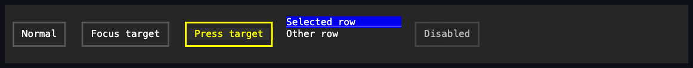

# Appearance

## Overview

SharpVision controls are styled through direct CLR properties and immutable
global themes. There is no selector cascade, no control-type map, and no mutable
style registry.

`Color` is the concrete RGB or special-color value. `Color.Default` means the
terminal's default color, and `Color.Transparent` preserves the destination
background. `ControlColor` is the discriminated value that appearance composites
accept: it holds either a concrete `Color` or a library-defined `SemanticColor`.
`ControlDecoration` likewise holds either concrete `TerminalAttributes` or a
`SemanticDecoration`. Both convert implicitly from either branch.

The Styling page in the live Showcase keeps concrete color samples beside the
complete `SemanticColor` palette. Its swatches retain semantic values and let
the active application theme resolve them; it does not build a detached theme or
copy a hand-maintained list.



The same page compares bounded `Face`, border, and shadow specimens, then uses
ordinary controls for element-state evidence. Selection and disabled state are
real control state; the focused and pressed captures are produced by pointer
actions against the mounted controls.







Appearance is grouped by responsibility:

| Complete value      | Partial set         | Members                                                              |
| ------------------- | ------------------- | -------------------------------------------------------------------- |
| `Face`              | `FaceOverlay`       | Foreground, background, attributes, underline, underline color.      |
| `Border`            | `BorderOverlay`     | Sides, glyph style, foreground, relief, background, attributes.      |
| `Shadow`            | `ShadowOverlay`     | Visibility, mode, offset, glyph, foreground, background, attributes. |
| `ControlAppearance` | `AppearanceOverlay` | Face, border, and shadow as one bulk appearance.                     |

A complete value always contains every member and is what a developer assigns
directly. A set value has nullable members and overlays only the members it
supplies; local per-state customization (`SetAppearance`) and the theme engine's
own JSON overlay both use sets so they can change part of a composite without
replacing the rest.

Controls with library-owned mechanics expose a complete local style value. The
control property is always a nullable `Style` that accepts a complete value.
`ActualStyle` is always present: it combines the local value with the active
theme-resolved value, falling back to the control's code-owned mechanical
defaults when neither supplies a member. Assigning null returns ownership to the
Theme; a complete local `Style` still wins.

Control authors declare that lifecycle once with an immutable
`StyleDefinition<TStyle>`. A control opts into that facade by declaring
[`IStyled<TStyle>`](../../src/SharpVision/Controls/IStyled.cs), whose required
`Style` and `ActualStyle` members make that contract compiler-enforced, and
forwards both members over a private `StyleSlot<TStyle>` field. That field comes
from the protected `InitializeStyle<TStyle>(definition, changed)` method every
`ControlBase` exposes, regardless of which concrete base the control actually
derives from (`ControlBase`, `InputBase`, `CompositeControlBase`,
`FloatingSurfaceBase`, or otherwise). A control that needs post-commit behavior
after a changed style commits passes a private method as `InitializeStyle`'s
optional `changed` callback - there is no virtual `OnStyleChanged` to override.
`InitializePartStyle` owns named pairs such as
`ScrollBarStyle`/`ActualScrollBarStyle`. `BindStyle` forwards the nullable local
value to matching retained-child slots, including parts created later. It never
copies a resolved value, so null reset and theme replacement remain live through
nested proxy chains. A binding releases when its target leaves the source
owner's retained subtree, so a removed part can be reused or reparented without
being disposed. Style graph values commit coherently before callbacks run;
throwing callbacks are aggregated after every target has committed, and a
reentrant newer commit abandons the older publication. The framework owns
dispatcher checks, notification order, theme transition planning, caching, exact
invalidation, and disposal of remaining binding edges.

Framework structural resolvers such as the shared input affix gap, drop-down
glyph, popup anchors, and Window close chrome register a typed Theme-value
dependency when used. Each stable descriptor owns its resolver, equality, and
impact. Repeated reads deduplicate without allocating; a later Theme replacement
compares the concrete resolved values and requests the strongest registered
measure or render impact even though those values do not appear in
`AppearanceStates`. Conditional consumers unregister when inactive, and a value
that has never been read creates no dependency. Controls therefore do not
duplicate whole-pipeline comparison overrides.

`TStyle` must derive from `ControlStyle` - see
[themes.md](themes.md#style-types) for the type hierarchy and how a control's
own `StyleDefinition<TStyle>` is built.

## Visual states

Every themeable style type derives from `ControlStyle`, which carries a complete
`Face`/`Border`/`Shadow` for its resting (`Normal`) state. The six well-known
role types resolve the complete Normal appearance plus its nine partial
per-state contributions, carried as an `AppearanceStates` instance - by
overlaying their own `styles.*` JSON key onto their code-owned default (see
[themes.md](themes.md#style-types)); every other (leaf) style type declares no
`styles.*` key of its own and instead resolves by completing a declared one-hop
fallback to one of those six, borrowing that fallback's own per-state deltas -
controls never select a closed enum of roles.

The resolver applies appearance in this order, with later supplied members
winning:

1. The style type's complete resolved normal appearance for the active Theme.
2. Theme state contributions in the fixed state order (below).
3. The complete local control Style's appearance, when one is assigned.
4. The developer's complete local `Face` and any protected derived-control
   border, shadow, or state contributions.

A control with one immutable intrinsic appearance overlay registers it once in
its constructor through `InitializeAppearanceOverlay`. `ControlBase` composes
that overlay at the same final stage for both the live and prospective Theme, so
theme-change classification and rendering see identical appearances. A second
registration is rejected; the overlay is intrinsic chrome, not another mutable
style slot.

A developer assignment therefore always wins over the Theme. `ResetFace()`
removes the public local face. The protected chrome reset and state-appearance
seams exist for control authors; an ordinary application simply assigns a
complete control Style.

`ActualFace`, `ActualBorder`, and `ActualShadow` expose the fully resolved
values for the control's current state. They are always available, even when no
local value has been assigned, and they are the supported inspection surface for
third-party rendering and composition. `ResolveAppearance(theme, visualState)`
resolves the same appearance for one explicit theme and visual-state combination
without requiring attachment - the seam consumer tests use to assert
theme-resolved values, with every semantic color resolved to the supplied
theme's literal.

IsActive states apply in this order:

```text
IsPointerOver -> FocusWithin -> Focused -> Current -> Selected -> Checked
-> Indeterminate -> Pressed -> Disabled
```

Only the direct focus owner contributes `Focused`; its ancestors contribute
`FocusWithin`. Physical pointer ancestry remains observable, but passive
controls do not opt into subtree state invalidation. Bundled themes leave the
passive `ControlStyle` unchanged for pointer, focus, press, and selection;
interactive controls resolve those cues from `InputStyle` or a specialized style
without recoloring passive descendants.

## Ambient face inheritance

Descendants may inherit a parent's resolved normal text face. Border and shadow
never inherit. A complete local face is authoritative and is never overwritten
by ambient inheritance. An opaque face forms a natural inheritance boundary; set
`IsAppearanceBoundary` when a transparent composition owner also needs to stop
inheritance.

Transparent is a valid background for composition. The foreground and underline
paint channels reject it. `Color.Default` remains an opaque terminal-default
color; it is not transparency.

## Shared chrome

Border, shadow, and body fill are intrinsic control chrome. The sealed render
pipeline draws the shadow and body before content, then overlays the border.
Custom controls implement `OnRenderContent` and never invoke a chrome helper.
The [intrinsic chrome page](intrinsic-chrome.md#overview) owns the exact public
values, modes, geometry, clipping, and test matrix.

The border background is an independent channel. A hover or focus change to the
face background does not repaint border-cell backgrounds unless that state's
`BorderOverlay` explicitly changes `Background`. This keeps button and input
frames visually stable while still letting a theme animate any border member by
state. The `Container` and `Window` style types do not inherit the generic hover
contribution, so passive surfaces stay visually unchanged while pointer ancestry
remains observable. `Window` maps the application-owned `IsActive` flag onto the
`FocusWithin` appearance contribution, switching only its border to
`SemanticColor.ActiveBorder` by default; keyboard focus remains an independent
fact. The button and input style types opt into a filled hover face. Borderless
interactive controls such as Expander, Slider, and ScrollBar rebase Input's
state colors onto Control's passive geometry, so they gain interaction cues
without inventing a frame. CheckBox, RadioButton, and CommandBarItem instead
fall back to Input directly rather than rebasing onto Control geometry; they opt
in only to the same reverse-video safety net for Focused/FocusWithin, since a
checkbox or radio button has no border to signal focus on its own. A control
that is a direct Tab-stop and focus target in its own right - a Table, TreeView,
or JsonView, none of which read their own resolved appearance for hover, press,
selection, or current-item cues that their own content already owns more
specifically - instead rebases only Focused/FocusWithin. TreeView and JsonView
use `Theme.GetFocusableContainerStyleSet` onto Container's all-sides light
border, recoloring it without changing its sides. Table uses the same focused
text delta over borderless control geometry but omits the generic reverse-video
fallback: its selected row or cell owns the strong filled cue, while reversing
the large owner surface would conflict with independently styled cells. Falling
back to the bare passive `control`/`container` key here would leave literally no
visual difference between focused and unfocused, since no bundled theme authors
a `focused`/`focusWithin` delta for either key. A custom theme may explicitly
add hover styling to any passive type.

`ShadowMode.Composite` restyles the destination cells, `BlockGlyph` writes one
configured rune, and `FractionalBlock` uses code-owned half-block glyphs.
Offsets are measured in columns; fractional Y offsets use half rows. Shadows
contribute visual overflow but never change the desired layout size.

Changing which border sides are enabled can change the reserved layout space, so
it causes measure invalidation. Changes to colors, attributes, or the glyph
family by state require only render invalidation. Resolved appearances are
cached per control state; theme publication, local assignments, state changes,
and ambient-boundary changes clear the affected cache entries. A theme
replacement compares only the currently rendered state; changes to inactive
states are resolved and laid out when that state next becomes active. Button
style comparison classifies pressed-shadow geometry from Normal plus the nine
sparse state contributions directly; it never enumerates the 512-state power
set, and adding a state therefore grows comparison work linearly.

Controls that consume a root Theme value outside an appearance profile register
that typed dependency explicitly and grade it by effect. Equal concrete outputs
across two Themes do not over-invalidate, and measure outranks render when
several consumed values change. In particular, an active marked `Text` mnemonic
depends on `Theme.Hotkey` at render level only; unmarked, disabled, or
`UseMnemonic = false` text does not subscribe to that value.

Global style-type Normal appearances define high-level chrome. Control-specific
padding, glyph families, and part colors live in each control's complete typed
style value, whose structural members are code-owned defaults completed with the
active theme-resolved appearance. Ordinary controls follow theme changes
automatically, so application code needs no Theme plumbing. Local complete Style
values remain authoritative.

Bar surfaces use `SemanticColor.Bar` for their complete normal face rather than
borrowing `Control` or `Surface` by accident. Menus, command bars, status bars,
their ordinary items and separators, and otherwise unoccupied cells therefore
form one continuous theme-authored plane. This rebase keeps the fallback's
foreground, hotkey decoration, border, shadow, and explicitly authored state
contributions. Physical hover omits only its `Face.Background`; disablement
restores the Bar background. Every other theme-authored state member still
applies, while a caller's complete local style bypasses those theme overlays and
wins unchanged in every state.

The [Control page](../controls/control.md#intrinsic-appearance) defines the
public properties, layout effects, and rendering order. The
[themes page](themes.md#overview) defines the JSON schema and global values. The
exact border and shadow value surfaces live in
[Intrinsic chrome](intrinsic-chrome.md#overview).

## Instance content: Affix

Control-specific glyph families are code-owned defaults completed with the
active theme-resolved appearance - correct for chrome the theme itself decides,
such as the drop-down chevron every input-family control shares. That is not the
same thing as one particular instance's own application content, and the two are
easy to collide on a name unless the boundary is stated explicitly.

`Affix` is a per-instance, bindable, edge-pinned decoration reserved as a fixed
cell column beside a control's caption - a `⚠` on one specific button, a `🔍` at
the head of one specific text input. It is application content, never
theme-authored, and deliberately excluded from theming for that reason: the
value varies by data, not by theme. What theming does own is the uniform
`AffixGap` between a present affix and the caption it sits beside, exposed on
each hosting style type the same way any other structural spacing member is -
except a control with no `IStyled<TStyle>` style of its own, such as
`TreeViewItem`, which owns its gap as a private per-row constant alongside its
other row-chrome geometry instead.

|             | Style glyph (existing)                   | Affix (new)                              |
| ----------- | ---------------------------------------- | ---------------------------------------- |
| Authored by | The theme                                | The application, per instance            |
| Varies by   | Terminal capability / theme              | Data                                     |
| Means       | Presentation of a built-in affordance    | Application content                      |
| Lifetime    | Frozen with the theme                    | Changes at runtime; bindable; animatable |
| Example     | The drop-down chevron every input shares | A status marker on one specific control  |

`Affix` is also distinct from the post-children adornment seam: an adornment
paints over a control's own already-rendered subtree - a focus ring, a splitter
grip - the opposite of a reserved inline column that participates in layout
before content renders. A control that hosts affixes declares its own
`StartAffix`/`EndAffix` properties backed by a shared `ControlBase` layout and
render seam; the seam never appears as a base-class property, so an author
adding affix support to a new control must wire it explicitly rather than
inherit it for free (see [Affix support](custom-components.md#affix-support)).

## Expected behavior

| Layer       | Observable evidence                                                                                                   |
| ----------- | --------------------------------------------------------------------------------------------------------------------- |
| Unit        | Complete/partial composition order, state precedence, validation, cache invalidation, reset, and ambient inheritance. |
| Surface     | Face, border, shadow, transparency, focus ancestry, combined states, and Unicode-safe chrome.                         |
| Integration | Theme replacement through the retained tree without reconstructing controls.                                          |

- Resolution behaves consistently for every style type and active `VisualState`
  combination.
- Local complete values compose correctly with later member-wise local state
  overrides.
- Transparent boundaries and the independence of the border background from the
  face background hold exactly as described above.
