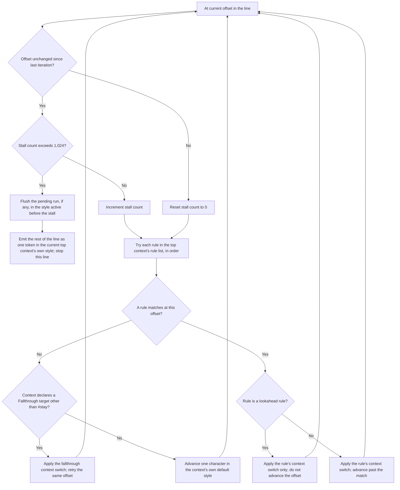
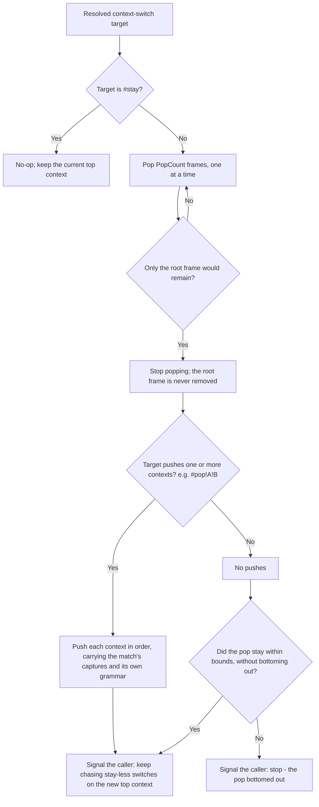

# Syntax highlighting

## Overview

`SharpVision.SyntaxHighlighting` is an independent C# reimplementation of the
[Kate](https://kate-editor.org)/KSyntaxHighlighting context-switching
highlighting engine against the public
[KDE syntax-definition XML format](https://docs.kde.org/?application=katepart&branch=stable5&path=highlight.html).
`SyntaxDefinitionReader` parses one definition file, `SyntaxGrammar.Compile`
resolves it (including any cross-definition reference) into a runtime grammar,
and `SyntaxTokenizer.Tokenize` runs that grammar's context-switching state
machine over a complete source string. KDE regular expressions execute through
PCRE2's UTF-16 engine, matching Qt's `QRegularExpression` dialect rather than
.NET's different regular-expression syntax. `CodeView` is the only consumer most
applications need; the engine types below exist as public API for anything that
needs raw tokens or fold ranges without a control attached.

Install the optional package alongside SharpVision:

```bash
dotnet add package SharpVision.SyntaxHighlighting
```

```csharp
var grammar = SyntaxDefinitionCatalog.Default.GetGrammar("Rust");
var result = SyntaxTokenizer.Tokenize(grammar, sourceText);

foreach (var token in result.Lines[0].Tokens)
{
    Console.WriteLine($"{token.Style}: {sourceText[token.Start..(token.Start + token.Length)]}");
}
```

## Engine architecture

| Type                      | Role                                                                                                   |
| ------------------------- | ------------------------------------------------------------------------------------------------------ |
| `SyntaxDefinition`        | The raw parsed shape of one XML file: metadata, keyword lists, item-data roles, and contexts.          |
| `SyntaxDefinitionReader`  | Parses one XML document into a `SyntaxDefinition`, failing fast on the first structural problem.       |
| `SyntaxGrammar`           | One definition after compilation: every `IncludeRules` spliced away, every context switch resolved.    |
| `SyntaxTokenizer`         | Runs the context-stack state machine over a complete document, once, top to bottom.                    |
| `SyntaxHighlightResult`   | One document's tokenized lines and detected fold ranges.                                               |
| `SyntaxDefinitionCatalog` | Lazy, hash-verified access to a named collection of definitions; resolves cross-definition references. |

Unlike an editor, which re-highlights only the lines a keystroke changed and
therefore needs a serializable per-line state to resume from, `CodeView`
displays immutable, already-complete text: the whole document is tokenized in
one pass whenever `Code` or `Language` changes, and the context stack lives as
an ordinary local list for that one pass rather than a reusable state object.
This is a deliberate simplification for a read-only display, not a limitation of
the underlying algorithm.

## Supported format surface

Every definition must declare its minimum engine format through the required
`kateversion` attribute. `SyntaxDefinition.KateVersion` preserves that value,
and the reader accepts format versions through 6.22; a missing, malformed, or
newer value fails before a directory catalog can publish the definition. This
keeps ignored future attributes from masquerading as compatible syntax.

Language catalog metadata follows upstream Kate's tolerant local-file rules:
`section` and `extensions` may be omitted and then remain empty, while missing
or malformed `version` and `priority` values become zero. Legacy floating-point
revision text such as `1.0` is accepted and projected to the integral
`SyntaxDefinition.Version` model. These defaults do not weaken structural XML,
context, rule, or required `kateversion` validation.

The reader enforces the schema's root envelope: one `highlighting` section,
followed by at most one `general` section, with only the declared root and
`highlighting` attributes and children. Unknown content, duplicate singleton
sections, and invalid ordering fail with `FormatException` instead of being
silently discarded. Within `general`, every schema-permitted repeated section is
processed in document order: comments and empty-line rules append, delimiter
changes accumulate, and later scalar settings take precedence.

The reader and grammar compiler support every rule element the schema defines:
`keyword`, `Float`, `HlCOct`, `HlCHex`, `Int`, `DetectChar`, `Detect2Chars`,
`AnyChar`, `StringDetect`, `WordDetect`, `RegExpr`, `LineContinue`,
`HlCStringChar`, `RangeDetect`, `HlCChar`, `IncludeRules`, `DetectSpaces`, and
`DetectIdentifier`; the full context-switch mini-language (`#stay`, `#pop`,
`#pop!Name`, multi-context `#pop!A!B`, and cross-definition
`Name##OtherLanguage` references); dynamic `%1`-`%9` context arguments captured
from a `RegExpr` match and consumed by a `dynamic="true"` rule in the context it
pushes (the mechanism heredocs and here-strings rely on); keyword lists with
per-rule case-sensitivity and delimiter overrides, including a cross-definition
`<include>ListName##OtherLanguage</include>`; and both `beginRegion`/`endRegion`
region folding and indentation-based folding. Named end markers close the most
recent open region with the same name, so differently named regions may
interleave without corrupting either fold range. Every rule's matching
algorithm - including the less obvious ones, such as `WordDetect`'s boundary
check or the escape-sequence grammar `HlCStringChar` and `HlCChar` share - was
verified line-for-line against the upstream KSyntaxHighlighting C++ source, not
inferred from the XML format documentation alone.

At each offset, the tokenizer tries the current top context's rules in order,
falls through to a declared fallthrough context when none match, and resolves a
lookahead rule's context switch without consuming a character. A budget on
same-offset transitions keeps a malformed or interacting fallthrough/lookahead
pair from stalling a line forever:



A resolved context switch (`#stay`, `#pop`, `#pop!Name`, or a multi-context
`#pop!A!B`) is then applied against the context stack, which never pops its root
frame:



Applying a switch only returns this chase-or-stop signal; it does not chase
further switches itself. Only the empty-line and end-of-line context loops
actually consume the signal to keep chasing. The main per-offset loop above
applies one switch and returns to evaluating the new top context's rules from
scratch, rather than chasing a further switch chain on its own.

Case-insensitive keywords, `StringDetect`, and `WordDetect` use Qt-compatible
Unicode simple case folding rather than .NET ordinal-ignore-case semantics. The
same allocation-free scalar folding primitive therefore handles ordinary case
pairs plus folds such as Kelvin sign to `k` and long s to `s` across every
literal-rule family. Public `TryMatch` calls reject null capture elements before
dispatching to any dynamic matcher.

`DetectIdentifier` evaluates Unicode scalars, accepting letters at the start and
every decimal-digit, letter-number, or other-number category afterward;
supplementary-plane continuations are never split into UTF-16 surrogate halves.

Indentation folding measures tabs as one cell, matching `CodeView` rendering. If
malformed look-ahead or fallthrough rules revisit one offset without consuming
text, tokenization follows at most 1,024 context transitions before styling the
remaining suffix with the active context; every non-empty output line therefore
remains completely tiled by tokens.

A catalog owns one compilation session, so a grammar reached through a
cross-definition reference is the same immutable instance returned by a direct
`GetGrammar` lookup. Concurrent first lookups also share one parse and one
compilation; failed lazy loads are removed so a later corrected resource can be
retried.

Parsed definitions, compiled grammars, and highlight results expose owned
read-only collection snapshots. Callers cannot cast those properties back to the
parser/compiler/tokenizer's mutable lists, dictionaries, or arrays. Public
syntax value structs define usable empty defaults; a resolved context target
entry remains a reference type because no valid target exists without a grammar.

Root metadata preserves both `style`, used by indentation integrations, and the
`hidden` language-picker flag. `SyntaxDefinitionInfo` carries both values in the
catalog inventory, including the embedded manifest, so callers can filter hidden
helper definitions without opening or parsing their resources.

A cross-definition reference (`IncludeRules`, a context switch, or a keyword
`<include>`) that names a definition or context the current
`SyntaxDefinitionCatalog` cannot resolve degrades to contributing nothing for
that one reference. The owning `SyntaxGrammar.Diagnostics` entry records the
source definition, declared reference, and whether the missing target was a
definition, context, or keyword list; safe degradation is therefore observable
without process-global logging or an exception that discards the usable grammar.

`RegExpr` supports PCRE2 constructs used by the shipped KDE corpus, including
possessive quantifiers, subroutine and back references, branch-reset groups,
quoted literals, and POSIX character classes. Its `minimal` attribute maps to
PCRE2's inverted-greediness option. Static expressions compile with their
grammar; invalid third-party patterns degrade to never matching.

Every match has bounded backtracking, nesting, and heap budgets. Exhausting a
budget suppresses that effective rule for the rest of the current line, so one
pathological expression cannot repay the same bound at every UTF-16 offset.
Capture-substituted dynamic expressions retain a 64-entry least-recently-used
working set per rule; distinct heredoc delimiters and similar user-controlled
captures therefore cannot create process-lifetime cache growth. Indentation
folding's `emptyLine` expressions use the same dialect and budgets.

Keyword candidates are matched directly from their source spans without
allocating temporary strings. A successful grouped regular expression only
materializes capture values when the resolved target context consumes them
through a dynamic rule, including a rule spliced through `IncludeRules`.

## The embedded catalog and licensing

`SyntaxDefinitionCatalog.Default` embeds 160 syntax definitions. 159 come from
[`KDE/syntax-highlighting`](https://github.com/KDE/syntax-highlighting), audited
to include only files whose own declared license is unambiguously permissive
(MIT, BSD-3-Clause, CC0-1.0, Zlib, or an explicit Public Domain dedication). The
audit rejects compound SPDX expressions, conflicting SPDX and XML-attribute
classifications, commented-out metadata, duplicate language names, and source
checkouts with any tracked or untracked working-tree changes. Roughly 250
upstream definitions - including C, C#, Python, PHP, Lua, MATLAB, Objective-C,
Pascal, and JSON - carry no stated license, an empty one, an ambiguous bare
`"BSD"` value, or a copyleft license, and are not redistributed by this package.
See the `SharpVision.SyntaxHighlighting` package's own `THIRD-PARTY-NOTICES.md`
for the complete per-file list and `extern/kde-syntax-highlighting/README.md`
for the full audit methodology.

Licensing excludes dependencies used by 34 otherwise-redistributable roots, so
those embedded grammars are explicitly partial: Cabal, COBOL, CoffeeScript, D2,
Dockerfile, Earthfile, Elixir/EEx, Elixir/HEEx, Elvish, Expect, InnoSetup, Jam,
Java Module, JavaScript React (JSX), Mermaid, Mustache/Handlebars (HTML), OORS,
Org Mode, PIO Assembler, PureScript, QML, R documentation, Raku, RenPy, RPM
Spec, SAS, SASS, SubRip Subtitles, TypeScript, TypeScript React (TSX), Web Video
Text Tracks, XHTML, YARA, and Zsh. The corpus contract freezes both this set and
its 192 missing-definition reference occurrences, while grammar diagnostics
expose the exact loss to applications. Adding a dependency, changing a
reference, or growing this partial set therefore requires an explicit inventory
update.

The 160th, C#, is a first-party definition original to SharpVision itself rather
than redistributed from upstream: upstream's own C# definition carries no stated
license at all and cannot be redistributed, so SharpVision wrote its own from
scratch against the C# grammar directly, released under this project's own MIT
license. `SyntaxDefinitionInfo.SourceCommit` is empty for this one entry - every
other entry's is a real 40-character upstream commit hash - since there is no
external commit for a first-party definition to pin.

`SyntaxDefinitionCatalog.FromDirectory` loads any KDE-format XML file from an
application's own files, mirroring upstream Kate's own local-file pickup model -
including one of the excluded definitions above, which an application remains
free to add on its own without this package redistributing it. Directory files
are parsed once from bounded streams during catalog construction; the catalog
retains only their immutable definitions, not a second complete XML string. When
several extension globs match, the greatest KDE `priority` wins, with the
ordinal language name as a deterministic tie-break.

`baseCatalog.Overlay(additions)` creates a new immutable combined catalog.
Definitions in `additions` win exact-name collisions, while every other base
definition remains available; the combined compiler resolves cross-definition
references across both inputs. This lets an application supply one excluded
dependency or private language without copying the complete embedded catalog.

## Theming

Every token is colored purely by its Kate default-style role
(`SyntaxDefaultStyle`, matching the format's `dsNormal`, `dsKeyword`,
`dsString`, and so on) resolved against `CodeViewStyle`. A syntax definition's
own optional literal `color`/`bold`/`italic` hints are intentionally never read,
so a theme swap restyles every embedded and external definition consistently.
Each of the 31 roles defaults to one of SharpVision's existing `SemanticColor`
values rather than a new syntax-specific one: adding global theme roles just for
source-code tokens would ripple into every built-in theme's own required color
set well beyond this optional package's boundary. A theme, or a control
instance's own local `Style`, can still repaint any individual role directly.

## Expected behavior

| Scope                 | Observable evidence                                                                                                                                                          |
| --------------------- | ---------------------------------------------------------------------------------------------------------------------------------------------------------------------------- |
| Public API            | `SyntaxDefinitionReader`, `SyntaxGrammar.Compile`, and `SyntaxTokenizer.Tokenize` validate input and produce deterministic, immutable results for the same grammar and text. |
| Integrated behavior   | `CodeView` re-tokenizes a complete document on `Code`/`Language` change and applies `SyntaxDefaultStyle` roles through the active `CodeViewStyle`.                           |
| Complete runtime path | The embedded catalog's audited licensing set and missing-definition inventory stay frozen and observable through `SyntaxDefinitionInfo` and `SyntaxGrammar.Diagnostics`.     |

- Every non-empty tokenized line is completely tiled by tokens with no gap or
  overlap, even when a malformed or pathological rule forces the tokenizer to
  fall back after 1,024 context transitions.
- A missing `kateversion`, an unsupported format version, or a structural XML
  violation (unknown content, duplicate singleton sections, invalid ordering)
  fails before a directory catalog publishes the definition.
- A cross-definition reference that cannot be resolved degrades to contributing
  nothing for that reference, recorded in `SyntaxGrammar.Diagnostics` rather
  than throwing or logging silently.
- Concurrent first lookups of the same grammar share one parse and compilation;
  a failed lazy load is removed so a corrected resource can be retried.
- Parsed definitions, compiled grammars, and highlight results expose read-only
  collection snapshots that cannot be cast back to mutable internal state.
- The embedded catalog's 160 definitions and their 34-entry partial-dependency
  set stay a frozen, explicitly tracked inventory; growing either requires an
  explicit update.
- `RegExpr` matching has bounded backtracking, nesting, and heap budgets per
  rule per line; exhausting a budget suppresses only that rule for the rest of
  the line.
