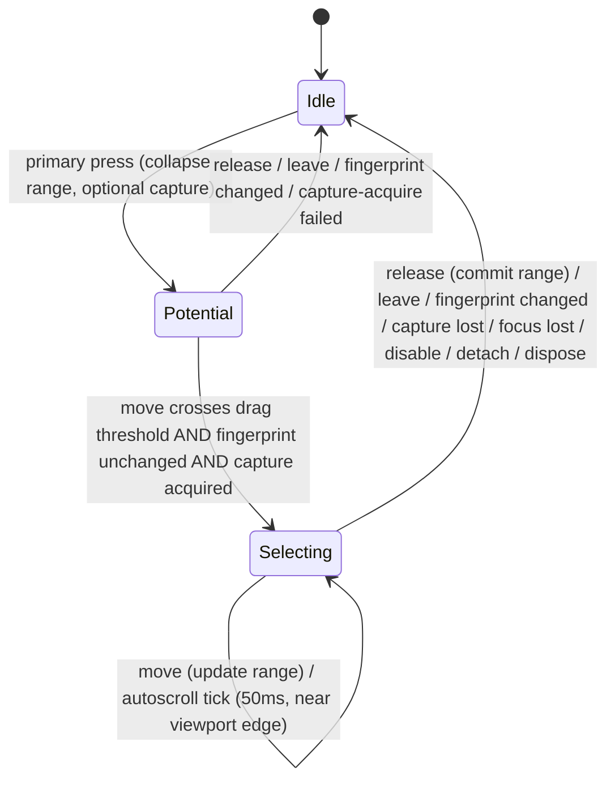

# Semantic text selection

## Overview

Semantic text selection is an opt-in `ControlBase` capability. Any control can
own one directional UTF-16 range over the text projected by itself and its
retained descendants, including a range that crosses child boundaries.
`IsTextSelectionEnabled` defaults to `false`; opting in does not implicitly make
the control focusable or a tab stop. Capability changes publish the property
before gesture setup or cleanup, but reentrant callbacks that reverse the value
own the newest transition: obsolete outer work does not cancel its gesture,
clear its range, or deliver a stale enabled-state hook afterward.

`ControlBase` owns the range, click and drag transaction, keyboard navigation,
capture, nested autoscroll, reveal, final adornment, and common change event.
Concrete controls provide only projection and policy: semantic geometry,
selectable hit regions, colors, viewport behavior, copy disclosure, and legacy
API aliases. They do not retain a second selection state machine.

The public range is read-only except through selection commands. Text mutation
remains the responsibility of an editor such as `TextInput`.

## Projection

The default projection walks semantic retained children in ownership order.
Visible leaf sources contribute complete text and visible complete-grapheme cell
geometry translated into owner-local coordinates. Clipping removes geometry, not
semantic text. Framework chrome, generated scrollbars, and decoration do not
become selectable unless their ownership role explicitly exposes them.

The indexed selection map retains:

- complete normalized text;
- visible grapheme ranges and cell rectangles;
- ordered source identity, range, captured text, generation, and optional
  `ISelectableTextViewport`;
- grapheme boundaries, row-local hit indexes, line boundaries, sticky-column
  navigation, and a semantic fingerprint.

Replacing a source with an equal string is still an identity change and clears a
stale range once. Reflow, clipping, or scrolling that preserves ordered source
identity and text preserves the range.

Authoritative controls override the projection. `Document` supplies Markdown
normalization and semantic separators; `CodeView` supplies normalized source and
fold geometry; `TextInput` supplies editor text while suppressing password text
from snapshots and copy output.

## Input and ownership

The nearest enabled owner to the routed original source normally wins. An
authoritative aggregate such as `Document` arbitrates drags beginning in its
projected descendants so one range can cross child boundaries; the descendant's
ordinary click path remains intact until the shared drag threshold is crossed.

- A primary press immediately collapses the range at the pressed caret without
  preventing an ordinary child click. The same gesture may then extend a fresh
  range after crossing the drag threshold.
- Moving one cell with the primary button held transfers capture to the owner
  and begins a cross-child drag.
- Ctrl+A selects the complete stream.
- Left/Right moves by grapheme and Ctrl+Left/Right moves by word; without Shift,
  an existing range first collapses toward the requested direction.
- Up/Down preserves a visual column. When several sparse visual rows share one
  semantic separator, navigation continues through them until the caret advances
  in the requested semantic direction or reaches the projection boundary.
- Home/End moves to a visual-row boundary in the default projection. An editor
  with an authoritative projection can override this; `TextInput` targets
  logical line boundaries, so under `WordWrap` Home and End cross wrapped rows.
- Page Up/Page Down moves by the visible height minus `PageOverlap`, with a
  minimum of one row and the same directional guarantee across sparse rows.
- Shift extends each navigation command from the established anchor.

An edge-held drag offers scrolling from the innermost eligible
`ISelectableTextViewport` outward through the selection owner and enabled
ancestor `AutoScroll` containers. The interval is 50 milliseconds and the
per-tick delta is bounded to eight cells. Modal boundaries stop ancestor
propagation. Source mutation, capture loss, losing focus (both logical and
terminal-focus loss), unavailability, disable, detach, and disposal stop
retained gesture work. A semantic projection change during an active drag
cancels the gesture before another move or release can commit its obsolete
anchor.

## Rendering and clipboard

The common owner paints selection as a final subtree adornment using
`SemanticColor.SelectedText` on `SemanticColor.SelectedControl`. Only complete
mapped graphemes are restyled, so wide cells are never split and borders or
other non-semantic chrome remain untouched. Every committed range change also
invalidates the retained surface that supplies the underlying glyph cells, so
shrinking or clearing a range repaints cells that no longer receive the
adornment. Specialized controls may retain a typed selection face while exposing
the same inherited state.

The framework's Ctrl+C handler acts during the preview phase from the
application root, ahead of descendant handlers and control defaults;
`Application` walks from focus toward the active boundary. It chooses the
nearest enabled text-selection owner before falling back to another
`IClipboardCopySource`, calls the chosen pure copy method exactly once, and
treats an empty result as authoritative. Cut, paste, replacement, and
password-disclosure policy remain editor-specific.

## Validation and threading

Selection endpoints use UTF-16 offsets and must both be extended-grapheme
boundaries within the current semantic stream. Invalid values throw before state
changes. Attached access and mutation are dispatcher-affine. A committed change
raises `TextSelectionChanged` synchronously after state and invalidation commit.

## Expected behavior

| Scope                 | Observable evidence                                                                                                                                                                                          |
| --------------------- | ------------------------------------------------------------------------------------------------------------------------------------------------------------------------------------------------------------ |
| Public API            | `IsTextSelectionEnabled`, range mutation, and navigation commands validate grapheme-boundary offsets and raise `TextSelectionChanged` synchronously after state and invalidation commit.                     |
| Integrated behavior   | The nearest enabled owner arbitrates presses, drags, keyboard navigation, autoscroll, and Ctrl+C copy through the real ownership and routing boundary, including across `Document`'s aggregated descendants. |
| Complete runtime path | Committed range changes invalidate only the retained surface supplying the affected glyph cells.                                                                                                             |

- `IsTextSelectionEnabled` defaults to `false` and opting in never implicitly
  makes a control focusable or a tab stop.
- A reentrant callback that reverses an enabled-state transition owns the newest
  state; obsolete outer work never cancels a gesture, clears a range, or
  delivers a stale hook afterward.
- Selection endpoints are always extended-grapheme boundaries in UTF-16 offsets;
  an invalid value throws before any state changes.
- Source mutation, capture loss, losing logical or terminal focus,
  unavailability, disable, detach, disposal, or a semantic projection change
  during an active drag stops the gesture before a stale anchor can commit.
- Autoscroll ticks every 50 milliseconds with a per-tick delta bounded to eight
  cells, and a modal boundary stops ancestor `AutoScroll` propagation.
- Only complete mapped graphemes are restyled by the selection adornment; wide
  cells are never split and non-semantic chrome is never painted.
- The framework's Ctrl+C handler runs during the preview phase, chooses the
  nearest enabled selection owner (falling back to another
  `IClipboardCopySource`), calls its pure copy method exactly once, and treats
  an empty result as authoritative.
- Attached access and mutation are dispatcher-affine.
