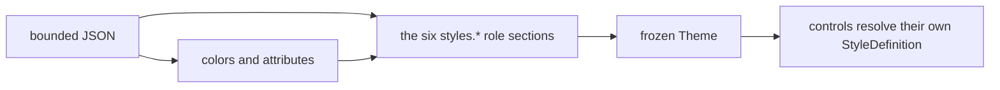

# Themes

## Overview

A SharpVision theme is a single bounded UTF-8 JSON document. It defines the
global semantic colors, terminal attributes, and a `styles` object holding
exactly six role sections - one JSON section per well-known style type. The
document contains no control instances and no application-defined selector
names. A leading UTF-8 byte order mark is accepted and ignored.



The root object accepts only these fields:

| Field                                  | Type     | Description                                                                                          |
| -------------------------------------- | -------- | ---------------------------------------------------------------------------------------------------- |
| `name`, `slug`, `colorScheme`, `order` | metadata | Embedded catalog identity and ordering.                                                              |
| `author`, `license`, `source`          | metadata | Attribution and provenance.                                                                          |
| `glyphs`                               | string   | Optional glyph family name (see [Glyph families](#glyph-families)); absent uses code-owned defaults. |
| `palette`                              | object   | At most 256 case-sensitive names mapped to RGB literals.                                             |
| `colors`                               | object   | One concrete value for every known `SemanticColor`.                                                  |
| `attributes`                           | object   | One concrete value for every known `SemanticDecoration`.                                             |
| `styles`                               | object   | Exactly the six well-known role sections (see below).                                                |

Unknown and duplicate fields are rejected. Embedded themes must carry complete
metadata, `colorScheme` included; external documents fill in missing _or blank_
identity metadata with `Custom`, `custom`, and dark. That leniency is keyed on
embedded-versus-external, not on which load method was called, so one document
gets one verdict from every entry point. `order` is a catalog concept rather
than a theme one: `ThemeCatalogEntry.Order` carries it, and an external document
has none. Programmatic `Theme` construction rejects an undefined `ColorScheme`
value and null or blank identity and provenance metadata before publishing the
theme. `ThemeCatalogEntry` rejects the same undefined color-scheme state before
publishing catalog metadata. A nonblank `slug` must be lowercase kebab case:
ASCII letters and digits separated by single hyphens. The same portable grammar
applies to parsed, programmatic, and catalog-entry slugs.

## Global values

`colors` requires these 36 properties:

```text
window, windowSurface, windowText, surface, surfaceText, control, controlText,
controlBorder, controlShadow, activeControl, activeText, activeBorder,
focusedControl, focusedText, focusedBorder, pressedControl, pressedText,
pressedBorder, selectedControl, selectedText, disabledControl,
disabledText, disabledBorder, accent, muted, hotkey, error, warning,
success, info, red, green, yellow, blue, magenta, cyan
```

Each value must be the exact name of a `palette` entry - a raw `#RGB`/`#RRGGBB`
literal is legal only inside `palette` itself, never here. Palette entries are
RGB literals and cannot reference each other. Loading a theme resolves every
value to a concrete `Color` instance, and `Theme.ResolveColor(SemanticColor)` is
the typed public lookup.

`attributes` requires these nine properties:

```text
normalText, activeText, focusedText, pressedText, selectedText,
disabledText, border, shadow, hotkey
```

Each accepts a single attribute name or an array of names; an empty array means
no attributes. `Theme.ResolveAttributes(SemanticDecoration)` is the typed public
lookup.

`Theme.Error`, `Warning`, `Success`, `Info`, `Muted`, and `Hotkey` are named
shortcuts onto `ResolveColor`, reading the same `colors` entries as every other
`SemanticColor`. A document used to be able to author these six a second time
under a parallel `status` object; that section is gone, so `colors` is the one
place any of them is written.

## Style types

Every themeable style value derives from `ControlStyle` - a required `Face`,
`Border`, and `Shadow` plus, for a specific control's own style type, whatever
structural members that control needs (padding, glyph families, mark styles, and
so on). Six sibling types generalize the common presentations - `ControlStyle`
itself (the passive base and universal fallback), `InputStyle`,
`ContainerStyle`, `WindowStyle`, `PopupStyle`, and `TooltipStyle`. Each has its
own `static Default` baking in a distinct code-owned border (none, heavy, light,
paired, rounded, and light again, respectively) and, for `Window` only, a
visible composite shadow. A control with nothing to add beyond one of these six
uses that type directly - there is no requirement to declare a new type per
control.

`styles` is a flat JSON object closed to exactly six top-level keys - one per
well-known style type: `control`, `input`, `container`, `window`, `popup`,
`tooltip`. Nothing else is accepted: not a leaf control's own key, not a
namespaced vendor key. Any other name is rejected as an unknown field, since it
is far more likely a typo of one of the six than an intentional section.

A leaf control style - `Button`, `CheckBox`, every other control with its own
style type - resolves no `styles.*` section of its own at all. Its only sources
of appearance are its code-owned default, a declared one-hop fallback to
whichever of the six well-known types is the closest semantic match, and a
locally assigned `Style`. Restyling a leaf therefore means either restyling the
role section it falls back to (moving every leaf that shares that fallback) or
assigning that one control a local `Style` - see
[theming-new-controls.md](theming-new-controls.md).

Only `control` is conventionally load-bearing: it is the terminal root every
other well-known style's `Normal` state cascades from (see below), and every
bundled theme authors it. There is no strict parse-time requirement that any
individual `styles.*` key be present, though - an absent key simply means that
type resolves entirely from its own code-owned default. Theme loading compiles
all six declared root style sections before publishing the frozen `Theme`, so a
malformed leaf fails atomically from `Parse`, `Load`, or `LoadFile` with that
loader's source label. Control inventory and first-use order never affect
validation.

Each style type's own section is an object whose top-level keys are visual state
names - `normal`, `pointerOver`, `focusWithin`, `focused`, `current`,
`selected`, `checked`, `indeterminate`, `pressed`, `disabled` - each holding a
**fractional** override object: any subset of that style type's own public
properties, reflectively patched onto a resolved base value. `normal` patches
onto the type's own code-owned default (or, for the five non-`control` well-
known styles, onto `control`'s own resolved `Normal` face/border/shadow first);
every other authored state patches onto the SAME type's own resolved `normal`,
not onto another state. An unauthored state is that type's resolved `normal`
unchanged, except where the cascade described next supplies one.

A control is often in more than one state at once - a list row can be both
`selected` and `disabled`. Every active state applies, in the fixed order the
state names are listed above, and the **later** state wins any member both of
them author. A member neither one mentions keeps whatever an earlier active
state supplied, falling back to `normal`. Writing a member back to the value
`normal` already carries is therefore meaningful rather than redundant: it is
how a later state says "for this combination, go back to the normal value" and
stops an earlier state from claiming that member.

For the five well-known styles other than `control` (`input`, `container`,
`window`, `popup`, `tooltip`), `Normal`'s `face`/`border`/`shadow` cascade from
`control` before this style's own `normal` JSON overlays on top - this is why
most bundled themes' `input`/`container`/`window`/`popup` JSON sections only
ever author a `border` delta (sides, glyph style) rather than repeating face
colors `control` already supplies.

What cascades is what `control`'s own JSON **authored**, not its whole resolved
value. A theme that sets colors on `control` and says nothing about its border
leaves each sibling's code-owned chrome intact - `input`'s heavy full border,
`container`'s light one, `window`'s paired border and shadow. A theme that does
author `control`'s border cascades that too, because it asked to. This is the
same delta rule every other state uses, and it is what lets a minimal theme
author `styles.control` alone without silently changing measured widths
everywhere, since a border's `sides` reserves layout space.

Past `Normal`, only **`input`** keeps following explicitly authored `control`
state deltas. Bundled themes reserve `control` for passive normal and disabled
defaults and author pointer, focus, press, and selection cues directly on
`input`. A custom theme may still put a deliberate shared state delta on
`control`; that delta is applied onto `input`'s own resolved `Normal`, with
`input`'s own JSON for the state winning on top. Inheriting the delta rather
than the whole value keeps `input`'s own border sides and glyph style intact, so
a state change never silently re-measures a field.

`container`, `window`, `popup`, and `tooltip` deliberately do **not** follow
`control` past `Normal`. They are passive chrome: a panel does not light up
because the pointer is over its content, and a window answers activation rather
than hover. For those four, an unauthored state simply is that type's resolved
`Normal`, and a theme that wants one to react must author the state on that
section itself. One exception exists in code, not JSON: `Window` defaults its
`focusWithin` border to `SemanticColor.ActiveBorder` unless a theme explicitly
authors `styles.window.focusWithin` itself, mirroring the application-owned
`IsActive` flag every mounted `Window` maps onto that state (see
[styling.md](styling.md#shared-chrome)).

A leaf control style's own per-state appearance is not authored JSON at all:
every state a leaf resolves - `pointerOver`, `focused`, `pressed`, and the rest

- borrows its declared fallback's own resolved per-state **delta** (what that
  role section's JSON changed about that state, not its whole resolved value)
  and re-applies just that delta onto the leaf's own resolved `Normal`. A
  `Button` falling back to `input`, for example, reacts to
  `styles.input.pointerOver` exactly as `input` itself does, with no
  `styles.button.pointerOver` of its own to layer on top or narrow it with -
  there is no such section any more.

The bundled themes keep `control`, `container`, and `window` visually unchanged
on hover. This keeps text, table shells, tab content, grouping surfaces, and
other passive ancestry stable even though physical pointer membership remains
observable. The bundled `input` section uses `surface` for its normal face and
`activeControl` during hover (authored directly on `input.pointerOver`), which
every borderless interactive leaf - `Button` included - inherits through its
fallback. Focus keeps the normal `surface`/`controlText` face, adds the focused
text decoration, and uses `activeBorder` for chrome; focus therefore remains
visible without introducing an alarm-like fill or text color. Borderless
interactive styles rebase those `input` state colors onto `control` geometry. A
custom theme may author an explicit hover contribution on any of the six
sections that wants one.

Every bundled `window` style uses `windowSurface` for its normal background and
`windowText` for its foreground. `windowSurface` is raised away from the
application `window` background, so a `Window`, `Dialog`, `MessageBox`, or file
dialog remains visually distinct from the plane beneath it without requiring a
local style. The bundled values follow each palette's existing raised-surface
tier.

`popup` and `tooltip` continue to use the `window`/`windowText` pair, and both
are framed with an all-side border for visual containment over whatever sits
beneath them. Popup uses a rounded border; Tooltip uses the light glyph style
instead, so a passive hint still reads as visually distinct from an interactive
drop-down or menu even though both are now framed.

Every fractional object shares the same precise shape regardless of which style
type or state it overrides: optional `face`, `border`, and `shadow` sub-objects
whose members match the corresponding type's own public properties (reflectively
resolved, not a hand-maintained DTO shape) - face colors and decorations; border
sides, glyph style, colors, and attributes; shadow visibility, mode, offset,
glyph, colors, and attributes.

A well-known style's own additional structural members (a window's close-chrome
glyphs, a popup's anchor arrows) sit at the top level of its state object too -
see `window`'s `closeGlyph` and `popup`'s `anchorGlyphs` below - but only under
`normal`. Nothing but `face`/`border`/`shadow` is ever read back from another
state: every per-state resolution completes a style's structural members from
its resolved `normal` alone, so a theme authoring, say,
`styles.window.pointerOver.closeGlyph` is rejected rather than parsed,
validated, and silently ignored.

A color member - whether one of `face`/`border`/`shadow`'s own nested colors or
a structural one such as `window`'s close-mark colors - accepts the same shapes:
a `SemanticColor` name, a palette key, or `"transparent"`/`"default"` - never a
raw hex literal - resolved through `Theme.Palette` lazily rather than an eager
parse-time dictionary. An exact, case-sensitive palette-key match takes
precedence over the case-insensitive semantic and special names, so keys such as
`accent` or `default` remain authorable without silently resolving to another
value. A `glyphs`-shaped member such as `anchorGlyphs` is a nested object whose
own members are each one printable, one-cell Rune string - an entry with more
than one Rune, or a Rune that measures wider than one cell, is rejected the same
way a hand-authored glyph value would be.

The same rule set covers every other member kind a style section accepts:
attributes take a literal attribute name/array or the JSON name of a global
semantic value; border glyph styles and shadow geometry are allowed because they
define the type's own chrome, not something a specific control instance owns.
Geometry objects contain exactly numeric `x` and `y` members; additional,
duplicate, missing, or differently typed members are rejected. Enum-shaped
leaves accept declared names and comma-separated declared flag names only;
numeric ordinals and numeric flag bitsets are rejected as unstable wire
representations. Individual controls may still set complete local styles that
take precedence over everything a theme supplies.

Every bundled theme except the two zero-config defaults (`default-dark`/
`default-light`, backing `ThemeCatalog.Dark`/`ThemeCatalog.White`) restyles
`input`'s hover and focus cues and `window`'s frame; none of the fifteen authors
anything beyond the six sections and the root-level `glyphs` field described
next - there is no other section left to author. A leaf's own appearance,
wherever it differs from its fallback's, now comes exclusively from its
code-owned `complete` logic (semantic colors it resolves directly, such as
`SemanticColor.Accent`) or from a locally assigned `Style`.

### Glyph families

`GlyphFamily` bundles the one theme-wide glyph personality shared by six
controls that would otherwise need six near-identical sections: CheckBox's mark
style and glyph trio, RadioButton's mark style and glyph pair, ScrollBar's
chrome, fill, and ten-glyph set, Spinner's frame sequence, ProgressBar's fill,
track, and indeterminate glyphs, and ChaseIndicator's active and inactive
glyphs. The root-level `glyphs` field selects one family by name,
case-insensitively: `dots`, `blocks`, `ascii`, `shades`, or `lines`. An absent
field - including both zero-config defaults - resolves every one of those six
styles to `GlyphFamily.Default`, the exact code-owned presentation each carried
before this field existed; an unrecognized name fails with a source-labelled
`InvalidDataException` like every other malformed theme value. Complete public
glyph-family structs also normalize their zero-initialized `default` value to
their code-owned family, so assigning one through a typed style cannot defer
invalid Rune failures to render.

| `glyphs` value | Look           | Extracted from       |
| -------------- | -------------- | -------------------- |
| `dots`         | Round, dotted  | Catppuccin           |
| `blocks`       | Solid, blocky  | Dracula, One Dark    |
| `ascii`        | Portable ASCII | Gruvbox              |
| `shades`       | Shade-block    | Monokai, Tokyo Night |
| `lines`        | Line-drawing   | Nord, Solarized      |

These six controls have no `styles.*` section of their own to layer on top any
more: `glyphs` is now their only theme-driven presentation lever beyond their
control-derived chrome and a locally assigned `Style`. ProgressBar's
`FillColor`/`TrackColor`/`IndeterminateColor` are not part of a glyph family
either; they stay code-owned (`Accent`/`Muted`/`Info`), themeable only through a
local `Style`.

### Where a section name comes from

A section key is not a free-form string: it is **derived from the style type
that owns it**. Drop a trailing `Style` and lower-case the first character - so
`ControlStyle` owns `control`, `InputStyle` owns `input`, and the same rule
accounts for the remaining four well-known roots. Deriving the key from the type
keeps the two from drifting apart, but only the six well-known roots ever
resolve a section through this derivation: a leaf control style's own derived
key (`ButtonStyle` would derive `button`) is never looked up against a theme
document at all, since `styles` admits only the six names regardless of what a
type's own key would compute to.

Register a library style type's fallback definition with
`StyleDefinitions.Control<TStyle, TFallback>(fallbackTo, complete, compare)` -
the one factory every leaf control style calls, and the only one left now that a
leaf resolves no section of its own. `Part<TStyle>` remains for a secondary
style forwarded to a control's retained pieces rather than owning that control's
own appearance. Both are public and require no internal access; see
[theming-new-controls.md](theming-new-controls.md) for a worked example.

## Example

```json
{
  "name": "Example",
  "slug": "example",
  "colorScheme": "dark",
  "order": 10,
  "author": "Example author",
  "license": "MIT",
  "source": "https://example.invalid/theme",
  "palette": {
    "page": "#101218",
    "ink": "#e7e9ee",
    "surface": "#181b24",
    "panel": "#202431",
    "outline": "#596170",
    "shadow": "#050608",
    "highlight": "#283044",
    "focus": "#22304a",
    "press": "#182030",
    "select": "#315b99",
    "muted": "#808080",
    "faintOutline": "#464b57",
    "accent": "#72a7ff",
    "hotkey": "#ffcc66",
    "danger": "#ff5c57",
    "warn": "#f3f99d",
    "ok": "#5af78e",
    "magenta": "#ff6ac1",
    "cyan": "#6be2d9"
  },
  "colors": {
    "window": "page",
    "windowSurface": "surface",
    "windowText": "ink",
    "surface": "surface",
    "surfaceText": "ink",
    "control": "panel",
    "controlText": "ink",
    "controlBorder": "outline",
    "controlShadow": "shadow",
    "activeControl": "highlight",
    "activeText": "ink",
    "activeBorder": "accent",
    "focusedControl": "focus",
    "focusedText": "ink",
    "focusedBorder": "accent",
    "pressedControl": "press",
    "pressedText": "ink",
    "pressedBorder": "accent",
    "selectedControl": "select",
    "selectedText": "ink",
    "disabledControl": "panel",
    "disabledText": "muted",
    "disabledBorder": "faintOutline",
    "accent": "accent",
    "muted": "muted",
    "hotkey": "hotkey",
    "error": "danger",
    "warning": "warn",
    "success": "ok",
    "info": "accent",
    "red": "danger",
    "green": "ok",
    "yellow": "warn",
    "blue": "accent",
    "magenta": "magenta",
    "cyan": "cyan"
  },
  "attributes": {
    "normalText": [],
    "activeText": [],
    "focusedText": "bold",
    "pressedText": [],
    "selectedText": [],
    "disabledText": "dim",
    "border": [],
    "shadow": "dim",
    "hotkey": "underline"
  },
  "styles": {
    "control": {
      "normal": {
        "face": {
          "foreground": "controlText",
          "background": "control",
          "attributes": "normalText"
        },
        "border": {
          "sides": "none",
          "glyphStyle": "rounded",
          "foreground": "controlBorder",
          "background": "control",
          "attributes": "border"
        },
        "shadow": {
          "visible": false,
          "mode": "composite",
          "offset": { "x": 0, "y": 0 },
          "glyph": "▓",
          "foreground": "controlShadow",
          "background": "transparent",
          "attributes": "shadow"
        }
      }
    },
    "input": {
      "normal": {
        "face": { "background": "surface" },
        "border": { "sides": "all", "glyphStyle": "heavy" }
      },
      "pointerOver": {
        "face": { "foreground": "activeText", "background": "activeControl" },
        "border": { "foreground": "activeBorder" }
      }
    },
    "container": {
      "normal": { "border": { "sides": "all", "glyphStyle": "light" } }
    },
    "window": {
      "normal": {
        "face": { "foreground": "windowText", "background": "windowSurface" },
        "border": { "sides": "all", "glyphStyle": "paired" },
        "shadow": {
          "visible": true,
          "mode": "composite",
          "offset": { "x": 2, "y": 1 }
        },
        "closeGlyph": "x"
      }
    },
    "popup": {
      "normal": {
        "face": { "foreground": "windowText", "background": "window" },
        "border": { "sides": "all", "glyphStyle": "rounded" },
        "anchorGlyphs": { "pointingUp": "^", "pointingDown": "v" }
      }
    },
    "tooltip": {
      "normal": {
        "face": { "foreground": "windowText", "background": "window" },
        "border": { "sides": "all", "glyphStyle": "light" }
      }
    }
  }
}
```

## Loading and publication

`ThemeCatalog.Load(slug)` loads an embedded theme, `ThemeCatalog.Parse(json)`
parses a string, `ThemeCatalog.Load(stream)` reads a caller-owned stream without
closing it, and `ThemeCatalog.LoadFile(path)` reads a file.
`ThemeCatalog.Entries` and `ThemeCatalog.Slugs` expose the ordered embedded
catalog. Embedded themes are parsed lazily and cached; each external load
returns a new frozen instance.

For typed construction, create an unfrozen `Theme`, configure semantic colors
with `SetColor`, semantic decorations with `SetAttributes`, the glyph family
with `SetGlyphs`, and any of the six root state sets with `SetStyleSet`, then
call `Freeze`. Mutation after freezing throws. `Application.Theme` accepts only
a frozen instance, so unfinished construction state cannot enter a live retained
tree.

Input is limited to 64 KiB, a JSON depth of eight, 256 palette entries, and
2,048 characters per metadata string. Comments, trailing commas, malformed
UTF-8, invalid element kinds, unknown top-level or `styles.*` key names, and
malformed colors all fail with a source-labelled `InvalidDataException` - for
`styles.*` leaf values specifically, at first resolution rather than at parse
time (see [Style types](#style-types) above).

Style-property metadata is cached once per style type; rejected JSON member
names are never retained, so repeated invalid external documents cannot grow a
process-lifetime negative-key cache.

Assigning `Application.Theme` publishes an already-frozen theme through the
retained control tree on the dispatcher; controls are not reconstructed. The
resolver caches each style type's resolved set per
`(Theme, VisualState combination)`, and theme replacement, local appearance
changes, and relevant state changes invalidate those entries.

## Expected behavior

| Layer      | Observable evidence                                                                                       |
| ---------- | --------------------------------------------------------------------------------------------------------- |
| Parser     | Size/depth bounds, malformed UTF-8/JSON, unknown names, invalid composites, and source-labelled failures. |
| Resolution | Global values, the `control`-Normal cascade, state overlays, local precedence, and frozen publication.    |
| Catalog    | Every embedded theme parses, and its bundled `styles` sections retain stable metadata and slug order.     |
| Surface    | Theme swaps update mounted controls, chrome, text, and visual states without reconstruction.              |

- Stream loading leaves the caller's stream open, and file and embedded loading
  each behave as described above.
- `control`'s Normal cascade and every well-known type's own JSON overrides
  resolve exactly as specified.
- Publication is dispatcher-affine and invalidates only the phases the change
  actually affects.
