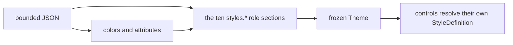
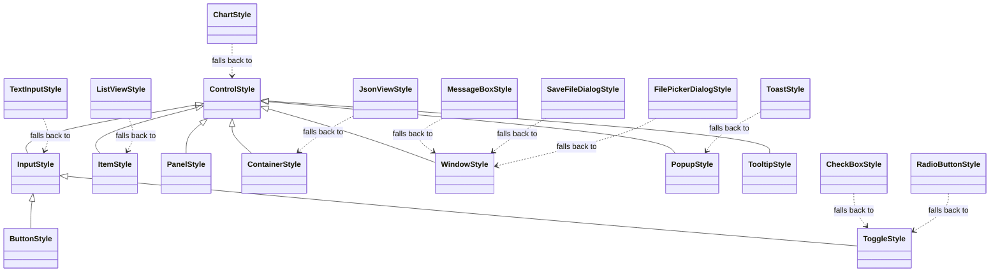

# Themes

## Overview

A SharpVision theme is a single bounded UTF-8 JSON document. It defines the
global semantic colors, terminal attributes, and a `styles` object holding at
most ten role sections - one JSON section per well-known style type. The
document contains no control instances and no application-defined selector
names. A leading UTF-8 byte order mark is accepted and ignored.



The root object accepts only these fields:

| Field                                  | Type     | Description                                                                                          |
| -------------------------------------- | -------- | ---------------------------------------------------------------------------------------------------- |
| `name`, `slug`, `colorScheme`, `order` | metadata | Embedded catalog identity and ordering.                                                              |
| `author`, `license`, `source`          | metadata | Attribution and provenance.                                                                          |
| `glyphs`                               | string   | Optional glyph family name (see [Glyph families](#glyph-families)); absent uses code-owned defaults. |
| `palette`                              | object   | At most 256 case-sensitive names mapped to RGB literals.                                             |
| `colors`                               | object   | One concrete value for every known `SemanticColor`.                                                  |
| `attributes`                           | object   | One concrete value for every known `SemanticDecoration`.                                             |
| `styles`                               | object   | Any subset of the ten well-known role sections (see below).                                          |

Unknown and duplicate fields are rejected. Embedded themes must carry complete
metadata, `colorScheme` included; external documents fill in missing _or blank_
identity metadata with `Custom`, `custom`, and dark. That leniency is keyed on
embedded-versus-external, not on which load method was called, so one document
gets one verdict from every entry point. `order` is a catalog concept rather
than a theme one: `ThemeCatalogEntry.Order` carries it, and an external document
has none. Programmatic `Theme` construction rejects an undefined `ColorScheme`
value and null or blank identity and provenance metadata before publishing the
theme. `ThemeCatalogEntry` rejects the same undefined color-scheme state before
publishing catalog metadata. A nonblank `slug` must be lowercase kebab case:
ASCII letters and digits separated by single hyphens. The same portable grammar
applies to parsed, programmatic, and catalog-entry slugs. `source` must be an
absolute HTTP or HTTPS URL. `license` must be one of the supported SPDX
identifiers accepted by typed construction; invalid provenance is rejected
consistently by programmatic, parsed, and catalog-entry metadata.

## Global values

`colors` requires these 39 properties:

```text
window, windowSurface, windowText, surface, surfaceText, bar, control, controlText,
controlBorder, controlShadow, reliefHighlight, reliefShade, activeControl, activeText, activeBorder,
focusedControl, focusedText, focusedBorder, pressedControl, pressedText,
pressedBorder, selectedControl, selectedText, disabledControl,
disabledText, disabledBorder, accent, muted, hotkey, error, warning,
success, info, red, green, yellow, blue, magenta, cyan
```

Each value must be the exact name of a `palette` entry - a raw `#RGB`/`#RRGGBB`
literal is legal only inside `palette` itself, never here. Palette entries are
RGB literals and cannot reference each other. Loading a theme resolves every
value to a concrete `Color` instance, and `Theme.ResolveColor(SemanticColor)` is
the typed public lookup.

`bar` is the normal raised-navigation background for `Menu`, `MenuItem`,
`MenuSeparator`, `CommandBar`, `CommandBarItem`, `CommandBarSeparator`,
`StatusBar`, and `StatusBarItem`. Each bundled theme maps it deliberately to a
palette tier that retains at least 4.5:1 contrast with `controlText` and
`activeText` at truecolor and xterm-256 depth, and stays distinct from the
`window` plane it lies on, the input `surface`, and the active, selected, and
pressed fills used around it. Every bundled theme except Turbo Vision also keeps
it distinct from the `windowSurface`, `control`, and `disabledControl` faces;
Turbo Vision paints its menu and status strip in the same gray as its dialogs,
exactly as Borland did, and relies on the blue desktop between them to keep the
two apart. Physical hover omits only its `Face.Background`, while disablement
restores the Bar background; every other authored state member still applies.
Focus, selection, checked, and press may replace the Bar background while
active. A complete local style bypasses these theme overlays and remains
authoritative in every state. Each bundled `disabledText` remains different from
`controlText` and retains at least 3:1 contrast with both Bar and
`disabledControl` at truecolor and xterm-256 depth, keeping unavailable entries
subdued but legible. Every bundled `selectedControl` pairing likewise retains at
least 4.5:1 contrast with `selectedText` at truecolor and xterm-256 depth so a
selected bar row does not make its caption disappear.

`hotkey` is the default color of the access-key grapheme of every mnemonic
caption - the value every face's `accessKeyColor` channel carries until a role
section authors its own (see [Access keys](#access-keys)). Every bundled theme
except Turbo Vision underlines that grapheme as well, keeps `hotkey` at the same
4.5:1 floor as ordinary text against both Bar and `selectedControl`, and lets
every face inherit it. Turbo Vision reproduces Borland's access keys per role
and, like Borland, draws no underline: red on the gray bar (0x74) and on the
green selection bar (0x24), yellow on the green button (0x2E), the cyan cluster
(0x3E), and the gray dialog face (0x7E). Those measure between 3.34:1 and 2.18:1
on the CGA palette; the theme keeps the historical pairings on purpose, and its
curated-theme tests pin that floor - against the bar, the selection fill, and
every role's own face - rather than the AA one.

### Access keys

A mnemonic caption (`&File`) colors its marked grapheme with the
`accessKeyColor` channel of the face it is drawn on, resolved exactly as the
caption's foreground is: a `Text` owned as a `Button`, `CheckBox`, `MenuItem`,
`GroupBox`, or other caption inherits its owner's resolved face through the
ambient rule (see [styling.md](styling.md#ambient-face-inheritance)), so the
letter takes the color the theme chose for that owner's plane and current state.
The channel defaults to `hotkey`, which is why a theme that never names it
behaves exactly as before the channel existed, and any role section may author
it under any state - `styles.button.normal.face.accessKeyColor`,
`styles.control.selected.face.accessKeyColor` - the same way it authors a
foreground. It is a paint channel: transparent is rejected. This is what lets a
theme whose planes differ widely in luminance keep every mnemonic legible where
one theme-wide color could not - a red letter on a light menu bar and a yellow
one on a dark button at the same time. A disabled caption never colors its
grapheme.

The grapheme's decoration is theme-wide: `attributes.hotkey`
(`SemanticDecoration.Hotkey`) is wrapped around it - `underline` in every
bundled theme but Turbo Vision, whose empty value leaves the letter
distinguished by color alone, the way Borland drew it. A caption with a marked
mnemonic registers a render-only dependency on that decoration, so a theme swap
that changes only it repaints without remeasuring; a changed color arrives
through ordinary appearance invalidation like any other face channel.

`reliefHighlight` and `reliefShade` model one light source above and to the left
of the surface: `BorderRelief.Raised` paints the top and left edges with
`reliefHighlight` and the bottom and right edges with `reliefShade`, and
`BorderRelief.Sunken` reverses the assignment. A theme author cannot infer the
correct direction from the color names alone - `reliefHighlight` must resolve
lighter than `reliefShade`, or every `Raised`/`Sunken` border in that theme
reads as the opposite of what it asked for.

`attributes` requires these nine properties:

```text
normalText, activeText, focusedText, pressedText, selectedText,
disabledText, border, shadow, hotkey
```

Each accepts a single attribute name or an array of names; an empty array means
no attributes. JSON `null` is not an alias for an empty array.
`Theme.ResolveAttributes(SemanticDecoration)` is the typed public lookup.

`Theme.Error`, `Warning`, `Success`, `Info`, `Muted`, and `Hotkey` are named
shortcuts onto `ResolveColor`, reading the same `colors` entries as every other
`SemanticColor`. A document used to be able to author these six a second time
under a parallel `status` object; that section is gone, so `colors` is the one
place any of them is written.

## Non-appearance theme values

A control occasionally reads a themed value that is not part of the ordinary
face/border/shadow appearance model - a themed glyph, a shared gap, or another
value a style resolves from `Theme` directly. `ThemeValueDependency<T>` is the
public, immutable descriptor for one such value: a pure resolver function from
`Theme?` to the resolved `T`, the earliest `InvalidationImpact` a changed
resolved value requires, and an optional equality comparer. A control passes one
to the protected `ControlBase.ResolveThemeValue<T>(ThemeValueDependency<T>)`
(see [Control base APIs](../controls/control.md#appearance-extension-point)) to
resolve the current value and register for invalidation across a later Theme
swap that changes it.

A dependency instance must stay stable across its owner's lifetime, because
registration tracks it by reference. A resolver that only reads the `Theme`
argument, with no captured instance state, belongs in a `static readonly` field
shared by every instance of the owning type - `TabHeader`, `Expander`, `Text`,
`TreeViewItem`, `Popup`, and `Window` all do this. A resolver that also reads
captured instance state instead needs its own dependency per owning instance,
held in a per-instance field, the way `ChartControlBase` resolves its authored
series colors.
`ControlBase.SetThemeValueDependency(IThemeValueDependency, bool)` activates or
removes a registration for a dependency a control consumes only while some other
condition holds, rather than for its entire lifetime.

## Style types

Every themeable style value derives from `ControlStyle` - a required `Face`,
`Border`, and `Shadow` plus, for a specific control's own style type, whatever
structural members that control needs (padding, glyph families, mark styles, and
so on). Ten sibling types generalize the common presentations - `ControlStyle`
itself (the passive base and universal fallback), `InputStyle`, `ButtonStyle`,
`ToggleStyle`, `ItemStyle`, `PanelStyle`, `ContainerStyle`, `WindowStyle`,
`PopupStyle`, and `TooltipStyle`. Each is a presentation role, never a control:
`button` is the push-button face a `Button` and every dialog action button
share, `toggle` the two-state option face a `CheckBox` and `RadioButton` caption
sits on, `item` the selectable row a list, tree, table, tab, or navigation entry
paints, and `panel` the plane a `Dock`, `Grid`, `Stack`, `Wrap`, `Overlay`, or
`SplitPane` paints behind the children it arranges. Each has its own
`static Default` baking in a distinct code-owned border (none, heavy, heavy,
heavy, none, none, light, paired, rounded, and light, respectively) and, for
`Window` only, a visible composite shadow; `ButtonStyle` adds a code-owned
`Padding`. A control with nothing to add beyond one of these ten uses that type
directly - there is no requirement to declare a new type per control.



`styles` is a flat JSON object closed to exactly ten top-level keys - one per
well-known style type: `control`, `input`, `button`, `toggle`, `item`, `panel`,
`container`, `window`, `popup`, `tooltip`. Nothing else is accepted: not a leaf
control's own key, not a namespaced vendor key. Any other name is rejected as an
unknown field, since it is far more likely a typo of one of the ten than an
intentional section. The vocabulary grew from six to ten because the four
additions are the presentation families the original six could not separate - a
command from a field, an option from a field, a row from the passive face, and
arrangement from a painted plane - which any theme reproducing a classic desktop
toolkit (Turbo Vision's green buttons, cyan clusters, blue input lines, and
transparent groups) needs; it stays closed to roles so a theme remains
finishable.

A leaf control style - `CheckBox`, `TextInput`, every other control with its own
style type - resolves no `styles.*` section of its own at all. Its only sources
of appearance are its code-owned default, a declared one-hop fallback to
whichever of the ten well-known types is the closest semantic match, and a
locally assigned `Style`. Restyling a leaf therefore means either restyling the
role section it falls back to (moving every leaf that shares that fallback) or
assigning that one control a local `Style` - see
[theming-new-controls.md](theming-new-controls.md). `Button` is the one control
whose own style type is itself a well-known root: its `Style` and `ActualStyle`
are `ButtonStyle`, and a locally assigned one still borrows the `button`
section's per-state deltas while staying authoritative for every member it
authors.

Only `control` is conventionally load-bearing: it is the terminal root every
other well-known style's `Normal` state cascades from, directly or through
`input` (see below), and every bundled theme authors it. There is no strict
parse-time requirement that any individual `styles.*` key be present, though -
an absent key simply means that role resolves from its parent's cascade and its
own code-owned default. Theme loading compiles all ten root style sections
before publishing the frozen `Theme`, so a malformed leaf fails atomically from
`Parse`, `Load`, or `LoadFile` with that loader's source label. Control
inventory and first-use order never affect validation.

Each style type's own section is an object whose top-level keys are visual state
names - `normal`, `pointerOver`, `focusWithin`, `focused`, `current`,
`selected`, `checked`, `indeterminate`, `pressed`, `disabled` - each holding a
**fractional** override object: any subset of that style type's own public
properties, reflectively patched onto a resolved base value. `normal` patches
onto the type's own code-owned default (or, for the nine non-`control` well-
known styles, onto its parent role's own resolved `Normal` face/border/shadow
first); every other authored state patches onto the SAME type's own resolved
`normal`, not onto another state. An unauthored state is that type's resolved
`normal` unchanged, except where the cascade described next supplies one.

A control is often in more than one state at once - a list row can be both
`selected` and `disabled`. Every active state applies, in the fixed order the
state names are listed above, and the **later** state wins any member both of
them author. A member neither one mentions keeps whatever an earlier active
state supplied, falling back to `normal`. Writing a member back to the value
`normal` already carries is therefore meaningful rather than redundant: it is
how a later state says "for this combination, go back to the normal value" and
stops an earlier state from claiming that member.

Every well-known style other than `control` has a parent role, and its
`Normal`'s `face`/`border`/`shadow` cascade from that parent before its own
`normal` JSON overlays on top. `input`, `item`, `panel`, `container`, `window`,
`popup`, and `tooltip` cascade from `control`; `button` and `toggle` cascade
from `input`, so what `control` authored reaches them through `input`. This is
why most bundled themes' `input`/`container`/`window`/`popup` JSON sections only
ever author a `border` delta (sides, glyph style) rather than repeating face
colors `control` already supplies, and why fifteen of the sixteen bundled themes
author no `button`, `toggle`, `item`, or `panel` section at all - each resolves
exactly as its parent does until a theme has something to say about it. A
structural member a child type shares with its parent type follows the parent as
well: `input`'s `dropDownGlyph` and `affixGap` reach `button` and `toggle`
without either section repeating them.

| Role        | Normal cascades from | States cascade from                       |
| ----------- | -------------------- | ----------------------------------------- |
| `control`   | -                    | -                                         |
| `input`     | `control`            | `control`                                 |
| `button`    | `input`              | `input`                                   |
| `toggle`    | `input`              | `input`                                   |
| `item`      | `control`            | `input`, hover keeping the row's own fill |
| `panel`     | `control`            | -                                         |
| `container` | `control`            | -                                         |
| `window`    | `control`            | -                                         |
| `popup`     | `control`            | -                                         |
| `tooltip`   | `control`            | -                                         |

What cascades is what `control`'s own JSON **authored**, not its whole resolved
value. A theme that sets colors on `control` and says nothing about its border
leaves each sibling's code-owned chrome intact - `input`'s heavy full border,
`container`'s light one, `window`'s paired border and shadow. A theme that does
author `control`'s border cascades that too, because it asked to. This is the
same delta rule every other state uses, and it is what lets a minimal theme
author `styles.control` alone without silently changing measured widths
everywhere, since a border's `sides` reserves layout space.

Past `Normal`, **`input`** keeps following explicitly authored `control` state
deltas, and **`button`**, **`toggle`**, and **`item`** keep following `input`'s.
Bundled themes reserve `control` for passive normal and disabled defaults and
author pointer, focus, press, and selection cues directly on `input`, so a
button, an option, and a row all react the way a field does unless their own
section says otherwise. A custom theme may still put a deliberate shared state
delta on `control`; that delta is applied onto `input`'s own resolved `Normal`,
with `input`'s own JSON for the state winning on top, and then travels on to the
three roles below it. Inheriting the delta rather than the whole value keeps
each role's own border sides, glyph style, and shadow intact, so a state change
never silently re-measures a field or a button. `item` applies the selectable-
row rule on top of what it inherits: pointer hover keeps the row's own
background and changes only its text, because a row's selection - not mere
pointer membership - owns the highlighted fill; and, being borderless, its
`focused`/`focusWithin` receive the reverse-video safety net described under
[styling.md](styling.md#visual-states) when they would otherwise match `Normal`.
`Theme.GetInteractiveRowStyleSet()` is that section viewed through
`ControlStyle`, so every row consumer resolves through one path.

`panel`, `container`, `window`, `popup`, and `tooltip` deliberately do **not**
follow any parent past `Normal`. They are passive chrome: a panel does not light
up because the pointer is over its content, and a window answers activation
rather than hover. For those five, an unauthored state simply is that type's
resolved `Normal`, and a theme that wants one to react must author the state on
that section itself. One exception exists in code, not JSON: `Window` defaults
its `focusWithin` border to `SemanticColor.ActiveBorder` unless a theme
explicitly authors `styles.window.focusWithin` itself, mirroring the
application-owned `IsActive` flag every mounted `Window` maps onto that state
(see [styling.md](styling.md#shared-chrome)).

A leaf control style's own per-state appearance is not authored JSON at all:
every state a leaf resolves - `pointerOver`, `focused`, `pressed`, and the rest

- borrows its declared fallback's own resolved per-state **delta** (what that
  role section's JSON changed about that state, not its whole resolved value)
  and re-applies just that delta onto the leaf's own resolved `Normal`. A
  `CheckBox` falling back to `toggle`, for example, reacts to
  `styles.toggle.pointerOver` - or, when a theme never authors that, to the
  `styles.input.pointerOver` that `toggle` inherits - exactly as `toggle` itself
  does, with no `styles.checkBox.pointerOver` of its own to layer on top or
  narrow it with.

The bundled themes keep `control`, `panel`, `container`, and `window` visually
unchanged on hover. This keeps text, table shells, tab content, grouping
surfaces, and other passive ancestry stable even though physical pointer
membership remains observable. The bundled `input` section uses `surface` for
its normal face and `activeControl` during hover (authored directly on
`input.pointerOver`), which `button`, `toggle`, and every borderless interactive
leaf inherit. Focus keeps the normal `surface`/`controlText` face, adds the
focused text decoration, and uses `activeBorder` for chrome; focus therefore
remains visible without introducing an alarm-like fill or text color. Borderless
interactive styles rebase those `input` state colors onto `control` geometry.
`CheckBox` and `RadioButton` fall back to `toggle`, and `CommandBarItem` to
`input`, rather than rebasing onto `control` geometry; they opt in only to the
same reverse-video fallback for Focused/FocusWithin, since none has a border of
its own to carry a focus cue. A custom theme may author an explicit hover
contribution on any of the ten sections that wants one.

Every bundled `window` style uses `windowSurface` for its normal background and
`windowText` - or `surfaceText`, when the desktop and the dialogs have opposite
polarity and cannot share one legible text color - for its foreground.
`windowSurface` contrasts with the application `window` background, so a
`Window`, `Dialog`, `MessageBox`, or file dialog remains visually distinct from
the plane beneath it without requiring a local style. The bundled values follow
each palette's existing surface tier. A `Screen` paints that `window` plane
itself (see [Screen](screen.md#overview)), so the contrast holds for every
application without a hand-authored root face.

`tooltip` continues to use the `window`/`windowText` pair, and `popup` does so
unless a theme gives its menu boxes their own plane (Turbo Vision puts them on
the bar). Both are framed with an all-side border for visual containment over
whatever sits beneath them. Popup uses a non-light square or rounded frame
family; Tooltip uses the light glyph style instead, so a passive hint still
reads as visually distinct from an interactive drop-down or menu even though
both are now framed.

Every fractional object shares the same precise shape regardless of which style
type or state it overrides: optional `face`, `border`, and `shadow` sub-objects
whose members match the corresponding type's own public properties (reflectively
resolved, not a hand-maintained DTO shape) - face colors and decorations; border
sides, glyph style, colors, and attributes; shadow visibility, mode, offset,
glyph, colors, and attributes.

A well-known style's own additional structural members (a window's close and
resize glyphs and interaction colors, a popup's anchor arrows) sit at the top
level of its state object too - see `window`'s `closeGlyph`/`resizeGripGlyph`
and `popup`'s `anchorGlyphs` below - but only under `normal`. Nothing but
`face`/`border`/`shadow` is ever read back from another state: every per-state
resolution completes a style's structural members from its resolved `normal`
alone, so a theme authoring, say, `styles.window.pointerOver.closeGlyph` is
rejected rather than parsed, validated, and silently ignored.

When framework rendering or layout reads one of those structural members
directly, the control registers a stable typed dependency containing the
resolver, equality, and invalidation impact. Theme replacement compares the
resolved immutable values, not the Theme objects or semantic tokens; equal
outputs remain clean, multiple changes use the strongest impact, and conditional
consumers stop participating when they no longer read the value.

A color member - whether one of `face`/`border`/`shadow`'s own nested colors or
a structural one such as `window`'s close-mark colors - accepts the same shapes:
a `SemanticColor` name, a palette key, or `"transparent"`/`"default"` - never a
raw hex literal - resolved through `Theme.Palette` lazily rather than an eager
parse-time dictionary. An exact, case-sensitive palette-key match takes
precedence over the case-insensitive semantic and special names, so keys such as
`accent` or `default` remain authorable without silently resolving to another
value. A `glyphs`-shaped member such as `anchorGlyphs` is a nested object whose
own members are each one printable, one-cell Rune string - an entry with more
than one Rune, or a Rune that measures wider than one cell, is rejected the same
way a hand-authored glyph value would be.

The same rule set covers every other member kind a style section accepts:
attributes take a literal attribute name/array or the JSON name of a global
semantic value; border glyph styles and shadow geometry are allowed because they
define the type's own chrome, not something a specific control instance owns.
Geometry objects contain exactly numeric `x` and `y` members; additional,
duplicate, missing, or differently typed members are rejected. Enum-shaped
leaves accept declared names and comma-separated declared flag names only;
numeric ordinals and numeric flag bitsets are rejected as unstable wire
representations. Individual controls may still set complete local styles that
take precedence over everything a theme supplies.

Every bundled theme except the two zero-config defaults (`default-dark`/
`default-light`, backing `ThemeCatalog.Dark`/`ThemeCatalog.White`) restyles
`input`'s hover and focus cues and `window`'s frame; none of the sixteen authors
anything beyond the ten sections and the root-level `glyphs` field described
next - there is no other section left to author. A leaf's own appearance,
wherever it differs from its fallback's, now comes exclusively from its
code-owned `complete` logic (semantic colors it resolves directly, such as
`SemanticColor.Accent`) or from a locally assigned `Style`.

The bundled `turbo-vision` theme is sourced from Turbo Vision's published
`cpAppColor` and `cpGrayDialog` palettes on the canonical CGA/VGA RGB values
without interpolation, each Borland role on the SharpVision role section that
owns it. `window` is the blue desktop (0x71); `windowSurface` the light-gray
dialog face (0x70) whose frame turns white while the dialog is active (0x7F),
whose close mark is green (0x7A), and whose labels carry a yellow access key
(0x7E); `bar` the light-gray menu and status strip with black text and red
access keys (0x70/0x74) that drop-down menus share; `control` the ordinary
light-gray face with black text and black lines; `input` Borland's borderless
white-on-blue input line (0x1F); `button` the black-on-green push button with a
yellow access key and a black block shadow (0x20/0x2E) that turns white while
focused (0x2F), with two cells of padding; `toggle` the black-on-cyan cluster
with a yellow access key (0x30/0x3E) that turns white while focused (0x3F);
`item` the black-on-cyan list viewer (0x30) whose whole surface a `ListView`
paints; `panel` a transparent plane, because a Borland `TGroup` arranges its
views and paints nothing of its own - so the desktop shows through an
application's root `Dock` and the gray dialog face shows through a dialog's
`Stack`; a default button's caption bright cyan on green (0x2B, through
`button.current`); a checked option in the cluster's own black
(`toggle.checked`, so the accent default never applies); selection the green
highlight (0x20); press feedback black on cyan (0x30); `accent` blue and `muted`
cyan (the scrollbar thumb on its shaded cyan rail, 0x31); shadows black; no
underline on any access key (`attributes.hotkey` is empty, as Borland drew
them); and the glyph family `classic` for `[X]` check boxes, `(•)` radio
buttons, shaded scrollbar tracks, and the `▒` desktop. Because the desktop and
the dialogs have opposite polarity, `windowText` (light gray, for text and
tooltips on the desktop) and `surfaceText` (black, the window face text) differ.
Its `ReliefHighlight` and `ReliefShade` roles are exact white and black. Among
built-in styles, only `ContainerStyle` opts into relief, using the sunken
mapping; Input, Button, Window, Popup, and Tooltip borders remain flat in every
state. The other bundled themes keep every built-in border flat.
Application-authored complete borders may still opt into `Raised` or `Sunken`
relief explicitly. Load the theme with `ThemeCatalog.Load("turbo-vision")`; the
Showcase theme picker discovers it from the same catalog automatically.

### Glyph families

`GlyphFamily` bundles the one theme-wide glyph personality shared by six
controls that would otherwise need six near-identical sections: CheckBox's mark
style and glyph trio, RadioButton's mark style and glyph pair, ScrollBar's
chrome, fill, and ten-glyph set, Spinner's frame sequence, ProgressBar's fill,
track, and indeterminate glyphs, and ChaseIndicator's active and inactive
glyphs - plus the desktop glyph a [`Screen`](screen.md#overview) tiles across
the application-window plane (a space everywhere but `classic`, whose `▒` is
Borland's dithered desktop). The root-level `glyphs` field selects one family by
name, case-insensitively: `dots`, `blocks`, `ascii`, `shades`, `lines`, or
`classic`. An absent field - including both zero-config defaults - resolves
every one of those six styles to `GlyphFamily.Default`, the exact code-owned
presentation each carried before this field existed; an unrecognized name fails
with a source-labelled `InvalidDataException` like every other malformed theme
value. Complete public glyph-family structs also normalize their
zero-initialized `default` value to their code-owned family, so assigning one
through a typed style cannot defer invalid Rune failures to render.

| `glyphs` value | Look           | Extracted from       |
| -------------- | -------------- | -------------------- |
| `dots`         | Round, dotted  | Catppuccin           |
| `blocks`       | Solid, blocky  | Dracula, One Dark    |
| `ascii`        | Portable ASCII | Gruvbox              |
| `shades`       | Shade-block    | Monokai, Tokyo Night |
| `lines`        | Line-drawing   | Nord, Solarized      |
| `classic`      | Text-mode DOS  | Turbo Vision         |

These six controls have no `styles.*` section of their own to layer on top any
more: `glyphs` is now their only theme-driven presentation lever beyond their
control-derived chrome and a locally assigned `Style`. ProgressBar's
`FillColor`/`TrackColor`/`IndeterminateColor` are not part of a glyph family
either; they stay code-owned (`Accent`/`Muted`/`Info`), themeable only through a
local `Style`.

### Where a section name comes from

A section key is not a free-form string: it is **derived from the style type
that owns it**. Drop a trailing `Style` and lower-case the first character - so
`ControlStyle` owns `control`, `InputStyle` owns `input`, and the same rule
accounts for the remaining four well-known roots. Deriving the key from the type
keeps the two from drifting apart, but only the ten well-known roots ever
resolve a section through this derivation: a leaf control style's own derived
key (`CheckBoxStyle` would derive `checkBox`) is never looked up against a theme
document at all, since `styles` admits only the ten names regardless of what a
type's own key would compute to.

Register a library style type's fallback definition with
`StyleDefinitions.Control<TStyle, TFallback>(fallbackTo, complete, compare)` -
the primary factory most leaf control styles call, and the only public one left
now that a leaf resolves no section of its own. A handful of leaf styles whose
completion must preserve theme-owned per-state defaults instead - `Button`,
`HyperlinkButton`, and the Bar-surface item and separator styles (`CommandBar`,
`CommandBarItem`, `CommandBarSeparator`, `MenuItem`, `MenuSeparator`,
`StatusBarItem`) - use the internal
`ControlWithThemeOwnedStateDefaults`/`BarControlWithThemeOwnedStateDefaults`
variants; both share `Control`'s one-hop fallback shape. `Part<TStyle>` remains
for a secondary style forwarded to a control's retained pieces rather than
owning that control's own appearance. `Control` and `Part` are public and
require no internal access; see
[theming-new-controls.md](theming-new-controls.md) for a worked example.

## Example

```json
{
  "name": "Example",
  "slug": "example",
  "colorScheme": "dark",
  "order": 10,
  "author": "Example author",
  "license": "MIT",
  "source": "https://example.invalid/theme",
  "palette": {
    "page": "#101218",
    "ink": "#e7e9ee",
    "surface": "#181b24",
    "panel": "#202431",
    "barSurface": "#242938",
    "outline": "#596170",
    "shadow": "#050608",
    "highlight": "#283044",
    "focus": "#22304a",
    "press": "#182030",
    "select": "#315b99",
    "muted": "#808080",
    "faintOutline": "#464b57",
    "accent": "#72a7ff",
    "hotkey": "#ffcc66",
    "danger": "#ff5c57",
    "warn": "#f3f99d",
    "ok": "#5af78e",
    "magenta": "#ff6ac1",
    "cyan": "#6be2d9"
  },
  "colors": {
    "window": "page",
    "windowSurface": "surface",
    "windowText": "ink",
    "surface": "surface",
    "surfaceText": "ink",
    "bar": "barSurface",
    "control": "panel",
    "controlText": "ink",
    "controlBorder": "outline",
    "controlShadow": "shadow",
    "reliefHighlight": "ink",
    "reliefShade": "shadow",
    "activeControl": "highlight",
    "activeText": "ink",
    "activeBorder": "accent",
    "focusedControl": "focus",
    "focusedText": "ink",
    "focusedBorder": "accent",
    "pressedControl": "press",
    "pressedText": "ink",
    "pressedBorder": "accent",
    "selectedControl": "select",
    "selectedText": "ink",
    "disabledControl": "panel",
    "disabledText": "muted",
    "disabledBorder": "faintOutline",
    "accent": "accent",
    "muted": "muted",
    "hotkey": "hotkey",
    "error": "danger",
    "warning": "warn",
    "success": "ok",
    "info": "accent",
    "red": "danger",
    "green": "ok",
    "yellow": "warn",
    "blue": "accent",
    "magenta": "magenta",
    "cyan": "cyan"
  },
  "attributes": {
    "normalText": [],
    "activeText": [],
    "focusedText": "bold",
    "pressedText": [],
    "selectedText": [],
    "disabledText": "dim",
    "border": [],
    "shadow": "dim",
    "hotkey": "underline"
  },
  "styles": {
    "control": {
      "normal": {
        "face": {
          "foreground": "controlText",
          "background": "control",
          "attributes": "normalText"
        },
        "border": {
          "sides": "none",
          "glyphStyle": "rounded",
          "foreground": "controlBorder",
          "background": "control",
          "attributes": "border"
        },
        "shadow": {
          "visible": false,
          "mode": "composite",
          "offset": { "x": 0, "y": 0 },
          "glyph": "▓",
          "foreground": "controlShadow",
          "background": "transparent",
          "attributes": "shadow"
        }
      }
    },
    "input": {
      "normal": {
        "face": { "background": "surface" },
        "border": { "sides": "all", "glyphStyle": "heavy" }
      },
      "pointerOver": {
        "face": { "foreground": "activeText", "background": "activeControl" },
        "border": { "foreground": "activeBorder" }
      }
    },
    "button": {
      "normal": {
        "padding": { "x": 2, "y": 0 },
        "face": { "background": "accent", "accessKeyColor": "warn" },
        "border": { "sides": "none" },
        "shadow": {
          "visible": true,
          "mode": "fractionalBlock",
          "offset": { "x": 1, "y": 1 }
        }
      }
    },
    "toggle": {
      "normal": {
        "face": { "background": "panel" },
        "border": { "sides": "none" }
      }
    },
    "item": {
      "pointerOver": { "face": { "foreground": "accent" } }
    },
    "panel": {
      "normal": { "face": { "background": "transparent" } }
    },
    "container": {
      "normal": { "border": { "sides": "all", "glyphStyle": "light" } }
    },
    "window": {
      "normal": {
        "face": { "foreground": "windowText", "background": "windowSurface" },
        "border": { "sides": "all", "glyphStyle": "paired" },
        "shadow": {
          "visible": true,
          "mode": "composite",
          "offset": { "x": 2, "y": 1 }
        },
        "closeGlyph": "x",
        "resizeGripGlyph": "+",
        "resizeGripColor": "accent"
      }
    },
    "popup": {
      "normal": {
        "face": { "foreground": "windowText", "background": "window" },
        "border": { "sides": "all", "glyphStyle": "rounded" },
        "anchorGlyphs": { "pointingUp": "^", "pointingDown": "v" }
      }
    },
    "tooltip": {
      "normal": {
        "face": { "foreground": "windowText", "background": "window" },
        "border": { "sides": "all", "glyphStyle": "light" }
      }
    }
  }
}
```

## Loading and publication

`ThemeCatalog.Load(slug)` loads an embedded theme, `ThemeCatalog.Parse(json)`
parses a string, `ThemeCatalog.Load(stream)` reads a caller-owned stream without
closing it, and `ThemeCatalog.LoadFile(path)` reads a file.
`ThemeCatalog.Entries` and `ThemeCatalog.Slugs` expose the ordered embedded
catalog. Embedded themes are parsed lazily and cached; each external load
returns a new frozen instance.

`LoadFile` preserves the platform file API's exception taxonomy: null paths
throw `ArgumentNullException`, empty or malformed paths throw
`ArgumentException`, access-denied paths and directories throw
`UnauthorizedAccessException`, and other file-read failures throw `IOException`.
Theme content failures remain source-labelled `InvalidDataException` values.

For typed construction, create an unfrozen `Theme`, configure semantic colors
with `SetColor`, semantic decorations with `SetAttributes`, the glyph family
with `SetGlyphs`, and any of the ten root state sets with `SetStyleSet`, then
call `Freeze`. Mutation after freezing throws. `Application.Theme` accepts only
a frozen instance, so unfinished construction state cannot enter a live retained
tree.

Input is limited to 64 KiB, a JSON depth of eight, 256 palette entries, and
2,048 characters per metadata string. Comments, trailing commas, malformed
UTF-8, invalid element kinds, unknown top-level or `styles.*` key names, and
malformed colors all fail with a source-labelled `InvalidDataException` (see
[Style types](#style-types) above).

Style-property metadata is cached once per style type; rejected JSON member
names are never retained, so repeated invalid external documents cannot grow a
process-lifetime negative-key cache.

Assigning `Application.Theme` publishes an already-frozen theme through the
retained control tree on the dispatcher; controls are not reconstructed. The
resolver caches each style type's resolved set per
`(Theme, VisualState combination)`, and theme replacement, local appearance
changes, and relevant state changes invalidate those entries. A control may also
register an exact root-value dependency outside the style profile. Active marked
`Text` mnemonics register `Hotkey` as render-only, including retained captions;
text with no active mnemonic does not receive that invalidation.

## Expected behavior

| Layer      | Observable evidence                                                                                       |
| ---------- | --------------------------------------------------------------------------------------------------------- |
| Parser     | Size/depth bounds, malformed UTF-8/JSON, unknown names, invalid composites, and source-labelled failures. |
| Resolution | Global values, the `control`-Normal cascade, state overlays, local precedence, and frozen publication.    |
| Catalog    | Every embedded theme parses, and its bundled `styles` sections retain stable metadata and slug order.     |
| Surface    | Theme swaps update mounted controls, chrome, text, and visual states without reconstruction.              |

- Stream loading leaves the caller's stream open, and file and embedded loading
  each behave as described above.
- `control`'s Normal cascade and every well-known type's own JSON overrides
  resolve exactly as specified.
- Publication is dispatcher-affine and invalidates only the phases the change
  actually affects.
