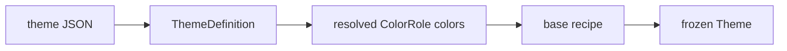

# Themes

## Theme file contract

A theme is one self-describing JSON file: a named palette plus a map from
semantic [`ColorRole`](../../src/SharpVision/Styling/ColorRole.cs) members to
colors. Every theme SharpVision ships — curated and built-in alike — is defined
this way; there is no hardcoded C# palette. Loading a theme runs one pipeline
regardless of source:



The `palette` object is authoring sugar: it is resolved into roles while loading
and is not retained on the produced `Theme`.

## File fields

| Field         | Type                  | Meaning                                                                                                                               |
| ------------- | --------------------- | ------------------------------------------------------------------------------------------------------------------------------------- |
| `name`        | string                | Display name.                                                                                                                         |
| `slug`        | string                | Stable catalog key, unique within the catalog; by convention `[a-z0-9-]`.                                                             |
| `colorScheme` | `"dark"` or `"light"` | The dark/light color scheme, using CSS `color-scheme` naming.                                                                         |
| `order`       | integer               | Catalog sort key; ties break by ordinal `slug`. By convention non-negative.                                                           |
| `author`      | string                | Attribution author.                                                                                                                   |
| `license`     | string                | License identifier for the palette source.                                                                                            |
| `source`      | string                | URL the palette values were taken from.                                                                                               |
| `palette`     | object                | Named color-value strings; may be empty if `roles` uses only inline values.                                                           |
| `roles`       | object                | Semantic role name (camelCase, matching `ColorRole` members) to a color-value string or palette key. Unknown role names are rejected. |

Validation is split by load path. For **any** theme, the loader requires that
`background` and `foreground` resolve and that every `palette`/`roles` color
value is valid (see below); otherwise it throws `InvalidDataException`. The
descriptive metadata fields (`name`, `author`, `license`, `source`,
`colorScheme`) and slug uniqueness are enforced only for **embedded catalog
themes**: the catalog requires non-empty `name`/`slug`/`author`/`license`/
`source`, a `colorScheme` of exactly `"dark"` or `"light"`, and slugs unique
across the catalog. The `slug` `[a-z0-9-]` format and a non-negative `order` are
authoring conventions, not enforced by the loader.

### Color-value grammar

A color value — in `palette` or inline in `roles` — is one of:

- `#rgb` / `#rrggbb` — a hex RGB color parsed by `Color.FromHex`, case
  insensitive, leading `#` optional on input but always required in a theme
  file.
- `idx:N` — a 256-color palette index, `0 <= N <= 255`, producing
  `Color.Indexed(N)`. Indexed values track the user's own terminal palette
  instead of an absolute RGB value.

In a `roles` value, a string is first tested against the two literal forms above
(a leading `#` or `idx:` prefix); otherwise it is treated as a `palette` key.
Palette keys never contain `#` or `:`, so the three cases are unambiguous. A bad
hex value, an out-of-range index, or a role referencing an unknown palette key
throws `InvalidDataException` naming the theme and the offending role or palette
entry.

## Example

```json
{
  "name": "Tokyo Night",
  "slug": "tokyo-night",
  "colorScheme": "dark",
  "order": 10,
  "author": "Folke Lemaitre",
  "license": "MIT",
  "source": "https://github.com/folke/tokyonight.nvim",
  "palette": {
    "bg": "#1a1b26",
    "fg": "#c0caf5",
    "comment": "#565f89",
    "blue": "#7aa2f7",
    "red": "#f7768e",
    "green": "#9ece6a",
    "yellow": "#e0af68",
    "selection": "#283457"
  },
  "roles": {
    "background": "bg",
    "foreground": "fg",
    "surface": "#16161e",
    "border": "comment",
    "muted": "comment",
    "accent": "blue",
    "selectionBackground": "selection",
    "selectionForeground": "fg",
    "error": "red",
    "warning": "yellow",
    "success": "green",
    "info": "blue"
  }
}
```

`surface` above resolves from an inline hex literal; every other role resolves
from a palette key.

## Semantic roles and fallbacks

A theme is valid with only `background` and `foreground` defined; every other
role has a fallback derivation. The twelve `ColorRole` members:

| Role                  | Meaning                                                      |
| --------------------- | ------------------------------------------------------------ |
| `Foreground`          | The default text color.                                      |
| `Background`          | The default surface color behind content.                    |
| `Surface`             | A raised or inset surface color distinct from `Background`.  |
| `Border`              | The default border and separator color.                      |
| `Accent`              | The primary emphasis color for focus and active affordances. |
| `Muted`               | A low-emphasis foreground for secondary text.                |
| `SelectionBackground` | The background color of a selected item.                     |
| `SelectionForeground` | The text color of a selected item.                           |
| `Error`               | The color signaling an error or failed state.                |
| `Warning`             | The color signaling a caution or degraded state.             |
| `Success`             | The color signaling a successful or healthy state.           |
| `Info`                | The color signaling neutral informational emphasis.          |

Missing roles fill by derivation, in a fixed order where each step consults only
roles resolved by an earlier step (this keeps the `Border`/`Muted`
cross-reference non-circular):

1. `Background` — required; loading throws `InvalidDataException` if unresolved.
2. `Foreground` — required; loading throws if unresolved.
3. `Accent` ← `Foreground`.
4. `Muted` ← explicit `Border` if present, else `Foreground`.
5. `Border` ← `Muted` (as resolved in step 4).
6. `Surface` ← `Background`.
7. `SelectionBackground` ← `Accent`.
8. `SelectionForeground` ← `Foreground`.
9. `Error`, `Warning`, `Success`, `Info` ← `Accent`.

Worked cases: if both `border` and `muted` are absent, both become `Foreground`;
if only `border` is present, `Muted` takes it; if only `muted` is present,
`Border` takes it. Every fallback chain terminates at a required role.

## `ThemeColors`: semantic colors as `Color` values

Each of the twelve roles above is also exposed as a first-class
[`Color`](../../src/SharpVision.Terminal/Protocols/Color.cs) value through the
public `ThemeColors` static class — one property per role
(`ThemeColors.Foreground`, `ThemeColors.Accent`, `ThemeColors.Border`, …). A
`ThemeColors.*` value is a *deferred* color: assign it anywhere a `Color` or
`Color?` is expected — a theme's own style (see the recipe below), a
per-instance local value (`control.Background = ThemeColors.Accent`), or
custom control code — and it resolves to the active theme's concrete palette
color **during property resolution**, not when the value is assigned. Because
resolution happens on every read rather than once at theme-build time, a
control holding a role color keeps tracking theme swaps automatically for as
long as it holds that value; no query API or custom control is needed to get
this behavior.

Under the hood, a role color is a deferred `Color` (`ColorKind.Role`, produced
by `Color.Role(int)` and read back through `Color.RoleId`) that carries only an
opaque role id — the terminal layer never interprets it. Because a role color
must never reach the encoder unresolved, `CellStyle` construction and the
lower-level `Palette`/`Sgr` encode paths throw if given one, so a resolution
gap fails fast in a test instead of rendering garbage.

## The base control-style recipe

Once all twelve roles are resolved, the internal `ThemeBuilder` recipe sets
every role on a fresh `Theme` and sets one base `ControlStyle<Control>` that
every control inherits before its own theme entry, class default, or local
value. The base style stores `ThemeColors.*` values, not resolved concretes:

| Property                   | State    | Value                             |
| -------------------------- | -------- | --------------------------------- |
| `ForegroundProperty`       | Normal   | `ThemeColors.Foreground`          |
| `BackgroundProperty`       | Normal   | `ThemeColors.Background`          |
| `BorderColorProperty`      | Normal   | `ThemeColors.Border`              |
| `ForegroundProperty`       | Hovered  | `ThemeColors.Accent`              |
| `AttributesProperty`       | Focused  | `Underline` (constant)            |
| `ForegroundProperty`       | Checked  | `ThemeColors.SelectionForeground` |
| `BackgroundProperty`       | Checked  | `ThemeColors.SelectionBackground` |
| `ForegroundProperty`       | Selected | `ThemeColors.SelectionForeground` |
| `BackgroundProperty`       | Selected | `ThemeColors.SelectionBackground` |
| `ForegroundProperty`       | Disabled | `ThemeColors.Muted`               |
| `ShadowForegroundProperty` | Normal   | `ThemeColors.Border`              |

Because none of these values depend on the specific theme, this base style is
**theme-independent** — every theme's base style is byte-identical, and a
theme differs from another only by its resolved palette (plus any per-type
style overrides a theme adds on top). `ThemeBuilder` still writes the palette
itself — `theme.SetColor(role, concreteColor)` for all twelve roles, from the
roles resolved above — which is what the base style's `ThemeColors.*` values
resolve against at render time.

The theme is then frozen and returned; a frozen `Theme` cannot be mutated
further. This is the only recipe v1 ships — there is no per-theme override of
the base style, and no pluggable recipe delegate.

## Authoring a new theme

To add a theme, drop a `<slug>.theme.json` file into
`src/SharpVision/Styling/Themes/`. No other project change is required:
`SharpVision.csproj` already embeds every file matching
`Styling/Themes/*.theme.json` under the logical name
`SharpVision.Styling.Themes.<filename>`, and
[`ThemeCatalog.Default`](../../src/SharpVision/Styling/ThemeCatalog.cs)
discovers it automatically the next time the catalog is constructed, by
enumerating embedded resources under that prefix/suffix and parsing each file's
metadata. There is no separate manifest file to update — each theme file is its
own source of truth, which avoids drift between a manifest and the shipped
resources. A duplicate `slug` across two theme files throws
`InvalidDataException` when the catalog is built.

Give the new file a unique `slug`, choose an `order` that places it sensibly
relative to existing entries (ties break by ordinal `slug`), and record real
`author`, `license`, and `source` values (see below).

## Loading at runtime

Embedded themes load by slug through the process-wide catalog singleton:

```csharp
Theme theme = ThemeCatalog.Default.Load("dracula");
Application.Theme = theme;
```

`Load` builds and freezes the theme on first request and caches the result;
repeated calls with the same slug return the same instance. An unknown slug
throws `KeyNotFoundException`. `ThemeCatalog.Default.Entries` returns the
ordered catalog metadata entries (`Name`, `Slug`, `ColorScheme`, `Author`,
`License`, `Source`) and `.Slugs` returns the ordered slugs.

User-supplied theme files — not part of the embedded catalog — load through
[`ThemeFile`](../../src/SharpVision/Styling/ThemeFile.cs):

```csharp
Theme fromText = ThemeFile.Parse(jsonText);
Theme fromStream = ThemeFile.Load(stream);      // caller owns the stream
Theme fromDisk = ThemeFile.LoadFile("my-theme.theme.json");
```

`ThemeFile` resolves the palette and roles and returns a frozen `Theme`,
validating the color values and the required `background`/`foreground` roles; it
does not require the descriptive metadata fields. The non-empty-metadata,
`colorScheme`, and unique-slug checks apply only to embedded catalog themes. All
three methods throw `ArgumentNullException` for a null argument and
`InvalidDataException` for malformed or invalid content; `LoadFile` also
propagates `FileNotFoundException`/`IOException` from the file read.

## Attribution and license policy

Every theme file — curated and built-in — records `author`, `license`, and
`source`, even the two built-in `default-light`/`default-dark` themes
(attributed to the SharpVision project itself). Curated palette values are taken
from each project's official repository at implementation time; no theme ships
with placeholder attribution.

## Curated themes

The curated set reproduces well-known editor themes as palette-plus-roles JSON:
Tokyo Night (Night, Storm, Day variants), Catppuccin (Mocha, Latte), Gruvbox
(Dark, Light), Dracula, Nord, Monokai, Solarized (Dark, Light), and One Dark.
Built-in `Themes.White`/`Themes.Dark` are catalog-backed too —
`default-light`/`default-dark` — and use `idx:N` values for every role so they
keep adapting to the user's own terminal palette, unlike the absolute-RGB editor
themes.
