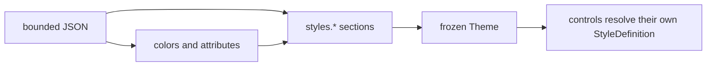

# Themes

## Overview

A SharpVision theme is a single bounded UTF-8 JSON document. It defines the
global semantic colors, terminal attributes, and a `styles` object holding every
themeable style type's own JSON section. The document contains no control
instances and no application-defined selector names. A leading UTF-8 byte order
mark is accepted and ignored.



The root object accepts only these fields:

| Field                                  | Type     | Description                                              |
| -------------------------------------- | -------- | -------------------------------------------------------- |
| `name`, `slug`, `colorScheme`, `order` | metadata | Embedded catalog identity and ordering.                  |
| `author`, `license`, `source`          | metadata | Attribution and provenance.                              |
| `palette`                              | object   | At most 256 case-sensitive names mapped to RGB literals. |
| `colors`                               | object   | One concrete value for every known `SemanticColor`.      |
| `attributes`                           | object   | One concrete value for every known `SemanticDecoration`. |
| `styles`                               | object   | One JSON section per themeable style type (see below).   |

Unknown and duplicate fields are rejected. Embedded themes must carry complete
metadata, `colorScheme` included; external documents fill in missing _or blank_
identity metadata with `Custom`, `custom`, and dark. That leniency is keyed on
embedded-versus-external, not on which load method was called, so one document
gets one verdict from every entry point. `order` is a catalog concept rather
than a theme one: `ThemeCatalogEntry.Order` carries it, and an external document
has none. Programmatic `Theme` construction rejects an undefined `ColorScheme`
value and null or blank identity and provenance metadata before publishing the
theme. `ThemeCatalogEntry` rejects the same undefined color-scheme state before
publishing catalog metadata.

## Global values

`colors` requires these 30 properties:

```text
window, windowSurface, windowText, surface, surfaceText, control, controlText,
controlBorder, controlShadow, activeControl, activeText, activeBorder,
focusedControl, focusedText, focusedBorder, pressedControl, pressedText,
pressedBorder, selectedControl, selectedText, disabledControl,
disabledText, disabledBorder, accent, muted, hotkey, error, warning,
success, info
```

Each value must be the exact name of a `palette` entry - a raw `#RGB`/`#RRGGBB`
literal is legal only inside `palette` itself, never here. Palette entries are
RGB literals and cannot reference each other. Loading a theme resolves every
value to a concrete `Color` instance, and `Theme.ResolveColor(SemanticColor)` is
the typed public lookup.

`attributes` requires these nine properties:

```text
normalText, activeText, focusedText, pressedText, selectedText,
disabledText, border, shadow, hotkey
```

Each accepts a single attribute name or an array of names; an empty array means
no attributes. `Theme.ResolveAttributes(SemanticDecoration)` is the typed public
lookup.

`Theme.Error`, `Warning`, `Success`, `Info`, `Muted`, and `Hotkey` are named
shortcuts onto `ResolveColor`, reading the same `colors` entries as every other
`SemanticColor`. A document used to be able to author these six a second time
under a parallel `status` object; that section is gone, so `colors` is the one
place any of them is written.

## Style types

Every themeable style value derives from `ControlStyle` - a required `Face`,
`Border`, and `Shadow` plus, for a specific control's own style type, whatever
structural members that control needs (padding, glyph families, mark styles, and
so on). Six sibling types generalize the common presentations, as an open set
any control can extend - `ControlStyle` itself (the passive base and universal
fallback), `InputStyle`, `ContainerStyle`, `WindowStyle`, `PopupStyle`, and
`TooltipStyle`. Each has its own `static Default` baking in a distinct
code-owned border (none, heavy, light, paired, rounded, and light again,
respectively) and, for `Window` only, a visible composite shadow. A control with
nothing to add beyond one of these six uses that type directly - there is no
requirement to declare a new type per control.

`styles` is a flat JSON object: each top-level key is one style type's own
`"styles.*"` name, resolved independently. The six well-known style keys above
map to the unqualified keys `control`, `input`, `container`, `window`, `popup`,
`tooltip`. A leaf control declares its own key (`button`, `checkBox`,
`scrollBar`, and so on - see the worked table below) alongside a declared
one-hop fallback to whichever of the six well-known types is the closest
semantic match; a third-party control claims a namespaced key
(`"vendor.control"`) the same way. An unqualified key that is neither one of the
six well-known names nor a library-registered leaf-control name is rejected as
an unknown field, since it is far more likely a typo than an intentional
section.

Every accepted section is a section something resolves. A style type that
declares itself secondary - a part style forwarded to a control's retained
pieces rather than owning that control's own appearance - owns no `styles.*` key
at all, and authoring one by its name is rejected exactly like a typo. That
matters because the alternative is worse than rejection: a section the parser
blesses and nothing ever reads would leave an author editing colors that never
appear, with no error to explain why.

Only `control` is conventionally load-bearing: it is the terminal root every
other well-known style's `Normal` state cascades from (see below), and every
bundled theme authors it. There is no strict parse-time requirement that any
individual `styles.*` key be present, though - an absent key simply means that
type resolves entirely from its own code-owned default. `styles` parsing is
lazy: the document's JSON is captured as-is when a theme loads, and a given
key's leaf values (colors, glyph styles, and so on) are only actually converted
and validated the first time something resolves that style type. A malformed
leaf a theme never exercises does not fail to load; it fails the first time it
is read.

Each style type's own section is an object whose top-level keys are visual state
names - `normal`, `pointerOver`, `focusWithin`, `focused`, `current`,
`selected`, `checked`, `indeterminate`, `pressed`, `disabled` - each holding a
**fractional** override object: any subset of that style type's own public
properties, reflectively patched onto a resolved base value. `normal` patches
onto the type's own code-owned default (or, for the five non-`control` well-
known styles, onto `control`'s own resolved `Normal` face/border/shadow first -
see below); every other authored state patches onto the SAME type's own resolved
`normal`, not onto another state. An unauthored state is that type's resolved
`normal` unchanged, except where the cascade described next supplies one.

A control is often in more than one state at once - a list row can be both
`selected` and `disabled`. Every active state applies, in the fixed order the
state names are listed above, and the **later** state wins any member both of
them author. A member neither one mentions keeps whatever an earlier active
state supplied, falling back to `normal`. Writing a member back to the value
`normal` already carries is therefore meaningful rather than redundant: it is
how a later state says "for this combination, go back to the normal value" and
stops an earlier state from claiming that member.

For the five well-known styles other than `control` (`input`, `container`,
`window`, `popup`, `tooltip`), `Normal`'s `face`/`border`/`shadow` cascade from
`control` before this style's own `normal` JSON overlays on top - this is why
most bundled themes' `input`/`container`/`window`/`popup` JSON sections only
ever author a `border` delta (sides, glyph style) rather than repeating face
colors `control` already supplies.

What cascades is what `control`'s own JSON **authored**, not its whole resolved
value. A theme that sets colors on `control` and says nothing about its border
leaves each sibling's code-owned chrome intact - `input`'s heavy full border,
`container`'s light one, `window`'s paired border and shadow. A theme that does
author `control`'s border cascades that too, because it asked to. This is the
same delta rule every other state uses, and it is what lets a minimal theme
author `styles.control` alone without silently changing measured widths
everywhere, since a border's `sides` reserves layout space.

Past `Normal`, only **`input`** keeps following explicitly authored `control`
state deltas. Bundled themes reserve `control` for passive normal and disabled
defaults and author pointer, focus, press, and selection cues directly on
`input`. A custom theme may still put a deliberate shared state delta on
`control`; that delta is applied onto `input`'s own resolved `Normal`, with
`input`'s own JSON for the state winning on top. Inheriting the delta rather
than the whole value keeps `input`'s own border sides and glyph style intact, so
a state change never silently re-measures a field.

`container`, `window`, `popup`, and `tooltip` deliberately do **not** follow
`control` past `Normal`. They are passive chrome: a panel does not light up
because the pointer is over its content, and a window answers activation rather
than hover. For those four, an unauthored state simply is that type's resolved
`Normal`, and a theme that wants one to react must author the state on that
section itself. One exception exists in code, not JSON: `Window` defaults its
`focusWithin` border to `SemanticColor.ActiveBorder` unless a theme explicitly
authors `styles.window.focusWithin` itself, mirroring the application-owned
`IsActive` flag every mounted `Window` maps onto that state (see
[styling.md](styling.md#shared-chrome)).

The bundled themes keep `control`, `container`, and `window` visually unchanged
on hover. This keeps text, table shells, tab content, grouping surfaces, and
other passive ancestry stable even though physical pointer membership remains
observable. The bundled `input` section uses `surface` for its normal face and
`activeControl` during hover (authored directly on `input.pointerOver`), and
`button` also opts into the filled hover background the same way. Focus keeps
the normal `surface`/`controlText` face, adds the focused text decoration, and
uses `activeBorder` for chrome; focus therefore remains visible without
introducing an alarm-like fill or text color. Borderless interactive styles
rebase those `input` state colors onto `control` geometry. An external theme may
author an explicit hover contribution on any type that wants it.

Every bundled `window` style uses `windowSurface` for its normal background and
`windowText` for its foreground. `windowSurface` is raised away from the
application `window` background, so a `Window`, `Dialog`, `MessageBox`, or file
dialog remains visually distinct from the plane beneath it without requiring a
local style. The bundled values follow each palette's existing raised-surface
tier.

`popup` and `tooltip` continue to use the `window`/`windowText` pair, and both
are framed with an all-side border for visual containment over whatever sits
beneath them. Popup uses a rounded border; Tooltip uses the light glyph style
instead, so a passive hint still reads as visually distinct from an interactive
drop-down or menu even though both are now framed.

A fractional state object holds optional `face`, `border`, and `shadow` objects
whose members match the corresponding type's own public properties (reflectively
resolved, not a hand-maintained DTO shape): face colors and decorations; border
sides, glyph style, colors, and attributes; shadow visibility, mode, offset,
glyph, colors, and attributes.

A style type's own additional structural members (padding, mark style, a glyph
family) sit at the top level of its state object too - see `button`'s `padding`
and `radioButton`'s `glyphs` below - but only under `normal`. Nothing but
`face`/`border`/`shadow` is ever read back from another state: every per-state
resolution completes a leaf's structural members from its resolved `normal`
alone, so a theme authoring, say, `button.pressed.padding` is rejected rather
than parsed, validated, and silently ignored.

Colors inside a style section must name a `SemanticColor` or a `palette` entry -
a raw hex literal is rejected here too, the same way it is in `colors`.
Attributes accept a literal attribute name/array or the JSON name of a global
semantic value. Border glyph styles and shadow geometry are allowed here because
they define the type's own chrome, not something a specific control instance
owns. Individual controls may still set complete local styles that take
precedence over everything a theme supplies.

Twenty-seven library controls resolve part or all of their structural `Style`
from their own theme section ahead of their code-owned default, whenever no
local `Style` is assigned - each with a one-hop fallback to the well-known style
noted.

A leaf's own state section **narrows** its fallback's rather than replacing it,
the same way the well-known cascade above works. Authoring
`styles.input.disabled.face.foreground` and
`styles.button.disabled.border.foreground` gives a disabled Button both: the
muted foreground from `input`, and its own muted border on top. Authoring the
same member on both sides lets the leaf win.

| `styles.*` key            | Control                   | Fallback style | Own members                                                                                                                                                                                                                                                                              |
| ------------------------- | ------------------------- | -------------- | ---------------------------------------------------------------------------------------------------------------------------------------------------------------------------------------------------------------------------------------------------------------------------------------- |
| `button`                  | `Button`                  | `input`        | `padding` (`{x, y}` object)                                                                                                                                                                                                                                                              |
| `checkBox`                | `CheckBox`                | `input`        | `markStyle` (string), `glyphs` (three one-character strings)                                                                                                                                                                                                                             |
| `radioButton`             | `RadioButton`             | `input`        | `markStyle` (string), `glyphs` (two one-character strings)                                                                                                                                                                                                                               |
| `calendar`                | `Calendar`                | `input`        | `weekdayHeaderColor`, `navigationColor`, `todayMarkerColor`, `outOfMonthDayColor`, `disabledDayColor`, `selectedDayColor`, `selectedDayBackground`, `activeDayBackground`, `disabledDayBackground`, `contentInset`, `previousMonthGlyph`, `nextMonthGlyph`                               |
| `scrollBar`               | `ScrollBar`               | `control`      | `chrome`, `fill` (strings), `glyphs` (ten one-character strings), `trackColor`, `thumbColor`, `buttonColor`                                                                                                                                                                              |
| `chaseIndicator`          | `ChaseIndicator`          | `control`      | `active`, `inactive` (one-character strings), `headColor`, `trailColor`, `trackColor`                                                                                                                                                                                                    |
| `slider`                  | `Slider`                  | `control`      | `fillColor`, `trackColor`, `thumbColor` (colors), `glyphs`                                                                                                                                                                                                                               |
| `progressBar`             | `ProgressBar`             | `control`      | `fillColor`, `trackColor`, `indeterminateColor` (colors), `glyphs` (three one-character strings)                                                                                                                                                                                         |
| `spinner`                 | `Spinner`                 | `control`      | `frames` (array of one-character strings, 1-256 entries)                                                                                                                                                                                                                                 |
| `separator`               | `Separator`               | `control`      | `horizontalGlyph`, `verticalGlyph` (one-character strings)                                                                                                                                                                                                                               |
| `chart`                   | chart controls            | `control`      | `axisColor`, `labelColor`, `primaryColor`, `secondaryColor`, `tertiaryColor`, `glyphs`, `fillMode`, `lineMode`, `linePattern`                                                                                                                                                            |
| `hyperlinkButton`         | `HyperlinkButton`         | `control`      | None - restyles the fallback's own `Face`/`Border`/`Shadow` members directly                                                                                                                                                                                                             |
| `jsonView`                | `JsonView`                | `container`    | `keyColor`, `indexColor`, `stringColor`, `numberColor`, `booleanColor`, `nullColor`, `punctuationColor`, `disclosureColor`, `selectedTextColor`, `selectedBackground`, `collapsedGlyph`, `expandedGlyph`                                                                                 |
| `treeView`                | `TreeView`                | `container`    | `loadingColor`, `failedColor` (colors), `loadingGlyph`, `failedGlyph`, `collapsedGlyph`, `expandedGlyph` (one-character strings)                                                                                                                                                         |
| `messageBox`              | `MessageBox`              | `window`       | `messageFace`, `messageMargin`, `actionBarMargin`                                                                                                                                                                                                                                        |
| `filePickerDialog`        | `FilePickerDialog`        | `window`       | `rootPadding`, `contentSpacing`, `fileListBorder`                                                                                                                                                                                                                                        |
| `saveFileDialog`          | `SaveFileDialog`          | `window`       | `rootPadding`, `contentSpacing`, `fileListBorder`                                                                                                                                                                                                                                        |
| `tabControl`              | `TabControl`              | `control`      | `dividerGlyph`, `underlineGlyph` (one-character strings), `dividerColor`, `selectionIndicatorColor`                                                                                                                                                                                      |
| `expander`                | `Expander`                | `control`      | `collapsedGlyph`, `expandedGlyph` (one-character strings), `contentIndent` (integer)                                                                                                                                                                                                     |
| `menuItem`                | `MenuItem`                | `control`      | `uncheckedGlyph`, `checkedGlyph`, `radioUncheckedGlyph`, `radioCheckedGlyph` (one-character strings), `affixGap` (integer)                                                                                                                                                               |
| `menuSeparator`           | `MenuSeparator`           | `control`      | `glyph` (one-character string)                                                                                                                                                                                                                                                           |
| `navigationViewGroup`     | `NavigationViewGroup`     | `control`      | `collapsedGlyph`, `expandedGlyph` (one-character strings), `itemIndent` (integer)                                                                                                                                                                                                        |
| `navigationViewItem`      | `NavigationViewItem`      | `control`      | `idleMarker`, `currentMarker` (one-character strings), `affixGap` (integer)                                                                                                                                                                                                              |
| `navigationViewSeparator` | `NavigationViewSeparator` | `control`      | `glyph` (one-character string)                                                                                                                                                                                                                                                           |
| `table`                   | `Table`                   | `control`      | `glyphs` (five one-character strings), `cellPadding` (`{x, y}` object), `headerForeground`, `headerBackground`, `gridLineColor` (nullable colors - null inherits the table's own face), `placeholderForeground`, `placeholderErrorForeground` (required colors, default `Muted`/`Error`) |
| `statusBarItem`           | `StatusBarItem`           | `control`      | `leftSeparatorGlyph`, `rightSeparatorGlyph` (one-character strings)                                                                                                                                                                                                                      |
| `text`                    | `Text`                    | `control`      | `ellipsisGlyph` (one-character string)                                                                                                                                                                                                                                                   |

A color member accepts the same shapes a well-known style's color does: a
`SemanticColor` name, a palette key, or `"transparent"`/`"default"` - never a
raw hex literal - resolved through `Theme.Palette` lazily rather than an eager
parse-time dictionary. A `glyphs` member is a nested object whose own members
are each one printable, one-cell Rune string - an entry with more than one Rune,
or a Rune that measures wider than one cell, is rejected the same way a
hand-authored glyph value would be. Every bundled theme except the two
zero-config defaults (`default-dark`/`default-light`, backing
`ThemeCatalog.Dark`/`ThemeCatalog.White`) authors the `normal` state of eight of
these keys - `button`, `checkBox`, `radioButton`, `scrollBar`, `chaseIndicator`,
`slider`, `progressBar`, and `spinner`. The remaining sections, and both
zero-config defaults, are deliberately left unauthored so a control stays on its
code-owned presentation until a theme opts into restyling it.

### Where a section name comes from

A section key is not a free-form string: it is **derived from the style type
that owns it**. Drop a trailing `Style`, drop a leading `Theme`, and lower-case
the first character - so `ButtonStyle` owns `button`, `ScrollBarStyle` owns
`scrollBar`, and the well-known root `ControlStyle` owns `control`. Adding a
style type is therefore all it takes to make its section authorable; there is no
separate registry to update, and a key cannot drift from the type it belongs to.

Alongside those, `styles` accepts a namespaced `vendor.control` key (for example
`"acme.widget"`) for a third-party style type. Because a dot cannot appear in a
type name, that one case keeps an explicit key: register it with
`StyleDefinitions.Control<TStyle>(key, codeOwnedDefault, compare)` (a
self-contained root, like the six well-known types) or
`StyleDefinitions.Control<TStyle, TFallback>(key, fallbackTo, complete, compare)`
(a one-hop fallback to an existing type, like every leaf control above). Library
styles use the overloads without a `key`, which derive it. All four factories
are public and require no internal access; see
[theming-new-controls.md](theming-new-controls.md) for a worked example.

## Example

```json
{
  "name": "Example",
  "slug": "example",
  "colorScheme": "dark",
  "order": 10,
  "author": "Example author",
  "license": "MIT",
  "source": "https://example.invalid/theme",
  "palette": {
    "page": "#101218",
    "ink": "#e7e9ee",
    "surface": "#181b24",
    "panel": "#202431",
    "outline": "#596170",
    "shadow": "#050608",
    "highlight": "#283044",
    "focus": "#22304a",
    "press": "#182030",
    "select": "#315b99",
    "muted": "#808080",
    "faintOutline": "#464b57",
    "accent": "#72a7ff",
    "hotkey": "#ffcc66",
    "danger": "#ff5c57",
    "warn": "#f3f99d",
    "ok": "#5af78e"
  },
  "colors": {
    "window": "page",
    "windowSurface": "surface",
    "windowText": "ink",
    "surface": "surface",
    "surfaceText": "ink",
    "control": "panel",
    "controlText": "ink",
    "controlBorder": "outline",
    "controlShadow": "shadow",
    "activeControl": "highlight",
    "activeText": "ink",
    "activeBorder": "accent",
    "focusedControl": "focus",
    "focusedText": "ink",
    "focusedBorder": "accent",
    "pressedControl": "press",
    "pressedText": "ink",
    "pressedBorder": "accent",
    "selectedControl": "select",
    "selectedText": "ink",
    "disabledControl": "panel",
    "disabledText": "muted",
    "disabledBorder": "faintOutline",
    "accent": "accent",
    "muted": "muted",
    "hotkey": "hotkey",
    "error": "danger",
    "warning": "warn",
    "success": "ok",
    "info": "accent"
  },
  "attributes": {
    "normalText": [],
    "activeText": [],
    "focusedText": "bold",
    "pressedText": [],
    "selectedText": [],
    "disabledText": "dim",
    "border": [],
    "shadow": "dim",
    "hotkey": "underline"
  },
  "styles": {
    "control": {
      "normal": {
        "face": {
          "foreground": "controlText",
          "background": "control",
          "attributes": "normalText"
        },
        "border": {
          "sides": "none",
          "glyphStyle": "rounded",
          "foreground": "controlBorder",
          "background": "control",
          "attributes": "border"
        },
        "shadow": {
          "visible": false,
          "mode": "composite",
          "offset": { "x": 0, "y": 0 },
          "glyph": "▓",
          "foreground": "controlShadow",
          "background": "transparent",
          "attributes": "shadow"
        }
      }
    },
    "input": {
      "normal": {
        "face": { "background": "surface" },
        "border": { "sides": "all", "glyphStyle": "heavy" }
      },
      "pointerOver": {
        "face": { "foreground": "activeText", "background": "activeControl" },
        "border": { "foreground": "activeBorder" }
      }
    },
    "container": {
      "normal": { "border": { "sides": "all", "glyphStyle": "light" } }
    },
    "window": {
      "normal": {
        "face": { "foreground": "windowText", "background": "windowSurface" },
        "border": { "sides": "all", "glyphStyle": "paired" },
        "shadow": {
          "visible": true,
          "mode": "composite",
          "offset": { "x": 2, "y": 1 }
        }
      }
    },
    "popup": {
      "normal": {
        "face": { "foreground": "windowText", "background": "window" },
        "border": { "sides": "all", "glyphStyle": "rounded" }
      }
    },
    "tooltip": {
      "normal": {
        "face": { "foreground": "windowText", "background": "window" },
        "border": { "sides": "all", "glyphStyle": "light" }
      }
    },
    "button": {
      "normal": { "padding": { "x": 1, "y": 0 } }
    }
  }
}
```

## Loading and publication

`ThemeCatalog.Load(slug)` loads an embedded theme, `ThemeCatalog.Parse(json)`
parses a string, `ThemeCatalog.Load(stream)` reads a caller-owned stream without
closing it, and `ThemeCatalog.LoadFile(path)` reads a file.
`ThemeCatalog.Entries` and `ThemeCatalog.Slugs` expose the ordered embedded
catalog. Embedded themes are parsed lazily and cached; each external load
returns a new frozen instance.

Input is limited to 64 KiB, a JSON depth of eight, 256 palette entries, and
2,048 characters per metadata string. Comments, trailing commas, malformed
UTF-8, invalid element kinds, unknown top-level or `styles.*` key names, and
malformed colors all fail with a source-labelled `InvalidDataException` - for
`styles.*` leaf values specifically, at first resolution rather than at parse
time (see [Style types](#style-types) above).

Assigning `Application.Theme` publishes the frozen theme through the retained
control tree on the dispatcher; controls are not reconstructed. The resolver
caches each style type's resolved set per `(Theme, VisualState combination)`,
and theme replacement, local appearance changes, and relevant state changes
invalidate those entries.

## Expected behavior

| Layer      | Observable evidence                                                                                       |
| ---------- | --------------------------------------------------------------------------------------------------------- |
| Parser     | Size/depth bounds, malformed UTF-8/JSON, unknown names, invalid composites, and source-labelled failures. |
| Resolution | Global values, the `control`-Normal cascade, state overlays, local precedence, and frozen publication.    |
| Catalog    | Every embedded theme parses, and its bundled `styles` sections retain stable metadata and slug order.     |
| Surface    | Theme swaps update mounted controls, chrome, text, and visual states without reconstruction.              |

- Stream loading leaves the caller's stream open, and file and embedded loading
  each behave as described above.
- `control`'s Normal cascade and every bundled type's own JSON overrides resolve
  exactly as specified.
- Publication is dispatcher-affine and invalidates only the phases the change
  actually affects.
