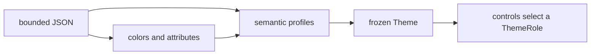

# Themes

## Overview

A SharpVision theme is a single bounded UTF-8 JSON document. It defines the
global semantic colors, terminal attributes, and five high-level appearance
profiles. Controls bring their own mechanical defaults and select one of those
profiles; the document contains no control instances and no application-defined
selector names. A leading UTF-8 byte order mark is accepted and ignored.



The root object accepts only these fields:

| Field                                  | Type     | Description                                                 |
| -------------------------------------- | -------- | ----------------------------------------------------------- |
| `name`, `slug`, `colorScheme`, `order` | metadata | Embedded catalog identity and ordering.                     |
| `author`, `license`, `source`          | metadata | Attribution and provenance.                                 |
| `palette`                              | object   | At most 256 case-sensitive names mapped to RGB literals.    |
| `colors`                               | object   | One concrete value for every known `ThemeColor`.            |
| `attributes`                           | object   | One concrete value for every known `ThemeDecoration`.       |
| `styles`                               | object   | The five fixed semantic appearance profiles.                |
| `status`                               | object   | Optional compatibility aliases for the six status meanings. |

Unknown and duplicate fields are rejected. Embedded themes must carry complete
metadata; external documents fill in missing identity metadata with `Custom`,
`custom`, dark, and order zero. Programmatic `Theme` construction rejects an
undefined `ColorScheme` value and null or blank identity and provenance metadata
before publishing the theme. `ThemeCatalogEntry` rejects the same undefined
color-scheme state before publishing catalog metadata.

## Global values

`colors` requires these 29 properties:

```text
window, windowText, surface, surfaceText, control, controlText,
controlBorder, controlShadow, activeControl, activeText, activeBorder,
focusedControl, focusedText, focusedBorder, pressedControl, pressedText,
pressedBorder, selectedControl, selectedText, disabledControl,
disabledText, disabledBorder, accent, muted, hotkey, error, warning,
success, info
```

Each value is `#RGB`, `#RRGGBB`, or the exact name of a palette entry. Palette
entries are RGB literals and cannot reference each other. Loading a theme
resolves every value to a concrete `Color` instance, and
`Theme.ResolveColor(ThemeColor)` is the typed public lookup.

`attributes` requires these nine properties:

```text
normalText, activeText, focusedText, pressedText, selectedText,
disabledText, border, shadow, hotkey
```

Each accepts a single attribute name or an array of names; an empty array means
no attributes. `Theme.ResolveAttributes(ThemeDecoration)` is the typed public
lookup.

The optional `status` object accepts `error`, `warning`, `success`, `info`,
`muted`, and `hotkey`. Any missing entry falls back to the equivalent global
color. The `Theme.Error`, `Warning`, `Success`, `Info`, `Muted`, and `Hotkey`
properties remain convenience accessors.

## Semantic profiles

`styles` is strongly typed. Its five properties are the semantic appearance
profiles:

| JSON property | `ThemeRole`         | Intended use                              |
| ------------- | ------------------- | ----------------------------------------- |
| `control`     | `ThemeRole.Control` | Passive controls and the common fallback. |
| `input`       | `Input`             | Editable or selectable input chrome.      |
| `container`   | `Container`         | Framed grouping surfaces.                 |
| `window`      | `Window`            | Top-level window surfaces.                |
| `popup`       | `Popup`             | Transient popup surfaces.                 |

After loading, every profile has a complete `normal` appearance, and it may
supply partial contributions for `pointerOver`, `focusWithin`, `focused`,
`current`, `selected`, `checked`, `indeterminate`, `pressed`, and `disabled`. A
missing role's normal values, and most missing state contributions, inherit from
`control`; missing members inherit from the earlier complete appearance. Two
roles deviate: `Container` and `Window` start `pointerOver` empty instead of
inheriting the generic hover, and `Window` also starts `focused` empty while
supplying an `activeBorder`-only `focusWithin` default — so descendant or direct
focus lights up the frame without changing the window face.

The bundled themes keep `container` and `window` visually unchanged during
`pointerOver`. The bundled `input` profile uses `surface` for its normal face
and `activeControl` during hover, while `button` also opts into the filled hover
background. An external theme may still author an explicit passive-role hover
contribution when that feedback is intentional.

An appearance holds optional `face`, `border`, and `shadow` objects whose
members match `FaceSet`, `BorderSet`, and `ShadowSet`: face colors and
decorations; border sides, glyph style, colors, and attributes; and shadow
visibility, mode, offset, glyph, colors, and attributes. A profile's normal
appearance is completed with the role's library defaults; state contributions
stay partial.

Colors and attributes inside profiles may be literal values or the JSON name of
a global semantic value. Border glyph styles and shadow geometry are allowed
here because they define the high-level role's chrome, not a specific control
type. Individual controls may still set complete local styles that take
precedence.

Control-specific structure — paddings, glyph families, frame sequences, and part
colors — is code-owned today. Each styled control completes its typed `Style`
value from the library's structural defaults plus the appropriate semantic
profile above, so a built-in control's structure is not yet influenced by a
theme document. A complete local `Style` assignment overrides both.

Alongside the five fixed profiles, `styles` accepts registrable style sections
under a namespaced `vendor.control` key (for example `"acme.widget"`); an
unqualified sibling key that is not one of the five profile names is rejected as
an unknown field, since it is far more likely a typo than an intentional
section. A registrable section's JSON is retained unparsed and bound lazily -
not while the theme document loads - through
`Theme.GetStyleSection<TSection>(sectionName)`, which deserializes and memoizes
it on first access and returns `null` for a theme that never authored that
section. No built-in control resolves a registrable section yet; the mechanism
exists so a control - library or third-party - can adopt one.

When several state flags are active, contributions apply in this order:

```text
PointerOver -> FocusWithin -> Focused -> Current -> Selected -> Checked
-> Indeterminate -> Pressed -> Disabled
```

The [appearance page](styling.md) defines local precedence, ambient face
inheritance, and the resolved values.

## Example

```json
{
  "name": "Example",
  "slug": "example",
  "colorScheme": "dark",
  "order": 10,
  "author": "Example author",
  "license": "MIT",
  "source": "https://example.invalid/theme",
  "palette": { "page": "#101218", "ink": "#e7e9ee" },
  "colors": {
    "window": "page",
    "windowText": "ink",
    "surface": "#181b24",
    "surfaceText": "ink",
    "control": "#202431",
    "controlText": "ink",
    "controlBorder": "#596170",
    "controlShadow": "#050608",
    "activeControl": "#283044",
    "activeText": "ink",
    "activeBorder": "#72a7ff",
    "focusedControl": "#22304a",
    "focusedText": "ink",
    "focusedBorder": "#72a7ff",
    "pressedControl": "#182030",
    "pressedText": "ink",
    "pressedBorder": "#72a7ff",
    "selectedControl": "#315b99",
    "selectedText": "ink",
    "disabledControl": "#202431",
    "disabledText": "#808080",
    "disabledBorder": "#464b57",
    "accent": "#72a7ff",
    "muted": "#808080",
    "hotkey": "#ffcc66",
    "error": "#ff5c57",
    "warning": "#f3f99d",
    "success": "#5af78e",
    "info": "#72a7ff"
  },
  "attributes": {
    "normalText": [],
    "activeText": [],
    "focusedText": "bold",
    "pressedText": [],
    "selectedText": [],
    "disabledText": "dim",
    "border": [],
    "shadow": "dim",
    "hotkey": "underline"
  },
  "styles": {
    "control": {
      "normal": {
        "face": {
          "foreground": "controlText",
          "background": "control",
          "attributes": "normalText"
        },
        "border": {
          "sides": "none",
          "glyphStyle": "rounded",
          "foreground": "controlBorder",
          "background": "control",
          "attributes": "border"
        },
        "shadow": {
          "visible": false,
          "mode": "composite",
          "offset": { "x": 0, "y": 0 },
          "glyph": "▓",
          "foreground": "controlShadow",
          "background": "transparent",
          "attributes": "shadow"
        }
      },
      "pointerOver": {
        "face": { "foreground": "activeText" },
        "border": { "foreground": "activeBorder" }
      }
    },
    "input": {
      "normal": {
        "face": { "background": "surface" },
        "border": { "sides": "all", "glyphStyle": "heavy" }
      },
      "pointerOver": { "face": { "background": "activeControl" } }
    },
    "container": {
      "normal": { "border": { "sides": "all", "glyphStyle": "light" } }
    },
    "window": {
      "normal": { "border": { "sides": "all", "glyphStyle": "paired" } }
    },
    "popup": {
      "normal": { "border": { "sides": "all", "glyphStyle": "rounded" } }
    }
  }
}
```

## Loading and publication

`Themes.Load(slug)` loads an embedded theme, `Themes.Parse(json)` parses a
string, `Themes.Load(stream)` reads a caller-owned stream without closing it,
and `Themes.LoadFile(path)` reads a file. `Themes.Entries` and `Themes.Slugs`
expose the ordered embedded catalog. Embedded themes are parsed lazily and
cached; each external load returns a new frozen instance.

Input is limited to 64 KiB, a JSON depth of eight, 256 palette entries, six
status entries, and 2,048 characters per metadata string. Comments, trailing
commas, malformed UTF-8, invalid element kinds, unknown names, malformed colors,
conflicting attributes, and invalid composite members all fail with a
source-labelled `InvalidDataException`.

Assigning `Application.Theme` publishes the frozen theme through the retained
control tree on the dispatcher; controls are not reconstructed. The resolver
caches each semantic role and exact visual-state combination, and theme
replacement, local appearance changes, and relevant state changes invalidate
those entries.

## Expected behavior

| Layer      | Observable evidence                                                                                       |
| ---------- | --------------------------------------------------------------------------------------------------------- |
| Parser     | Size/depth bounds, malformed UTF-8/JSON, unknown names, invalid composites, and source-labelled failures. |
| Resolution | Global values, semantic inheritance, state overlays, local precedence, and frozen publication.            |
| Catalog    | Every embedded theme parses, exposes required roles, and retains stable metadata and slug order.          |
| Surface    | Theme swaps update mounted controls, chrome, text, and visual states without reconstruction.              |

- Stream loading leaves the caller's stream open, and file and embedded loading
  each behave as described above.
- Role fallback from `control` and every bundled role override resolve exactly
  as specified.
- Publication is dispatcher-affine and invalidates only the phases the change
  actually affects.
