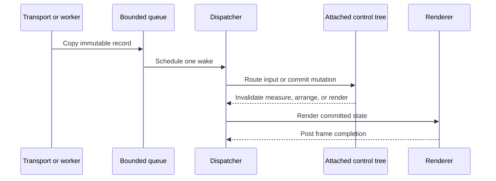

# Threading and dispatcher

## Overview

The dispatcher thread exclusively owns the attached visual tree, control
properties, style assignment, focus, pointer capture, layout, rendering, and
user callbacks. There is no exception for styles: every style value is an
immutable record, and a replacement is assigned and published on the dispatcher
like any other control state.

`CheckAccess` reports whether the caller is on the owner thread, and
`VerifyAccess` throws before an invalid mutation can happen. `Post` queues
fire-and-observe work with diagnostic failure handling. `InvokeAsync` returns a
completion that represents execution, cancellation, or an exception on the
dispatcher.

Framework continuations retain an opaque attachment identity rather than a
dispatcher plus a numeric generation. It names one exact control, dispatcher,
and attachment lifetime; detach, same-dispatcher reattach, cross-dispatcher
reattach, and disposal all make it stale. Guarded post and invoke operations
recheck the identity on the dispatcher and can also require a domain-current
predicate. Fire-and-observe callers explicitly select whether synchronous queue
rejection throws, drops, reports through dispatcher failure handling, or runs
caller cleanup.

Latest-wins asynchronous controls separately own opaque operation leases.
Replacement revokes and cancels the previous lease, authority clears before
cancellation callbacks run, and only the matching current lease may commit or
retire its cancellation source. Attachment identity answers where a continuation
may run; operation identity answers whether its result still owns the component
state.

Only the dispatcher touches `Tree`. Queue locks protect record copies and wake
state; they never hold user callbacks, layout, rendering, or terminal I/O. Live
resolved getters such as `ActualStyle`, `ActualFace`, `ActualBorder`, and
`ActualShadow` use the live resolution cache on the dispatcher. Off-dispatcher
reads resolve a cache-neutral snapshot and never observe or mutate that cache;
callers with an explicit prospective Theme use the corresponding resolution
APIs.

`Dispatcher.Start` creates one named background owner thread and a finite FIFO
queue (4,096 entries by default). `Post` rejects overflow before enqueueing and
reports callback failures through `UnhandledException` outside the queue lock;
an unhandled failure stops the loop. `InvokeAsync` runs inline when called on
the owner thread; otherwise it preserves the result or exception identity and
observes cancellation before the queued callback begins. Shutdown cancels queued
invocations, waits for the active finite callback to finish, and is idempotent.

Shutdown rejects new work, and the rule is specifically about _enqueueing_: once
shutdown has started, the callback that is still running may run to completion,
may invoke inline, and may take pending holds; it may not enqueue new work.
`Post` and the off-thread `InvokeAsync` path throw `ObjectDisposedException`,
because the queue is already cancelled and nothing would ever run what they
added. The inline operations schedule nothing, so refusing them would contradict
the promise that the active callback runs to completion rather than enforce it.
`SynchronizationContext.Post` is the one exception to the throw: it drops the
callback silently, because `SynchronizationContext.Post` must not throw.

A callback failure that stops the dispatcher is recorded on `FatalException`,
whether it went unhandled because no `UnhandledException` subscriber exists,
because a subscriber left `IsHandled` false, or because a subscriber itself
threw — in which case both exceptions are retained. `DisposeAsync` always
completes normally, so a dispatcher that died is diagnosed by reading
`FatalException`, not by awaiting disposal.

Transport readers, resize watchers, and background tasks enqueue immutable
records through thread-safe bounded queues. They never call controls directly.
Queue backpressure, coalescing policy, and shutdown behavior are explicit for
each record type.

## Dispatcher timers

`Dispatcher.Start` accepts one optional `TimeProvider`; passing null selects
`TimeProvider.System`. `Application` passes a single resolved provider to its
dispatcher and to its other time-aware owned services, so tests can advance the
complete application clock without wall-clock sleeps.

A `DispatcherTimer` owns one provider timer and raises `Tick` only on its
dispatcher. Its interval ranges from 1 through 2,147,483,647 milliseconds. The
timer fires its first tick after one complete interval, changing the interval on
a running timer restarts one complete new interval, and stopping the timer keeps
its handlers for a later restart. Start, stop, and interval mutation are
dispatcher-affine. Disposal is thread-safe and idempotent.

> [!NOTE]
>
> The stop/restart symmetry does not extend to disposal. `Dispose()` clears the
> `Tick` handlers, and every later `Start`, `Stop`, or interval assignment
> throws `ObjectDisposedException` — a disposed timer cannot be restarted the
> way a stopped one can.

The provider callback never invokes user code directly. It posts at most one
pending tick, and any periods that elapse while that tick is queued are skipped
rather than replayed as a burst. A full dispatcher queue drops that period, and
a later period may try again. Stop, disposal, and dispatcher shutdown suppress
posted ticks that have not started running. Tick handlers run outside locks, and
their failures follow the ordinary `Dispatcher.UnhandledException` policy.

## Locks and reentrancy

No user callback, control method, layout callback, or renderer hook runs under
an internal lock. Dispatcher callbacks may enqueue further work, but nested run
loops are unsupported. Layout and render invalidation raised during a callback
is coalesced into the next safe phase.

The queue resets an idle-transition flag whenever ready work arrives, and
internal pending-phase leases keep asynchronous frame output counted as
non-idle. When both ready and pending work reach zero, `Idle` runs once on the
owner thread. Work posted by that handler drains before the next wait, and the
loop blocks on a condition variable rather than polling.

`Application` holds a pending lease while renderer I/O is incomplete. The lease
may be released from a renderer continuation, but frame and lifecycle callbacks
are posted back first and run on the owner thread. The bounded input queue and
the newest-resize slot use short locks only to copy records and schedule one
wake; no user callback or terminal I/O ever runs under them.

## Expected behavior

The threading model guarantees that off-thread access fails before any mutation,
posted and invoked work completes with exception and cancellation identity
preserved, ordering stays FIFO, resizes coalesce, shutdown races resolve safely,
queues stay bounded, and callback reentrancy attempts are rejected. Timers keep
their cadence, interval replacement restarts a full interval, ticks coalesce,
stop and disposal races resolve safely, handler failures follow the
unhandled-exception policy, and the loop never busy-waits - all of which is
observable with a fake clock and waiter.
