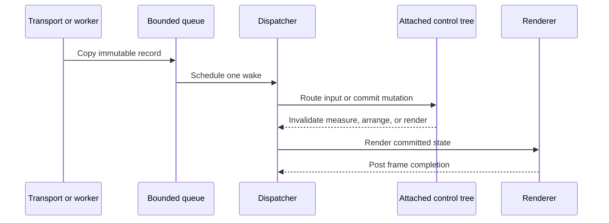

# Threading and dispatcher

## Threading contract

The dispatcher thread exclusively owns the attached visual tree, control
properties, style assignment, focus, pointer capture, layout, rendering, and
user callbacks. A mutable `Style` resource may be changed from another thread;
attached subscribers marshal its invalidation back to their dispatcher before
touching control state.

`CheckAccess` reports ownership; `VerifyAccess` throws before an invalid
mutation. `Post` queues fire-and-observe work with diagnostic failure handling.
`InvokeAsync` returns a completion representing execution, cancellation, or
exception on the dispatcher.

Only the dispatcher touches `Tree`. Queue locks protect record copies and wake
state; they never contain user callbacks, layout, rendering, or terminal I/O.

`Dispatcher.Start` creates one named background owner thread and a finite FIFO
queue (4,096 entries by default). `Post` rejects overflow before enqueue and
reports callback failures through `UnhandledException` outside the queue lock;
an unhandled failure stops the loop. `InvokeAsync` runs inline when already on
the owner, otherwise preserves result or exception identity and observes
cancellation before the queued callback begins. Shutdown rejects new work,
cancels queued invocations, waits for the active finite callback, and is
idempotent.

Transport readers, resize watchers, and background tasks enqueue immutable
records through thread-safe bounded queues. They never call controls. Queue
backpressure, coalescing policy, and shutdown behavior are explicit per record
type.

## Dispatcher timers

`Dispatcher.Start` accepts one optional `TimeProvider`; null selects
`TimeProvider.System`. `Application` passes one resolved provider to its
dispatcher and other time-aware owned services. Tests may therefore advance the
complete application clock without wall-clock sleeps.

`DispatcherTimer` owns one provider timer and raises `Tick` only on its
dispatcher. Its interval is from 1 through 2,147,483,647 milliseconds. It starts
after one complete interval, changing a running interval restarts one complete
new interval, and stopping retains handlers for a later restart. Start, stop,
and interval mutation are dispatcher-affine. Disposal is thread-safe and
idempotent.

The provider callback never invokes user code. It posts at most one pending
tick; elapsed periods while that tick is queued are skipped rather than replayed
as a burst. A full dispatcher queue drops that period and permits a later period
to try again. Stop, disposal, and dispatcher shutdown suppress posted ticks that
have not begun. Tick handlers run outside locks and failures follow ordinary
`Dispatcher.UnhandledException` policy.

## Locks and reentrancy

No user callback, control method, layout callback, or renderer hook runs under
an internal lock. Dispatcher callbacks may enqueue work but nested run loops are
unsupported. Layout/render invalidation during callbacks is coalesced for the
next safe phase.

The queue resets an idle-transition flag whenever ready work arrives. Internal
pending-phase leases keep asynchronous frame output non-idle. When both ready
and pending work reach zero, `Idle` runs once on the owner thread; work posted
by that handler drains before another wait, and the loop blocks on a condition
rather than polling.

`Application` holds a pending lease while renderer I/O is incomplete. The lease
may be released from a renderer continuation, but frame and lifecycle callbacks
are posted back first and run on the owner. The bounded input queue and
newest-resize slot use short locks only to copy records and schedule one wake;
no user callback or terminal I/O runs under them.

## Test obligations

Cover off-thread failure before mutation, posted/invoked success, exception and
cancellation propagation, FIFO ordering within priority, resize coalescing,
shutdown races, bounded queues, callback reentrancy attempts, timer cadence,
interval replacement, coalescing, stop/disposal races, handler failure, and
absence of busy waits using a fake clock/waiter.
