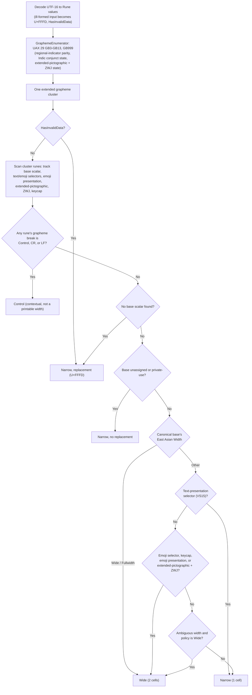

# Unicode cell geometry

## Overview

SharpVision pins
[Unicode 17.0.0](https://www.unicode.org/versions/Unicode17.0.0/),
[UAX 29 revision 47](https://www.unicode.org/reports/tr29/tr29-47.html), and
[UAX 11 revision 44](https://www.unicode.org/reports/tr11/tr11-44.html) for its
first generated tables. The source data and its attribution are checked in
alongside the generator output.

The exact Unicode property and conformance inputs live under
`extern/unicode/17.0.0`. `npm run generate:unicode` reads those local files and
deterministically emits the runtime lookup table, and `npm run check:unicode`
needs no network access. Maintainers run the explicit `npm run refresh:unicode`
command to redownload the pinned official files and verify their recorded
SHA-256 values.

The generated lookup tables are packed into compile-time string metadata and
viewed as little-endian integer spans. This avoids a generated type initializer
and per-lookup allocation on supported .NET targets. Multi-byte static metadata
views require a little-endian runtime; the generator records that constraint
beside the emitted representation.

Text is decoded as Rune values and segmented into extended grapheme clusters.
Width is assigned to the whole cluster; it is never calculated by summing the
scalar East Asian Width values. The default ambiguous-width policy is narrow,
and callers may choose wide explicitly through `Capabilities`.

`Graphemes.Enumerate(ReadOnlySpan<char>)` returns an allocation-free
`GraphemeEnumerable`. Each `Grapheme` is a borrowed `(Offset, Length)` slice
into the original UTF-16 span and becomes invalid as soon as that source is no
longer valid. `HasInvalidData` marks a segment whose single ill-formed UTF-16
code unit is interpreted as U+FFFD. The enumerator applies UAX 29 rules GB3
through GB13 and GB999 directly — including regional-indicator parity, Indic
conjunct state, and extended-pictographic ZWJ state — and never allocates a
normalized string.

`Width.Measure(ReadOnlySpan<char>, Ambiguous)` returns printable cells,
graphemes, and contextual-control counts in one allocation-free pass.
`Ambiguous.Narrow` is the default; `Ambiguous.Wide` applies only when it is
selected explicitly in `Capabilities`. Generated canonical-decomposition bases
keep composed and decomposed text equal in width without allocating normalized
storage. Invalid UTF-16, combining-only clusters, private-use scalars, and
scalars unassigned in Unicode 17 each occupy one conservative, repairable cell.

Grapheme segmentation and width classification run as one pipeline per cluster:

`SharpVision.Text.Layout` is the shipped UI consumer of this geometry. It emits
only grapheme-boundary source slices, expands tabs at four-cell stops, and
reserves ellipsis width under the same explicit ambiguous-width policy. Text
caches those lines. The runtime derives one immutable `UnicodePolicy` from the
active capability profile before the first layout, propagates that same
reference through the attached control tree, and replaces it before invalidating
layout after a profile change. Children inserted later inherit the owner's
current policy.

Physical-cell primitives follow a stricter rule than flowing text.
`Canvas.DrawRune` and `Canvas.Fill` validate that a glyph is one cell under the
owning frame's policy before mutating anything. The semantic line, box, shade,
and quadrant primitives use their exact Unicode glyphs under the narrow policy
and deterministic ASCII fallbacks under the wide policy. Fixed-cell control
chrome applies the same rule per glyph, so a negotiated policy can never make a
border, shadow, checkbox, button, or scrollbar overwrite an adjacent cell.

## Source and terminal presentation

Source text and terminal presentation are owned separately. IsEditing,
selection, clipboard, and accessibility keep the original grapheme-aligned
UTF-16, while a frame stores the safe UTF-8 presentation that owns the terminal
cells.

A base-less cluster — one made only from combining or spacing marks, prepend
characters, variation selectors, emoji modifiers, tag characters, or joiners —
has no portable independent glyph position. It advances one repairable logical
cell but presents as U+FFFD. Raw orphan components are never emitted on their
own, because a terminal could apply them to the preceding cell and violate frame
ownership. Valid decomposed text keeps its original base plus its components.

Cluster analysis returns width and presentation classification in one
allocation-free pass. Measurement, layout, canvas preflight, canvas mutation,
selection, and cursor placement all consume that single classification; none of
them may invent a second orphan or emoji-width rule.

## Width rules

| Category                                                                                  | Cell count                                                 | Example                           |
| ----------------------------------------------------------------------------------------- | ---------------------------------------------------------- | --------------------------------- |
| Printable narrow clusters                                                                 | 1 cell                                                     | `a` (U+0061 LATIN SMALL LETTER A) |
| Wide/fullwidth and recognized emoji-presentation clusters                                 | 2 cells                                                    | `世` (U+4E16), `😀` (U+1F600)     |
| Combining marks, variation selectors, emoji modifiers, tag characters, and ZWJ components | 0 independent cells (fold into the owning cluster)         | U+0301 COMBINING ACUTE ACCENT     |
| Controls such as tab, CR, and LF                                                          | Contextual, not a printable width                          | U+0009 TAB, U+000D CR, U+000A LF  |
| Invalid UTF-16                                                                            | 1 cell per replacement                                     | An unpaired surrogate             |
| Private-use and unassigned scalars                                                        | 1 cell by default, unless an explicit profile tailors them | U+E000 (Private Use Area)         |

Canonically equivalent precomposed and decomposed text yields equal width
without allocating normalized strings.

## Cell ownership

A wide cluster writes one lead cell plus a continuation cell that references the
same owned grapheme. Clipping, clearing, or overwriting either cell damages and
repairs the full ownership range. The right-edge policy is explicit per drawing
operation — wrap, clip the whole cluster, or emit a replacement — and emitting
half a cluster is forbidden.

Ownership generalizes to a positive rectangular cell span. Ordinary text spans
one row and one or two columns, and every continuation references one lead cell.
Repair, clearing, styling, clipping, selection, semantic comparison, damage, and
frame copying all operate on the complete owner rectangle.

## Cell and pixel grids

When the total cell and pixel dimensions are known, pixel boundaries use exact
rational mapping rather than truncated per-cell division:

`cell = floor(pixel * cellCount / pixelCount)`

The coordinate must lie inside the known pixel rectangle, and the arithmetic
uses a checked 64-bit intermediate. Every valid pixel maps monotonically to one
valid cell, even when the final columns or rows have different pixel extents.
Missing or out-of-domain geometry produces no cell coordinate; `(0, 0)` is never
used as a placeholder.

## Shared consumers

Measurement, wrapping, horizontal scrolling, clipping, cursor movement, hit
testing, selection, marked `Text`, canvas operations, damage tracking, and
terminal encoding all use this single geometry service. Password-mask
measurement and rendering use the same inherited ambiguous-width policy.

## Expected behavior

The geometry holds against the Unicode grapheme conformance data, the emoji
data, and generated-table boundaries, across the ASCII, CJK, and ambiguous
policies, and for decomposed text, variation selectors, keycaps, flags, ZWJ
families, lone surrogates, wrapping, clipping, selection, and wide-cell repair.
