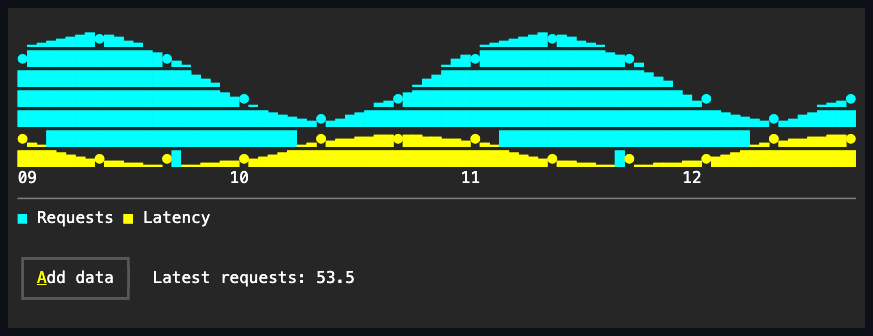

# AreaChart

## Overview

`AreaChart` presents ordered values as connected lines with colored fill toward
the visible zero baseline.

## API

The control uses the [shared chart API](index.md#api) and the same non-zero
automatic scale as `LineChart`.

## Example



```csharp
var chart = new AreaChart
{
    Series = [requests, latency],
};
```

## Expected behavior

When zero is visible, the fill spans between the series and zero; when an
explicit range excludes zero, fill proceeds toward the nearest plot edge. By
default (`ChartStyle.FillMode` of `Fractional`) the fill is continuous across
the series' domain: every plot column carries the linearly interpolated series
height rasterized in eighth-cell resolution, so the fill's own fractional top
edge traces the series silhouette. A style with `ChartFillMode.Glyph` keeps the
authored area glyph filling whole cells in the columns that carry a data point,
leaving the columns between points empty. Point glyphs remain visible over the
fill in both modes, and multiple series retain deterministic color precedence.
