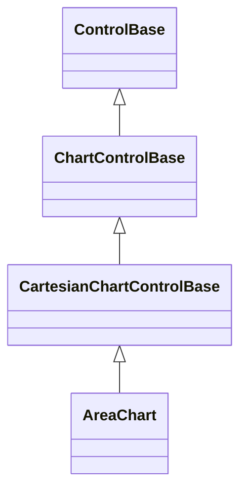

# AreaChart

## Overview

`AreaChart` presents ordered values as connected series with colored fill toward
zero or the nearest visible scale edge.

## Inheritance



## API

| Member                       | Type                                           | Default                   | Description                                                          |
| ---------------------------- | ---------------------------------------------- | ------------------------- | -------------------------------------------------------------------- |
| `Series`                     | `IReadOnlyList<ChartSeries>`                   | Empty                     | Borrowed observable series validated before membership changes.      |
| `Scale`                      | `ChartScale`                                   | Automatic (zero excluded) | Authored bounds and zero-inclusion policy.                           |
| `Selection`                  | `ChartSelection?`                              | `null`                    | Selected marker by series and point indices.                         |
| `SelectionChanged`           | `EventHandler<ChartSelectionChangedEventArgs>` | —                         | Raised after selection changes or clears.                            |
| `LegendPlacement`            | `ChartLegendPlacement`                         | `Automatic`               | Legend location; undefined values throw before mutation.             |
| `ShowCategoryLabels`         | `bool`                                         | `true`                    | Whether category labels reserve one plot row.                        |
| `ShowValueLabels`            | `bool`                                         | `false`                   | Whether complete formatted values draw beside markers when they fit. |
| `ShowZeroAxis`               | `bool`                                         | `true`                    | Whether an interior zero rule draws.                                 |
| `ValueLabelFormat`           | `string`                                       | `"G"`                     | Invariant numeric format validated before mutation.                  |
| Inherited `IsHitTestVisible` | `bool`                                         | `true`                    | Allows nearest-point pointer selection.                              |
| `Style`                      | `ChartStyle?`                                  | `null`                    | Complete local chart presentation.                                   |
| `ActualStyle`                | `ChartStyle`                                   | Resolved                  | Read-only resolved presentation.                                     |

The [shared chart API](index.md#api) documents model observation, binding,
selection repair, and `ChartStyle.SelectionDecoration`.

The intrinsic desired size is 30 by 10 cells. Parent layout may arrange any
other size.

## Keyboard

| Key            | Behavior                                                |
| -------------- | ------------------------------------------------------- |
| `Left`/`Right` | Select the first point, then move through the series.   |
| `Up`/`Down`    | Move to the same or nearest point in another series.    |
| `Home`/`End`   | Select the first or last point in the current series.   |
| `Escape`       | Clear selection; bubble when there is nothing to clear. |

A primary pointer press focuses the chart and selects the plotted point nearest
the clicked plot cell. Wheel input continues to an enclosing scroll host.

## Example


```csharp
var chart = new AreaChart
{
    Series = [requests, latency],
    ShowZeroAxis = true,
};
```

## Expected behavior

| Scope      | Observable evidence                                                  |
| ---------- | -------------------------------------------------------------------- |
| Public API | Validation, focus, selection, deterministic geometry, and rendering. |

- When zero is visible, fill spans between the series and zero. Otherwise it
  proceeds toward the nearest plot edge.
- Fractional mode interpolates every visible plot column and uses eighth-cell
  vertical resolution. Opposite-sign extreme values remain finite.
- Glyph mode uses authored area and line glyphs at whole-cell positions.
- Point markers remain visible over fill and selected markers receive the
  configured decoration.
