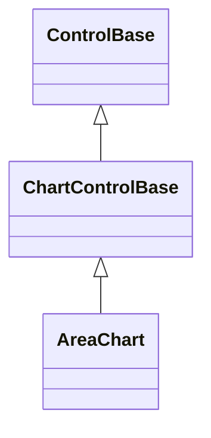

# AreaChart

## Overview

`AreaChart` presents ordered values as connected lines with colored fill toward
the visible zero baseline.

## Inheritance



## API

| Member                       | Type                         | Default                   | Description                                                                                               |
| ---------------------------- | ---------------------------- | ------------------------- | --------------------------------------------------------------------------------------------------------- |
| `Series`                     | `IReadOnlyList<ChartSeries>` | Empty                     | Borrowed observable series source; rejects a null value, a null series, and a duplicate series reference. |
| `Scale`                      | `ChartScale`                 | Automatic (zero excluded) | Authored bounds and zero-inclusion policy; an invalid `ChartScale` throws when constructed.               |
| `LegendPlacement`            | `ChartLegendPlacement`       | `Automatic`               | Chooses where the legend renders; rejects an undefined enum value.                                        |
| `ShowCategoryLabels`         | `bool`                       | `true`                    | Whether category labels consume plot cells when they fit.                                                 |
| `ShowValueLabels`            | `bool`                       | `false`                   | Whether point values are drawn when they fit.                                                             |
| Inherited `IsHitTestVisible` | `bool`                       | `false`                   | Overrides the `ControlBase` default; the passive chart never participates in pointer hit testing.         |
| `Style`                      | `ChartStyle?`                | `null`                    | Gets or sets the complete local presentation.                                                             |
| `ActualStyle`                | `ChartStyle`                 | Resolved                  | Read-only; the complete local, theme-owned, or code-owned presentation.                                   |

The [shared chart API](index.md#api) documents `ChartSeries`, `ChartDataPoint`,
`ChartScale`, and the one-way binding pattern common to every chart control.

`ChartStyle`, reached through `Style`/`ActualStyle`, also carries `AxisColor`,
`LabelColor`, the `PrimaryColor`/`SecondaryColor`/`TertiaryColor` deterministic
series palette, `Glyphs`, and `FillMode` (default `Fractional`), which governs
how this chart's fill rasterizes; see [Expected behavior](#expected-behavior).

## Example


```csharp
var chart = new AreaChart
{
    Series = [requests, latency],
};
```

## Expected behavior

| Scope      | Observable evidence                                            |
| ---------- | -------------------------------------------------------------- |
| Public API | Validation, defaults, state changes, and deterministic output. |

- When zero is visible, the fill spans between the series and zero; when an
  explicit range excludes zero, fill proceeds toward the nearest plot edge.
- By default (`ChartStyle.FillMode` of `Fractional`) the fill is continuous
  across the series' domain: every plot column carries the linearly interpolated
  series height rasterized in eighth-cell resolution, so the fill's own
  fractional top edge traces the series silhouette.
- A style with `ChartFillMode.Glyph` keeps the authored area glyph filling whole
  cells in the columns that carry a data point, leaving the columns between
  points empty.
- Point glyphs remain visible over the fill in both modes, and multiple series
  retain deterministic color precedence.
