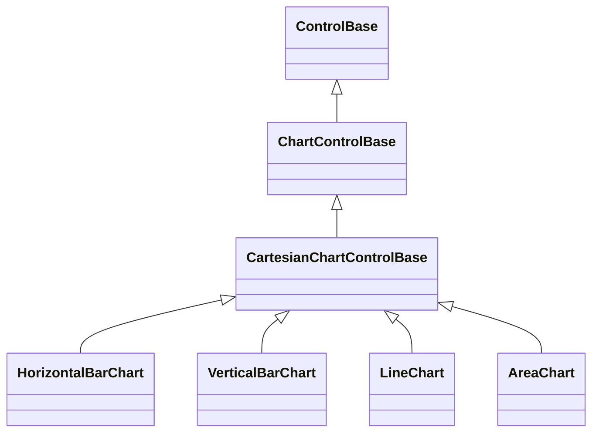

# CartesianChartControlBase

## Overview

`CartesianChartControlBase` is the abstract authoring role for full charts with
category labels, numeric value labels, legends, and an optional visible zero
axis. Applications normally instantiate one of its four concrete chart types.

## Inheritance



## API

| Member               | Type                                           | Default     | Description                                                                         |
| -------------------- | ---------------------------------------------- | ----------- | ----------------------------------------------------------------------------------- |
| `Series`             | `IReadOnlyList<ChartSeries>`                   | Empty       | Borrowed observable series source validated before membership changes.              |
| `Scale`              | `ChartScale`                                   | Family set  | Authored finite bounds and zero-inclusion policy.                                   |
| `Selection`          | `ChartSelection?`                              | `null`      | Selected point; indices outside current data throw before mutation.                 |
| `SelectionChanged`   | `EventHandler<ChartSelectionChangedEventArgs>` | —           | Raised after a changed selection commits.                                           |
| `LegendPlacement`    | `ChartLegendPlacement`                         | `Automatic` | Legend policy; an undefined enum value throws before mutation.                      |
| `ShowCategoryLabels` | `bool`                                         | `true`      | Whether category labels reserve plot cells when space permits.                      |
| `ShowValueLabels`    | `bool`                                         | `false`     | Whether complete formatted values draw when they fit without replacing data.        |
| `ShowZeroAxis`       | `bool`                                         | `true`      | Whether an axis rule draws when zero is strictly inside the resolved range.         |
| `ValueLabelFormat`   | `string`                                       | `"G"`       | Invariant numeric format; null or an invalid numeric format throws before mutation. |
| `Style`              | `ChartStyle?`                                  | `null`      | Complete local presentation, or null for theme and code-owned fallback.             |
| `ActualStyle`        | `ChartStyle`                                   | Resolved    | Read-only resolved presentation, including `SelectionDecoration`.                   |

The [shared chart API](index.md#api) documents model observation, selection
repair, scaling, and binding.

The intrinsic desired size is 30 by 10 cells. Parent layout may arrange any
other size.

## Keyboard

| Key          | Behavior                                                          |
| ------------ | ----------------------------------------------------------------- |
| Arrow keys   | Select the first point, then move along category and series axes. |
| `Home`/`End` | Select the first or last point in the current series.             |
| `Escape`     | Clear selection; bubble when there is nothing to clear.           |

A primary pointer press focuses the chart and selects the nearest visible point
or bar lane. Wheel input is not consumed and can continue to an enclosing
scrolling container. An arrow on the series axis is likewise left unhandled when
fewer than two series contain points. Disabled or hidden charts do not change
selection.

## Example

An author-defined Cartesian chart derives from this role and implements only its
geometry and content rendering:

```csharp
public sealed class RangeChart : CartesianChartControlBase
{
    public RangeChart() : base(ChartScale.Automatic)
    {
    }

    protected override void OnRenderContent(TerminalCanvas canvas)
    {
        // Render retained Series through the chart canvas contract.
    }
}
```

## Expected behavior

| Scope      | Observable evidence                                                          |
| ---------- | ---------------------------------------------------------------------------- |
| Public API | Shared options, validated selection, input routing, and render invalidation. |

- The role centralizes every public presentation option shared by full charts;
  concrete chart controls do not redeclare those properties.
- Selection changes repaint without forcing measure and remain synchronized by
  point identity through observable collection moves.
- Input uses exact unmodified navigation commands and preserves wheel bubbling.
