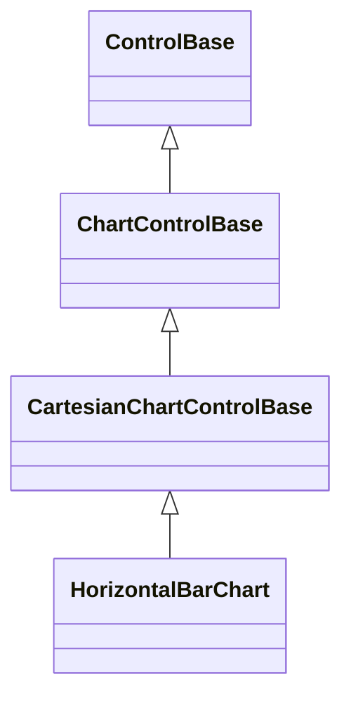

# HorizontalBarChart

## Overview

`HorizontalBarChart` compares labeled values as horizontal bars growing away
from a resolved numeric baseline.

## Inheritance



## API

| Member                       | Type                                           | Default                | Description                                                       |
| ---------------------------- | ---------------------------------------------- | ---------------------- | ----------------------------------------------------------------- |
| `Series`                     | `IReadOnlyList<ChartSeries>`                   | Empty                  | Borrowed observable series validated before membership changes.   |
| `Scale`                      | `ChartScale`                                   | `ChartScale.Automatic` | Authored bounds and zero-inclusion policy.                        |
| `Selection`                  | `ChartSelection?`                              | `null`                 | Selected bar by series and category indices.                      |
| `SelectionChanged`           | `EventHandler<ChartSelectionChangedEventArgs>` | —                      | Raised after selection changes or clears.                         |
| `LegendPlacement`            | `ChartLegendPlacement`                         | `Automatic`            | Legend location; undefined values throw before mutation.          |
| `ShowCategoryLabels`         | `bool`                                         | `true`                 | Whether labels and their separating axis reserve cells.           |
| `ShowValueLabels`            | `bool`                                         | `false`                | Whether complete formatted values draw beyond bars when they fit. |
| `ShowZeroAxis`               | `bool`                                         | `true`                 | Whether an interior zero baseline draws.                          |
| `ValueLabelFormat`           | `string`                                       | `"G"`                  | Invariant numeric format validated before mutation.               |
| Inherited `IsHitTestVisible` | `bool`                                         | `true`                 | Allows primary pointer selection.                                 |
| `Style`                      | `ChartStyle?`                                  | `null`                 | Complete local chart presentation.                                |
| `ActualStyle`                | `ChartStyle`                                   | Resolved               | Read-only resolved presentation.                                  |

The [shared chart API](index.md#api) documents model observation, binding,
selection repair, and `ChartStyle.SelectionDecoration`.

The intrinsic desired size is 30 by 10 cells. Parent layout may arrange any
other size.

## Keyboard

| Key            | Behavior                                                 |
| -------------- | -------------------------------------------------------- |
| `Up`/`Down`    | Select the first bar, then move between category rows.   |
| `Left`/`Right` | Move between series lanes for the current category.      |
| `Home`/`End`   | Select the first or last category in the current series. |
| `Escape`       | Clear selection; bubble when there is nothing to clear.  |

A primary pointer press focuses the chart and selects the nearest bar lane in
the clicked category band. Wheel input continues to an enclosing scroll host.

## Example


```csharp
var chart = new HorizontalBarChart
{
    Series = [new ChartSeries("Change", [
        new ChartDataPoint("North", 8),
        new ChartDataPoint("South", -3),
    ])],
    ShowValueLabels = true,
    ValueLabelFormat = "0.0",
};
chart.SelectionChanged += (_, args) => ShowDetails(args.Selection);
```

## Expected behavior

| Scope      | Observable evidence                                                  |
| ---------- | -------------------------------------------------------------------- |
| Public API | Validation, focus, selection, deterministic geometry, and rendering. |

- Categories own disjoint vertical bands. Series divide each band and keep a
  blank gutter whenever all visible lanes still fit. The category label stays
  centered on the occupied lanes rather than drifting onto that gutter.
- Fractional bars end on eighth-cell boundaries. Glyph mode keeps one-cell
  whole-rounded bars using the authored bar glyph.
- Mixed signs grow in opposite directions from the zero baseline.
- The selected bar uses `SelectionDecoration` and a point glyph at its value
  endpoint, including for full-block fills.
- A value label keeps one blank cell beyond the bar or is suppressed whole; it
  never overwrites the bar tail or clips into a different number.
