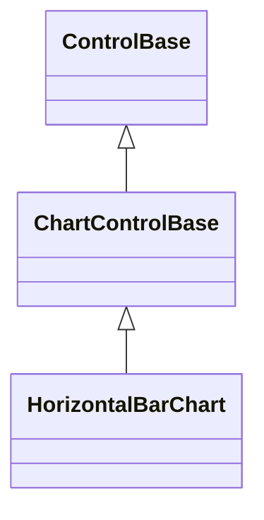
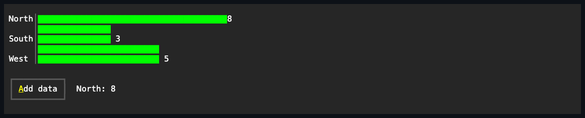

# HorizontalBarChart

## Overview

`HorizontalBarChart` compares category values as grouped horizontal bars.
Positive and negative values grow in opposite directions from the resolved zero
baseline.

## Inheritance



## API

| Member                       | Type                         | Default                | Description                                                                                                            |
| ---------------------------- | ---------------------------- | ---------------------- | ---------------------------------------------------------------------------------------------------------------------- |
| `Series`                     | `IReadOnlyList<ChartSeries>` | Empty                  | Borrowed observable series source; rejects a null value, a null series, and a duplicate series reference.              |
| `Scale`                      | `ChartScale`                 | `ChartScale.Automatic` | Authored bounds and zero-inclusion policy; `Automatic` includes zero. An invalid `ChartScale` throws when constructed. |
| `LegendPlacement`            | `ChartLegendPlacement`       | `Automatic`            | Chooses where the legend renders; rejects an undefined enum value.                                                     |
| `ShowCategoryLabels`         | `bool`                       | `true`                 | Whether category labels consume plot width when they fit.                                                              |
| `ShowValueLabels`            | `bool`                       | `false`                | Whether numeric values are drawn beside bars when they fit.                                                            |
| Inherited `IsHitTestVisible` | `bool`                       | `false`                | Overrides the `ControlBase` default; the passive chart never participates in pointer hit testing.                      |
| `Style`                      | `ChartStyle?`                | `null`                 | Gets or sets the complete local presentation.                                                                          |
| `ActualStyle`                | `ChartStyle`                 | Resolved               | Read-only; the complete local, theme-owned, or code-owned presentation.                                                |

The [shared chart API](index.md#api) documents `ChartSeries`, `ChartDataPoint`,
`ChartScale`, and the one-way binding pattern common to every chart control.

`ChartStyle`, reached through `Style`/`ActualStyle`, also carries `AxisColor`,
`LabelColor`, the `PrimaryColor`/`SecondaryColor`/`TertiaryColor`/
`QuaternaryColor`/`QuinaryColor`/`SenaryColor` deterministic six-color series
palette, `Glyphs`, and `FillMode` (default `Fractional`), which governs how this
chart's bars rasterize; see [Expected behavior](#expected-behavior).

## Example



```csharp
var chart = new HorizontalBarChart
{
    Series = [new ChartSeries("Change", [
        new ChartDataPoint("North", 8),
        new ChartDataPoint("South", -3),
    ])],
    ShowValueLabels = true,
};
```

## Expected behavior

| Scope      | Observable evidence                                            |
| ---------- | -------------------------------------------------------------- |
| Public API | Validation, defaults, state changes, and deterministic output. |

- Categories consume vertical bands, series share each category band, and every
  bar is clipped to the plot.
- The same `ChartStyle.FillMode` contract as
  [VerticalBarChart](vertical-bar-chart.md) applies along the horizontal axis:
  fractional bars fill their band's rows and end on an eighth-cell boundary, and
  the glyph mode keeps one-cell whole-rounded bars.
- A value label that would not fit beyond its bar clamps inside the plot and
  draws over the bar's tail rather than disappearing. Labels are removed when
  they would leave no useful bar width.
- Empty and zero values render safely without inventing magnitude.
