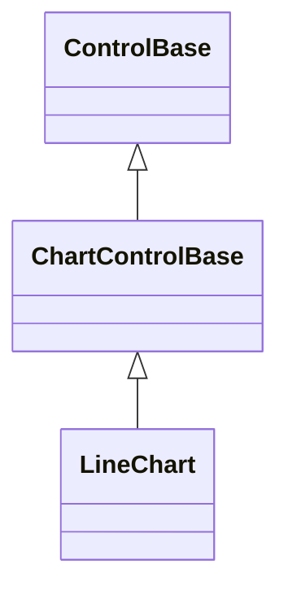
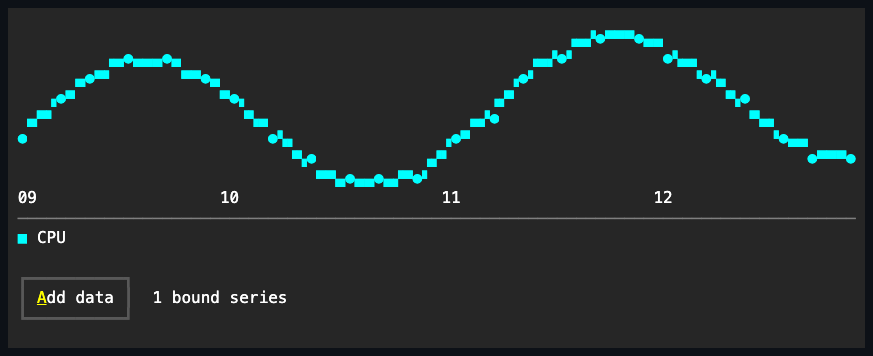

# LineChart

## Overview

`LineChart` presents ordered values as connected colored series with visible
point cells.

## Inheritance



## API

| Member                       | Type                         | Default                   | Description                                                                                                                                                |
| ---------------------------- | ---------------------------- | ------------------------- | ---------------------------------------------------------------------------------------------------------------------------------------------------------- |
| `Series`                     | `IReadOnlyList<ChartSeries>` | Empty                     | Borrowed observable series source; rejects a null value, a null series, and a duplicate series reference.                                                  |
| `Scale`                      | `ChartScale`                 | Automatic (zero excluded) | Authored bounds and zero-inclusion policy; an invalid `ChartScale` throws when constructed. Not forcing zero preserves small changes around a large value. |
| `LegendPlacement`            | `ChartLegendPlacement`       | `Automatic`               | Chooses where the legend renders; rejects an undefined enum value.                                                                                         |
| `ShowCategoryLabels`         | `bool`                       | `true`                    | Whether category labels consume plot cells when they fit.                                                                                                  |
| `ShowValueLabels`            | `bool`                       | `false`                   | Whether point values are drawn when they fit.                                                                                                              |
| Inherited `IsHitTestVisible` | `bool`                       | `false`                   | Overrides the `ControlBase` default; the passive chart never participates in pointer hit testing.                                                          |
| `Style`                      | `ChartStyle?`                | `null`                    | Gets or sets the complete local presentation.                                                                                                              |
| `ActualStyle`                | `ChartStyle`                 | Resolved                  | Read-only; the complete local, theme-owned, or code-owned presentation.                                                                                    |

The [shared chart API](index.md#api) documents `ChartSeries`, `ChartDataPoint`,
`ChartScale`, and the one-way binding pattern common to every chart control.
Callers can use an explicit `ChartScale` when comparisons require fixed bounds.

`ChartStyle`, reached through `Style`/`ActualStyle`, also carries `AxisColor`,
`LabelColor`, the `PrimaryColor`/`SecondaryColor`/`TertiaryColor` deterministic
series palette, `Glyphs`, `LineMode` (default `Quadrant`), and `LinePattern`
(default `Solid`), which govern how this chart's lines rasterize; see
[Expected behavior](#expected-behavior).

## Example



```csharp
var chart = new LineChart
{
    Series = [new ChartSeries("CPU", points)],
    LegendPlacement = ChartLegendPlacement.Bottom,
};
```

## Expected behavior

| Scope      | Observable evidence                                            |
| ---------- | -------------------------------------------------------------- |
| Public API | Validation, defaults, state changes, and deterministic output. |

- Point order defines the horizontal coordinate, finite values define the
  vertical coordinate, and connections use deterministic geometry.
- By default (`ChartStyle.LineMode` of `Quadrant`) segments rasterize in
  half-cell resolution: each Bresenham step fills one quadrant of a cell,
  crossing series merge into the connected quadrant glyph rather than
  overwriting one another, and the extrema land on the same cells the point
  markers use.
- A style with `ChartLineMode.Glyph` rasterizes whole cells with the style's own
  line glyph, exactly as authored. Point glyphs remain visible over connecting
  cells in both modes. Values outside explicit bounds are clipped to the nearest
  plot edge.
- In `Quadrant` mode, each series draws with the dash pattern its own
  `ChartSeries.LinePattern` selects, falling back to `ChartStyle.LinePattern`
  when unset. `Solid` draws an unbroken stroke; `DoubleDash`, `TripleDash`, and
  `QuadrupleDash` draw progressively finer dashes, so series stay
  distinguishable without relying on color alone.
- The dash phase advances continuously across a series' whole polyline, so it
  stays consistent through every segment instead of restarting at each point.
  `ChartLineMode.Glyph` ignores the resolved pattern - a style that replaces the
  line glyph already owns that mode's appearance.
