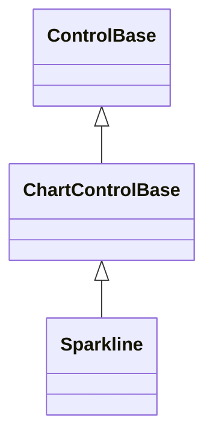

# Sparkline

## Overview

`Sparkline` compresses one ordered series into selectable fractional columns. It
provides compact trend context rather than labeled comparison.

## Inheritance



## API

| Member                       | Type                                           | Default                   | Description                                                                      |
| ---------------------------- | ---------------------------------------------- | ------------------------- | -------------------------------------------------------------------------------- |
| `Series`                     | `IReadOnlyList<ChartSeries>`                   | Empty                     | Borrowed source containing at most one series.                                   |
| `Scale`                      | `ChartScale`                                   | Automatic (zero excluded) | Authored bounds and zero-inclusion policy.                                       |
| `Selection`                  | `ChartSelection?`                              | `null`                    | Selected retained point; pointer selection is limited to visible recent columns. |
| `SelectionChanged`           | `EventHandler<ChartSelectionChangedEventArgs>` | —                         | Raised after selection changes or clears.                                        |
| Inherited `IsHitTestVisible` | `bool`                                         | `true`                    | Allows visible-column pointer selection.                                         |
| `Style`                      | `ChartStyle?`                                  | `null`                    | Complete local chart presentation.                                               |
| `ActualStyle`                | `ChartStyle`                                   | Resolved                  | Read-only resolved presentation.                                                 |

The intrinsic desired size is 20 by 1 cells. Parent layout may arrange any other
size.

`Sparkline` has no `LegendPlacement`, label, zero-axis, or value-format
properties. The [shared chart API](index.md#api) documents model observation,
selection repair, scaling, binding, and `ChartStyle.SelectionDecoration`.

## Keyboard

| Key            | Behavior                                                 |
| -------------- | -------------------------------------------------------- |
| `Left`/`Right` | Select the first point, then move through retained data. |
| `Home`/`End`   | Select the first or last retained point.                 |
| `Escape`       | Clear selection; bubble when there is nothing to clear.  |

A primary pointer press focuses the control and maps the clicked visible column
to the matching point in the recent-data window. Wheel input continues to an
enclosing scroll host. Vertical arrows are not consumed because a sparkline has
only one populated series axis.

## Example


```csharp
var sparkline = new Sparkline
{
    Series = [new ChartSeries("Load", points)],
    Width = Length.Cells(20),
};
sparkline.SelectionChanged += (_, args) => ShowDetails(args.Selection);
```

## Expected behavior

| Scope      | Observable evidence                                                  |
| ---------- | -------------------------------------------------------------------- |
| Public API | Validation, focus, selection, deterministic geometry, and rendering. |

- Only the most recent points that fit are rendered. Pointer hit testing maps
  visible columns back to their original retained indices.
- Fractional mode uses eight vertical levels per cell and full cells beneath the
  cap in taller bounds. Glyph mode rounds to whole authored bar glyphs.
- The selected column uses `SelectionDecoration` and replaces its cap with the
  chart point glyph, keeping the active sample visible on full-block columns.
- Empty data leaves content clear. Resize and deep value changes repaint without
  replacing the series.
