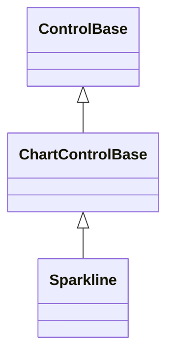
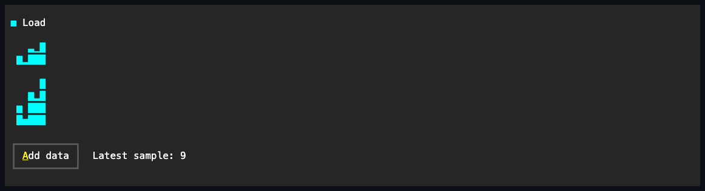

# Sparkline

## Overview

`Sparkline` compresses one ordered series into fractional lower-block cells. It
is intended for compact trend context rather than labeled comparison.

## Inheritance



## API

| Member                       | Type                         | Default                   | Description                                                                                       |
| ---------------------------- | ---------------------------- | ------------------------- | ------------------------------------------------------------------------------------------------- |
| `Series`                     | `IReadOnlyList<ChartSeries>` | Empty                     | Borrowed single-series source; rejects a null value and a source containing more than one series. |
| `Scale`                      | `ChartScale`                 | Automatic (zero excluded) | Authored bounds and zero-inclusion policy; an invalid `ChartScale` throws when constructed.       |
| Inherited `IsHitTestVisible` | `bool`                       | `false`                   | Overrides the `ControlBase` default; the passive chart never participates in pointer hit testing. |
| `Style`                      | `ChartStyle?`                | `null`                    | Gets or sets the complete local presentation.                                                     |
| `ActualStyle`                | `ChartStyle`                 | Resolved                  | Read-only; the complete local, theme-owned, or code-owned presentation.                           |

`Sparkline` has no `LegendPlacement`, `ShowCategoryLabels`, or `ShowValueLabels`
property: it never shows a legend or labels, regardless of series count. The
[shared chart API](index.md#api) documents `ChartSeries`, `ChartDataPoint`,
`ChartScale`, and the one-way binding pattern common to every chart control.

`ChartStyle`, reached through `Style`/`ActualStyle`, also carries `AxisColor`,
`LabelColor`, the `PrimaryColor`/`SecondaryColor`/`TertiaryColor`/
`QuaternaryColor`/`QuinaryColor`/`SenaryColor` deterministic six-color series
palette, `Glyphs`, and `FillMode` (default `Fractional`), which governs how this
chart's columns rasterize; see [Expected behavior](#expected-behavior).

## Example



```csharp
var sparkline = new Sparkline
{
    Series = [new ChartSeries("Load", points)],
    Width = Length.Cells(20),
};
```

## Expected behavior

| Scope      | Observable evidence                                            |
| ---------- | -------------------------------------------------------------- |
| Public API | Validation, defaults, state changes, and deterministic output. |

- The most recent points that fit are rendered.
- Columns rasterize through the canvas fractional-bar primitive: eight
  fractional levels provide sub-cell vertical resolution, and taller bounds use
  full cells beneath the fraction.
- A style with `ChartFillMode.Glyph` rounds each column to whole cells of the
  style's own bar glyph instead.
- Empty data leaves the content clear. Resize and deep value changes repaint
  without replacing the series.
