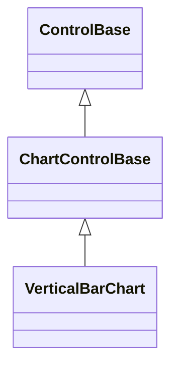
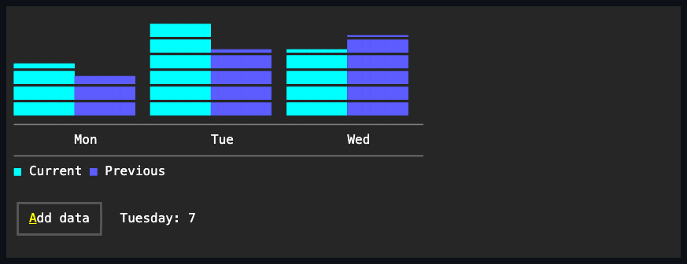

# VerticalBarChart

## Overview

`VerticalBarChart` compares category values as grouped vertical bars rising or
falling from the resolved zero baseline.

## Inheritance



## API

| Member                       | Type                         | Default                | Description                                                                                                            |
| ---------------------------- | ---------------------------- | ---------------------- | ---------------------------------------------------------------------------------------------------------------------- |
| `Series`                     | `IReadOnlyList<ChartSeries>` | Empty                  | Borrowed observable series source; rejects a null value, a null series, and a duplicate series reference.              |
| `Scale`                      | `ChartScale`                 | `ChartScale.Automatic` | Authored bounds and zero-inclusion policy; `Automatic` includes zero. An invalid `ChartScale` throws when constructed. |
| `LegendPlacement`            | `ChartLegendPlacement`       | `Automatic`            | Chooses where the legend renders; rejects an undefined enum value.                                                     |
| `ShowCategoryLabels`         | `bool`                       | `true`                 | Whether category labels consume plot height when they fit.                                                             |
| `ShowValueLabels`            | `bool`                       | `false`                | Whether numeric values are drawn above bars when they fit.                                                             |
| Inherited `IsHitTestVisible` | `bool`                       | `false`                | Overrides the `ControlBase` default; the passive chart never participates in pointer hit testing.                      |
| `Style`                      | `ChartStyle?`                | `null`                 | Gets or sets the complete local presentation.                                                                          |
| `ActualStyle`                | `ChartStyle`                 | Resolved               | Read-only; the complete local, theme-owned, or code-owned presentation.                                                |

The [shared chart API](index.md#api) documents `ChartSeries`, `ChartDataPoint`,
`ChartScale`, and the one-way binding pattern common to every chart control.

`ChartStyle`, reached through `Style`/`ActualStyle`, also carries `AxisColor`,
`LabelColor`, the `PrimaryColor`/`SecondaryColor`/`TertiaryColor`/
`QuaternaryColor`/`QuinaryColor`/`SenaryColor` deterministic six-color series
palette, `Glyphs`, and `FillMode` (default `Fractional`), which governs how this
chart's bars rasterize; see [Expected behavior](#expected-behavior).

The intrinsic desired size is a constraint-independent 30 by 10 cells; parent
layout sizes the control normally beyond that.

## Keyboard

| Key | Behavior                                                |
| --- | ------------------------------------------------------- |
| —   | This control has no control-specific keyboard commands. |

## Example



```csharp
var chart = new VerticalBarChart
{
    Series = [current, previous],
    LegendPlacement = ChartLegendPlacement.Bottom,
};
```

## Expected behavior

| Scope      | Observable evidence                                            |
| ---------- | -------------------------------------------------------------- |
| Public API | Validation, defaults, state changes, and deterministic output. |

- Categories consume horizontal bands and multiple series remain visually
  distinct through explicit or palette colors.
- By default (`ChartStyle.FillMode` of `Fractional`) the series divide each band
  into bars as thick as the band affords, keeping a one-cell gutter between
  categories when there is room, and a bar's height ends on an eighth-cell
  boundary rasterized from the shared zero baseline.
- A style with `ChartFillMode.Glyph` keeps one-cell bars of the style's own bar
  glyph rounded to whole cells.
- Category labels yield before the plot becomes empty, and bars always stay
  inside arranged bounds.
