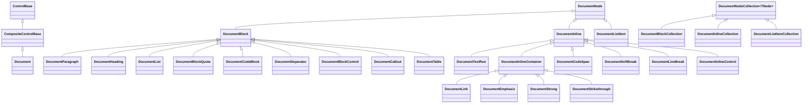
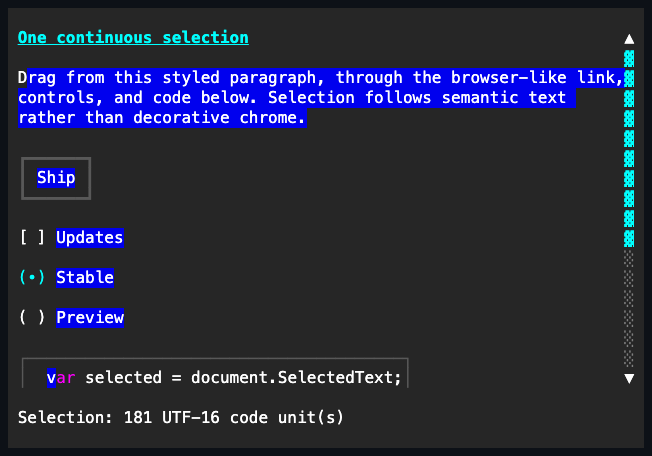

# Document

## Overview

`Document` is declared `public sealed class Document : CompositeControlBase` and
implements `IStyled<DocumentStyle>`, `ISelectableTextViewport`, and
`IClipboardCopySource`. It displays a scrollable tree of rich text content:
headings, paragraphs with inline markup and activatable links, bulleted and
numbered lists, block quotes, preformatted code, and thematic breaks.

A document is a semantic content tree. Text, links, lists, tables, callouts, and
other structural nodes stay lightweight data. `DocumentInlineControl` and
`DocumentBlockControl` are the deliberate bridge for a form: each mounts one
real retained `ControlBase` into the shared flow, preserving its focus, routed
input, commands, events, styling, and disposal behavior. This hybrid keeps a
long Markdown document compact without faking interactive widgets as painted
text.

Ownership is single and explicit. Adding a node that already belongs to a tree
throws `ArgumentException` instead of silently reparenting it; removing a node
detaches it and hands back a value the caller may reuse. Mutating an attached
document is dispatcher-affine, exactly like every other control, and a detached
subtree invalidates nothing, so composing a whole document before adding it
costs one layout pass rather than one per node.

Presentation resolves from `ActualStyle` during the paint pass rather than being
cached onto nodes, so a theme swap or a local `Style` assignment restyles every
heading, marker, bar, and link on the next frame. Every glyph resolves against
the live ambiguous-width policy first and falls back to a code-owned ASCII
repair value when the primary glyph would not fit one cell, so a terminal
configured for wide ambiguous characters degrades to plain ASCII instead of
corrupting the columns beside each glyph.

Ordinary document scrolling is vertical and exposes a generated vertical rail.
Content that deliberately exceeds the wrapping width - preformatted code,
indivisible prose tokens, and intrinsic-width tables - also participates in the
document's horizontal selectable-text viewport, so selection reveal and edge
dragging can expose it without changing ordinary paragraph wrapping. `Document`
stretches to fill its slot by default and is a single focus stop; it never traps
Tab, because link navigation releases focus at either end of the document. It
also owns one browser-like semantic selection that can begin or end inside
ordinary text, links, retained control captions, or an embedded selectable
control such as `CodeView`.

## Inheritance



## API

| Member                                                                                         | Type                                          | Default          | Description                                                                              |
| ---------------------------------------------------------------------------------------------- | --------------------------------------------- | ---------------- | ---------------------------------------------------------------------------------------- |
| `Blocks`                                                                                       | `DocumentBlockCollection`                     | Empty            | Owned ordered root block content; accepts only `DocumentBlock` nodes.                    |
| `Style`                                                                                        | `DocumentStyle?`                              | `null`           | Complete local presentation, or null for theme ownership.                                |
| `ActualStyle`                                                                                  | `DocumentStyle`                               | Resolved         | Read-only; the complete local, theme-owned, or code-owned presentation.                  |
| `ScrollBarStyle`                                                                               | `ScrollBarStyle?`                             | `null`           | Local generated-bar style; null leaves it to the theme.                                  |
| `ActualScrollBarStyle`                                                                         | `ScrollBarStyle`                              | Resolved         | Read-only resolved generated-bar style.                                                  |
| `Extent`                                                                                       | `Size`                                        | Layout-dependent | Read-only committed content extent, including genuine horizontal overflow, in cells.     |
| `Viewport`                                                                                     | `Size`                                        | Layout-dependent | Read-only committed non-negative visible extent, in cells.                               |
| `VerticalOffset`                                                                               | `int`                                         | `0`              | Valid vertical content offset in lines; rejects a value outside the current extent.      |
| `LineSize`                                                                                     | `int`                                         | `1`              | Non-negative lines one arrow key or wheel notch scrolls; rejects a negative value.       |
| `PageOverlap`                                                                                  | `int`                                         | `0`              | Non-negative lines a page command keeps in view; rejects a negative value.               |
| `ShowScrollBars`                                                                               | `ShowScrollBars`                              | `WhenNeeded`     | When the generated vertical scrollbar is shown; rejects an undefined value.              |
| `ActiveLink`                                                                                   | `DocumentLink?`                               | `null`           | Focused projected link; unprojected, foreign, or disabled assignments clear it.          |
| `Selection`                                                                                    | `Selection`                                   | Empty at `0`     | Read-only directional UTF-16 range over the normalized semantic stream.                  |
| Inherited `IsTextSelectionEnabled`                                                             | `bool`                                        | `true`           | Enabled by the constructor; disabling clears Document selection and selection gestures.  |
| Inherited `TextSelection`                                                                      | `Selection`                                   | Empty at `0`     | The same committed directional value exposed by `Selection`.                             |
| Inherited `SelectedText`                                                                       | `string`                                      | `""`             | Read-only owned copy of the selected semantic substring.                                 |
| `Load(string, IDocumentFormatReader, DocumentReadOptions?)`                                    | `DocumentReadResult`                          | —                | Parses, revalidates, then atomically consumes all detached roots.                        |
| `LoadAsync(Stream, IDocumentFormatReader, DocumentReadOptions?, Encoding?, CancellationToken)` | `ValueTask<DocumentReadResult>`               | —                | Reads a bounded stream, then consumes its result unless canceled.                        |
| `ScrollBy(int lines, ScrollCause cause)`                                                       | `bool`                                        | —                | Adds a signed line delta with saturation and endpoint clamping; rejects unknown cause.   |
| `ScrollToTop()`                                                                                | `bool`                                        | —                | Scrolls to the first line; reports whether the offset changed.                           |
| `ScrollToEnd()`                                                                                | `bool`                                        | —                | Scrolls to the last line; reports whether the offset changed.                            |
| `SetSelection(Selection selection)`                                                            | `void`                                        | —                | Replaces the range after validating both endpoints as grapheme boundaries.               |
| `SelectAll()`                                                                                  | `void`                                        | —                | Selects the complete normalized semantic stream.                                         |
| `ClearSelection()`                                                                             | `void`                                        | —                | Collapses the range at its current active caret.                                         |
| `CopySelection()`                                                                              | `string`                                      | —                | Pure read of `SelectedText`; clipboard publication remains application-owned.            |
| `GetSelectableTextSnapshot()`                                                                  | `SelectableTextSnapshot`                      | —                | Authoritative full semantic stream plus currently visible document-local glyph geometry. |
| `SelectableTextViewport`                                                                       | `Rect`                                        | Layout-dependent | Read-only visible selectable aperture in document-local cells.                           |
| `RevealSelectableTextOffset(int offset)`                                                       | `bool`                                        | —                | Reveals one validated grapheme offset through the document's intrinsic viewport.         |
| `ScrollSelectableTextViewport(int horizontal, int vertical)`                                   | `bool`                                        | —                | Offers signed cell motion to the intrinsic selectable viewport.                          |
| `ScrollChanged`                                                                                | `EventHandler<ScrollChangedEventArgs>`        | —                | Raised after either intrinsic viewport offset commits.                                   |
| `LinkClicked`                                                                                  | `EventHandler<DocumentLinkEventArgs>`         | —                | Raised after any link is activated, following that link's own `Clicked`.                 |
| `SelectionChanged`                                                                             | `EventHandler`                                | —                | Raised synchronously after a different directional selection commits.                    |
| Inherited `TextSelectionChanged`                                                               | `EventHandler<TextSelectionChangedEventArgs>` | —                | Raised from the same committed transition as `SelectionChanged`.                         |

`ScrollBy` defaults its `cause` to `ScrollCause.Programmatic`; the other causes
describe keyboard, pointer, wheel, and content-driven changes and reach
subscribers through `ScrollChanged` (see
[scrolling.md](../../concepts/scrolling.md#overview)). `Extent` and `Viewport`
report the committed values from the most recent layout pass, so both are zero
before the document has been measured. Horizontal overflow has no separate
generated rail or public offset setter; `RevealSelectableTextOffset` and
`ScrollSelectableTextViewport` move it as part of the selectable-text viewport,
and `ScrollChanged` reports that movement in `Offset.X`.

`DocumentLinkEventArgs` carries one property, `Link`, holding the activated
`DocumentLink`. It exists so an application can handle every link centrally
instead of subscribing to each one.

`LoadAsync` reads `source` into a character buffer bounded by `options`'
`MaximumCharacters` - throwing `ArgumentOutOfRangeException` the moment decoded
content would exceed it, before any block ever replaces the current tree - then
checks cancellation at the EOF-to-parse handoff, parses the accumulated text,
and checks again before validation and replacement. Each decode read requests at
most the remaining allowance plus one character, so excess input is detected
without filling the pooled buffer first. `encoding` defaults to strict UTF-8. A
UTF-8, UTF-16 little- or big-endian, or UTF-32 little- or big-endian byte-order
mark selects that encoding while retaining strict invalid-byte fallback;
malformed input throws `DecoderFallbackException` rather than silently inserting
replacement characters.

Both load paths revalidate the reader result as one complete mutable tree before
clearing existing content. Cross-root duplicate controls, attached nodes, and
other invalid ownership are rejected without changing the destination. A
successful load consumes the exact roots: the returned result still exposes them
for inspection, but they now belong to that document and cannot be loaded again.

The document validates its lifecycle and dispatcher access before the first read
and never disposes `source`. On any bound, decoding, cancellation, reader, or
commit failure, a seekable source returns to its original byte position. A
non-seekable source remains at the position reached by decoding because its
consumed bytes cannot be restored; callers that require retry semantics must
provide a seekable or independently buffered source.

> [!NOTE]
>
> `ActiveLink` resolves against the links the most recent layout pass found.
> Assigning it on a document that has not been measured yet leaves it `null`,
> because there is no projected link sequence to match the value against. A link
> added after that pass likewise remains unselectable until a later layout
> projects it; rejected assignments never become latent selections.

Reading `ActiveLink` after disposal throws `ObjectDisposedException`. Disposal
also clears the retained link reference and its internal projected index, so an
unavailable document cannot keep a detached interactive selection alive.

## Content tree

Every node derives from `DocumentNode`, most of them through one of two abstract
roles: `DocumentBlock` for content that occupies whole lines and stacks
vertically, and `DocumentInline` for content that flows within a line.
`DocumentNode`, `DocumentBlock`, and `DocumentInline` each declare a
`private protected` constructor, so the hierarchy is closed to the library and
cannot be extended from outside it. The sealed types below are the only nodes
that can ever exist, which is what lets consuming code pattern-match a node
exhaustively and lets the layout pass be total over the tree.

| Node                    | Role   | Content it owns                                        |
| ----------------------- | ------ | ------------------------------------------------------ |
| `DocumentParagraph`     | Block  | `Inlines` — flowing inline content.                    |
| `DocumentHeading`       | Block  | `Inlines` — flowing inline content, at a level 1 to 6. |
| `DocumentList`          | Block  | `Items` — marked list items.                           |
| `DocumentBlockQuote`    | Block  | `Blocks` — nested block content.                       |
| `DocumentCodeBlock`     | Block  | `Text` — literal preformatted text.                    |
| `DocumentSeparator`     | Block  | Nothing; it draws a thematic break.                    |
| `DocumentBlockControl`  | Block  | `Control` — one genuine retained control.              |
| `DocumentCallout`       | Block  | `Kind`, `Title`, and nested `Blocks`.                  |
| `DocumentTable`         | Block  | `Rows` containing aligned semantic cells.              |
| `DocumentListItem`      | Item   | `Blocks` — nested block content.                       |
| `DocumentTextRun`       | Inline | `Text` — inline-markup text.                           |
| `DocumentLink`          | Inline | `Inlines` — semantic activatable label content.        |
| `DocumentEmphasis`      | Inline | `Inlines` — italic semantic content.                   |
| `DocumentStrong`        | Inline | `Inlines` — bold semantic content.                     |
| `DocumentStrikethrough` | Inline | `Inlines` — struck semantic content.                   |
| `DocumentCodeSpan`      | Inline | `Text` — literal inline code.                          |
| `DocumentSoftBreak`     | Inline | Collapsible whitespace between source lines.           |
| `DocumentLineBreak`     | Inline | Nothing; it ends the current line.                     |
| `DocumentInlineControl` | Inline | `Control` — one atomic, single-line retained control.  |

`DocumentListItem` derives from `DocumentNode` directly rather than from
`DocumentBlock`, and that is deliberate: an item is only meaningful inside a
`DocumentList`, which supplies its marker and its gutter. Because it is not a
block, the type system alone prevents an item from being dropped into a
document, a block quote, or another item's `Blocks`, where it would render with
no marker at all.

### Node collections

`DocumentBlockCollection`, `DocumentInlineCollection`, and
`DocumentListItemCollection` are the three sealed collections a node or a
document exposes. Each derives from `DocumentNodeCollection<TNode>` and offers
exactly this surface:

| Member                          | Type                     | Default | Description                                                             |
| ------------------------------- | ------------------------ | ------- | ----------------------------------------------------------------------- |
| `Count`                         | `int`                    | `0`     | Read-only; the number of owned nodes.                                   |
| `Add(TNode node)`               | `void`                   | —       | Appends one detached non-null node.                                     |
| `Insert(int index, TNode node)` | `void`                   | —       | Inserts one detached non-null node at a position from zero to `Count`.  |
| `Remove(TNode node)`            | `bool`                   | —       | Removes the first reference match, leaving it detached and reusable.    |
| `RemoveAt(int index)`           | `void`                   | —       | Removes the node at a valid position, leaving it detached and reusable. |
| `Clear()`                       | `void`                   | —       | Removes every node, leaving each one detached and reusable.             |
| `GetEnumerator()`               | `List<TNode>.Enumerator` | —       | Allocation-free value enumerator used by direct iteration.              |

An indexer returns the node at a valid zero-based position. The collection
implements `IReadOnlyList<TNode>`.

Validation happens before the sequence changes, so a rejected insertion leaves
both the node and the collection exactly as the caller found them:

1. A null node throws `ArgumentNullException`.
2. An index outside the insertion or removal range throws
   `ArgumentOutOfRangeException`.
3. A node that already belongs to any document tree — this one included — throws
   `ArgumentException`. Remove it from its current owner first.

Every successful structural collection mutation reconciles the retained
embedded-control set and invalidates the owning document's layout exactly once.
Changing node text, presentation, or link metadata invalidates only the required
layout or render work; it does not walk and reconcile an unchanged control tree.
A collection or node inside a detached subtree invalidates nothing.

Mutating an attached node follows its owning document's lifecycle contract: an
off-dispatcher mutation throws `InvalidOperationException`, and mutation after
the document is disposed throws `ObjectDisposedException`, before observable
state changes.

## Blocks

Sibling blocks are separated by exactly one blank line, both at the document
root and inside a block quote. A list item's own blocks are the one exception:
they are tight, so an item's paragraph sits directly above its nested list.

Emptying a block does not remove its line. An empty paragraph or empty
`DocumentList` still occupies one line, and an empty list item still occupies
one marked line. An empty list between non-empty sibling blocks supplies their
single blank separator itself; the layout does not add another blank row on
either side.

### DocumentParagraph

| Member                           | Type                       | Default | Description                                                            |
| -------------------------------- | -------------------------- | ------- | ---------------------------------------------------------------------- |
| `DocumentParagraph(string text)` | —                          | —       | Initializes a paragraph with one markup text run; rejects a null text. |
| `Inlines`                        | `DocumentInlineCollection` | Empty   | Owned ordered inline content.                                          |

`DocumentParagraph()` initializes an empty paragraph. A paragraph wraps its
inline content to the width available at its nesting level.

### DocumentHeading

| Member                                    | Type                       | Default | Description                                                             |
| ----------------------------------------- | -------------------------- | ------- | ----------------------------------------------------------------------- |
| `DocumentHeading(int level)`              | —                          | —       | Initializes an empty heading; rejects a level outside 1 through 6.      |
| `DocumentHeading(int level, string text)` | —                          | —       | Adds one markup text run; rejects an invalid level or a null text.      |
| `Level`                                   | `int`                      | —       | The heading level from 1 through 6; rejects a value outside that range. |
| `Inlines`                                 | `DocumentInlineCollection` | Empty   | Owned ordered inline content.                                           |

`Level` has no default because a heading cannot be constructed without one. The
public constants `MinimumLevel` and `MaximumLevel` are `1` and `6`.

A terminal has no font sizes, so levels differentiate through weight, color, and
underline rather than scale. Levels 1 and 2 paint with `HeadingFace`; levels 3
through 6 paint in the body face with bold weight added.

### DocumentList

| Member                                | Type                         | Default    | Description                                                               |
| ------------------------------------- | ---------------------------- | ---------- | ------------------------------------------------------------------------- |
| `DocumentList(DocumentListKind kind)` | —                            | —          | Initializes an empty list with a marker style; rejects an undefined kind. |
| `Kind`                                | `DocumentListKind`           | `Bulleted` | The marker style applied to every item; rejects an undefined value.       |
| `IsLoose`                             | `bool`                       | `false`    | Whether a blank line separates one item from the next.                    |
| `Start`                               | `int`                        | `1`        | Non-negative first ordinal for a numbered list.                           |
| `Items`                               | `DocumentListItemCollection` | Empty      | Owned ordered items.                                                      |

`DocumentList()` initializes an empty bulleted list. `DocumentListKind` is
`Bulleted`, which marks each item with a depth-rotating bullet glyph, or
`Numbered`, which marks each item with its one-based position formatted as
`"N."`.

The marker gutter is measured from the widest marker the list will actually
draw, plus one cell of gap. A list that reaches `"10."` or `"100."` therefore
keeps every item's content aligned behind the same column instead of letting a
wider marker overwrite its own text.

A bulleted item's glyph rotates by nesting depth modulo three — `FirstBullet`,
`SecondBullet`, `ThirdBullet`, then back to `FirstBullet` at the fourth level.
Depth is derived from the tree during layout and never cached, so moving a
nested list out to the document's own `Blocks` renders it at depth zero on the
next frame, with no stale marker.

### DocumentListItem

| Member                                               | Type                      | Default | Description                                                                    |
| ---------------------------------------------------- | ------------------------- | ------- | ------------------------------------------------------------------------------ |
| `DocumentListItem(DocumentBlock block)`              | —                         | —       | Initializes an item owning one detached block; rejects null or an owned block. |
| `DocumentListItem(string text)`                      | —                         | —       | Initializes an item with one markup text paragraph; rejects a null text.       |
| `DocumentListItem(string text, DocumentList nested)` | —                         | —       | Adds one markup text paragraph followed by one detached nested list.           |
| `Blocks`                                             | `DocumentBlockCollection` | Empty   | Owned ordered block content.                                                   |

`DocumentListItem()` initializes an empty item, which still occupies one marked
line so that emptying an item never silently drops its marker.

An item's own blocks are tight: its paragraph sits directly above its nested
list with no blank line between them, matching CommonMark. `IsLoose` adds a
blank line _between_ items only and leaves each item's own blocks tight.

### DocumentBlockQuote

| Member                                    | Type                      | Default | Description                                                                    |
| ----------------------------------------- | ------------------------- | ------- | ------------------------------------------------------------------------------ |
| `DocumentBlockQuote(DocumentBlock block)` | —                         | —       | Initializes a quote owning one detached block; rejects null or an owned block. |
| `DocumentBlockQuote(string text)`         | —                         | —       | Initializes a quote with one markup text paragraph; rejects a null text.       |
| `Blocks`                                  | `DocumentBlockCollection` | Empty   | Owned ordered block content.                                                   |

`DocumentBlockQuote()` initializes an empty quote. A quote indents its content
by two cells and draws `QuoteBar` in the first of them on every line it spans,
including wrapped continuations. Quotes nest freely: a quote inside a quote
indents twice and draws two bars.

### DocumentCodeBlock

| Member                           | Type     | Default | Description                                                      |
| -------------------------------- | -------- | ------- | ---------------------------------------------------------------- |
| `DocumentCodeBlock(string text)` | —        | —       | Initializes a code block with literal text; rejects a null text. |
| `Text`                           | `string` | `""`    | Non-null literal text; rejects null.                             |
| `Language`                       | `string` | `""`    | Optional language identifier retained from a source format.      |

`DocumentCodeBlock()` initializes an empty code block. `Text` is literal: markup
is never parsed, so source containing angle brackets needs no escaping. The
block splits on CRLF, CR, and LF — a CRLF pair is one break, not two — and each
source line becomes exactly one rendered line. Tabs expand to the next four-cell
stop. `Language` is retained source metadata and changing it does not invalidate
layout or rendering.

A code line never wraps, because re-flowing code changes its meaning. A line
longer than the available width is clipped at the content edge until selection
reveal or edge dragging moves the document's horizontal selectable viewport.

### DocumentSeparator

`DocumentSeparator` has no members beyond its default constructor. It draws
`Rule` repeated across the full width available at its nesting level and
occupies a single line, so a separator inside a block quote stops at the quote's
own indent rather than at the document's edge.

### DocumentBlockControl

| Member                                      | Type          | Default | Description                                                          |
| ------------------------------------------- | ------------- | ------- | -------------------------------------------------------------------- |
| `DocumentBlockControl(ControlBase control)` | —             | —       | Owns one detached control; rejects null or an already-owned control. |
| `Control`                                   | `ControlBase` | —       | The retained control mounted at its measured block size.             |

The control participates in the ordinary retained tree, routed input, focus,
measurement, and disposal contracts. A desired-size change reflows later
document content. The same control instance cannot appear in two document nodes.
A collapsed block control remains retained but contributes neither rows nor
sibling spacing; making it visible restores its ordinary block position.
Embedded-control widths participate in saturating cell geometry: an extreme
desired width can overflow the viewport and saturate `Extent.Width`, but cannot
wrap a committed line negative or overflow nested and table layout arithmetic.

**Known limitation:** the document measures every embedded control unbounded
before its own layout pass ever runs, so a percentage `Width` or `Height` on the
embedded control always resolves as if it were `Auto` rather than sizing against
the document's own content width. Give an embedded control a fixed or automatic
size instead.

### DocumentCallout

| Member   | Type                      | Default  | Description                                       |
| -------- | ------------------------- | -------- | ------------------------------------------------- |
| `Kind`   | `string`                  | `"NOTE"` | Non-null source-defined callout kind.             |
| `Title`  | `string`                  | `""`     | Non-null title displayed above the nested blocks. |
| `Blocks` | `DocumentBlockCollection` | Empty    | Owned callout body blocks.                        |

A callout uses `CalloutFace` for its quote-like vertical bar and body, and
`CalloutTitleFace` for its bold title. Both faces use the same semantic
foreground by default so the callout reads as one visual region. `Kind` is
retained so applications can interpret format-specific kinds without the control
inventing a closed taxonomy.

Five standard kinds replace that fallback foreground with a theme semantic color
while preserving the two faces' other channels: `NOTE` uses `Info`, `TIP` uses
`Success`, `IMPORTANT` uses `Accent`, `WARNING` uses `Warning`, and `CAUTION`
uses `Error`. Kind matching is case-insensitive; any other value keeps the
fallback foreground.

That foreground cascades through headings, links, code, lists, nested quotes,
rules, and tables inside the callout. Descendants retain their own attributes,
backgrounds, and interaction states, but cannot break the callout into unrelated
foreground colors. Long generated titles wrap below the two-cell callout indent,
with the vertical bar continuing beside every title line.

### DocumentTable

`DocumentTable.Rows` owns `DocumentTableRow` values. Each row owns
`DocumentTableCell` values through `Cells`; `IsHeader` selects the header face.
A cell owns flowing `Inlines`, and its `Alignment` is `Left`, `Center`, or
`Right`. Column widths are measured once across all rows, then shared by every
cell so headings and body values stay aligned. Rich inline attributes, links,
and one-line retained controls remain active inside cells; table layout never
flattens them to decorative text. Content still clips to the document viewport
when the complete table is wider than the available cells. Alignment padding is
represented as bounded repeated-cell runs rather than materialized strings, so
even a saturated column width has bounded allocation.

## Inlines

Inline content flows inside a `DocumentParagraph` or a `DocumentHeading`.
Wrapping is greedy and prefers whitespace boundaries, and it can break between
two adjacent inlines as readily as within one, so neighboring runs read as one
continuous stretch of text. A token wider than the content width is placed alone
on its own line and overflows it rather than being split mid-word.

Whitespace an author actually typed survives — at the start of a paragraph and
immediately after a hard break — while whitespace that a wrap pushed to the
front of a continuation line is dropped.

U+00A0 NO-BREAK SPACE, U+202F NARROW NO-BREAK SPACE, and U+2060 WORD JOINER stay
inside the surrounding word and never introduce a wrap opportunity. Ordinary
breakable whitespace keeps the greedy wrapping behavior above.

`DocumentInlineControl` contributes one indivisible, exactly one-cell-high
retained control to that flow. A collapsed inline control remains retained but
contributes no token or width; making it visible restores its position without
restructuring the document tree. Before the first layout, semantic selection
includes an inline control's selectable text without treating its unmeasured
zero height as a contract violation. Once measured, a control taller than one
cell is rejected and must be represented by `DocumentBlockControl` instead.

### DocumentTextRun

| Member                         | Type     | Default | Description                                              |
| ------------------------------ | -------- | ------- | -------------------------------------------------------- |
| `DocumentTextRun(string text)` | —        | —       | Initializes a run with markup text; rejects a null text. |
| `Text`                         | `string` | `""`    | Non-null inline-markup text; rejects null.               |

`DocumentTextRun()` initializes an empty run. `Text` uses the same inline-markup
syntax as [`Text.Content`](../display/text.md#markup-grammar) — bold, dim,
italic, underline, strikethrough, reverse, and color tags. Call
[`Text.Escape`](../display/text.md#api) on dynamic content that must render
literally.

Markup applies at exact character boundaries rather than at token boundaries, so
a tag may open or close in the middle of a word: `"pre<b>post</b>"` renders
`prepost` with only the last four cells bold, and `"go <b>fast</b>, ok"` leaves
the comma unstyled.

Two characters inside a run are structural rather than text. A newline — `\n`,
`\r`, or `\r\n` — is a hard break that ends the current line wherever it
appears. A tab advances a fixed four cells; it is a blank advance rather than a
tab stop, so a break in a different place cannot change its width.

Generated cells for a tab or `DocumentSoftBreak` retain their originating inline
style and link target. Backgrounds, attributes, underline metadata, and terminal
hyperlink identity therefore remain continuous across visible blanks.

### DocumentLink

| Member                                     | Type                      | Default    | Description                                                                         |
| ------------------------------------------ | ------------------------- | ---------- | ----------------------------------------------------------------------------------- |
| `DocumentLink(string text)`                | —                         | —          | Initializes a link with literal text; rejects a null text.                          |
| `DocumentLink(string text, string target)` | —                         | —          | Adds an OSC 8 target; rejects null, empty, or control-containing arguments.         |
| `Text`                                     | `string`                  | `""`       | Non-null literal link text; rejects null.                                           |
| `Target`                                   | `string?`                 | `null`     | OSC 8 target, or null; rejects empty or control-containing values before mutation.  |
| `IsEnabled`                                | `bool`                    | `true`     | Whether the link can be focused and activated.                                      |
| `Emphasis`                                 | `DocumentLinkEmphasis`    | `Standard` | Which `DocumentStyle` face family paints the link; rejects an undefined value.      |
| `Clicked`                                  | `EventHandler<EventArgs>` | —          | Raised after the link is activated by Enter, Space, or an eligible primary release. |

`DocumentLink()` initializes an empty link. The owning document — not the data
node — owns link focus and activation. Embedded controls retain their own input
behavior independently.

`Text` is literal, not markup: a link's face is its identity and is never
reinterpreted by inline tags. A link that wraps across lines stays one logical
link and remains activatable on every line it occupies.

`Target` and `Clicked` are independent. `Target` emits an OSC 8 terminal
hyperlink around the link's cells so a capable terminal can offer its own open
or copy affordance, and a terminal without OSC 8 support renders the text
unchanged; `Clicked` is what makes the link do something inside the application.
Either, both, or neither is valid. Every non-null target must be non-empty and
contain no control code unit, matching the terminal cell-style contract.

`Emphasis` chooses the presentation, never the behavior: an `Action`-emphasis
link is exactly as focusable and activatable as a `Standard` one. `Standard`
paints with `LinkFace`/`ActiveLinkFace`, reading as an ordinary part of the
flowing text. `Action` paints with `ActionLinkFace`/`ActiveActionLinkFace`, a
solid, high-contrast chip that reads as a compact call to action. Use
`DocumentBlockControl` or `DocumentInlineControl` when the content needs a real
`Button` rather than link semantics.

A disabled link paints with `DisabledLinkFace` regardless of `Emphasis`, is
skipped by link navigation, and never raises `Clicked`. Disabling the currently
active link clears `ActiveLink` synchronously, as does removing any subtree that
contains it. Until the next layout rebuilds link geometry, keyboard navigation
and pointer hit-testing ignore detached links still present in the stale
projection.

A `DocumentLink` cannot contain another `DocumentLink`. Inserting a subtree that
would create nested link semantics throws `ArgumentException` before the tree
changes.

### DocumentLineBreak

`DocumentLineBreak` has no members beyond its default constructor. It ends the
current line independently of word wrapping, so two consecutive breaks leave one
blank line and a trailing break leaves a blank final line.

## Input

`Document` is one framework tab stop with `TabNavigation.None`, then performs a
source-ordered walk across its semantic links and retained controls. Links keep
focus on the document; controls embedded through `DocumentInlineControl` and
`DocumentBlockControl` receive focus directly and retain their ordinary input
behavior. At either end, the unhandled Tab leaves the whole document subtree.

| Input                                  | Result                                                                        |
| -------------------------------------- | ----------------------------------------------------------------------------- |
| Tab                                    | Moves to the next enabled link or embedded control and scrolls it into view.  |
| Shift+Tab                              | Moves to the previous enabled link or embedded control and reveals it.        |
| Enter / Space                          | Activates the focused link once on the initial activation-eligible press.     |
| Up / Down                              | Scrolls by `LineSize` lines.                                                  |
| Page Up / Page Down                    | Scrolls by the viewport height minus `PageOverlap`, and by at least one line. |
| Home / End                             | Scrolls to the first or last line.                                            |
| Wheel up / down                        | Scrolls by `LineSize` lines per notch.                                        |
| Ctrl+A                                 | Selects the complete semantic stream while `Document` owns focus.             |
| Ctrl+C                                 | Publishes the nearest focused copy source through the application clipboard.  |
| Shift+Left / Shift+Right               | Extends from the active caret by one complete grapheme.                       |
| Shift+Up / Shift+Down                  | Extends by visual row while preserving a sticky cell column.                  |
| Shift+Home / Shift+End                 | Extends to the current visual line boundary.                                  |
| Shift+Page Up / Shift+Page Down        | Extends by one document page and reveals the new caret.                       |
| Primary click on selectable content    | Collapses the selection at the nearest semantic endpoint.                     |
| Primary drag across selectable content | Selects semantic text and suppresses link or embedded-control activation.     |
| Eligible primary release on a link     | Activates the same enabled link where the primary press began.                |

Tab and Shift+Tab consume the keystroke only while it actually reaches another
interactive item. At either end of the document the keystroke is left unhandled,
so the framework's own Tab default moves focus out — the same browser-like
convention that stops a page of links and controls from trapping the caret.
Disabled links and ineligible controls are skipped; a document with no eligible
interactive item never consumes Tab.

Embedded inline and block controls request keyboard-reason focus from that same
walk. Their reveal therefore waits for focus callbacks and settled layout, then
uses the shared enclosing-container contract instead of a Document-only stale
placement snapshot.

Activating a link raises that link's own `Clicked` first, then the document's
`LinkClicked` with the same link. A keyboard activation and a pointer activation
produce the identical pair of events. Held Enter or Space repeats are consumed
without repeating either event; scrolling keys remain repeatable.

A primary press records a potential click without handling the event, stealing
child capture, or activating a link. Crossing the shared one-cell drag threshold
focuses and captures the document for selection. A link activates only when the
primary release remains over the same enabled link and no selection drag began;
releasing elsewhere, reflowing the link away from that cell, or dragging leaves
it inactive. Embedded controls retain their ordinary click behavior below the
threshold.

A scroll command is reported handled whenever the document has anything to
scroll, even at a boundary, so the keystroke cannot escape and page an enclosing
scrollable container out from under the still-focused document. A document whose
content fits its viewport leaves every scroll key unhandled instead, which keeps
those keys available to an ancestor.

## Selection and copying

`Selection` uses UTF-16 offsets into one normalized semantic stream. Endpoints
must be extended-grapheme boundaries. `SetSelection` validates both endpoints
before changing state; an out-of-range endpoint throws
`ArgumentOutOfRangeException`, and an endpoint inside a grapheme throws
`ArgumentException`. `SelectAll` selects the whole stream, `ClearSelection`
collapses at the directional caret, and `SelectionChanged` raises once only when
the committed `Selection` value changes. If that compatibility event commits a
newer selection, the superseded transition does not subsequently reach inherited
`TextSelectionChanged` subscribers.

The stream follows reading semantics rather than painted rows or chrome:

| Content                                          | Copied representation                                                            |
| ------------------------------------------------ | -------------------------------------------------------------------------------- |
| Adjacent block values                            | One LF (`\n`), independent of blank display rows or soft wrapping.               |
| `DocumentSoftBreak` / `DocumentLineBreak`        | One space / one LF outside a table cell.                                         |
| Bulleted / numbered list item                    | A hyphen or displayed ordinal, then a period where applicable, then one space.   |
| Table cells / rows                               | Tab-separated cells and LF-separated rows; line breaks inside a cell are spaces. |
| Code block                                       | Original tabs with CRLF and CR normalized to LF.                                 |
| Quote, callout, rule, border, and control chrome | Decorative glyphs are omitted; semantic labels and callout title/body remain.    |
| Embedded `ISelectableTextSource`                 | Its complete authoritative text at the inline or block node position.            |
| Embedded `Document`                              | Its full normalized stream, independent of that nested document's own range.     |

Wrapping never inserts copied line breaks. Wide and combining graphemes remain
indivisible, and clipped half-wide glyphs expose no selectable geometry. A
selection can nevertheless start or end inside one child's semantic text, so a
button caption or `CodeView` line is not forced to be atomic. Only mapped text
cells receive `SelectionFace`; borders, checkbox marks, radio marks, gutters,
quote bars, and other chrome remain unchanged.

The normalized stream is available before measurement. In that detached state,
inline and block controls contribute their selectable text, while glyph geometry
remains absent until layout establishes visible cell positions.

When code, an indivisible prose token, or a table is wider than the viewport,
keyboard extension and pointer edge scrolling translate the projected content by
the minimum horizontal distance that exposes the active caret. The full semantic
stream and its range remain unchanged; only complete glyphs inside the new clip
receive exported geometry. Keyboard focus uses the same two-axis reveal for an
interactive link in an intrinsic table column beyond the right edge.

`Document` is itself an authoritative `ISelectableTextSource` and an
`ISelectableTextViewport`. Its snapshot retains semantic-only separators and
offscreen text while exporting geometry only for complete graphemes inside the
current inherited clip. This lets one document nest inside another without
exposing the nested presenter's private controls or letting the nested local
selection truncate the enclosing stream. A nested document's viewport consumes
reveal and edge-scroll requests before the enclosing document moves.

`CopySelection()` is pure: it returns an independently owned string and never
emits a terminal protocol. On Ctrl+C, `Application` walks from the focused
control toward its parents and publishes the nearest `IClipboardCopySource`'s
result through `Application.Terminal.Clipboard`. Focus inside an embedded
`CodeView` therefore copies that view's own selection; focus on the `Document`
copies the document-owned cross-child range. Ctrl+A while the document owns
focus selects its complete stream, with Caps Lock and Num Lock ignored.

### Pointer selection and autoscroll

A primary press records a possible click. Staying in the original cell keeps the
ordinary link, button, checkbox, or radio-button click path. Moving by one cell
in either axis crosses `PointerDragThreshold.Cells`, cancels the pending child
activation, transfers capture to `Document`, and begins a directional selection.
The hit position is resolved at a grapheme midpoint, so either cell of a wide
grapheme chooses a valid boundary. Reversing direction preserves
`Anchor`/`Caret` direction. Release, capture loss, terminal-focus loss, hide,
disable, detach, and disposal end the gesture without leaving capture or a timer
behind.

While a captured drag remains outside a selectable viewport, the inherited
`ControlBase` selection controller ticks autoscroll every 50 milliseconds.
Direction follows the edge crossed, and speed is the outside cell distance
clamped to 1 through 8 cells per tick. The nearest eligible nested
`ISelectableTextViewport` scrolls first; a saturated viewport passes the same
motion to `Document`, then to an eligible ancestor `AutoScroll` container. Each
successful move re-hit-tests the newly exposed content immediately. Returning
inside stops the timer. Traversal never crosses the active modal plane, and
source mutation or lifecycle changes cancel stale geometry before another
selection commit.

### Keyboard extension and mutation

After a click, drag, `SetSelection`, or `SelectAll` establishes a caret, Shift
with Left/Right moves by one grapheme; Shift+Up/Down keeps a sticky visual
column; Shift+Home/End reaches the current visual line boundary; and Shift+Page
Up/Page Down moves by the viewport height minus `PageOverlap`, with at least one
visual row. Every move reveals the caret through its nested selectable viewport,
the document, and in-plane scrollable ancestors. A reveal that synchronously
changes focus, content, selection, or projection stops without recommitting
stale state.

Pure reflow and scrolling preserve the same semantic range. A semantic tree or
embedded-source mutation rebuilds text and geometry as one transaction; if its
ordered source identity, ranges, or text changed, the old selection clears once
before any requested new range commits. A collapsed caret that no longer fits
resets to document start.

## Presentation

### DocumentStyle

`DocumentStyle : ControlStyle` is a complete immutable presentation. It declares
no `styles.*` theme key of its own: it falls back to `control`'s role section
for its inherited `Face`/`Border`/`Shadow`, and resolves its fifteen additional
faces and one glyph family directly from semantic colors and the code-owned
defaults below:

| Member                 | Type             | Default                                                              | Description                                                                |
| ---------------------- | ---------------- | -------------------------------------------------------------------- | -------------------------------------------------------------------------- |
| `HeadingFace`          | `Face`           | Bold, straight-underlined `SemanticColor.Accent`                     | Level 1 and 2 headings.                                                    |
| `MarkerFace`           | `Face`           | Bold `SemanticColor.Accent`                                          | A list item's bullet or number.                                            |
| `QuoteFace`            | `Face`           | `SemanticColor.ControlText`, italic                                  | A block quote's bar and its quoted content.                                |
| `CodeFace`             | `Face`           | `SemanticColor.SurfaceText` on `SemanticColor.Surface`               | A preformatted code block.                                                 |
| `RuleFace`             | `Face`           | `SemanticColor.Muted`                                                | A thematic break.                                                          |
| `CalloutFace`          | `Face`           | `SemanticColor.Warning`                                              | A callout body and its vertical bar.                                       |
| `CalloutTitleFace`     | `Face`           | Bold `SemanticColor.Warning`                                         | A callout title.                                                           |
| `TableFace`            | `Face`           | `SemanticColor.SurfaceText` on `SemanticColor.Surface`               | Ordinary table cells.                                                      |
| `TableHeaderFace`      | `Face`           | Bold `SemanticColor.Accent` on `SemanticColor.Surface`               | Header table cells.                                                        |
| `LinkFace`             | `Face`           | Straight-underlined `SemanticColor.Info`                             | A `Standard`-emphasis link that is not focused.                            |
| `ActiveLinkFace`       | `Face`           | `SemanticColor.SelectedText` on `SemanticColor.SelectedControl`      | The `Standard`-emphasis link at `ActiveLink` while the document has focus. |
| `DisabledLinkFace`     | `Face`           | `SemanticColor.DisabledText`                                         | A link whose `IsEnabled` is false, regardless of emphasis.                 |
| `ActionLinkFace`       | `Face`           | Bold `SemanticColor.SelectedText` on `SemanticColor.SelectedControl` | An `Action`-emphasis link that is not focused.                             |
| `ActiveActionLinkFace` | `Face`           | Bold `SemanticColor.PressedText` on `SemanticColor.PressedControl`   | The `Action`-emphasis link at `ActiveLink` while the document has focus.   |
| `SelectionFace`        | `Face`           | `SemanticColor.SelectedText` on `SemanticColor.SelectedControl`      | Final overlay applied only to selected semantic glyph cells.               |
| `Glyphs`               | `DocumentGlyphs` | `DocumentGlyphs.Default`                                             | The bullet, quote-bar, and rule glyph family.                              |

Every member is required. A `with` expression creates a validated member-wise
copy of `DocumentStyle.Default` or of any resolved style; assigning `null` to
`Style` restores the `control`-derived presentation, and `ActualStyle` never
returns null. A theme's `styles` object is closed to the six well-known role
sections (see [themes.md](../../concepts/themes.md#style-types)), so restyling
`Document` beyond a local `Style` assignment means restyling `control` itself -
every control that falls back to it moves together.

The `QuoteFace` default uses `SemanticColor.ControlText`, the same foreground as
the document body. A quotation is set apart through the italic attribute, never
through a separately colored, lower-contrast tone that a theme's palette might
not keep legible.

`ActionLinkFace` and `ActiveActionLinkFace` deliberately reuse the same
selection and press color pairs every theme must already keep legible for
ordinary selection highlighting and pressed-button feedback, rather than an
arbitrary color invented only for this one face — the guarantee a solid button
chip needs and a general-purpose accent color does not carry on its own.

Replacing a face costs a repaint, because faces resolve during painting.
Replacing `Glyphs` costs a remeasure, because a different glyph can occupy a
different number of cells and move the text beside it.

A disabled document dims uniformly: every face resolves to the disabled body
style, so a heading, marker, bar, or link cannot stay bright while the
paragraphs around it fade.

### DocumentGlyphs

`DocumentGlyphs` is a complete immutable `readonly record struct`. Each member
is the theme-customizable primary glyph; the portable ASCII repair value beside
it is permanently code-owned and is not themeable.

| Member         | Type             | Default | Description                                                         |
| -------------- | ---------------- | ------- | ------------------------------------------------------------------- |
| `FirstBullet`  | `Rune`           | `'•'`   | The bullet marking a top-level list item; repairs to `'*'`.         |
| `SecondBullet` | `Rune`           | `'◦'`   | The bullet marking a once-nested list item; repairs to `'o'`.       |
| `ThirdBullet`  | `Rune`           | `'▪'`   | The bullet marking a twice-nested list item; repairs to `'+'`.      |
| `QuoteBar`     | `Rune`           | `'│'`   | The vertical bar down a block quote's left edge; repairs to `'\|'`. |
| `Rule`         | `Rune`           | `'─'`   | The horizontal rule drawn for a thematic break; repairs to `'-'`.   |
| `Default`      | `DocumentGlyphs` | —       | Static; the established code-owned glyph family.                    |

Every glyph is validated on construction and on `init`: a control character, or
a rune that does not measure exactly one cell, throws `ArgumentException`.

Every default above is an East Asian Ambiguous character, which a terminal
configured for wide ambiguous width renders as two cells. The document resolves
each glyph against the live cell policy before measuring and substitutes the
repair value when the primary would not fit, so under that configuration a
nested list, a quote, and a separator render as `*`, `o`, `+`, `|`, and `-`
rather than shifting every column beside them (see
[unicode-cell-geometry.md](../../concepts/unicode-cell-geometry.md#width-rules)).

## Example



```csharp
var document = new Document();
document.Blocks.Add(new DocumentHeading(1, "SharpVision"));
document.Blocks.Add(new DocumentParagraph(
    "Build rich terminal apps without giving up <b>Unicode</b>."));

var steps = new DocumentList(DocumentListKind.Numbered);
steps.Items.Add(new DocumentListItem("Install the CLI"));

var details = new DocumentList(DocumentListKind.Bulleted);
details.Items.Add(new DocumentListItem("Bullets rotate with nesting depth"));
steps.Items.Add(new DocumentListItem("Run <b>sharpvision init</b>:", details));

document.Blocks.Add(steps);
document.Blocks.Add(new DocumentBlockQuote("Correctness outranks shortcuts."));
document.Blocks.Add(new DocumentCodeBlock("dotnet add package SharpVision"));
document.Blocks.Add(new DocumentSeparator());

var footer = new DocumentParagraph();
footer.Inlines.Add(new DocumentTextRun("Read the "));
var guide = new DocumentLink("guide", "https://example.com/guide");
guide.Clicked += (_, _) => OpenGuide();
footer.Inlines.Add(guide);
footer.Inlines.Add(new DocumentTextRun(" to continue."));
document.Blocks.Add(footer);

document.LinkClicked += (_, eventArgs) => RecordLinkClick(eventArgs.Link.Text);

document.Blocks.Add(new DocumentBlockControl(new CheckBox("Send updates")));

document.SelectAll();
var copied = document.CopySelection();

var markdown = File.ReadAllText("README.md");
document.Load(markdown, new MarkdownDocumentReader());
```

## Expected behavior

| Scope               | Observable evidence                                                                                                      |
| ------------------- | ------------------------------------------------------------------------------------------------------------------------ |
| Public API          | Constructor and property validation, single ownership, defaults, detach-and-reuse, and level/kind range rejection.       |
| Surface             | Exact rendered lines, grapheme-safe hit geometry, final selection overlay, clipping, and retained chrome.                |
| Integrated behavior | Link/control click arbitration, cross-child selection, clipboard routing, keyboard reveal, and deterministic autoscroll. |

- Embedded controls are explicit retained descendants. Inline controls are one
  atomic one-line token; block controls preserve their natural height.
- Adding an already-owned node throws `ArgumentException` before any state
  changes, and removing a node leaves it detached and immediately reusable in
  another tree.
- A semantic path is limited to 256 nodes. An insertion that would exceed that
  bound throws `ArgumentException` before ownership or collection state changes,
  keeping recursive layout bounded for programmatically authored trees.
- Sibling blocks are separated by exactly one blank line at the document root
  and inside a block quote, while a list item's own blocks stay tight; `IsLoose`
  adds a blank line between items only.
- A list reserves a gutter measured from its widest marker plus one cell, so
  numbering past 9 or 99 keeps every item's content on the same column.
- Bullet glyphs rotate by nesting depth modulo three, and moving a subtree
  re-derives its depth on the next layout instead of reusing a cached one.
- A code block never wraps: it splits on CRLF, CR, and LF, expands tabs to the
  next four-cell stop, renders markup characters literally, and clips a line
  that exceeds the width.
- Inline markup applies at exact character boundaries, so a tag that opens or
  closes mid-word styles only the characters it covers.
- Tab and Shift+Tab walk enabled links, skip disabled ones, and release focus at
  either end rather than trapping it inside the document.
- Activating a link raises the link's own `Clicked` before the document's
  `LinkClicked`, identically for Enter, Space, and an eligible primary release.
- A primary click collapses the selection at the current semantic hit, while a
  drag selects across text and embedded-control labels without activating them.
- Semantic selection is independent of visual wrapping and blank spacing; pure
  reflow preserves its offsets, while semantic mutation clears stale ranges.
- Selection rendering is the final face overlay on complete visible grapheme
  owners and preserves hyperlink identity; it never recolors decorative chrome.
- Swapping the theme restyles every heading, marker, bar, and link on the next
  frame, because presentation resolves at paint time and no node caches it.
- Under a wide ambiguous-width policy every default glyph degrades to its
  code-owned one-cell ASCII repair value instead of shifting the columns beside
  it.
- A disabled document renders every face in the disabled body style.
