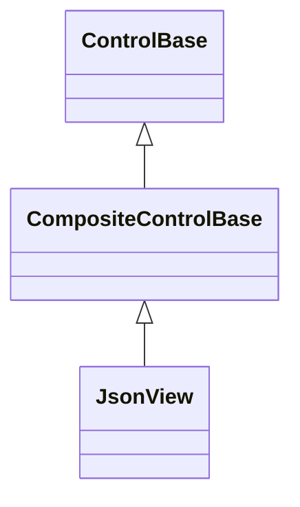
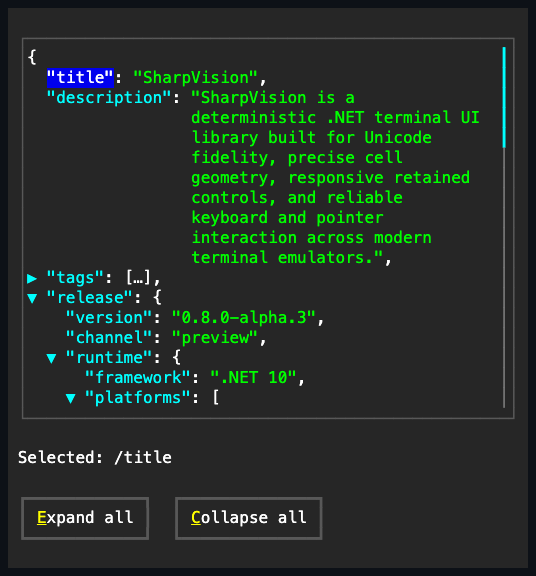

# JsonView

## Overview

`JsonView` displays a complete JSON document as an expandable, syntax-colored
tree. Object properties and array indices are individual navigation targets;
containers can be collapsed without replacing the document, and long string
values wrap within the available viewport width.

The control copies the supplied `Json` text into an owned parsed model. Callers
retain no `JsonDocument` lifetime responsibility. Parsing, selection, expansion,
layout, and input mutation remain dispatcher-affine after attachment. Invalid
replacement text is rejected before the current document, disclosure state,
selection, or offsets change.

## Inheritance



## API

| Member                        | Type                                              | Default          | Description                                                                                                                                                   |
| ----------------------------- | ------------------------------------------------- | ---------------- | ------------------------------------------------------------------------------------------------------------------------------------------------------------- |
| `Json`                        | `string`                                          | `"null"`         | Complete non-null JSON document text; parsed completely before any observable state changes.                                                                  |
| `Indent`                      | `int`                                             | `2`              | Non-negative cells added for each visible nesting level; the line projection is rebuilt before the property publishes, and a reentrant newer value owns both. |
| `SelectedPath`                | `string?`                                         | `null`           | Read-only; RFC 6901 pointer of the selected key or array index.                                                                                               |
| `Style`                       | `JsonViewStyle?`                                  | `null`           | Gets or sets the complete local presentation.                                                                                                                 |
| `ActualStyle`                 | `JsonViewStyle`                                   | Resolved         | Read-only; the complete local, theme-owned, or code-owned presentation.                                                                                       |
| `ScrollBars`                  | `ScrollBars`                                      | `Both`           | Axes that may expose generated scrollbars.                                                                                                                    |
| `ShowScrollBars`              | `ShowScrollBars`                                  | `WhenNeeded`     | Visibility policy for generated scrollbars.                                                                                                                   |
| `ScrollBarStyle`              | `ScrollBarStyle?`                                 | `null`           | Complete local style for generated scrollbars.                                                                                                                |
| `ActualScrollBarStyle`        | `ScrollBarStyle`                                  | Resolved         | Read-only resolved generated-scrollbar style.                                                                                                                 |
| `Extent`                      | `Size`                                            | Layout-dependent | Read-only committed content extent.                                                                                                                           |
| `Viewport`                    | `Size`                                            | Layout-dependent | Read-only committed visible extent.                                                                                                                           |
| `HorizontalOffset`            | `int`                                             | `0`              | Valid horizontal content offset; rejects a value outside the current extent.                                                                                  |
| `VerticalOffset`              | `int`                                             | `0`              | Valid vertical content offset; rejects a value outside the current extent.                                                                                    |
| `LineSize`                    | `int`                                             | `1`              | Non-negative wheel-scroll cell increment.                                                                                                                     |
| `PageOverlap`                 | `int`                                             | `0`              | Non-negative cells of context retained between page commands.                                                                                                 |
| `ScrollBy(x, y, cause)`       | `bool`                                            | —                | Applies signed cell deltas with saturation and endpoint clamping.                                                                                             |
| `SetExpanded(path, expanded)` | `bool`                                            | —                | Changes one non-root container entry's disclosure state; returns whether it changed.                                                                          |
| `ExpandAll()`                 | `void`                                            | —                | Expands every object and array entry.                                                                                                                         |
| `CollapseAll()`               | `void`                                            | —                | Collapses every non-root object and array entry.                                                                                                              |
| `SelectionChanged`            | `EventHandler<JsonViewSelectionChangedEventArgs>` | No subscribers   | Reports the previous and committed pointer.                                                                                                                   |
| `ScrollChanged`               | `EventHandler<ScrollChangedEventArgs>`            | No subscribers   | Reports the settled offset, extent, and viewport for one layout pass.                                                                                         |

`JsonViewStyle`, reached through `Style`/`ActualStyle`, colors object keys,
array indices, strings, numbers, booleans, null, punctuation, disclosure glyphs,
and selected tokens through `ControlColor`. Its defaults use semantic
`SemanticColor` roles, so built-in and custom themes remain authoritative.

`Json` rejects null with `ArgumentNullException` and malformed text — including
an object with duplicate keys — with `JsonException`; `Indent` rejects a
negative value. All non-empty object and array entries start expanded. Replacing
`Json` selects the first property or array entry in depth-first source order and
resets the document's disclosure model. A scalar root and an empty container
have no selection.

## Wrapping

Within a finite width, string values wrap at whitespace and fall back to
extended-grapheme boundaries when one word cannot fit. Continuation lines align
under the value rather than under its key, preserve the original JSON string
lexeme, and leave a trailing comma on the final line. A vertical scrollbar
narrows and reflows the string projection before horizontal overflow is
resolved. Long keys, deep indentation, and non-string scalar lexemes remain
unwrapped and can still require horizontal scrolling.

## Navigation

Navigation follows the visible depth-first projection:

| Input             | Result                                                                               |
| ----------------- | ------------------------------------------------------------------------------------ |
| Up / Down         | Select the previous or next visible property or array index.                         |
| PageUp / PageDown | Select the entry as many lines away as fill the viewport height minus `PageOverlap`. |
| Home / End        | Select the first or last visible entry.                                              |
| Left              | Collapse the selected container, or select its nearest visible parent.               |
| Right             | Expand the selected container, or select its first visible child.                    |
| Enter / Space     | Toggle the selected non-empty container.                                             |
| Primary key click | Select that property or array index.                                                 |
| Disclosure click  | Select and toggle that container.                                                    |

The movement rows repeat while a key is held; the Enter/Space toggle fires once
per key hold and only with activation-eligible modifiers, so a command chord
such as Ctrl+Enter never toggles a container.

Selection highlights only the quoted key or `[index]` token. The value keeps its
scalar type color, which avoids erasing syntax meaning as navigation moves.
Every selection change minimally reveals its line through the vertical viewport.
Wheel, scrollbar, and programmatic scrolling use the shared container scrolling
contract. `LineSize` scales the wheel's cell step; keyboard navigation always
moves the selection by exactly one line regardless of this value. A word-wrapped
value's continuation lines count toward the PageUp/PageDown page step the same
as any other line, since the step is line-based rather than entry-based.

## Example



```csharp
var json = new JsonView
{
    Json = """
        {
          "name": "SharpVision",
          "versions": [9, 10],
          "active": true
        }
        """,
    ScrollBars = ScrollBars.Both
};

_ = json.SetExpanded("/versions", false);
json.SelectionChanged += (_, eventArgs) =>
    Console.WriteLine(eventArgs.Path);
```

## Expected behavior

| Scope       | Observable evidence                                                                |
| ----------- | ---------------------------------------------------------------------------------- |
| Public API  | Atomic parsing, pointer escaping, selection events, disclosure, and scroll bounds. |
| Surface     | Exact syntax lines, semantic token colors, selected key cells, and tiny clipping.  |
| Integration | Decoded keyboard and pointer input changes the mounted tree and visible selection. |

- Source object-property order and array order are preserved.
- Strings and numbers retain their original JSON lexemes; property labels are
  escaped deterministically.
- Rendering measures and clips grapheme clusters using the active terminal cell
  policy. String continuations wrap only between complete clusters, while each
  key remains the single navigation target for all of its visual lines.
- Collapsing a branch removes its descendants from navigation and rendering;
  expanding it restores the same source-ordered entries.
