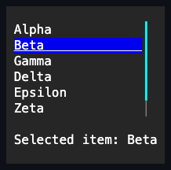

# ListView

## Overview

`ListView` is a focusable selection control over an owned snapshot of items and
a caller-configurable template. By default it realizes every item eagerly into a
private vertical arrangement armed with the intrinsic
[`AutoScroll`](../../concepts/scrolling.md) contract, so realization cost and
memory scale with the item count, not the viewport. Setting `RowHeight` opts
into windowed realization instead: only items inside the current viewport plus a
bounded overscan margin are ever realized, so cost and memory scale with the
viewport instead — see [Virtualization](#virtualization) below.

Each template result is wrapped in one ordinary pressable `ListItem`. The
ListView owns focus and current-item navigation; the wrapper owns activation,
the selected and current visual facts, and exactly one template control through
its inherited `Content`. Selection propagates through the realized control
subtree so the theme treats the complete row as one selected item; an explicit
complete local appearance on template content remains authoritative.

By default a ListView is a quiet, borderless collection region whose fill comes
from the active theme's `ListView.normal` style. The continuous plane is its
boundary; callers can opt into an inherited frame or replace the background
through the shared [chrome contract](../../concepts/styling.md#shared-chrome).

The control paints its complete arranged surface with its normal or disabled
appearance. Normal and pointer-over realized items keep a transparent background
when their theme states omit one, so the owning surface stays continuous. A
`VisualState.Selected` overlay may paint the complete row rather than only the
label cells.

## API

| Member                                                 | Default                  | Purpose                                                                   |
| ------------------------------------------------------ | ------------------------ | ------------------------------------------------------------------------- |
| `Items`                                                | Empty snapshot           | Copies data items before realizing presentation controls.                 |
| `ItemTemplate`                                         | Invariant-culture `Text` | Creates one unique detached control per item.                             |
| `RowHeight`                                            | `null`                   | Fixed per-row cell height that opts into windowed realization.            |
| `SelectionMode`                                        | `Single`                 | Allows no selection, one selection, or multiple selections.               |
| `ItemInvocation`                                       | `SingleClick`            | Chooses whether one pointer click or a double-click raises `ItemInvoked`. |
| `SelectedIndex`, `SelectedItem`, `SelectedItems`       | `-1`, `null`, empty      | Read or change committed selection.                                       |
| `ActiveIndex`                                          | `-1`                     | Identify the keyboard-navigation row.                                     |
| `ScrollBars`, `ShowScrollBars`                         | Vertical automatic rails | Configure overflow visibility policy.                                     |
| `ScrollBarStyle`, `ActualScrollBarStyle`               | `null`, Theme style      | Override or inspect the complete generated-rail presentation.             |
| `SelectionChanging`, `SelectionChanged`, `ItemInvoked` | No subscribers           | Cancel a proposal or observe committed selection and activation.          |

## Behavior

- `Items` rejects a null collection replacement and copies the complete
  `IReadOnlyList<object?>` before realizing controls. The returned owner-backed
  view cannot mutate the snapshot. Null items are passed to the template
  unchanged.
- `ItemTemplate(object?)` must return one unique, detached, undisposed, non-null
  control per item. The entire candidate set is built and validated before the
  previous realized tree is detached. A successful replacement disposes every
  old wrapper and template control; a failure preserves the items, template,
  selection, parents, and cells.
- The default template creates one invariant-culture `Text` control per item.
  Custom templates may return Unicode and variable-height controls.
- `ListSelectionMode.None`, `Single`, and `Multiple` permit zero, at most one,
  or many selected indexes. Narrowing the mode normalizes the selection
  deterministically by keeping the lowest applicable index.
- `SelectedIndex` returns the lowest selected index, and assigning `-1` clears
  the selection. Invalid indexes throw, and a non-negative assignment in None
  mode is rejected. Assigning an unavailable realized row is ignored and
  preserves the existing valid selection. `SetSelected(index, bool)` changes one
  index without replacing other Multiple selections; selecting an unavailable
  realized row returns `false` and leaves the valid selection unchanged.
  `SelectedItem` and the stable owner-backed `SelectedItems` view always reflect
  the committed selection in ascending index order.
- Replacing `Items` remaps the selected and active rows by item equality, so an
  item that remains in the new snapshot stays selected even when its index
  changes. Equal duplicate values map by occurrence: the first old occurrence
  maps to the first new occurrence, the second to the second, and so on, and
  unmatched occurrences are removed. The snapshot map uses equality buckets and
  runs in expected `O(old count + new count)` time. When selected items are
  removed, the selection is cleared or narrowed to the remaining valid items. A
  removed or unavailable active row falls back to the available realized row
  with the smallest absolute distance from the clamped prior position,
  preferring the lower index on a tie; when the prior position is beyond the new
  snapshot this becomes the last available row, or `-1` when no row is
  available. Insert, remove, and replace notifications from an observed
  collection follow the same stable index and item rules.
- `ActiveIndex` identifies the row that keyboard selection and invocation act
  on. Keyboard navigation keeps it synchronized with the committed selection in
  Single and Multiple modes; None mode keeps active navigation without
  selection. `VerticalOffset` exposes the composed viewport offset.
  `ScrollBars`, `ShowScrollBars`, `ScrollBarStyle`, and `PageOverlap` forward
  the common overflow and paging policy to the owned viewport, so a ListView
  scrolls with the same canonical rail and page behavior as any scrollable
  `Container` rather than a private scrolling dialect.
- `SelectionChanging` receives owned, sorted added and removed index memories
  and may cancel the change before it commits. `SelectionChanged` reports the
  same committed delta after all selected views and visual states have updated.
  Reentrant changes advance a transaction version, so a stale outer proposal
  cannot overwrite them. Mode or item-realization changes invalidate pending
  proposals even when the selected index set was already empty, and a reentrant
  change to None mode rejects any pending non-empty proposal.
- `ItemInvoked` reports the index, the borrowed item, and the `ActivationCause`
  for Enter or an eligible primary pointer invocation. Every pointer activation
  still applies selection; whether it also raises `ItemInvoked` depends on
  `ItemInvocation`.
- `ItemInvocation` selects which pointer gesture raises `ItemInvoked`. The
  `SingleClick` default raises it from every pointer activation, matching
  Enter's always-commits behavior. `DoubleClick` raises it only when the pointer
  activation is itself a plain (unmodified) multi-click (a second primary press
  on the same row within the terminal's multi-click window); a lone click still
  applies selection without invoking. A multi-click held with Control or Shift
  is a selection gesture - toggling or extending the selection like any other
  modified click - and never raises `ItemInvoked`, even once its click count
  reaches a multi-click. Enter always raises `ItemInvoked` regardless of
  `ItemInvocation`; Space, a keyboard activation that only changes selection
  (see below), does not.

## Interaction and layout

Arrow keys keep focus on the ListView and move its active index in stable
realized order, skipping template controls that are effectively hidden or
disabled. In Single and Multiple modes every move also replaces the selection
with the active row; when a `SelectionChanging` transaction is cancelled, both
values stay unchanged. None mode moves only the active index. Home and End
choose the first or last eligible item. PageUp and PageDown advance by at least
one item, and otherwise by as many items as fill the committed viewport height
minus `PageOverlap`. In eager mode they accumulate each realized row's own
height rather than treating the viewport's cell height as an item count, so rows
taller than one cell are never skipped; in windowed mode the identical distance
becomes pure arithmetic against the fixed `RowHeight`, requiring no realized
row. A navigation target outside the current window is realized (and scrolled
into view) on demand. Every successful move uses the composed `BringIntoView`
path.

Space follows press-and-release activation and changes the selection; Enter
invokes without changing it. A primary pointer release selects and, subject to
`ItemInvocation`, invokes. In Multiple mode, Control toggles one index, Shift
selects the inclusive range from the stable anchor while skipping unavailable
rows, and an unmodified activation replaces the selection. In Single mode
activation replaces the sole selection, and None mode still permits navigation
and invocation.

Pointer hit testing targets the pressable item wrapper rather than letting its
display child swallow the activation. Capture, focus loss, disable, detach, and
disposal therefore reuse the same cancellation guarantees as `Button` and the
other `PressableBase` controls.

Disabled realized item content stays visible, but its row is not eligible for
pointer activation, keyboard navigation, or selection. An empty `Items` snapshot
has no active or selected row and renders only the ListView surface.

The ListView owns keyboard focus but never paints a list-wide hover appearance.
The physical `PointerOver` state remains observable on the list ancestry, while
the directly targeted internal item wrapper changes only its foreground and
border semantics over the unchanged owner background. Selection may paint the
paired selection background.

## Virtualization

Setting `RowHeight` to a positive cell count opts a ListView into windowed
realization: only rows inside the current viewport plus a bounded overscan
margin are ever realized, and every arranged row is clipped to exactly the
configured height. `RowHeight = null` (the default) keeps eager realization
byte-for-byte unchanged - `ComboBox`, the file-picker dialogs, and every
existing showcase page embed a ListView on that guarantee, so eager stays the
default rather than a deprecated fallback.

```csharp
var results = new ListView
{
    RowHeight = 1,
    ItemTemplate = item => new Text(item?.ToString() ?? string.Empty),
    Items = matches, // tens of thousands of rows
};
```

Windowed realization is opt-in because it trades away a real capability:
**variable-height templates only work in eager mode.** Row height here is
width-dependent (wrapped text reflows as the viewport narrows, and reserving a
scrollbar column can itself change how a row wraps), so there is no
estimate-then-correct fallback - a template whose natural height differs from
`RowHeight` is clipped, not silently misaligned, and only eager mode supports
it. Choose `RowHeight` for large, uniform-height collections (logs, search
results, file listings); leave it `null` for everything else.

Selection, the active row, and `SelectedItems` are pure index and value state
independent of which rows happen to be realized, so they behave identically in
both modes - including for an index currently outside the window, which is
optimistically treated as eligible until a realized row proves otherwise. A
ListView that relies on auto-width sizing (no explicit `Width` and no
`HorizontalAlignment.Stretch` parent slot) while windowed can see its own
measured width jitter across a scroll, the same accepted tradeoff virtualizing
panels make elsewhere: `Extent.Width` reports only the widest _currently
realized_ row rather than the widest row overall. `Extent.Height`, the scrollbar
`Maximum`, `BringIntoView(int)`, and offset-to-index conversion are all pure
arithmetic against `RowHeight` and never depend on a realized row.

## Example



```csharp
var list = new ListView
{
    Items = files,
    SelectionMode = ListSelectionMode.Single,
};
```

## Expected behavior

Empty lists and item replacement behave as described above. Selection modes,
events, and cancellation are deterministic; keyboard and pointer input,
including modifiers, selects and invokes as documented; and scrolling with
bring-into-view keeps the active item visible across resizes. Disabled items are
excluded from activation and selection, Unicode and variable-height content lays
out correctly, template failures preserve state and ownership, and focus
behavior and the final cells are exact.

Tests retain the actual template controls to prove unique parents and
deterministic disposal, compare final Unicode cells and wide-cell ownership,
assert stable selected-view identity, drive routed keyboard and pointer input
through the focus and capture managers, and verify active-item scrolling across
resize-sized viewports. Performance tests cover 1,000 fully realized items and
retained memory for eager mode; they must not relabel realization as
virtualization. A randomized equivalence fixture drives an eager and a windowed
ListView through the same seeded sequence of scroll, resize, selection, and
mutation operations and asserts they stay observably identical, following
[randomized testing](../../testing/randomized.md)'s conventions - the eager
instance is the independent oracle, since its always-fully-realized behavior
predates and is unaffected by windowed realization.
