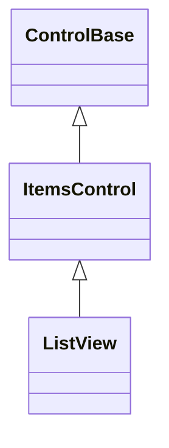

# ListView

## Overview

`ListView` is a focusable selection control over an owned snapshot of items and
a caller-configurable template. By default it realizes every item eagerly into a
private vertical arrangement armed with the intrinsic
[`AutoScroll`](../../concepts/scrolling.md) contract, so realization cost and
memory scale with the item count, not the viewport. Setting `RowHeight` opts
into windowed realization instead: only items inside the current viewport plus a
bounded overscan margin are ever realized, so cost and memory scale with the
viewport instead — see [Virtualization](#virtualization) below.

The public scrolling shell stays behind the semantic owner. One lifecycle-owned
bridge forwards programmatic and child-driven scroll properties exactly once and
preserves direct `ScrollChanged` transitions.

Each template result is wrapped in one ordinary pressable `ListItem`. The
ListView owns focus and current-item navigation; the wrapper owns activation,
the selected and current visual facts, and exactly one template control through
its inherited `Content`. Selection propagates through the realized control
subtree so the theme treats the complete row as one selected item; an explicit
complete local appearance on template content remains authoritative.

By default a ListView is a quiet, borderless collection region whose fill comes
from the active theme's `ListView.normal` style. The continuous plane is its
boundary; callers can opt into an inherited frame or replace the background
through the shared [chrome contract](../../concepts/styling.md#shared-chrome).

The control paints its complete arranged surface with its normal or disabled
appearance. Normal and pointer-over realized items keep a transparent background
when their theme states omit one, so the owning surface stays continuous. A
`VisualState.Selected` overlay may paint the complete row rather than only the
label cells.

## Inheritance



## API

| Member                         | Type                                           | Default                  | Description                                                                                                                                                                                 |
| ------------------------------ | ---------------------------------------------- | ------------------------ | ------------------------------------------------------------------------------------------------------------------------------------------------------------------------------------------- |
| `Items`                        | `IReadOnlyList<object?>`                       | Empty snapshot           | Copies the borrowed source before realizing controls; rejects null.                                                                                                                         |
| `ItemTemplate`                 | `ItemTemplate`                                 | Invariant-culture `Text` | Detached-control factory; must return one unique, detached, undisposed, non-null control per item.                                                                                          |
| `RowHeight`                    | `int?`                                         | `null`                   | Fixed per-row cell height that opts into windowed (virtualized) realization; rejects zero or negative.                                                                                      |
| `SelectionMode`                | `ListSelectionMode`                            | `Single`                 | Allows no, one, or multiple selected indexes; rejects an undefined value.                                                                                                                   |
| `ItemInvocation`               | `ListItemInvocation`                           | `SingleClick`            | Chooses whether every pointer activation, or only a plain multi-click, raises `ItemInvoked`.                                                                                                |
| `SelectedIndex`                | `int`                                          | `-1`                     | Lowest selected index; setting replaces the exclusive selection, makes that row current, and minimally reveals it. Rejects a value outside `Items`, or a non-negative value in `None` mode. |
| `SelectedItem`                 | `object?`                                      | `null`                   | Lowest selected item by value; setting selects its first matching index.                                                                                                                    |
| `SelectedItems`                | `IReadOnlyList<object?>`                       | Empty                    | Read-only, stable, ascending-index view of the committed selection.                                                                                                                         |
| `ActiveIndex`                  | `int`                                          | `-1`                     | Read-only; the row keyboard navigation and invocation act on.                                                                                                                               |
| `ScrollBars`                   | `ScrollBars`                                   | `Vertical`               | Axes exposed by the composed overflow host.                                                                                                                                                 |
| `ShowScrollBars`               | `ShowScrollBars`                               | `WhenNeeded`             | Visibility policy for the generated scrollbar.                                                                                                                                              |
| `ScrollBarStyle`               | `ScrollBarStyle?`                              | `null`                   | Local override for the generated scrollbar's presentation.                                                                                                                                  |
| `ActualScrollBarStyle`         | `ScrollBarStyle`                               | Resolved                 | Read-only; the local, theme-owned, or code-owned generated-scrollbar style.                                                                                                                 |
| `Extent`                       | `Size`                                         | Layout-dependent         | Read-only; the committed content extent of the composed scroll container.                                                                                                                   |
| `Viewport`                     | `Size`                                         | Layout-dependent         | Read-only; the committed visible extent of the composed scroll container.                                                                                                                   |
| `HorizontalOffset`             | `int`                                          | `0`                      | Composed horizontal scroll offset; rejects a value outside `Extent`.                                                                                                                        |
| `VerticalOffset`               | `int`                                          | `0`                      | Composed vertical scroll offset; rejects a value outside `Extent`.                                                                                                                          |
| `LineSize`                     | `int`                                          | `1`                      | Non-negative wheel-scroll increment forwarded to the composed viewport.                                                                                                                     |
| `PageOverlap`                  | `int`                                          | `0`                      | Non-negative cells of context retained between page commands.                                                                                                                               |
| `ScrollBy(x, y, cause)`        | `bool`                                         | —                        | Applies signed cell deltas with saturation and endpoint clamping.                                                                                                                           |
| `BringIntoView(index)`         | `bool`                                         | —                        | Scrolls minimally to expose the item at a valid index.                                                                                                                                      |
| `SetSelected(index, selected)` | `bool`                                         | —                        | Changes one index without replacing the rest of a `Multiple` selection; selecting makes that row current and minimally reveals it.                                                          |
| `SelectionChanging`            | `EventHandler<ListSelectionChangingEventArgs>` | No subscribers           | Raised before a changed selection commits; cancellable.                                                                                                                                     |
| `SelectionChanged`             | `EventHandler<ListSelectionChangedEventArgs>`  | No subscribers           | Raised after a changed selection commits.                                                                                                                                                   |
| `ItemInvoked`                  | `EventHandler<ItemInvokedEventArgs>`           | No subscribers           | Raised after Enter or an eligible pointer invocation.                                                                                                                                       |
| `ScrollChanged`                | `EventHandler<ScrollChangedEventArgs>`         | No subscribers           | Forwards the composed scroll container's committed offset changes.                                                                                                                          |

## Behavior

- `Items` rejects a null replacement and copies the complete
  `IReadOnlyList<object?>` before realizing controls. The returned owner-backed
  view cannot mutate the snapshot. Null items are passed to the template
  unchanged.
- `ItemTemplate(object?)` must return one unique, detached, undisposed, non-null
  control per item. The entire candidate set is built and validated before the
  previous realized tree is detached: a successful replacement disposes every
  old wrapper and template control, and a failure preserves the items, template,
  selection, parents, and cells. The default template creates one
  invariant-culture `Text` control per item; custom templates may return Unicode
  and variable-height controls.
- Directly disposing a realized template control removes its semantic item from
  the snapshot, disposes the now-empty wrapper, and repairs selection and active
  position through the same rules as an ordinary item removal. This contract is
  identical in eager and windowed realization.
- `ListSelectionMode.None`, `Single`, and `Multiple` permit zero, at most one,
  or many selected indexes. Narrowing the mode normalizes the selection
  deterministically by keeping the lowest applicable index.
- `SetSelected(index, bool)` changes one index without replacing other
  `Multiple` selections; selecting an unavailable realized row returns `false`
  and leaves the valid selection unchanged.

Replacing `Items` remaps the selected and active rows by item equality instead
of by position:

1. Equal duplicate values map by occurrence — the first old occurrence maps to
   the first new occurrence, the second to the second, and so on; unmatched
   occurrences are removed. The snapshot map uses equality buckets and runs in
   expected `O(old count + new count)` time.
2. An item that remains in the new snapshot stays selected even when its index
   changes. When selected items are removed, the selection is cleared or
   narrowed to the remaining valid items. Eager and windowed replacement both
   publish the resulting stable index delta through `SelectionChanged`.
3. A removed or unavailable active row falls back to the available realized row
   with the smallest absolute distance from the clamped prior position,
   preferring the lower index on a tie; when the prior position is beyond the
   new snapshot this becomes the last available row, or `-1` when no row is
   available.
4. Insert, remove, and replace notifications from an observed collection follow
   the same stable index and item rules.

An items binding applies those single-item notifications incrementally only
while the emitting collection remains the current bound property identity and
source-path revision. Replacing the property while an older notification is
queued or retained across detachment discards that delta and installs one full
snapshot of the replacement before later incremental changes resume.

`SelectionChanging` receives owned, sorted added and removed index snapshots and
may cancel the change before it commits. `SelectionChanged` reports the same
committed delta after all selected views and visual states have updated.
Reentrant changes advance a transaction version, so a stale outer proposal
cannot overwrite them. The property notifications for `SelectedIndex`,
`SelectedItem`, and `SelectedItems` are also transaction boundaries: if an
observer commits a newer selection, the superseded transaction publishes neither
its remaining property notifications nor its stale `SelectionChanged`. Mode or
item-realization changes invalidate pending proposals even when the selected
index set was already empty, and a reentrant change to `None` mode rejects any
pending non-empty proposal. If a synchronous selection callback disposes the
ListView, the committed notification completes but dependent active-index and
reveal work stops at that lifetime boundary.

A successfully committed non-negative `SelectedIndex`, or a selected index
committed through `SetSelected`, also becomes `ActiveIndex` and is minimally
brought into the composed viewport. This is one selection invariant for direct
assignment, `SelectedItem`, binding, additive selection, and list-backed
controls. A selection assigned before first layout is revealed after the first
non-empty viewport commits. Clearing, rejecting, or cancelling selection leaves
the viewport unchanged.

`ItemInvoked` reports the index, the borrowed item, and the `ActivationCause`
for Enter or an eligible primary pointer invocation; every pointer activation
still applies selection, and whether it also raises `ItemInvoked` depends on
`ItemInvocation`. The `SingleClick` default raises it from every pointer
activation, matching Enter's always-commits behavior. `DoubleClick` raises it
only when the pointer activation is itself a lock-normalized plain multi-click —
a second primary press on the same row within the terminal's multi-click window;
a lone click still applies selection without invoking, and a multi-click held
with Control, Shift, Alt, Super, Meta, or Hyper never raises `ItemInvoked`. Each
held pointer press retains its own modifiers and click count until release; an
intervening keyboard activation or navigation command cannot reclassify that
physical gesture. Selection callbacks are also an identity boundary: invocation
continues only while the ListView remains attached and effectively available and
the exact activated realized row remains owned and available. Disable, detach,
clearing, replacing, or inserting items in a way that replaces that row abandons
the pending invocation instead of indexing its former position.

## Interaction and layout

| Input                           | Result                                                                                                                                   |
| ------------------------------- | ---------------------------------------------------------------------------------------------------------------------------------------- |
| Up / Down / Left / Right        | Move the active index by one eligible row, in stable realized order, skipping template controls that are effectively hidden or disabled. |
| Home / End                      | Choose the first or last eligible item.                                                                                                  |
| PageUp / PageDown               | Move by at least one item, otherwise by as many items as fill the committed viewport height minus `PageOverlap`.                         |
| Mouse wheel                     | Scrolls the composed viewport by `LineSize` cells per notch; never changes the active index.                                             |
| Space                           | Changes selection without invoking when only Control, Shift, or lock modifiers accompany it; larger chords remain unhandled.             |
| Enter                           | Invokes without changing the selection.                                                                                                  |
| Primary pointer release         | Selects and, subject to `ItemInvocation`, invokes.                                                                                       |
| Control click (`Multiple` mode) | Toggles one index.                                                                                                                       |
| Shift click (`Multiple` mode)   | Selects the inclusive range from the stable anchor, skipping unavailable rows.                                                           |
| Unmodified click                | Replaces the selection in `Single` and `Multiple` modes; `None` mode still permits navigation and invocation without selecting.          |

Keyboard movement accepts incidental lock state but leaves Shift and every
application-command-modified movement key unhandled.

In `Single` and `Multiple` modes, every initial or repeated arrow-key move also
replaces the selection with the active row; when a `SelectionChanging`
transaction is cancelled, both values stay unchanged. `None` mode moves only the
active index. PageUp and PageDown accumulate each realized row's own height in
eager mode rather than treating the viewport's cell height as an item count, so
rows taller than one cell are never skipped; in windowed mode the identical
distance becomes pure arithmetic against the fixed `RowHeight`, requiring no
realized row. A navigation target outside the current window is realized (and
scrolled into view) on demand, and every successful move uses the composed
`BringIntoView` path. Keyboard Up and Down always move by exactly one item
regardless of `RowHeight` or `LineSize`; an application wanting the wheel to
step by whole rows in windowed mode can set `LineSize` to the same value as
`RowHeight`.

Pointer hit testing targets the pressable item wrapper rather than letting its
display child swallow the activation, so capture, focus loss, disable, detach,
and disposal reuse the same cancellation guarantees as `Button` and the other
press-activation-enabled controls. Disabled realized item content stays visible,
but its row is not eligible for pointer activation, keyboard navigation, or
selection. An empty `Items` snapshot has no active or selected row and renders
only the ListView surface.

The ListView owns keyboard focus but never paints a list-wide hover appearance.
The physical `IsPointerOver` state remains observable on the list ancestry,
while the directly targeted internal item wrapper changes only its foreground
and border semantics over the unchanged owner background. Selection may paint
the paired selection background.

## Virtualization

Setting `RowHeight` to a positive cell count opts a ListView into windowed
realization: only rows inside the current viewport plus a bounded overscan
margin are ever realized, and every arranged row is clipped to exactly the
configured height. `RowHeight = null` (the default) keeps eager realization
byte-for-byte unchanged - `ComboBox`, the file-picker dialogs, and every
existing showcase page embed a ListView on that guarantee, so eager stays the
default rather than a deprecated fallback.

```csharp
var results = new ListView
{
    RowHeight = 1,
    ItemTemplate = item => new Text(item?.ToString() ?? string.Empty),
    Items = matches, // tens of thousands of rows
};
```

Windowed realization is opt-in because it trades away a real capability:
**variable-height templates only work in eager mode.** Row height here is
width-dependent (wrapped text reflows as the viewport narrows, and reserving a
scrollbar column can itself change how a row wraps), so there is no
estimate-then-correct fallback — a template whose natural height differs from
`RowHeight` is clipped, not silently misaligned, and only eager mode supports
it. Choose `RowHeight` for large, uniform-height collections (logs, search
results, file listings); leave it `null` for everything else.

- Selection, the active row, and `SelectedItems` are pure index and value state
  independent of which rows happen to be realized, so they behave identically in
  both modes — including for an index currently outside the window, which is
  optimistically treated as eligible until a realized row proves otherwise.
  First realization caches actual availability before presentation; an already
  disabled or collapsed row is removed from selection and active state through
  the same non-cancellable repair used when realized template content later
  becomes effectively disabled or hidden.
- A ListView that relies on auto-width sizing (no explicit `Width` and no
  `HorizontalAlignment.Stretch` parent slot) while windowed can see its own
  measured width jitter across a scroll, the same accepted tradeoff virtualizing
  panels make elsewhere: `Extent.Width` reports only the widest _currently
  realized_ row rather than the widest row overall.
- `Extent.Height`, the scrollbar `Maximum`, `BringIntoView(int)`, and
  offset-to-index conversion are all pure arithmetic against `RowHeight` and
  never depend on a realized row.

## Example


```csharp
var list = new ListView
{
    Items = files,
    SelectionMode = ListSelectionMode.Single,
};
```

## Expected behavior

| Scope       | Observable evidence                                                                                                 |
| ----------- | ------------------------------------------------------------------------------------------------------------------- |
| Public API  | Validation, defaults, state changes, and deterministic output.                                                      |
| Integration | Decoded keyboard and pointer input drives navigation, selection, and invocation.                                    |
| Performance | 1,000 fully realized items and retained memory for eager mode; virtualized realization is never relabeled as eager. |

- Empty lists and item replacement behave as described above. Selection modes,
  events, and cancellation are deterministic.
- Keyboard and pointer input, including modifiers, selects and invokes as
  documented, and scrolling with bring-into-view keeps the active item visible
  across resizes.
- Disabled items are excluded from activation and selection, Unicode and
  variable-height content lays out correctly, template failures preserve state
  and ownership, and focus behavior and the final cells are exact.
- Tests retain the actual template controls to prove unique parents and
  deterministic disposal, compare final Unicode cells and wide-cell ownership,
  assert stable selected-view identity, and drive routed keyboard and pointer
  input through the focus and capture managers.
- A randomized equivalence fixture drives an eager and a windowed ListView
  through the same seeded sequence of scroll, resize, selection, and mutation
  operations and asserts they stay observably identical, following
  [randomized testing](../../testing/randomized.md)'s conventions — the eager
  instance is the independent oracle, since its always-fully-realized behavior
  predates and is unaffected by windowed realization.
