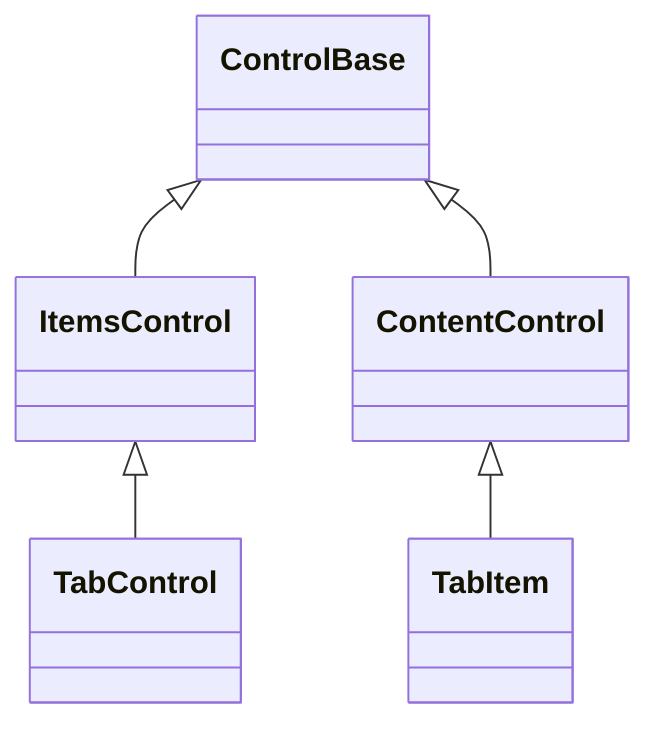

# TabControl

## Overview

`TabControl` arranges typed [`TabItem`](#tabitem) pages and coordinates a header
strip, keyboard navigation, and content participation. It extends
[`ItemsControl`](../items-control.md) with one private retained page host and
one private retained header strip. The `TabControl` itself owns keyboard focus.
Each generated header is a pressable framework part that owns its pointer hit
target, hover, capture, pressed state, and selected appearance. Public `TabItem`
objects own the semantic page content without exposing those presentation
controls.

Unselected headers keep the containing strip's background, and hovering one
changes only its foreground; the committed selected header may use the selection
background.

The header strip occupies the first row. Each label gets one cell of horizontal
padding, adjacent labels are separated by the code-owned tab-divider glyph, and
the code-owned tab-underline glyph occupies the second row when the height
permits. Below that rule, only the selected page's content participates in
measure, arrangement, rendering, hit testing, and navigation. The selected
visual state belongs to the header; page content keeps its normal appearance.
Unselected content stays owned and attached, with empty bounds.

## Inheritance



## API

| Member                 | Type                                         | Default                           | Description                                                                                                       |
| ---------------------- | -------------------------------------------- | --------------------------------- | ----------------------------------------------------------------------------------------------------------------- |
| `Items`                | `TabItemCollection`                          | Empty typed collection            | Owns `TabItem` values and their retained content pages.                                                           |
| `SelectedIndex`        | `int`                                        | `-1` until an eligible tab exists | Selects one visible and enabled page, or explicitly clears selection; rejects an out-of-range value.              |
| `SelectedItem`         | `TabItem?`                                   | `null`                            | Gets the selected page, or sets one owned page as selected; an unowned page clears selection.                     |
| `HeaderWidth`          | `Length`                                     | `Length.Auto`                     | Applies an automatic, fixed-cell, percentage, or proportional width to every header.                              |
| `HeaderOverflowPolicy` | `TabHeaderOverflowPolicy`                    | `Clip`                            | Clips overflowing headers or scrolls the strip to keep the selected header reachable; rejects an undefined value. |
| `Style`                | `TabControlStyle?`                           | `null`                            | Optional complete developer-authored tab-strip style.                                                             |
| `ActualStyle`          | `TabControlStyle`                            | Resolved                          | Read-only; the local style when assigned, otherwise the `control` role plus code-owned tab-strip members.         |
| `RequestClose(item)`   | `bool`                                       | —                                 | Requests closure of a closeable owned page; raises `CloseRequested` and removes it unless cancelled.              |
| `SelectionChanged`     | `EventHandler<TabSelectionChangedEventArgs>` | No subscribers                    | Raised after the selected tab index changes.                                                                      |
| `CloseRequested`       | `EventHandler<TabCloseRequestedEventArgs>`   | No subscribers                    | Raised before a closeable tab is removed; handlers may cancel before removal.                                     |

`Items : TabItemCollection` exposes typed `Add`, `Insert`, `Remove`, `RemoveAt`,
`Move`, `IndexOf`, and `Clear` operations for `TabItem`, plus a settable typed
indexer and enumeration. Null, duplicate, attached, disposed, and cyclic
candidates are rejected before ownership changes. Removal and replacement detach
without disposing. `Move` reorders the existing page and header identities in
place: neither control detaches, changes parent, loses focus, nor crosses an
attachment lifecycle boundary.

## Behavior

- Inserting, removing, replacing, or moving a page preserves the identity of an
  already-selected page: its `SelectedIndex` shifts silently when the page is
  unaffected, and `SelectionChanged` fires only when the selected page itself is
  removed or replaced.
- `SelectedIndex` tracks the selected eligible page, and `-1` explicitly clears
  the selection. The first effectively visible and enabled tab auto-selects.
  Invalid indexes and unavailable targets are rejected before mutation.
- `SelectionChanged` fires once, after the selected page identity and the
  retained content participation have committed. Assigning the same index again
  is not a selection change.
- Selection and presentation are transaction-ordered under synchronous reentry.
  A newer selection or structural mutation from `SelectedIndex`, `SelectedItem`,
  or page `Visibility` notification supersedes the interrupted transaction;
  stale typed events are suppressed and the live selected page is presented
  before its event is raised.
- `TabItem.IsClosable` opts a page into `RequestClose` and Delete-key closure.
  `CloseRequested` is raised before removal with a cancellable
  [`TabCloseRequestedEventArgs`](#tabcloserequestedeventargs) payload. No close
  glyph or mouse-only close affordance is part of this basic contract.
- When the selected page is removed, disabled, or collapsed, the control chooses
  the nearest eligible successor, then the nearest predecessor, and otherwise
  clears the selection. Clearing the collection clears the selection.
  Re-enabling an unselected page does not steal the selection.

`HeaderWidth` uses the shared `Length` model. `Length.Auto` keeps each header's
intrinsic width; fixed, percentage, and proportional values resolve against the
available header-strip width. `HeaderOverflowPolicy.Scroll` uses the existing
horizontal container offset and reveals the selected header after keyboard or
programmatic selection; it does not add a second scrollbar row to the tab strip.

| Input                               | Result                                                                                                         |
| ----------------------------------- | -------------------------------------------------------------------------------------------------------------- |
| Primary pointer release on a header | Selects that page.                                                                                             |
| Unmodified Left / Right             | Moves and selects with wrapping, skipping pages that are effectively hidden or disabled.                       |
| Unmodified Home / End               | Chooses the first or last eligible page.                                                                       |
| Unmodified Delete                   | Requests closure of the selected closeable page, once per key hold — a held Delete never closes a second page. |

Pointer focus resolves to the `TabControl`, while hover and pressed state stay
local to the hit header. A selected header combines `VisualState.Selected` with
its own hover, pressed, or disabled state; hovering the page or the owner does
not recolor the strip. Keys outside the tab-navigation command set remain
available to inherited routed input, and a handler that consumes a navigation
key suppresses the built-in selection change. Shift, Alt, Control, and combined
modifier variants of the tab commands remain unhandled for application
shortcuts.

## TabItem

`TabItem` extends [`ContentControl`](../content-control.md#api), adding
`HeaderText` directly. `HeaderText` is the only header surface a page exposes:
the strip's generated `TabHeader` faces are text-only, so there is no rich
`Header` slot to retain — a page cannot own a header control it is unable to
show. `Content` is the single caller-replaceable owned child, arranged below the
rule only while the page is selected.

| Member       | Type     | Default | Description                                                                                                                       |
| ------------ | -------- | ------- | --------------------------------------------------------------------------------------------------------------------------------- |
| `HeaderText` | `string` | `""`    | The non-null label rendered in the owning tab strip; rejects terminal control characters.                                         |
| `IsClosable` | `bool`   | `false` | Opts the page into `RequestClose` and Delete-key closure; dirty-state tracking and header adornments remain application concerns. |

## TabCloseRequestedEventArgs

`TabCloseRequestedEventArgs : EventArgs` is the cancellable payload
`CloseRequested` raises for one closeable tab page.

| Member   | Type      | Default | Description                                          |
| -------- | --------- | ------- | ---------------------------------------------------- |
| `Item`   | `TabItem` | —       | The tab page being requested for closure.            |
| `Cancel` | `bool`    | `false` | Settable; rejecting the close request when set true. |

When no handler cancels, `RequestClose` removes the item through the ordinary
typed collection path and applies the nearest-eligible selection repair,
following the same identity rule as every other mutation: `SelectionChanged`
fires only when the selected page itself is removed, not merely when its numeric
index shifts.

## Strip style

`TabControlStyle` carries the whole header-strip presentation: the validated
one-cell `DividerGlyph` and `UnderlineGlyph`, and the `DividerColor` and
`SelectionIndicatorColor` foregrounds, alongside the inherited
`Face`/`Border`/`Shadow`. TabControlStyle declares no `styles.*` theme key of
its own: its `Face`/`Border`/`Shadow` fall back to `control`'s role section,
while the four strip members above stay code-owned - so ASCII divider and
underline glyphs on a terminal without dependable box-drawing coverage need a
locally assigned `Style` (shared across instances if desired) rather than a
theme setting.

Assigning `Style` replaces the resolved presentation for one control; assigning
`null` returns it to the theme. Both colors accept either a concrete `Color` or
a `SemanticColor` role — a role keeps following theme swaps, while a literal
pins one exact color — and they are required rather than nullable, so the
default is part of the value the theme overlays instead of a fallback chosen at
the draw site.

## Example


```csharp
var tabs = new TabControl();
tabs.Items.Add(new TabItem
{
    HeaderText = "General",
    Content = new Stack
    {
        Children = { new Text("General settings") },
    },
});
tabs.Items.Add(new TabItem
{
    HeaderText = "Advanced",
    Content = new Stack
    {
        Children = { new CheckBox { Text = "Debug mode" } },
    },
});
```

An ampersand in `TabItem.HeaderText` declares an
[access key](../../concepts/access-keys.md#focus-and-semantic-actions). The
private retained header renders the caption without the marker and with the
key's grapheme underlined; pressing Alt plus the key focuses the `TabControl`
and selects that page. Page body text is not the tab caption.

## Expected behavior

| Scope       | Observable evidence                                                                                                                 |
| ----------- | ----------------------------------------------------------------------------------------------------------------------------------- |
| Public API  | Typed ownership and validation at the collection boundary, selection defaults and explicit clearing, and deterministic event order. |
| Integration | Nested pointer activation, pointer capture cleanup, and keyboard navigation through mounted routed input.                           |

- Removing a page repairs availability deterministically; the header, divider,
  and rule render into exact cells; selected and hover appearance stay local to
  the header; and unselected content is excluded from participation yet remains
  replaceable.
- Keyboard navigation wraps while skipping disabled pages.
- Owner focus, Unicode cells, clipping, zero and tiny bounds, resize, clearing
  of stale cells, disposal, and the final semantic cells are all observable
  guarantees.
