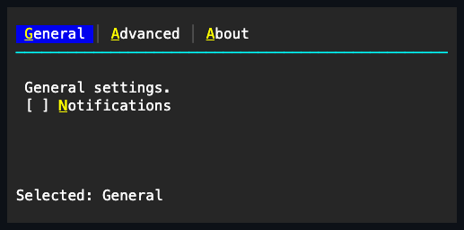

# TabControl

## Overview

`TabControl` arranges typed [`TabItem`](#tabitem) pages and coordinates a header
strip, keyboard navigation, and content participation. It extends
[`ItemsControl`](../items-control.md) with one private retained page host and
one private retained header strip. The `TabControl` itself owns keyboard focus.
Each generated header is a pressable framework part that owns its pointer hit
target, hover, capture, pressed state, and selected appearance. Public `TabItem`
objects own the semantic page content without exposing those presentation
controls.

Unselected headers keep the containing strip's background, and hovering one
changes only its foreground; the committed selected header may use the selection
background.

The header strip occupies the first row. Each label gets one cell of horizontal
padding, adjacent labels are separated by the code-owned tab-divider glyph, and
the code-owned tab-underline glyph occupies the second row when the height
permits. Below that rule, only the selected page's content participates in
measure, arrangement, rendering, hit testing, and navigation. The selected
visual state belongs to the header; page content keeps its normal appearance.
Unselected content stays owned and attached, with empty bounds.

## API

| Member                                    | Default                           | Purpose                                                                               |
| ----------------------------------------- | --------------------------------- | ------------------------------------------------------------------------------------- |
| `Items`                                   | Empty typed collection            | Owns `TabItem` values and their retained content pages.                               |
| `SelectedIndex`                           | `-1` until an eligible tab exists | Selects one visible and enabled page or explicitly clears selection.                  |
| `HeaderWidth`                             | `Length.Auto`                     | Applies an automatic, fixed-cell, percentage, or proportional width to every header.  |
| `HeaderOverflowPolicy`                    | `Clip`                            | Clips overflowing headers or scrolls the strip to keep the selected header reachable. |
| `DividerGlyph`, `UnderlineGlyph`          | Code-owned                        | Override one-cell strip and selected-tab markers; `ResetGlyphs()` restores defaults.  |
| `DividerColor`, `SelectionIndicatorColor` | `null`, `null`                    | Override the theme colors for the two strip parts.                                    |
| `SelectionChanged`                        | No subscribers                    | Reports selection after page participation commits.                                   |
| `CloseRequested`                          | No subscribers                    | Requests closure of a closeable page; handlers may cancel before removal.             |

## Behavior

- `Items : TabItemCollection` exposes typed `Add`, `Insert`, `Remove`,
  `RemoveAt`, `Move`, `IndexOf`, and `Clear` operations for `TabItem`, plus a
  settable typed indexer and enumeration. Null, duplicate, attached, disposed,
  and cyclic candidates are rejected before ownership changes. Removal and
  replacement detach without disposing. Inserting, removing, replacing, or
  moving a page preserves the identity of an already-selected page: its
  `SelectedIndex` shifts silently when the page is unaffected, and
  `SelectionChanged` fires only when the selected page itself is removed or
  replaced.
- `SelectedIndex` tracks the selected eligible page, and `-1` explicitly clears
  the selection. The first effectively visible and enabled tab auto-selects.
  Invalid indexes and unavailable targets are rejected before mutation.
- `SelectionChanged` fires once, after the selected page identity and the
  retained content participation have committed. Assigning the same index again
  is not a selection change.
- `TabItem.IsClosable` opts a page into `RequestClose` and Delete-key closure.
  `CloseRequested` is raised before removal with a cancellable
  [`TabCloseRequestedEventArgs`](#tabcloserequestedeventargs) payload. No close
  glyph or mouse-only close affordance is part of this basic contract.

`HeaderWidth` uses the shared `Length` model. `Length.Auto` keeps each header's
intrinsic width; fixed, percentage, and proportional values resolve against the
available header-strip width. `HeaderOverflowPolicy.Scroll` uses the existing
horizontal container offset and reveals the selected header after keyboard or
programmatic selection; it does not add a second scrollbar row to the tab strip.

When the selected page is removed, disabled, or collapsed, the control chooses
the nearest eligible successor, then the nearest predecessor, and otherwise
clears the selection. Clearing the collection clears the selection. Re-enabling
an unselected page does not steal the selection.

A primary pointer release on a header selects that page. Left and Right move and
select with wrapping, and Home and End choose the first or last eligible page.
Navigation skips pages that are effectively hidden or disabled. Pointer focus
resolves to the `TabControl`, while hover and pressed state stay local to the
hit header. A selected header combines `VisualState.Selected` with its own
hover, pressed, or disabled state; hovering the page or the owner does not
recolor the strip. Keys outside the tab-navigation command set remain available
to inherited routed input, and a handler that consumes a navigation key
suppresses the built-in selection change.

## TabItem

`TabItem` extends [`ContentControl`](../content-control.md#overview). `Header`
is a non-null string without terminal control characters, rendered in the owning
tab strip. `Content` is the single caller-replaceable owned child, arranged
below the rule only while the page is selected.

`IsClosable` defaults to `false` and only enables the semantic close request;
dirty-state tracking and header adornments remain application concerns.

## TabCloseRequestedEventArgs

The event payload exposes the requested `Item` and a mutable `Cancel` flag. When
no handler cancels, `RequestClose` removes the item through the ordinary typed
collection path, applies the nearest-eligible selection repair, and raises
`SelectionChanged` if the selected index changes.

## Code-owned glyphs

`DividerGlyph` and `UnderlineGlyph` are validated one-cell local overrides for
the header row. Their defaults resolve from the code-owned separator glyph
catalog on every render, and `ResetGlyphs()` clears both overrides.

A null `DividerColor` uses the normal theme border, and a null
`SelectionIndicatorColor` uses the focused theme foreground. Callers override
only the part whose meaning they need to change, with either a concrete `Color`
or a `ThemeColor` role — a role keeps following theme swaps, while a literal
pins one exact color.

## Example



```csharp
var tabs = new TabControl();
tabs.Items.Add(new TabItem
{
    Header = "General",
    Content = new Stack
    {
        Children = { new Text("General settings") },
    },
});
tabs.Items.Add(new TabItem
{
    Header = "Advanced",
    Content = new Stack
    {
        Children = { new CheckBox { Text = "Debug mode" } },
    },
});
```

An ampersand in `TabItem.Header` declares an
[access key](../../concepts/access-keys.md#focus-and-semantic-actions). The
private retained header renders the caption without the marker and with the
key's grapheme underlined; pressing Alt plus the key focuses the `TabControl`
and selects that page. Page body text is not the tab caption.

## Expected behavior

Typed ownership and validation hold at the collection boundary, selection
defaults and explicit clearing behave as described, and events fire in a
deterministic order. Removing a page repairs availability deterministically; the
header, divider, and rule render into exact cells; selected and hover appearance
stay local to the header; and unselected content is excluded from participation
yet remains replaceable. Nested pointer activation works, pointer capture is
cleaned up, and keyboard navigation wraps while skipping disabled pages. Owner
focus, Unicode cells, clipping, zero and tiny bounds, resize, clearing of stale
cells, disposal, and the final semantic cells are all observable guarantees.
