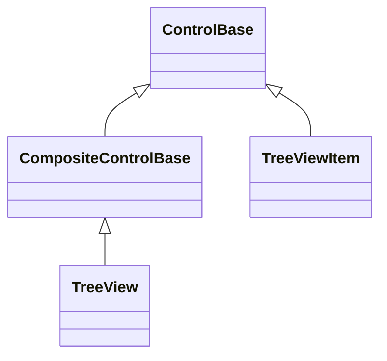
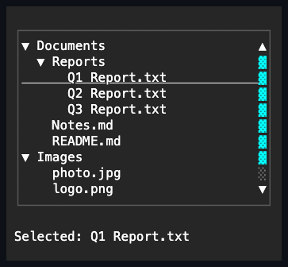

# TreeView

## Overview

`TreeView` displays hierarchical items with expandable nodes, keyboard
navigation, configurable single or multiple selection, and optional checkable
items.

Public offsets, extent, viewport, line increment, page overlap, and scroll
events use the shared retained-part bridge to the private item container. A
source-originated change is observable on TreeView without exposing its
presentation tree.

## Inheritance



## API

| Member                        | Type                                               | Default                                   | Description                                                                                                                             |
| ----------------------------- | -------------------------------------------------- | ----------------------------------------- | --------------------------------------------------------------------------------------------------------------------------------------- |
| `Items`                       | `TreeViewItemCollection`                           | Empty                                     | Typed owned root-item collection.                                                                                                       |
| `SelectedItem`                | `TreeViewItem?`                                    | `null`                                    | The first selected item in stable tree order. Assigning an item selects it through `SelectItem`; assigning `null` clears the selection. |
| `SelectedItems`               | `IReadOnlyList<TreeViewItem>`                      | Empty                                     | Read-only immutable snapshot in stable tree order.                                                                                      |
| `SelectionMode`               | `TreeSelectionMode`                                | `Single`                                  | Allows no, one, or multiple selected items; rejects an undefined value.                                                                 |
| `CheckMark`                   | `CheckMark?`                                       | `null`                                    | Shared check-mark layout and glyphs for items that do not override it.                                                                  |
| `ActualCheckMark`             | `CheckMark`                                        | `Brackets`, resolved                      | Read-only; the mark items render when they do not locally override it.                                                                  |
| `Indent`                      | `int`                                              | `2`                                       | Non-negative cells per visible depth level; rejects a negative value and saturates derived geometry.                                    |
| `Style`                       | `TreeViewStyle?`                                   | `null`                                    | Complete local presentation, or null for theme ownership.                                                                               |
| `ActualStyle`                 | `TreeViewStyle`                                    | Resolved                                  | Read-only; the complete local, theme-owned, or code-owned presentation.                                                                 |
| `LoadingText`                 | `string`                                           | `"Loading…"`                              | Inline status text an unloaded item's synthetic row shows while its children load.                                                      |
| `LoadFailedText`              | `string`                                           | `"Failed to load. Press Enter to retry."` | Inline status text a failed item's synthetic row shows alongside its retry affordance.                                                  |
| `MaxConcurrentChildLoads`     | `int`                                              | `4`                                       | Maximum child-loading requests running at once across every item; additional requests queue.                                            |
| `ScrollBarStyle`              | `ScrollBarStyle?`                                  | `null`                                    | Local generated-bar style; null leaves it to the theme.                                                                                 |
| `ActualScrollBarStyle`        | `ScrollBarStyle`                                   | Resolved                                  | Read-only resolved generated-bar style.                                                                                                 |
| `Extent`                      | `Size`                                             | Layout-dependent                          | Read-only committed content extent of the generated scroll container.                                                                   |
| `Viewport`                    | `Size`                                             | Layout-dependent                          | Read-only committed visible extent of the generated scroll container.                                                                   |
| `HorizontalOffset`            | `int`                                              | `0`                                       | Valid horizontal content offset; rejects a value outside the current extent.                                                            |
| `VerticalOffset`              | `int`                                              | `0`                                       | Valid vertical content offset; rejects a value outside the current extent.                                                              |
| `LineSize`                    | `int`                                              | `1`                                       | Non-negative wheel-scroll increment forwarded to the generated scroll container.                                                        |
| `PageOverlap`                 | `int`                                              | `0`                                       | Non-negative cells of context retained between page commands.                                                                           |
| `ScrollBy(x, y, cause)`       | `bool`                                             | —                                         | Scrolls the generated scroll container by signed cell deltas with saturation and endpoint clamping.                                     |
| `BringItemIntoView(item)`     | `bool`                                             | —                                         | Scrolls minimally to expose one owned item.                                                                                             |
| `SelectItem(item)`            | `void`                                             | —                                         | Selects an item owned by this tree, replacing the current selection.                                                                    |
| `SetSelected(item, selected)` | `bool`                                             | —                                         | Adds or removes one owned item from the selection without replacing the rest.                                                           |
| `SelectAll()`                 | `void`                                             | —                                         | Selects every enabled item; requires `Multiple` selection mode.                                                                         |
| `ClearSelection()`            | `void`                                             | —                                         | Clears the current selection.                                                                                                           |
| `ExpandAll()`                 | `void`                                             | —                                         | Expands every item in the tree.                                                                                                         |
| `CollapseAll()`               | `void`                                             | —                                         | Collapses every item in the tree.                                                                                                       |
| `BeginUpdate()`               | `void`                                             | —                                         | Begins a batch of structural changes, deferring the flat-list rebuild until the matching `EndUpdate`; calls may nest.                   |
| `EndUpdate()`                 | `void`                                             | —                                         | Ends a batch begun by `BeginUpdate`; rebuilds once, only when it closes the outermost pending batch.                                    |
| `SelectionChanging`           | `EventHandler<TreeViewSelectionChangingEventArgs>` | No subscribers                            | Raised before a caller- or input-driven selection change commits; cancellable.                                                          |
| `SelectionChanged`            | `EventHandler<TreeViewSelectionChangedEventArgs>`  | No subscribers                            | Raised after the selected item changes.                                                                                                 |
| `ItemInvoked`                 | `EventHandler<TreeViewItemInvokedEventArgs>`       | No subscribers                            | Raised after an item is activated by keyboard or pointer.                                                                               |
| `ScrollChanged`               | `EventHandler<ScrollChangedEventArgs>`             | No subscribers                            | Forwards the generated scroll container's committed offset changes.                                                                     |

`SelectionMode` defaults to `Single`. `Multiple` supports Control toggles, Shift
ranges over enabled visible items, `SelectAll`, `ClearSelection`, and Control+A.
`None` keeps navigation and invocation but commits no selection. Changing
`SelectionMode` publishes its own property notification before any selection it
normalizes, so a two-way observer sees the new configuration first.

`CheckMark` selects the mark layout and glyph family from the same `Brackets`,
`Tick`, and `Square` families a standalone
[`CheckBox`](../input/check-box.md#api) offers, and it defaults to `Brackets` so
both controls render an unconfigured mark identically. Precedence runs from the
local `TreeViewItem.CheckMark`, to the owning `TreeView.CheckMark`, to the
library default, and `ActualCheckMark` reports the resolved value. Only the
layout and glyphs are shared — a row paints itself from its own resolved style,
so no `CheckBox` appearance profile reaches the row.

`TreeViewStyle`, reached through `Style`/`ActualStyle`, extends `ContainerStyle`
with the loading and failed status foreground colors and one-cell glyphs the
synthetic status row draws, plus the one-cell disclosure glyphs drawn beside
collapsed and expanded items. Its defaults use the semantic `Muted` and `Error`
`SemanticColor` roles, so built-in and custom themes remain authoritative for
the colors those roles resolve to. TreeViewStyle declares no `styles.*` theme
key of its own: its `Face`/`Border`/`Shadow` fall back to `container`'s role
section, while `LoadingColor`/`FailedColor`/`LoadingGlyph`/`FailedGlyph`/
`CollapsedGlyph`/`ExpandedGlyph` stay code-owned - reachable only through a
locally assigned `Style`.

## Selection

Setting a `TreeViewItem`'s `Visibility` to `Collapsed` removes both its own row
and its entire subtree from realization, exactly as `IsExpanded = false` does.
`Hidden` keeps the item's own row in its blank slot but removes its descendants
from realization, matching the ancestor-inheritance contract applied everywhere
else in the control tree. Selection is retained for items made unreachable by
either state, the same as a collapsed branch; removing an item removes it from
the selection, and disabled items are never selected.

`SetSelected(TreeViewItem, bool)` adds or removes one item without replacing the
rest, which `SelectItem` cannot do. Selecting through it in `Single` mode
replaces the selection exactly as input does, and deselecting is always
permitted. Selecting a disabled item returns `false` and leaves the selection
unchanged, and selecting in `None` mode is rejected.

Selection follows the same transaction contract as
[`ListView`](list-view.md#behavior). `SelectionChanging` receives owned
immutable `AddedItems` and `RemovedItems` snapshots in stable tree order and may
cancel before the commit. `SelectionChanged` reports the same committed delta
after every selected view and visual state has updated, because `PreviousItem`
and `CurrentItem` describe only the first selected identity and cannot express a
range, a `SelectAll`, a removal repair, or a mode change. Reentrant changes
advance a transaction version so a stale outer proposal cannot overwrite them.
The `SelectedItem` and `SelectedItems` property notifications are also
transaction boundaries: an observer that commits a newer selection suppresses
the superseded transaction's remaining notifications and typed event. Mode
narrowing and structural rebuilds invalidate pending proposals, and a reentrant
change to `None` mode rejects any pending non-empty proposal.

Only caller- and input-driven changes are cancellable. Normalization the control
performs on its own behalf — narrowing `SelectionMode`, or repairing the
selection after items are detached or disabled — commits regardless, because
refusing it would leave the control in a state its own configuration forbids.

## Navigation

| Input                                         | Result                                                                                                                     |
| --------------------------------------------- | -------------------------------------------------------------------------------------------------------------------------- |
| Up / Down                                     | Moves to the previous or next item in linear depth-first order; does not wrap.                                             |
| Left                                          | Collapses an expanded item with children; otherwise selects and moves to its parent.                                       |
| Right                                         | Expands a collapsed item with children; otherwise selects and moves to its first visible child.                            |
| Home / End                                    | Selects the first or last visible item.                                                                                    |
| PageUp / PageDown                             | Moves by items filling the committed viewport height minus `PageOverlap`, accumulating each realized item's own height.    |
| Space                                         | Toggles check state or selection when only Control, Shift, or lock modifiers accompany it; larger chords remain unhandled. |
| Enter                                         | Activates the current item, applies selection, and raises `ItemInvoked` for an activation-eligible modifier state.         |
| Control+A (`Multiple` mode)                   | Selects every enabled item for the exact lock-normalized Control command; larger chords remain unhandled.                  |
| Primary pointer click on the disclosure glyph | Toggles `IsExpanded`.                                                                                                      |
| Primary pointer click on the check mark       | Toggles the check state; every cell of the mark is a hit target.                                                           |
| Primary pointer click elsewhere on the row    | Invokes and applies selection.                                                                                             |

The movement keys repeat while held; Space, Enter, and Control+A fire once per
key hold.

Each `TreeViewItem` preserves its inherited routed key and pointer events before
applying row activation. A handler that consumes the event suppresses the
built-in row action. Every `ItemInvoked` event reports one defined keyboard,
pointer, or programmatic activation cause. Item invocation and selection
callbacks may remove or dispose the candidate; keyboard and pointer activation
revalidate owner attachment and effective availability plus item ownership after
each callback, and never publish a tree-level invocation for an unavailable or
obsolete item.

Hierarchy depth is caller-controlled and has no fixed limit. Ownership
propagation, cycle detection, flattening, expand and collapse, item collection,
and check-state propagation all traverse iteratively, so a deep valid tree
cannot exhaust the process stack. Check-state snapshots are evaluated once per
mutation through a shared memo rather than once per affected item, which keeps a
single toggle linear in the nodes it touches instead of quadratic. A structural
change replaces the visible presentation as one validated snapshot instead of
clearing it and re-adding every item, and an unchanged flat list costs nothing.
Depth/indent multiplication and pointer coordinates saturate instead of
wrapping. Real and synthetic status rows materialize only the indentation cells
inside the current canvas clip, so an off-screen extreme indent cannot drive an
off-screen-sized allocation.

## TreeViewItem

`TreeViewItem : ControlBase` is one selectable, optionally expandable entry
owned by a `TreeView` or by another `TreeViewItem`'s `Children` collection.
Directly disposing an item removes it from that semantic collection before
disposal publishes and releases every descendant as a detached, reusable item;
no disposed entry remains reachable through `Items` or `Children`.

| Member                                   | Type                                               | Default              | Description                                                                              |
| ---------------------------------------- | -------------------------------------------------- | -------------------- | ---------------------------------------------------------------------------------------- |
| `TreeViewItem(header)`                   | —                                                  | —                    | Initializes an item with the given display text; rejects a null header.                  |
| `Header`                                 | `string`                                           | `""`                 | Non-null display text; rejects null and a value containing a terminal control character. |
| `IsExpanded`                             | `bool`                                             | `true`               | Whether child items are visible.                                                         |
| `Children`                               | `TreeViewItemCollection`                           | Empty                | Read-only; the child item collection.                                                    |
| `IsCheckable`                            | `bool`                                             | `false`              | Whether this item displays and responds to a check mark.                                 |
| `IsChecked`                              | `bool?`                                            | `false`              | Checked, unchecked, or indeterminate state; throws when the item is not checkable.       |
| `CheckGlyphs`                            | `CheckBoxGlyphs`                                   | Resolved             | Convenience projection over `ActualCheckMark`'s glyphs.                                  |
| `CheckMark`                              | `CheckMark?`                                       | `null`               | Local check-mark presentation; null defers to the owning tree, then the library default. |
| `ActualCheckMark`                        | `CheckMark`                                        | `Brackets`, resolved | Read-only; the mark this item renders.                                                   |
| `StartAffix`                             | `Affix?`                                           | `null`               | Optional leading decoration, inboard of the disclosure/check and outboard of the header. |
| `EndAffix`                               | `Affix?`                                           | `null`               | Optional trailing decoration, outboard of the header and inboard of the row's own edge.  |
| `IsSelected`                             | `bool`                                             | `false`              | Read-only; whether this item is the tree view's selected item.                           |
| `HasChildren`                            | `bool`                                             | `false`              | Read-only; whether this item has any children.                                           |
| `Depth`                                  | `int`                                              | `0`                  | Read-only to callers; the nesting depth set by the owning tree view.                     |
| `ChildSource`                            | `ITreeViewChildSource?`                            | `null`               | Source this item asks for its children the first time it expands.                        |
| `ChildState`                             | `TreeViewChildState`                               | `Leaf`               | Read-only; this item's position in the asynchronous child-loading lifecycle.             |
| `LastChildLoadError`                     | `Exception?`                                       | `null`               | Read-only; the exception from the most recently failed child request.                    |
| `ReloadChildrenAsync(cancellationToken)` | `Task`                                             | —                    | Requests this item's children from `ChildSource` again; legal from any `ChildState`.     |
| `Invoked`                                | `EventHandler<ActivationEventArgs>`                | No subscribers       | Raised after keyboard or pointer activation requests invocation.                         |
| `ExpandedChanged`                        | `EventHandler<ItemExpandedChangedEventArgs>`       | No subscribers       | Raised after `IsExpanded` changes.                                                       |
| `CheckStateChanged`                      | `EventHandler<CheckChangedEventArgs>`              | No subscribers       | Raised after this item or a descendant changes check state.                              |
| `ChildStateChanged`                      | `EventHandler<TreeViewChildStateChangedEventArgs>` | No subscribers       | Raised after `ChildState` changes.                                                       |

Setting `IsChecked` on a checkable parent propagates to its checkable
descendants, and a parent becomes indeterminate when its checkable children do
not agree. Check-state and checkability changes share one transaction version at
the hierarchy root. Adding, replacing, removing, clearing, or directly disposing
a child uses that same transaction and publishes every changed ancestor's
`IsChecked` property and `CheckStateChanged` event. Every affected callback is
revalidated against the shared version and current attachment, so a nested
change or removal cannot publish the remainder of an obsolete snapshot.
`CheckGlyphs` keeps the resolved mark layout while replacing only its glyphs, so
the two surfaces cannot disagree about which glyphs a row draws.

A checkable row reserves its indent, one disclosure cell, one gap, the mark, and
one leading space before the header, and its measured width matches those cells
exactly. `Brackets` therefore shifts headers two cells further right than a
one-cell family would.

`StartAffix` and `EndAffix` each reserve a fixed cell column pinned inboard of
the disclosure and check glyphs and outboard of the header: the row lays out as
indent, disclosure, check, start affix, gap, header, gap, end affix. Setting
either never moves the disclosure glyph or the check mark. Every row measures
and renders its own affixes against its own live bounds - a `TreeViewItem` is
not negotiated across siblings the way `Menu`'s shared shortcut column is, so
one row's affix never shifts another row's header. When the row is too narrow
for everything, the header shrinks first, then the end affix drops whole, then
the start affix - never a partial cluster - the same priority order
[`Button`](../input/button.md#api)'s affixes use.

## Asynchronous children

Assigning `ChildSource` instead of authoring `Children` directly makes an item
load its children the first time it expands, instead of requiring every
descendant to be authored up front. `ChildState` reports where one item stands
in that lifecycle:

| State        | Meaning                                                                                           |
| ------------ | ------------------------------------------------------------------------------------------------- |
| `Leaf`       | No `ChildSource` and no children; never offers to expand.                                         |
| `Loaded`     | `Children` reflects the most recently committed load, or was authored directly by the caller.     |
| `Unloaded`   | A `ChildSource` is assigned but no request has been made yet.                                     |
| `Loading`    | A child request is in flight; a synthetic status row shows `LoadingText`.                         |
| `LoadFailed` | The most recent request failed or was rejected by validation; a prior committed load is retained. |

Implement the interface and its two supporting types like this:

```csharp
public interface ITreeViewChildSource
{
    Task<IReadOnlyList<TreeViewChildDescription>> GetChildrenAsync(
        TreeViewChildContext context, CancellationToken cancellationToken);
}

public sealed class TreeViewChildContext
{
    public object? Key { get; }
    public string Header { get; }
}

public sealed class TreeViewChildDescription(object key, string header)
{
    public object Key { get; }
    public string Header { get; }
    public bool IsCheckable { get; init; }
    public bool? InitialCheckState { get; init; }
    public TreeViewChildPresence Presence { get; init; } = TreeViewChildPresence.MayHaveChildren;
}
```

`context.Key` is the stable key of the expanding item, or `null` for a
caller-authored root the source was assigned to directly; `context.Header` is
its display text. Each described child's `Presence` decides whether it can
expand further: the default `MayHaveChildren` makes the materialized child
inherit this same `ChildSource`, so it issues its own `GetChildrenAsync` request
the first time it expands, while `Leaf` leaves it with no `ChildSource` and it
never offers to expand. A source must opt in to `Leaf` explicitly — it is never
inferred from an empty answer.

```csharp
internal sealed class DocumentChildSource : ITreeViewChildSource
{
    public Task<IReadOnlyList<TreeViewChildDescription>> GetChildrenAsync(
        TreeViewChildContext context, CancellationToken cancellationToken)
    {
        IReadOnlyList<TreeViewChildDescription> children = context.Header switch
        {
            "Documents" =>
            [
                new TreeViewChildDescription("readme", "README.md") { Presence = TreeViewChildPresence.Leaf },
                new TreeViewChildDescription("notes", "Notes.txt") { Presence = TreeViewChildPresence.Leaf },
                new TreeViewChildDescription("archive", "Archive") // MayHaveChildren by default
            ],
            "Archive" => [],
            _ => []
        };

        return Task.FromResult(children);
    }
}

// var documents = new TreeViewItem("Documents") { ChildSource = new DocumentChildSource() };
```

Expanding an `Unloaded` item starts exactly one request; expanding an
already-`Loading` item is a no-op, and collapsing a `Loading` item cancels the
request and restores the state it had before the request started. An item that
starts life `IsExpanded` with `ChildSource` already assigned - the constructor
default - starts its request as soon as it reaches a running dispatcher, even
when that happens after construction. If an expansion or child-state callback
commits a newer expansion, source, or loading state, that newer transaction owns
all later flattening and request work; the superseded transaction cannot start a
request or reuse its disposed cancellation token. A throwing observer does not
skip the still-current structural or request work, and its first failure is
re-thrown only after those invariants are established. Deferred starts and
in-flight results require both the opaque operation lease and exact dispatcher
attachment that created them. A stale lease cannot retire its replacement.
Detaching cancels and restores a pending load; reattaching may begin a new load,
while callbacks from the previous attachment cannot mutate the item or consume
the new attachment's concurrency slot. Every child request is validated before
it commits: a null result or element, a duplicate key, a key that would create a
cycle with an ancestor, or a header containing a terminal control character is
rejected without mutating `Children` or `ChildState`, and the rejection surfaces
through `LastChildLoadError`. A stable key reused across a reload keeps the same
materialized `TreeViewItem` instance, so its `IsExpanded`, checked, and selected
state survive the reload. A successful load publishes final `ChildState`,
flattened realization, selection repair, and aggregate check state in that
order; callbacks never observe a newly loaded child outside the realized tree.

`ChildSource` reassignment - including to null - cancels a pending request and
evicts (detaches and disposes) any children the loader previously committed.

> [!WARNING]
>
> That eviction disposes real controls, and the source propagates to every
> `MayHaveChildren` descendant — one `ChildSource = null` on a populated branch
> disposes the entire loaded subtree. Any `TreeViewItem` references the
> application retained into that subtree become disposed objects.

A failed retry of a populated node leaves its stale-but-real children in place;
the failed status row and its retry affordance appear only once `Children` is
empty. `TreeView.LoadingText` and `LoadFailedText` configure the synthetic
status row's inline text; `MaxConcurrentChildLoads` bounds how many requests run
at once across the whole tree, queuing the rest. Raising the limit immediately
admits queued requests into the newly available slots; lowering it leaves
already-running requests intact and delays further admissions until usage falls
below the new limit. The status row itself is never a navigation, selection, or
check target - `Up`/`Down`/`Home`/`End` skip it, and `TreeView.ExpandAll` skips
an `Unloaded` branch rather than starting a remote load it never promised to
trigger. Clicking a failed row, or pressing Enter while it is the current item,
retries through `ReloadChildrenAsync`.

## Example



```csharp
var treeView = new TreeView();

var tree = new TreeView { SelectionMode = TreeSelectionMode.Multiple };
var source = new TreeViewItem("src") { IsCheckable = true };
source.Children.Add(new TreeViewItem("Program.cs") { IsCheckable = true });
tree.Items.Add(source);
```

## Expected behavior

| Scope       | Observable evidence                                                                                                                     |
| ----------- | --------------------------------------------------------------------------------------------------------------------------------------- |
| Public API  | Ownership, selection modes, validation, expansion, checking, event order, removal repair, and the asynchronous child-loading lifecycle. |
| Surface     | Exact indentation, glyphs, affixes, focus/current/selected/disabled states, clipping, scrolling, and the loading/failed status rows.    |
| Integration | Keyboard and pointer input through mounted routed input, including status-row retry.                                                    |

- A selected descendant stays selected while its branch is collapsed, and the
  selection keeps its stable tree order.
- Control toggles, Shift ranges, and Control+A behave as described under the
  shared
  [keyboard modifier policy](../../concepts/input-routing.md#keyboard-modifier-policy),
  and disabled items are always excluded from selection.
- Parent check state propagates to descendants, and indeterminate state is
  repaired after structural edits.
- A child request commits atomically: `ChildState` and the full committed
  `Children` set become observable together, never as a partial intermediate
  set, and selection or focus held on the loading item itself survives the
  commit.
- A stale completion - from a cancelled, superseded, or reassigned request - is
  always dropped; only the newest request's outcome is ever committed.
- Background load completion and admission-slot cleanup use the dispatcher's
  bounded fault bridge; a full queue gets one report attempt and never retries
  indefinitely.
- Reentrant expansion and loading callbacks leave structural realization and
  request ownership aligned with the newest committed state.
