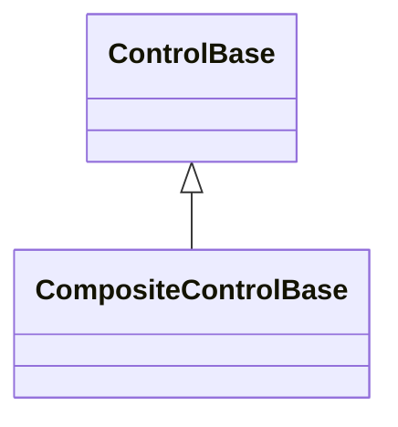

# CompositeControl base API

## Overview

`CompositeControlBase` is the abstract base for a reusable component built from
a retained private tree of existing controls. It derives directly from
[`ControlBase`](control.md#overview); it is not a `Container`, exposes no public
`Children` collection, and does not expose its implementation root as publicly
replaceable content.

A composite that needs an immutable complete typed style declares
[`IStyled<TStyle>`](../concepts/styling.md#overview) directly, the same contract
any other control uses - see [Appearance](../concepts/styling.md#overview) for
the full mechanism. `ColorPicker` and `JsonView` are the library's own
composites that do this.

Use `CompositeControlBase` when the component owns the identity and lifetime of
its implementation tree. Use [`ContentControl`](content-control.md#overview)
when callers own a replaceable semantic content value, and use
[`Container`](container.md#overview) only for a genuine layout control whose
arbitrary children are part of its public API.

## Inheritance



## API

| Member                                   | Type                     | Default | Description                                                                                                                                   |
| ---------------------------------------- | ------------------------ | ------- | --------------------------------------------------------------------------------------------------------------------------------------------- |
| `Content`                                | `ControlBase`            | —       | Protected, read-only; the currently committed private implementation root, for derived behavior to coordinate without exposing it to callers. |
| `InitializeContent(ControlBase content)` | `void`                   | —       | Protected; transfers one detached root into the permanent private composition slot, exactly once.                                             |
| `GetSelectableTextSnapshot()`            | `SelectableTextSnapshot` | —       | Override; projects the retained tree's semantic text and visible grapheme geometry as an owned control-local snapshot.                        |

A composite that declares `IStyled<TStyle>` also initializes its own primary
style slot through the inherited `ControlBase.InitializeStyle<TStyle>`, and
forwards `Style`/`ActualStyle` itself over the returned `StyleSlot<TStyle>`
field; these are not members `CompositeControlBase` supplies.

Callers configure the composite's public semantic properties plus the inherited
[`ControlBase` properties](control.md#api); they cannot replace its
implementation tree.

## Construction and ownership

A concrete constructor creates its complete retained subtree and transfers one
detached root through `InitializeContent(root)`. The protected method is
non-virtual and may commit exactly one root during the component's lifetime.
When the component needs multiple implementation children, a layout container
such as `Stack`, `Grid`, or `Dock` serves as that root.

`Screen` is the framework specialization. It commits the authored root through
the same permanent composition edge, then owns temporary application surfaces
through a separate private presentation slot. The protected initialization API
remains non-virtual.

The composition-root slot has capacity one, occupies the normal render layer,
participates in hit testing and focus navigation, and invalidates measure when
committed. The protected non-virtual `Content` getter returns the currently
committed root so derived behavior can coordinate its retained controls. Neither
member lets callers replace or remove the root.

`InitializeContent` rejects:

- null with `ArgumentNullException`;
- a disposed root with `ObjectDisposedException`;
- an attached, already-owned, or cyclic root with `ArgumentException`;
- a repeated call, including one after direct root disposal, with
  `InvalidOperationException`; and
- off-dispatcher access or reentrant ownership publication with
  `InvalidOperationException`.

A validation failure before the structural commit does not consume the
initialization, so a constructor may catch an invalid candidate and transfer a
valid root instead. Once the ownership edge commits, initialization is
permanent, even if a parent, lifecycle, or other ownership-publication callback
throws. During such a callback, `Content` already returns the committed root. A
callback failure never rolls back the edge or reopens initialization.

An uninitialized composite cannot attach as a root or enter another ownership
slot; this is validated before any dispatcher or parent context changes. The
framework never calls a virtual factory from the base constructor, never builds
lazily from layout, and never retries construction during rendering.

## Layout and traversal

The base measures the retained root once through `MeasureChild`. Visible and
hidden content contributes its desired border-box size plus margin using
saturating arithmetic. Collapsed content contributes neither size nor margin,
and the shared layout transaction clears its stale desired size and bounds.

Arrangement passes the component's complete content box through
`ArrangeChild(root, bounds, ResolvedAxes.Both)`. The child applies its own
margin inside that box. The component's border and padding remain owned by the
shared [box model](../concepts/layout.md#passes-and-rounding).

Rendering, normal and popup hit testing, focus navigation, routed ancestry,
theme and Unicode context, inherited availability, lifecycle, focus and capture
cleanup, and disposal all follow the registered composition-root edge. The base
adds no parallel traversal and no hidden public collection.

## Lifetime

Disposing the component disposes its retained root exactly once and continues
through the shared callback-failure rules. Disposing the root directly removes
the ownership edge, but that does not turn the component into a reusable shell:
`Content`, attachment, and layout then reject the missing permanent root, and a
second `InitializeContent` call is invalid.

## Example

```csharp
public sealed class StatusCard: CompositeControlBase
{
    private readonly Text _status;

    public StatusCard(string label, string status)
    {
        ArgumentNullException.ThrowIfNull(label);
        ArgumentNullException.ThrowIfNull(status);

        _status = new Text(status);
        var root = new Stack { Spacing = 1 };
        root.Children.Add(new Text(label));
        root.Children.Add(_status);
        InitializeContent(root);
    }

    public string Status
    {
        get => _status.Content;
        set => _status.Content = value;
    }
}
```

## Expected behavior

| Scope               | Observable evidence                                                       |
| ------------------- | ------------------------------------------------------------------------- |
| Public API          | Validation, defaults, state changes, and deterministic output.            |
| Integrated behavior | Cross-component behavior through the real ownership and routing boundary. |

- The public surface matches the documented reflection shape.
- Initialization succeeds once and rejects every invalid candidate; a pre-commit
  rejection leaves initialization available for recovery.
- A callback failure after the commit leaves the composition-root edge in place.
- `Content` before initialization is rejected, and direct-root and owner
  disposal behave as documented.
- Dispatcher and inherited context propagate to the root, and the first layout
  is cached.
- Collapsed content and margins produce the documented geometry.
- Rendering, normal and popup hit testing, and focus navigation follow the
  composition-root edge.
