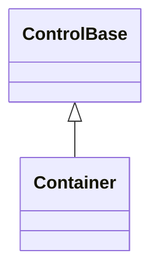

# Container base API

## Overview

`Container : ControlBase` is the abstract base for layout controls whose ordered
children are part of their public API. It exposes one caller-managed
[`Children`](#children-and-ownership) collection and supplies the shared
auto-size, scrolling, rendering, clipping, and pointer-target traversal
behavior. It is not the base for every control that owns descendants: use
[`ContentControl`](content-control.md#overview) when there is one replaceable
content value, and [`CompositeControlBase`](composite-control.md#overview) when
the control keeps a private retained implementation tree.

`Container` does not choose a layout algorithm. Every concrete subclass must
override `MeasureOverride` and `ArrangeOverride`; because both declarations are
abstract, an incomplete layout control fails to compile.

## Inheritance



## API

| Member                                                     | Type                                   | Default                      | Description                                                                                                                                        |
| ---------------------------------------------------------- | -------------------------------------- | ---------------------------- | -------------------------------------------------------------------------------------------------------------------------------------------------- |
| `Container(int capacity)`                                  | —                                      | —                            | Protected constructor; creates a child collection with a non-negative maximum count. Throws `ArgumentOutOfRangeException` for a negative capacity. |
| `Children`                                                 | `ControlCollection`                    | Empty, unbounded             | The mutable ordered caller-managed child collection.                                                                                               |
| `AutoSize`                                                 | `bool`                                 | `false`                      | Sizes the border box to content, overriding stretch and star sizing.                                                                               |
| `AutoSizeMode`                                             | `AutoSizeMode`                         | `AutoSizeMode.GrowAndShrink` | Selects whether an auto-sizing axis may shrink below its explicit fixed-cell size.                                                                 |
| `AutoScroll`                                               | `bool`                                 | `false`                      | Turns the container into a viewport that clips and offsets overflowing content.                                                                    |
| `ScrollBars`                                               | `ScrollBars`                           | `ScrollBars.Vertical`        | Selects the axes that may scroll within this container.                                                                                            |
| `ShowScrollBars`                                           | `ShowScrollBars`                       | `ShowScrollBars.WhenNeeded`  | Sets the common chrome-reservation policy for both scroll axes at once.                                                                            |
| `HorizontalBarVisibility`                                  | `ScrollBarVisibility`                  | `ScrollBarVisibility.Auto`   | Sets the horizontal bar's own reservation policy.                                                                                                  |
| `VerticalBarVisibility`                                    | `ScrollBarVisibility`                  | `ScrollBarVisibility.Auto`   | Sets the vertical bar's own reservation policy.                                                                                                    |
| `ScrollBarStyle`                                           | `ScrollBarStyle?`                      | `null`                       | The complete local style shared by both generated bars.                                                                                            |
| `ActualScrollBarStyle`                                     | `ScrollBarStyle`                       | Resolved                     | Read-only; the complete local or theme-resolved generated-bar style.                                                                               |
| `LineSize`                                                 | `int`                                  | `1`                          | Non-negative arrow and wheel change, in cells.                                                                                                     |
| `PageOverlap`                                              | `int`                                  | `0`                          | Non-negative cells retained between page commands.                                                                                                 |
| `Extent`                                                   | `Size`                                 | Empty                        | Read-only; the committed non-negative content extent.                                                                                              |
| `Viewport`                                                 | `Size`                                 | Empty                        | Read-only; the committed non-negative visible extent.                                                                                              |
| `HorizontalOffset`                                         | `int`                                  | `0`                          | The valid horizontal content offset.                                                                                                               |
| `VerticalOffset`                                           | `int`                                  | `0`                          | The valid vertical content offset.                                                                                                                 |
| `OnChildrenChanged()`                                      | `void`                                 | —                            | Protected virtual; runs after a `Children` mutation structurally commits.                                                                          |
| `MeasureOverride(Constraint constraint)`                   | `Size`                                 | —                            | Protected abstract; measures owned children and returns their intrinsic content size.                                                              |
| `ArrangeOverride(Rect bounds)`                             | `void`                                 | —                            | Protected abstract; assigns the final content-box slots of owned children.                                                                         |
| `ScrollBy(int x, int y, ScrollCause cause = Programmatic)` | `bool`                                 | —                            | Adds signed axis deltas with saturation and endpoint clamping.                                                                                     |
| `BringIntoView(ControlBase descendant)`                    | `bool`                                 | —                            | Scrolls minimally to expose one descendant, walking through any intervening armed container.                                                       |
| `ScrollChanged`                                            | `EventHandler<ScrollChangedEventArgs>` | —                            | Raised after one or both offsets commit.                                                                                                           |

Concrete controls normally use the unbounded parameterless constructor;
specialized presenters may impose a finite semantic limit through
`Container(int capacity)`.

## Children and ownership

`Children` is the public adapter over exactly one container-child ownership
slot. Add, insert, replacement, removal, clearing, and enumeration preserve a
stable order. Every mutation rejects null, disposed, attached, duplicate,
cross-parent, and cyclic candidates before it changes the existing tree, and
mutation while attached is dispatcher-affine. Removing a child detaches it
without disposing it; disposing the container disposes every child it still
owns.

Private scrollbar parts use a separate framework slot and never appear in
`Children`. Cross-cutting rendering, routed ancestry, inherited context,
lifecycle, focus, capture, and disposal all traverse the central ownership
registry described by the
[base ownership rules](control.md#children-and-ownership).

A derived container overrides `OnChildrenChanged` to observe a mutation of its
own `Children`, cache per-child metadata, or react to the change - the same
notification `ItemsControl` already consumes on its own private presentation
host. The hook runs after the mutation structurally commits and cannot reject a
candidate. Validation belongs at the point of insertion, because layout runs
asynchronously and cannot serve as a validation seam.

## Layout

`MeasureOverride` must measure each relevant child through `MeasureChild`, honor
collapsed visibility and margins, and return a non-negative intrinsic content
extent. `ArrangeOverride` must arrange each relevant child through
`ArrangeChild`; the supplied `ResolvedAxes` value records which dimensions the
parent algorithm has already fixed. Layout code must not add, remove, or replace
children during measure or arrange.

Use a shipped semantic panel when its algorithm matches the application:
[`Stack`](layout/stack.md#overview), [`Grid`](layout/grid.md#overview),
[`Dock`](layout/dock.md#overview), or [`Overlay`](layout/overlay.md#overview).
The shared [layout rules](../concepts/layout.md#overview) own constraints,
alignment, margins, sizing, and rounding.

## Auto-size and scrolling

`AutoSize` sizes the container border box from the measured content extent, and
`AutoSizeMode` selects grow-and-shrink or grow-only behavior. The exact rules
are defined by [grow and shrink](../concepts/layout.md#grow-and-shrink).

`AutoScroll` turns the container into a viewport over its own layout algorithm.
The inherited scroll properties select axes, offsets, bar reservation, chrome,
line and page changes, and interaction. Generated bars are private framework
parts. The [scrolling rules](../concepts/scrolling.md#overview) define feedback,
clipping, nested wheel propagation, and offset validation. `AutoScroll` and
`ShowScrollBars` apply their dependent bar state from the live value after
property observers return, so a reentrant observer's newer policy owns the
offset reset, generated parts, and both axis reservation values.

## Example

```csharp
public sealed class SharedSlot : Container
{
    protected override Size MeasureOverride(Constraint constraint)
    {
        var width = 0;
        var height = 0;

        foreach (var child in Children)
        {
            if (child.Visibility == Visibility.Collapsed)
            {
                continue;
            }

            var desired = MeasureChild(child, constraint);

            width = Math.Max(
                width,
                (int) Math.Min(int.MaxValue, (long) desired.Width + child.Margin.Horizontal));
            height = Math.Max(
                height,
                (int) Math.Min(int.MaxValue, (long) desired.Height + child.Margin.Vertical));
        }

        return new Size(width, height);
    }

    protected override void ArrangeOverride(Rect bounds)
    {
        foreach (var child in Children)
        {
            ArrangeChild(child, bounds);
        }
    }
}
```

## Expected behavior

| Scope               | Observable evidence                                                       |
| ------------------- | ------------------------------------------------------------------------- |
| Public API          | Validation, defaults, state changes, and deterministic output.            |
| Integrated behavior | Cross-component behavior through the real ownership and routing boundary. |

- The child collection enforces its capacity and rejects invalid ownership,
  attached mutation is dispatcher-affine, order stays stable, and mutations
  invalidate layout.
- The measure and arrange extension points hold concrete subclasses to
  implementing both layout passes.
- Rendering and pointer traversal, disposal, auto-size, scroll geometry,
  clipping, and nested wheel propagation all behave as documented.
- Generated scrollbar parts stay encapsulated and never appear in `Children`.
- Reentrant common scrolling-policy changes leave generated parts, offsets, and
  both axis policies consistent with the newest committed value.
