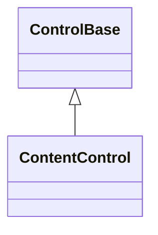

# ContentControl base API

## Overview

`ContentControl` is the abstract base for a control that owns zero or one
publicly replaceable `ControlBase`. It derives directly from
[`ControlBase`](control.md#overview). Its non-virtual `Content` property is
`null` by default; a derived class can observe committed changes through
`OnContentChanged(previous, current)` without replacing the ownership engine.

Use `ContentControl` when arbitrary callers may replace one semantic content
value. A component whose retained implementation tree is private uses
[`CompositeControlBase`](composite-control.md#overview) instead, and a
general-purpose panel whose callers add arbitrary children remains a
[`Container`](container.md#overview). Focusable single-face controls typically
compose one owned caption child through the owned-control engine instead of a
replaceable content edge — see
[`InputBase`'s caption capability](pressable.md#overview) for that narrower
surface, which exposes `Text`, not `Content`.

## Inheritance



## API

| Member                                                          | Type                     | Default | Description                                                                                                              |
| --------------------------------------------------------------- | ------------------------ | ------- | ------------------------------------------------------------------------------------------------------------------------ |
| `Content`                                                       | `ControlBase?`           | `null`  | Transfers ownership of zero or one detached `ControlBase`; replacement detaches the previous value without disposing it. |
| `OnContentChanged(ControlBase? previous, ControlBase? current)` | `void`                   | —       | Protected virtual; responds after the content ownership change is structurally committed.                                |
| `GetSelectableTextSnapshot()`                                   | `SelectableTextSnapshot` | —       | Override; returns the content's semantic text and visible grapheme geometry as an owned control-local snapshot.          |

All inherited layout, appearance, availability, and focus properties are defined
by [`ControlBase`](control.md#api).

## Ownership and mutation

The base constructor registers one capacity-one, normal-layer content slot
before a derived constructor can register private parts. The slot participates
in hit testing and focus navigation and has `InvalidationImpact.Measure`. It
uses the same [owned-control transaction](control.md#children-and-ownership) as
every other visual edge.

Assigning a detached control commits it as `Content`. Assigning `null` clears
the slot. Replacement detaches the previous control but does not dispose it;
ownership of the detached control returns to the caller. Assigning the same
instance again, or clearing an already-empty slot, is a no-op. Validation
rejects disposed, attached, already-owned, duplicate-slot, cross-parent, and
cyclic candidates before touching the old edge, inherited context, focus, or
pointer capture.

While the control is attached, every setter call is dispatcher-affine. The
dispatcher and lifetime checks run before equivalence is accepted, so
off-dispatcher replacement, clearing, and even assigning the identical value all
throw without mutating anything. Setting content can throw:

- `ArgumentException` when the candidate already belongs to a tree or would
  create a cycle;
- `InvalidOperationException` for off-dispatcher access or reentrant structural
  publication; or
- `ObjectDisposedException` when the owner or candidate is disposed.

## Change publication

After a successful structural commit and the parent, theme, detach, and attach
publication, the registry requests `Measure` invalidation once. The base then
snapshots the previous and current controls, updates its published content
state, calls `OnContentChanged(previous, current)`, and raises
`PropertyChanged(nameof(Content))` exactly once. Both callbacks observe the
complete new structure: the old content is detached, the current content has
this owner, and `Content` returns the current value. A property subscriber may
run layout at the unchanged viewport and immediately observe the current content
measured and arranged; that layout consumes the already-pending invalidation, so
no redundant pass follows the notification.

Equivalent and rejected operations call neither callback. Disposing the current
child directly removes it through its exact content slot, clears `Content`, and
publishes the same `(previous, null)` callback and property notification.

If `OnContentChanged` throws, the property notification is still attempted. The
hook failure wins over a later property-handler failure, but an earlier failure
from availability or structural publication remains the ownership transaction's
authoritative first exception. A callback failure never rolls back the
structural commit.

`OnContentChanged` and the property notification run while guarded structural
publication is still active. They may inspect and lay out the committed tree,
but any attempt to mutate an owned slot, replace or clear `Content`, or dispose
the owner or either affected content control throws `InvalidOperationException`.
The guard keeps a callback from turning one atomic publication into a nested
transaction.

## Layout and traversal

Visible or hidden content is measured once through `MeasureChild`. The reported
content size adds the child's horizontal and vertical margin using saturating
integer arithmetic. Arrangement passes the owner's complete content box to
`ArrangeChild(content, bounds, ResolvedAxes.Both)`; the child applies its margin
inside that slot, and both axes count as resolved by this parent.

Collapsed content contributes neither desired size nor margin and enters neither
child layout override. The base child transactions still clear its prior
`DesiredSize` and `Bounds`. The owner follows the shared
[border and padding box model](../concepts/layout.md#passes-and-rounding).

Rendering, normal and popup hit testing, routed ancestry, focus navigation,
theme and Unicode context, inherited availability, lifecycle, and popup
traversal all follow the registered content edge. `ContentControl` adds no
role-specific traversal override.

## Disposal

Disposing the current child directly clears `Content` and publishes one content
change. Disposing the owner disposes the currently assigned child exactly once.
Owner disposal runs to completion even when the content hook or a property
handler throws, then rethrows the first recorded callback failure from the fully
disposed tree. Content that was previously replaced or cleared remains
caller-owned and is never disposed by its former owner.

## Example

```csharp
public sealed class Card: ContentControl
{
    public Card(ControlBase content)
    {
        ArgumentNullException.ThrowIfNull(content);
        Content = content;
    }

    protected override void OnContentChanged(ControlBase? previous, ControlBase? current)
    {
        // The ownership transaction is already committed here.
    }
}
```

## Expected behavior

| Scope               | Observable evidence                                                       |
| ------------------- | ------------------------------------------------------------------------- |
| Public API          | Validation, defaults, state changes, and deterministic output.            |
| Integrated behavior | Cross-component behavior through the real ownership and routing boundary. |

- The full assignment matrix behaves as described: null, first assignment,
  equivalent assignment, replacement, and clearing, with every ownership
  rejection leaving the tree untouched.
- Dispatcher affinity is enforced even for equivalent assignments.
- Callback and property notifications arrive in the documented order, and
  callback failures never roll back the commit.
- Direct-child and owner disposal publish the documented change.
- Collapsed content, margin saturation, both-axis arrangement, rendering, hit
  testing, focus navigation, and popup traversal are all covered by tests.
