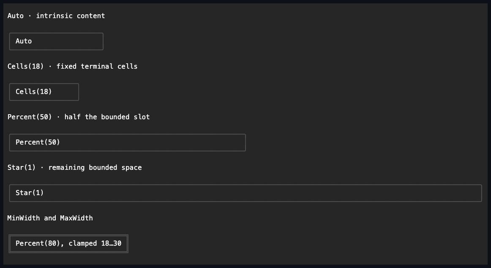

# Control base APIs

## Overview

`ControlBase` is the abstract base class for every mutable UI element. It owns
the tree, layout, input, appearance, invalidation, and lifecycle contract.
`Control<TStyle>` adds the framework-owned primary `Style`/`ActualStyle` slot
for controls with an immutable complete typed style. A control belongs to at
most one parent and, while attached, to exactly one
[`Dispatcher`](../concepts/threading.md#overview). You can assemble a detached
tree on any thread; once the tree is attached, all mutation and disposal must
run on that dispatcher.

## API

| Property                                                                    | Default                         | Description                                                                |
| --------------------------------------------------------------------------- | ------------------------------- | -------------------------------------------------------------------------- |
| `Width`, `Height`                                                           | `Length.Auto`                   | Fixed, percentage, automatic, or proportional `Length`.                    |
| `MinWidth`, `MinHeight`                                                     | `0`                             | Non-negative cell minimums.                                                |
| `MaxWidth`, `MaxHeight`                                                     | `int.MaxValue`                  | Cell maximums not below the corresponding minimum.                         |
| `Margin`                                                                    | Zero edges                      | External non-negative `Thickness`.                                         |
| `ActualBorder`                                                              | Resolved style                  | Read-only fully resolved current border; raw authoring is protected.       |
| `Padding`                                                                   | Zero edges                      | Internal non-negative `Thickness`.                                         |
| `HorizontalAlignment`, `VerticalAlignment`                                  | `Left`, `Stretch`               | Placement within the arranged slot.                                        |
| `Visibility`                                                                | `Visible`                       | Visible, hidden, or collapsed.                                             |
| `Enabled`                                                                   | `true`                          | Inherited effective input state.                                           |
| `HitTestVisible`                                                            | `true`                          | Whether pointer hit testing may target the control.                        |
| `Focusable`, `CanFocus`, `TabStop`, `TabIndex`                              | `false`, effective, `true`, `0` | Configured and effective focus/tab participation with deterministic order. |
| `UseMnemonic`                                                               | `true`                          | Enables ampersand access-key syntax for the control caption.               |
| `Focused`, `ContainsFocus`, `PointerOver`, `PointerDirectlyOver`, `Pressed` | `false`                         | Read-only committed interaction state.                                     |
| `DesiredSize`                                                               | Empty                           | Read-only result of the last successful measure.                           |
| `Bounds`                                                                    | Empty                           | Read-only committed arranged rectangle.                                    |

Every setter validates its value before changing anything, verifies dispatcher
access while the control is attached, and raises `PropertyChanged` once after
the new value is committed. Invalid lengths, negative constraints, min/max pairs
that contradict each other, invalid enum values, and access after disposal throw
the documented argument or object-lifetime exceptions. When a change hides,
collapses, or disables a control, focus and pointer-capture cleanup completes
before `PropertyChanged` is raised. If either callback path fails, cleanup and
property publication are still both attempted, and the earliest failure is
rethrown once the state and manager transitions are complete.

`EffectiveIsEnabled` and `EffectiveIsVisible` are computed across the whole
ancestor chain, and changing an inherited state invalidates the affected
descendants. `HitTestVisible` affects pointer targeting only; it does not
suppress drawing, visibility, enabled state, or explicit focus.

## Intrinsic appearance

Every `ControlBase` carries its own face, border, and shadow composites; there
are no border or shadow wrapper controls.

The shared [intrinsic-chrome rules](../concepts/intrinsic-chrome.md#overview)
define the border and shadow value members, rendering order, geometry, clipping,
and the evidence that verifies them. This page describes how the base control
exposes that behavior.

The public surface is:

| Property or method                           | Description                                                                    |
| -------------------------------------------- | ------------------------------------------------------------------------------ |
| `Face`, `ResetFace()`                        | Public complete local face authoring and Theme-ownership reset.                |
| `Border`, `Shadow`, their reset methods      | Protected derived-control chrome authoring.                                    |
| `SetAppearance(state, set)`                  | Protected derived-control partial state authoring.                             |
| `ActualFace`, `ActualBorder`, `ActualShadow` | Public read-only, fully composed current values with concrete terminal values. |
| `AppearanceBoundary`                         | Stops ambient face inheritance for descendants.                                |

The resolver applies semantic normal states, semantic active states, complete
local values, and local state sets, in that order, so a value you assign
directly survives a theme replacement. State sets can still vary any individual
member, including border sides, glyph style, colors, or shadow geometry. The
composition order itself is defined by the
[appearance rules](../concepts/styling.md#visual-states).

`Face` owns the foreground, background, terminal attributes, underline style,
and underline color. `Border` owns `BorderSide`, `BorderGlyphStyle`, foreground,
background, and terminal attributes. `Shadow` owns visibility, `ShadowMode`,
offset, glyph, foreground, background, and terminal attributes. Each has a
matching `*Set` record whose members are all optional, used for partial state
contributions.

All complete and partial values are validated before mutation. A transparent
background is valid because backgrounds compose; the glyph-painting foreground
and underline channels reject it. Border glyphs and block-shadow glyphs must be
printable one-cell runes. A partial border draws only its enabled edges, and a
corner appears only when both adjoining edges are enabled. Every enabled edge
reserves one cell before padding. A state change that alters border sides
invalidates measure; any other appearance change invalidates rendering.

The render pipeline draws the shadow, the body fill, content and normal-layer
children, and finally the border or a specialized frame overlay. Border cells
use the border's own background, so changing the face background on hover does
not change the border cells unless the state also supplies
`BorderOverlay.Background`.

`ShadowMode.Composite` restyles the translated destination cells, `BlockGlyph`
replaces them with the configured glyph, and `FractionalBlock` uses the
code-owned `▄`, `▀`, and `█` cells. X offsets are whole columns; fractional Y
offsets are half rows. The body is excluded from its own shadow. Shadow overflow
expands `VisualBounds` but does not reserve desired size, child space, scrolling
extent, or hit targets. If the translated bounds cannot be represented, the body
stays drawable and the unreachable shadow cells are clipped.

Button may translate its face while a composite or block shadow is pressed; the
fractional shadow is suppressed there because a complete face cannot move by
half a terminal row. Window and Popup keep their specialized titled or transient
frame rendering while still consuming their resolved composites.

Intrinsic appearance adds no ownership edge. When chrome needs its own bounds,
margin, ancestry, or lifetime, use an ordinary container instead. A custom
`OnRenderContent` draws through `ContentBounds`; the framework-owned chrome
already accounts for border and padding.

## Children and ownership

Every `ControlBase` owns one central registry of distinct, ordered visual slots.
`ControlBase.Parent` is therefore typed `ControlBase?`: having a parent does not
imply that the parent exposes a public child collection. Each slot records a
structural role, a render layer, hit-test and navigation participation, an
optional stable part key, and the invalidation impact of a committed mutation.

[`Container.Children`](container.md#children-and-ownership) is a
`ControlCollection`, the mutable public adapter over just the container-child
slot. Private scrollbar rails, item hosts, and other framework parts use
separate slots over the same registry and never appear in `Children`. Two slots
may share the same role; membership and capacity are determined by slot
identity, not role.

The role vocabulary is container child, content, header, composition root, item
visual, item host, and framework part. The foundation itself instantiates
container children, item hosts, and private framework parts. The public
[`ContentControl`](content-control.md#overview) instantiates the capacity-one
content role, `HeaderedContentControl` additionally instantiates the
capacity-one header role, and
[`CompositeControlBase`](composite-control.md#overview) instantiates the
permanent capacity-one composition-root role. A slot also selects the normal or
popup layer, hit-test and navigation participation, an optional stable part key,
and the earliest invalidation impact. These policies are independent: excluding
an edge from hit testing or navigation never excludes it from parentage,
inherited context, lifecycle, or disposal.

Cross-cutting traversal reads this registry directly rather than testing whether
the owner is a `Container`. Stable tree order is slot registration order, then
item order within each slot. Focus navigation visits only
navigation-participating edges in that order; ordinary rendering visits
normal-layer edges in that order; hit testing visits hit-participating edges in
reverse order. Popup-layer edges and popup descendants are promoted above every
ordinary sibling for both rendering and hit testing, and they never paint once
in the ordinary pass and again in the popup pass. A `Popup` surface promotes
itself even when a legacy owner still keeps it in an ordinary slot, but a
dedicated popup slot remains the preferred ownership metadata. Routed ancestry,
inherited state, style scopes, lifecycle, focus and capture cleanup, radio-group
discovery, and disposal follow every edge regardless of its interaction
metadata.

### Usage

Most application code adds and removes children through a container's public
collection, such as [`Container.Children`](container.md#children-and-ownership):

```csharp
container.Children.Add(control);
Debug.Assert(control.Parent == container);

container.Children.Remove(control);
Debug.Assert(control.Parent == null);

container.Children.Clear();
Debug.Assert(container.Children.Count == 0);
```

Adding a subtree below an attached owner attaches it recursively; removing it
detaches it recursively and clears its `Parent`. Disposing an owner disposes
every owned descendant, and repeated disposal is safe.

### Ordering and failure guarantees

`Add`, indexed insert and replacement, `Remove`, `Clear`, and complete-slot
replacement share the same commit discipline:

| Guarantee                 | Detail                                                                                                                                                                                                                                                                                                                  |
| ------------------------- | ----------------------------------------------------------------------------------------------------------------------------------------------------------------------------------------------------------------------------------------------------------------------------------------------------------------------- |
| Atomic validation         | The entire proposed change is validated before any ownership state changes. A control cannot have two parents, appear twice, be attached independently, or be inserted beneath one of its own descendants.                                                                                                              |
| Rollback on failure       | When a batch fails validation, the old order, parent links, inherited context, focus, and pointer capture are all preserved unchanged.                                                                                                                                                                                  |
| Reentrancy                | Tree mutation and disposal are rejected while any affected ownership transaction is still publishing.                                                                                                                                                                                                                   |
| Focus/capture propagation | When a root owns focus or capture managers, that ownership propagates through every registered slot. Removal, inherited disable or hide, and disposal release manager state synchronously before parent or dispatcher references are cleared.                                                                           |
| Disposal identity         | Disposing a child directly removes it through its exact owning slot with `ReleaseReason.Disposed`, publishes the slot change once, and never emits a second `Detached` notification. Owner disposal continues across all slots after a descendant callback failure and disposes each remaining descendant exactly once. |

Structural removal makes one deliberate exception to publication-after-commit.
Its order is:

1. While the old tree is still coherent, guarded availability cleanup releases
   focus and clears capture — running capture's cancellation hook first — then
   calls `OnUnavailable`. Those callbacks still observe the old parent and
   inherited context, even though the manager state is already clear.
2. For root-manager disposal, this cleanup may run before the transaction
   commits slot membership, parent links, dispatcher, Unicode policy, theme, and
   manager context, with no further callbacks in between.
3. Parent changes, theme changes, detach hooks, and attach hooks then publish
   from the complete new tree.
4. The transaction requests its slot invalidation impact exactly once, before
   the slot-changed notification, so a notification callback can consume current
   layout without leaving a redundant pass behind.

Callback failures are remembered while the remaining publication and cleanup
continue: a `finally` path still requests invalidation when an unexpected
earlier failure bypasses normal publication, and the first failure is rethrown
once the new tree is coherent. The structural publication guard spans
`OnDisposing`, the unavailable notification, the exact-slot unlink, and
descendant cleanup — a disposal callback cannot switch to ordinary collection
removal to publish `Detached`, and cannot bypass the exact slot.

## Invalidation API

The shared [invalidation rules](../concepts/invalidation.md#overview) own phase
dependencies, ancestor propagation, dispatcher scheduling, retries, and frame
coordination. `ControlBase` exposes the authoring seams that let derived
controls participate without exposing pending phase flags.

| Seam                                       | Use                                                             |
| ------------------------------------------ | --------------------------------------------------------------- |
| `SetProperty(ref field, value, impact)`    | Commit one ordinary CLR property and raise `PropertyChanged`.   |
| `NotifyPropertyChanged(name, impact)`      | Publish a coordinated mutation after all related fields commit. |
| `Invalidate(InvalidationImpact)`           | Request phase work without a property notification.             |
| `InvalidateVisualState()`                  | Clear resolved appearance caches after semantic state changes.  |
| `SetVisualStateProperty(ref field, value)` | Commit a property that changes `GetAppearanceState()`.          |

Each seam validates dispatcher access, lifetime, arguments, and the selected
impact before changing any observable state. Assigning an equivalent value is a
no-op. A real change commits the value and requests the phase work before
notifying observers, so callbacks see both the new value and its pending update.
Specialized visual-state changes compute their strongest impact from the active
style rather than assuming that every state transition is render-only.

## Access-key extension points

A derived captioned control overrides `AccessKeyText` to return the action,
header, label, or title string it already owns. `OnAccessKey(Rune)` runs only
after the application matches that caption and re-checks that the control is
currently available. The default implementation focuses this control, the first
eligible descendant of a scope, or the next tab stop for a label-like leaf.
Action controls override the method and reuse their ordinary keyboard state
machine. Returning `false` lets the next duplicate candidate handle the key.

`UseMnemonic` controls both marker rendering and discovery, and changing it
invalidates measure for the caption subtree. Rich or body `Text` changes its own
default to `false`; a `Text` used as a `PressableBase` caption inherits the
owner's effective setting. The full syntax, modifier, duplicate, modality, and
paired-text rules live in the shared
[access-key rules](../concepts/access-keys.md#overview).

## Lifecycle and events

Attachment commits the same dispatcher, Unicode policy, theme, and manager
context across the complete subtree before any lifecycle callback runs, so
`OnAttached()` always sees every sibling fully attached. During application
startup it additionally sees the installed focus and capture managers and may
request either service immediately. Detachment clears the whole subtree's
context before any `OnDetached()` callback, so every sibling is already
detached. Direct `Attach` and `Detach` calls accept only an unowned root; an
owned control changes lifecycle context exclusively through its registry edge,
so a child can never attach or detach independently of its parent.
`OnDisposing()` runs at most once, before owned state is released; if the hook
throws, base cleanup completes before the original exception is rethrown. These
hooks and `OnParentChanged(Control?, Control?)` always observe committed
ownership state. `OnUnavailable` is the guarded pre-commit exception described
under [children and ownership](#children-and-ownership): manager state is
already clear, while parent and inherited context still describe the coherent
old tree.

Focus and pointer capture are released synchronously when a control becomes
unavailable or leaves the owned tree. Derived controls request those behaviors
through the target-safe helpers documented in
[Input routing](../concepts/input-routing.md#pointer-capture-and-coordinates).

`AddHandler<TArgs>` registers a typed synchronous handler and returns an
idempotent removal token. Routed arguments expose `OriginalSource`, a
retargetable `Source`, the route `Phase`, and `Handled`. Preview and bubble
phases use stable ancestry and handler snapshots, even when a callback mutates
the tree. The standard [`Events`](../concepts/input-routing.md#routed-event-api)
cover key, text, pointer, paste, and terminal focus payloads.

## Layout extension points

A derived control implements `MeasureOverride(Constraint)` to report its
intrinsic content size and `ArrangeOverride(Rect)` to receive its committed
content box. The base class owns margin, border, padding, explicit and deferred
length resolution, min/max clamping, alignment, caching, collapse behavior,
dispatcher checks, and reentrancy guards. The physical order is margin → border
→ padding → content; combined measure insets saturate, and arrange deflation
saturates at zero. The extension points therefore deal only with content and
must not repeat box-model arithmetic.

A parent lays out only its direct children, through
`MeasureChild(child, constraint)` and `ArrangeChild(child, slot, resolvedAxes)`.
Both reject null and non-direct children before entering the child's internal
transaction. `ArrangeChild` also rejects undefined `ResolvedAxes` flags;
`Width`, `Height`, or `Both` means the parent has already resolved that
border-box dimension. Raw `Measure`, `Arrange`, `Render`, phase flags, and the
layout managers remain internal.

If an extension point changes a layout property, that invalidation stays pending
for a later transaction. If it throws, the active phase is marked dirty again
before the exception escapes.

Building a retained component out of existing controls, rather than a new
primitive, does not use these seams directly: derive from
[`CompositeControlBase`](composite-control.md#overview), construct the private
tree once, and transfer its root through `InitializeContent`. Derive from
[`Container`](container.md#overview) only when callers own an arbitrary public
child collection and the concrete type supplies both layout passes.

`OnRenderContent` receives a canvas clipped to the control's resolved
`VisualBounds`. Rendering carries two constraints down each normal-layer branch:
a hard canvas from the frame, an explicit clip, or a scroll viewport, and a soft
content aperture accumulated from ordinary arranged bounds. A control may expand
only its own soft aperture, and only where its `VisualBounds` exceed its
`Bounds`. That expansion follows arbitrary ordinary nesting without being shared
with a sibling, changing layout, or enlarging hit testing.

`Overlay.ClipToBounds = true`, the caller's canvas, and an armed container's
committed scroll viewport are hard boundaries that contain descendant shadows.
When `ClipToBounds` is false, Overlay keeps its inherited hard canvas and soft
ancestor aperture. A container whose protected `ClipsChildren` override returns
false gets the same soft-clip behavior. Such an owner also hit-tests eligible
ordinary children outside its own `Bounds`, while the owner itself remains a
target only inside that box. Popup-layer roots restart from the root frame
canvas during their elevated pass; an ordinary owner's clip neither truncates
them nor admits them into the normal pass.

## Appearance extension point

Controls expose validated CLR properties for face and layout configuration.
Specialized presentation is a nullable complete `Style` plus an always-present
`ActualStyle`. A null style uses the inherited immutable Theme; a local style
wins over a theme replacement. Raw border, shadow, and state authoring is
protected unless a chrome-host control intentionally republishes it.

Appearance is local and render-only. Derived controls may use the protected
`SetAppearance` for one `VisualState`. The resolver applies states in the fixed
order PointerOver, FocusWithin, Focused, Current, Selected, Checked,
Indeterminate, Pressed, then Disabled. Text-only ambient values can flow through
normal parentage; background, border, shadow, and visual states never cascade. A
caller may assign `FocusWithin` explicitly when a composite intentionally needs
descendant-focus emphasis.

Pointer membership and hover appearance are separate concerns. Every control in
the physical hit ancestry exposes `PointerOver`; the active theme and local
appearance overlays decide whether that state changes any channel.

`GetAppearanceState` derives the local flags from physical pointer membership,
focus, availability, and the control's explicit pressed, current, selection,
checked, or indeterminate facts. A derived control uses `SetVisualStateProperty`
when a CLR state property changes one of those facts. Pressed defaults to the
interaction state tracked by the framework's own gesture behaviors; a control
with its own press concept - continuous drag tracking rather than one-shot
activation, for example - overrides the protected `PressedState` seam directly,
the same pattern `CheckedState`, `SelectedState`, `CurrentState`, and
`IndeterminateState` already use for their own facts.

Intrinsic body, border, and shadow rendering is framework-owned. A custom
`OnRenderContent` implementation draws semantic content with `ResolvedStyle`; it
does not emit escape bytes or manually invoke a chrome helper.

## Example



```csharp
control.Width = Length.Cells(14);
control.Margin = new Thickness(horizontal: 1, vertical: 0);
control.Enabled = true;

using var registration = control.AddHandler(
    Events.Key,
    (_, args) => args.Handled = true);
```

## Expected behavior

Every concrete control is verified against the guarantees on this page: setters
validate before they mutate, changes request phase-specific invalidation,
attached access is dispatcher-affine, attach and detach follow the ownership
rules, visibility and enabled state inherit correctly, focus and pointer capture
are cleaned up when availability changes, zero and tiny bounds render safely,
and the final cells match the documented appearance.
