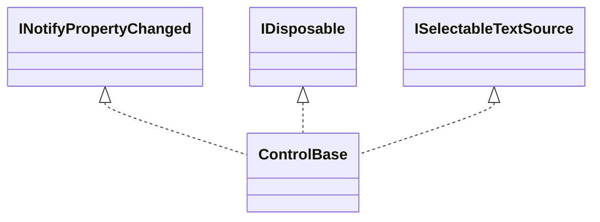

# Control base APIs

## Overview

`ControlBase` is the abstract base class for every mutable UI element. It owns
the tree, layout, input, appearance, invalidation, and lifecycle contract,
including the mechanics behind an immutable complete typed style: the protected
`InitializeStyle<TStyle>(definition, changed)` method. A control opts into a
typed style by declaring [`IStyled<TStyle>`](../concepts/styling.md#overview)
and forwarding `Style` and `ActualStyle` itself over a private
`StyleSlot<TStyle>` field returned by that call - see
[Appearance](../concepts/styling.md#overview) for the full mechanism. A control
belongs to at most one parent and, while attached, to exactly one
[`Dispatcher`](../concepts/threading.md#overview). You can assemble a detached
tree on any thread; once the tree is attached, all mutation and disposal must
run on that dispatcher.

## Inheritance



`ControlBase` has no generic style layer: a control derives from whichever base
fits its role (`ControlBase` directly, `Container`, `ContentControl`,
`CompositeControlBase`, `InputBase`, and so on) and separately declares
`IStyled<TStyle>` when it needs a typed style, regardless of where it sits in
this hierarchy. See the [control catalog](index.md#control-catalog) for the full
authoring-role diagram.

## API

| Member                                                                                                    | Type                                          | Default           | Description                                                                                                                                                                                                                                                                               |
| --------------------------------------------------------------------------------------------------------- | --------------------------------------------- | ----------------- | ----------------------------------------------------------------------------------------------------------------------------------------------------------------------------------------------------------------------------------------------------------------------------------------- |
| `InitializeStyle<TStyle>(StyleDefinition<TStyle>, Action<TStyle, TStyle>?)`                               | `StyleSlot<TStyle>`                           | —                 | Protected; initializes and returns the calling control's own primary style slot from the immutable style policy, with an optional changed-style callback. Throws `ArgumentNullException` for a null definition, and `InvalidOperationException` if a primary slot is already initialized. |
| `Name`                                                                                                    | `string?`                                     | `null`            | Optional debugging or accessibility identifier.                                                                                                                                                                                                                                           |
| `Tag`                                                                                                     | `object?`                                     | `null`            | Arbitrary user data associated with the control.                                                                                                                                                                                                                                          |
| `Theme`                                                                                                   | `Theme?`                                      | `null`            | Read-only; the immutable theme inherited from the owning application.                                                                                                                                                                                                                     |
| `Width`, `Height`                                                                                         | `Length`                                      | `Length.Auto`     | Fixed, percentage, automatic, or proportional `Length`.                                                                                                                                                                                                                                   |
| `MinWidth`, `MinHeight`                                                                                   | `Length`                                      | `Length.Cells(0)` | Cell or percentage border-box minimums.                                                                                                                                                                                                                                                   |
| `MaxWidth`, `MaxHeight`                                                                                   | `Length?`                                     | `null`            | Cell or percentage border-box maximums; null is unbounded.                                                                                                                                                                                                                                |
| `Margin`                                                                                                  | `Thickness`                                   | Zero edges        | External non-negative `Thickness`.                                                                                                                                                                                                                                                        |
| `ActualBorder`                                                                                            | `Border`                                      | Resolved style    | Read-only fully resolved current border; raw authoring is public but gated by `EnableChromeAuthoring()`.                                                                                                                                                                                  |
| `Padding`                                                                                                 | `Thickness`                                   | Zero edges        | Internal non-negative `Thickness`.                                                                                                                                                                                                                                                        |
| `HorizontalAlignment`                                                                                     | `HorizontalAlignment`                         | `Left`            | Horizontal placement within the arranged slot.                                                                                                                                                                                                                                            |
| `VerticalAlignment`                                                                                       | `VerticalAlignment`                           | `Stretch`         | Vertical placement within the arranged slot.                                                                                                                                                                                                                                              |
| `Visibility`                                                                                              | `Visibility`                                  | `Visible`         | Visible, hidden, or collapsed.                                                                                                                                                                                                                                                            |
| `IsEnabled`                                                                                               | `bool`                                        | `true`            | Inherited effective input state.                                                                                                                                                                                                                                                          |
| `IsHitTestVisible`                                                                                        | `bool`                                        | `true`            | Whether pointer hit testing may target the control.                                                                                                                                                                                                                                       |
| `IsFocusable`                                                                                             | `bool`                                        | `false`           | Whether the control is configured to accept keyboard focus.                                                                                                                                                                                                                               |
| `CanFocus`                                                                                                | `bool`                                        | Effective         | Read-only; whether the control can currently receive keyboard focus.                                                                                                                                                                                                                      |
| `IsTabStop`                                                                                               | `bool`                                        | `true`            | Whether this focusable control participates in Tab traversal.                                                                                                                                                                                                                             |
| `TabIndex`                                                                                                | `int`                                         | `0`               | The deterministic tab-order key.                                                                                                                                                                                                                                                          |
| `TabNavigation`                                                                                           | `TabNavigation`                               | `Continue`        | Controls how Tab traversal treats this control's subtree.                                                                                                                                                                                                                                 |
| `UseMnemonic`                                                                                             | `bool`                                        | `true`            | Enables ampersand access-key syntax for the control caption.                                                                                                                                                                                                                              |
| `IsFocused`                                                                                               | `bool`                                        | `false`           | Read-only; whether this control directly owns keyboard focus.                                                                                                                                                                                                                             |
| `ContainsFocus`                                                                                           | `bool`                                        | `false`           | Read-only; whether this control or a descendant owns keyboard focus.                                                                                                                                                                                                                      |
| `IsPointerOver`                                                                                           | `bool`                                        | `false`           | Read-only; whether the pointer is over this control or a descendant.                                                                                                                                                                                                                      |
| `IsPointerDirectlyOver`                                                                                   | `bool`                                        | `false`           | Read-only; whether the pointer directly targets this control.                                                                                                                                                                                                                             |
| `IsPressed`                                                                                               | `bool`                                        | `false`           | Read-only; whether a primary press is currently held on this control.                                                                                                                                                                                                                     |
| `HasPointerCapture`                                                                                       | `bool`                                        | `false`           | Read-only; whether this control is the current exclusive pointer-capture target.                                                                                                                                                                                                          |
| `ContextMenu`                                                                                             | `ContextMenu?`                                | `null`            | Optional context menu shown on a secondary pointer press. A menu's presentation control may belong to only one owner at a time; assigning an already-presented menu throws `ArgumentException`.                                                                                           |
| `IsTextSelectionEnabled`                                                                                  | `bool`                                        | `false`           | Enables inherited semantic text selection over this control and its retained descendants. Disabling clears the range and cancels an active drag.                                                                                                                                          |
| `TextSelection`                                                                                           | `Selection`                                   | Empty at `0`      | Read-only directional UTF-16 range over the current semantic text projection.                                                                                                                                                                                                             |
| `SelectedText`                                                                                            | `string`                                      | `""`              | Read-only owned copy of the selected semantic substring.                                                                                                                                                                                                                                  |
| `DesiredSize`                                                                                             | `Size`                                        | Empty             | Read-only result of the last successful measure.                                                                                                                                                                                                                                          |
| `Bounds`                                                                                                  | `Rect`                                        | Empty             | Read-only committed arranged rectangle.                                                                                                                                                                                                                                                   |
| `ContentBounds`                                                                                           | `Rect`                                        | Empty             | Read-only committed content area after border and padding deflation.                                                                                                                                                                                                                      |
| `LocalBounds`                                                                                             | `Rect`                                        | Empty             | Read-only committed bounds relative to the parent's content area.                                                                                                                                                                                                                         |
| `Focus()`                                                                                                 | `bool`                                        | —                 | Requests keyboard focus from the manager inherited by this control; returns true when focus is acquired or already owned, false when detached or ineligible.                                                                                                                              |
| `Invalidate()`                                                                                            | `void`                                        | —                 | Requests a render-level repaint of this control's output; the render-only counterpart to `Invalidate(InvalidationImpact)` for composition-based callers that have no other seam to ask for a repaint.                                                                                     |
| `GetSelectableTextSnapshot()`                                                                             | `SelectableTextSnapshot`                      | Empty             | Returns complete semantic text and currently visible complete-grapheme geometry in control-local cells.                                                                                                                                                                                   |
| `SetTextSelection(Selection selection)`                                                                   | `void`                                        | —                 | Replaces the enabled range after validating containment and both grapheme boundaries.                                                                                                                                                                                                     |
| `SelectAllText()`                                                                                         | `void`                                        | —                 | Selects the complete current semantic projection.                                                                                                                                                                                                                                         |
| `ClearTextSelection()`                                                                                    | `void`                                        | —                 | Collapses the enabled range at its directional caret.                                                                                                                                                                                                                                     |
| `CopySelectedText()`                                                                                      | `string`                                      | —                 | Purely returns an owned selected string and never emits terminal or clipboard state.                                                                                                                                                                                                      |
| `OnPointerOverChanged(bool isPointerOver, bool isPointerDirectlyOver)`                                    | `void`                                        | —                 | Protected; runs after both pointer-over facts commit and before `PointerEntered` or `PointerExited`.                                                                                                                                                                                      |
| `AddHandler<TArgs>(Event<TArgs> routedEvent, EventHandler<TArgs> handler, bool handledEventsToo = false)` | `IDisposable`                                 | —                 | Adds one typed routed-event handler to this control and returns an idempotent registration that removes it on disposal.                                                                                                                                                                   |
| `GotFocus`                                                                                                | `EventHandler`                                | —                 | Raised after this control gains direct keyboard focus.                                                                                                                                                                                                                                    |
| `LostFocus`                                                                                               | `EventHandler`                                | —                 | Raised after this control loses direct keyboard focus.                                                                                                                                                                                                                                    |
| `FocusEntered`                                                                                            | `EventHandler`                                | —                 | Raised after keyboard focus enters this control's subtree.                                                                                                                                                                                                                                |
| `FocusLeft`                                                                                               | `EventHandler`                                | —                 | Raised after keyboard focus leaves this control's subtree.                                                                                                                                                                                                                                |
| `PointerEntered`                                                                                          | `EventHandler`                                | —                 | Raised after the physical pointer enters this control's subtree.                                                                                                                                                                                                                          |
| `PointerExited`                                                                                           | `EventHandler`                                | —                 | Raised after the physical pointer exits this control's subtree.                                                                                                                                                                                                                           |
| `LostPointerCapture`                                                                                      | `EventHandler<PointerCaptureLostEventArgs>`   | —                 | Raised after this control loses exclusive pointer capture.                                                                                                                                                                                                                                |
| `ParentChanged`                                                                                           | `EventHandler`                                | —                 | Raised after this control's direct ownership changes.                                                                                                                                                                                                                                     |
| `BoundsChanged`                                                                                           | `EventHandler`                                | —                 | Raised after the committed border box changes during arrange.                                                                                                                                                                                                                             |
| `EnabledChanged`                                                                                          | `EventHandler`                                | —                 | Raised after the `IsEnabled` property changes.                                                                                                                                                                                                                                            |
| `VisibilityChanged`                                                                                       | `EventHandler`                                | —                 | Raised after the `Visibility` property changes.                                                                                                                                                                                                                                           |
| `TextSelectionChanged`                                                                                    | `EventHandler<TextSelectionChangedEventArgs>` | —                 | Raised synchronously after a different directional text range commits.                                                                                                                                                                                                                    |

`GotFocus`, `LostFocus`, `FocusEntered`, and `FocusLeft` follow the transaction
order and traversal rules the [focus manager](../concepts/focus.md#overview)
defines; see that page for cancellation, initial-target resolution, and Tab
traversal detail.

`Style` and `ActualStyle` are not inherited members: a control that needs a
typed style declares `IStyled<TStyle>` itself and forwards both properties over
the `StyleSlot<TStyle>` field `InitializeStyle` returns. There is no protected
virtual style-changed hook to override; a control that needs one passes a
private method as `InitializeStyle`'s `changed` argument instead. See
[Appearance](../concepts/styling.md#overview) for the complete contract.

Every setter validates its value before changing anything, verifies dispatcher
access while the control is attached, and raises `PropertyChanged` once after
the new value is committed. Limits accept `Length.Cells` and `Length.Percent`,
while `Auto` and `Star` are rejected. Same-kind min/max pairs are ordered at
assignment; if unlike kinds cross only after resolving against the current
containing extent, the minimum wins. Invalid lengths, contradictory comparable
pairs, invalid enum values, and access after disposal throw the documented
argument or object-lifetime exceptions. When a change hides, collapses, or
disables a control, focus and pointer-capture cleanup completes before
`PropertyChanged` is raised. If either callback path fails, cleanup and property
publication are still both attempted, and the earliest failure is rethrown once
the state and manager transitions are complete. If cleanup or an unavailability
callback commits a newer `Visibility` or `IsEnabled` transition, that newer
transition owns the event stream; the superseded outer setter does not publish
duplicate property-specific or derived-focus notifications.

When a control follows `PropertyChanged` with a property-specific typed event,
synchronous reentry uses the same ownership rule: a callback that commits a
newer value supersedes the older transaction. The older setter does not publish
a typed payload that disagrees with the live property, even when the value
changes away and back before the callback returns.

`EffectiveIsEnabled` and `EffectiveIsVisible` are computed across the whole
ancestor chain, and changing an inherited state invalidates the affected
descendants. When either authored ancestor state or an ownership edge changes,
each affected control raises `PropertyChanged` exactly once for every derived
value that actually changed: `EffectiveIsEnabled`, `EffectiveIsVisible`,
`CanFocus`, and `CanTabStop`. A locally disabled or collapsed descendant stays
silent when its corresponding effective value was already false.
`IsHitTestVisible` affects pointer targeting only; it does not suppress drawing,
visibility, enabled state, or explicit focus.

## Semantic text selection

Every control inherits the opt-in
[semantic selection](../concepts/text-selection.md#overview) owner. The default
projection walks semantic retained children in ownership order, concatenates
visible leaf text, translates complete grapheme rectangles into owner-local
cells, and keeps clipped text in the semantic stream without inventing hit
geometry. Framework chrome and generated parts participate only when their
owning role explicitly exposes them through the selectable-child seam.

A primary press immediately collapses the range at the pressed caret without
stealing the child's click. Moving one cell with the primary button held crosses
the shared drag threshold, transfers capture to the resolved enabled selection
owner, and extends across child boundaries. Ctrl+A selects all; Left/Right moves
by grapheme or by word with Ctrl; Up/Down preserves a visual column; Home/End
uses the current visual row; and Page Up/Page Down uses visible height and page
overlap. Shift extends any navigation command from the established anchor.
Selection is painted as a final subtree adornment with `SelectedText` on
`SelectedControl`, so borders and non-semantic chrome remain untouched.

Replacing a contributing source, even with equal text, changes projection
identity and clears a stale range once. Reflow and clipping that preserve the
ordered sources and text preserve the range. Nested enabled owners normally
arbitrate by proximity to the routed original source. An authoritative aggregate
projection owns descendant drags when its range must cross child boundaries,
while stationary presses remain ordinary child clicks.

Selection notifications are transition-ordered under synchronous reentry. If a
state hook, component-specific selection event, or earlier
`TextSelectionChanged` subscriber commits a newer range, the superseded outer
transition stops publishing immediately. Later common-event subscribers
therefore receive only the newest committed range and never an event payload
that disagrees with live selection state.

Focus loss, pointer-capture loss, disable, hide, detach, and disposal cancel an
active selection gesture in non-virtual framework notifier steps. Those steps
clear the semantic anchor and source identities, retire auto-scroll, and release
selection capture before the corresponding `OnFocusChanged`,
`OnLostPointerCapture`, or `OnUnavailable` component hook runs. An override may
omit the base call or throw: framework cleanup still completes, later callbacks
still run, and the earliest failure is rethrown afterward.

Application Ctrl+C walks from focus toward the active route boundary, preferring
the nearest enabled text-selection owner before another `IClipboardCopySource`.
The chosen copy method runs exactly once; an empty result remains authoritative.
`ControlBase` never exposes cut, replacement, or other text mutation because
those remain editor-specific operations.

## Intrinsic appearance

Every `ControlBase` carries its own face, border, and shadow composites; there
are no border or shadow wrapper controls.

The shared [intrinsic-chrome rules](../concepts/intrinsic-chrome.md#overview)
define the border and shadow value members, rendering order, geometry, clipping,
and the evidence that verifies them. This page describes how the base control
exposes that behavior.

The public and protected chrome surface is:

| Member                                                     | Type     | Default  | Description                                                                                                            |
| ---------------------------------------------------------- | -------- | -------- | ---------------------------------------------------------------------------------------------------------------------- |
| `Face`                                                     | `Face`   | Resolved | Public complete local face authoring.                                                                                  |
| `ResetFace()`                                              | `void`   | —        | Public; returns the local face to Theme ownership.                                                                     |
| `Border`                                                   | `Border` | Resolved | Public derived-control chrome authoring; throws `InvalidOperationException` until `EnableChromeAuthoring()` is called. |
| `ResetBorder()`                                            | `void`   | —        | Public; returns the local border to Theme ownership. Throws until chrome authoring is enabled.                         |
| `Shadow`                                                   | `Shadow` | Resolved | Public derived-control chrome authoring; throws `InvalidOperationException` until `EnableChromeAuthoring()` is called. |
| `ResetShadow()`                                            | `void`   | —        | Public; returns the local shadow to Theme ownership. Throws until chrome authoring is enabled.                         |
| `SetAppearance(VisualState state, AppearanceOverlay? set)` | `void`   | —        | Protected derived-control partial state authoring.                                                                     |
| `ActualFace`                                               | `Face`   | Resolved | Public read-only, fully composed current face.                                                                         |
| `ActualBorder`                                             | `Border` | Resolved | Public read-only, fully composed current border.                                                                       |
| `ActualShadow`                                             | `Shadow` | Resolved | Public read-only, fully composed current shadow.                                                                       |
| `IsAppearanceBoundary`                                     | `bool`   | `false`  | Stops ambient face inheritance for descendants.                                                                        |

The resolver applies semantic normal states, semantic active states, complete
local values, and local state sets, in that order, so a value you assign
directly survives a theme replacement. State sets can still vary any individual
member, including border sides, glyph style, colors, or shadow geometry. The
composition order itself is defined by the
[appearance rules](../concepts/styling.md#visual-states).

`Face` owns the foreground, background, terminal attributes, underline style,
and underline color. `Border` owns `BorderSide`, `BorderGlyphStyle`, foreground,
background, and terminal attributes. `Shadow` owns visibility, `ShadowMode`,
offset, glyph, foreground, background, and terminal attributes. Each has a
matching `*Set` record whose members are all optional, used for partial state
contributions.

All complete and partial values are validated before mutation. A transparent
background is valid because backgrounds compose; the glyph-painting foreground
and underline channels reject it. Border glyphs and block-shadow glyphs must be
printable one-cell runes. A partial border draws only its enabled edges, and a
corner appears only when both adjoining edges are enabled. Every enabled edge
reserves one cell before padding. A state change that alters border sides
invalidates measure; any other appearance change invalidates rendering.

The render pipeline draws the shadow, the body fill, content and normal-layer
children, and finally the border or a specialized frame overlay. Border cells
use the border's own background, so changing the face background on hover does
not change the border cells unless the state also supplies
`BorderOverlay.Background`.

`ShadowMode.Composite` restyles the translated destination cells, `BlockGlyph`
replaces them with the configured glyph, and `FractionalBlock` uses the
code-owned `▄`, `▀`, and `█` cells. X offsets are whole columns; fractional Y
offsets are half rows. The body is excluded from its own shadow. Shadow overflow
expands `VisualBounds` but does not reserve desired size, child space, scrolling
extent, or hit targets. If the translated bounds cannot be represented, the body
stays drawable and the unreachable shadow cells are clipped.

Button may translate its face while a composite or block shadow is pressed; the
fractional shadow is suppressed there because a complete face cannot move by
half a terminal row. Window and Popup keep their specialized titled or transient
frame rendering while still consuming their resolved composites.

Intrinsic appearance adds no ownership edge. When chrome needs its own bounds,
margin, ancestry, or lifetime, use an ordinary container instead. A custom
`OnRenderContent` draws through `ContentBounds`; the framework-owned chrome
already accounts for border and padding.

## Children and ownership

Every `ControlBase` owns one central registry of distinct, ordered visual slots.
`ControlBase.Parent` is therefore typed `ControlBase?`: having a parent does not
imply that the parent exposes a public child collection. Each slot records a
structural role, a render layer, hit-test and navigation participation, an
optional stable part key, and the invalidation impact of a committed mutation.

[`Container.Children`](container.md#children-and-ownership) is a
`ControlCollection`, the mutable public adapter over just the container-child
slot. Private scrollbar rails, item hosts, and other framework parts use
separate slots over the same registry and never appear in `Children`. Two slots
may share the same role; membership and capacity are determined by slot
identity, not role.

The role vocabulary is container child, content, header, composition root, item
visual, item host, and framework part. The foundation itself instantiates
container children, item hosts, and private framework parts. The public
[`ContentControl`](content-control.md#overview) instantiates the capacity-one
content role, `HeaderedContentControl` additionally instantiates the
capacity-one header role, and
[`CompositeControlBase`](composite-control.md#overview) instantiates the
permanent capacity-one composition-root role. A slot also selects the normal or
popup layer, hit-test and navigation participation, an optional stable part key,
and the earliest invalidation impact. These policies are independent: excluding
an edge from hit testing or navigation never excludes it from parentage,
inherited context, lifecycle, or disposal.

Cross-cutting traversal reads this registry directly rather than testing whether
the owner is a `Container`. Stable tree order is slot registration order, then
item order within each slot. Focus navigation visits only
navigation-participating edges in that order; ordinary rendering visits
normal-layer edges in that order; hit testing visits hit-participating edges in
reverse order. Popup-layer edges and popup descendants are promoted above every
ordinary sibling for both rendering and hit testing, and they never paint once
in the ordinary pass and again in the popup pass. A `Popup` surface promotes
itself even when a legacy owner still keeps it in an ordinary slot, but a
dedicated popup slot remains the preferred ownership metadata. Routed ancestry,
inherited state, style scopes, lifecycle, focus and capture cleanup, radio-group
discovery, and disposal follow every edge regardless of its interaction
metadata.

### Usage

Most application code adds and removes children through a container's public
collection, such as [`Container.Children`](container.md#children-and-ownership):

```csharp
container.Children.Add(control);
Debug.Assert(control.Parent == container);

container.Children.Remove(control);
Debug.Assert(control.Parent == null);

container.Children.Clear();
Debug.Assert(container.Children.Count == 0);
```

Adding a subtree below an attached owner attaches it recursively; removing it
detaches it recursively and clears its `Parent`. Disposing an owner disposes
every owned descendant, and repeated disposal is safe.

### Ordering and failure guarantees

`Add`, indexed insert and replacement, `Remove`, `Clear`, and complete-slot
replacement share the same commit discipline:

| Guarantee                 | Detail                                                                                                                                                                                                                                                                                                                  |
| ------------------------- | ----------------------------------------------------------------------------------------------------------------------------------------------------------------------------------------------------------------------------------------------------------------------------------------------------------------------- |
| Atomic validation         | The entire proposed change is validated before any ownership state changes. A control cannot have two parents, appear twice, be attached independently, or be inserted beneath one of its own descendants.                                                                                                              |
| Rollback on failure       | When a batch fails validation, the old order, parent links, inherited context, focus, and pointer capture are all preserved unchanged.                                                                                                                                                                                  |
| Reentrancy                | Tree mutation and disposal are rejected while any affected ownership transaction is still publishing.                                                                                                                                                                                                                   |
| Focus/capture propagation | When a root owns focus or capture managers, that ownership propagates through every registered slot. Removal, inherited disable or hide, and disposal release manager state synchronously before parent or dispatcher references are cleared.                                                                           |
| Disposal identity         | Disposing a child directly removes it through its exact owning slot with `ReleaseReason.Disposed`, publishes the slot change once, and never emits a second `Detached` notification. Owner disposal continues across all slots after a descendant callback failure and disposes each remaining descendant exactly once. |
| Binding cleanup           | Binding disposal attempts every nested source, collection, target, and registry cleanup after an accessor failure; owner disposal continues with later bindings and descendants while retaining the first stack-preserved failure.                                                                                      |

Structural removal makes one deliberate exception to publication-after-commit.
For caller-initiated disposal, two preliminary steps run first: the owning
slot's observer is notified so it can repair semantic state, then the control's
own direct-disposal hook runs — and when either reentrantly completes the
disposal, `Dispose()` returns without entering a second publication transaction.
Owner-driven teardown skips both. The transaction order is then:

1. While the old tree is still coherent, guarded availability cleanup releases
   focus and clears capture — running capture's cancellation hook first — then
   calls `OnUnavailable`. Those callbacks still observe the old parent and
   inherited context, even though the manager state is already clear.
2. For root-manager disposal, this cleanup may run before the transaction
   commits slot membership, parent links, dispatcher, Unicode policy, theme, and
   manager context, with no further callbacks in between.
3. Parent changes publish from the complete new tree, followed by exactly the
   derived availability/focus property changes caused by the new ancestry. Theme
   changes, detach hooks, and attach hooks follow. Overlapping changed roots are
   captured once, so a descendant is never notified twice.
4. The transaction requests its slot invalidation impact exactly once, before
   publishing an immutable committed change for each affected slot. That change
   carries copied previous/current orders, added/removed identities, stable
   old/new indices, the normalized operation, and `ReleaseReason`; it never
   exposes the registry's mutable storage. A callback can therefore repair
   semantic state from exact facts without leaving a redundant layout pass.

Callback failures are remembered while the remaining publication and cleanup
continue: a `finally` path still requests invalidation when an unexpected
earlier failure bypasses normal publication, and the first failure is rethrown
once the new tree is coherent. The structural publication guard spans
`OnDisposing`, the unavailable notification, the exact-slot unlink, and
descendant cleanup — a disposal callback cannot switch to ordinary collection
removal to publish `Detached`, and cannot bypass the exact slot.

A retained owner that temporarily controls a child's live property uses one
ownership-generation lease. The lease captures the caller-authored value,
attributes owner writes explicitly, and intercepts later caller requests through
one shared property boundary. While imposed, a caller request updates only the
authored value; ordinary detachment restores the latest request after the
structural commit, while direct or owner disposal retires it without
restoration. Reownership installs a newer generation before callbacks can let an
old lease write over the new owner's presentation.

## Invalidation API

The shared [invalidation rules](../concepts/invalidation.md#overview) own phase
dependencies, ancestor propagation, dispatcher scheduling, retries, and frame
coordination. `ControlBase` exposes the authoring seams that let derived
controls participate without exposing pending phase flags.

| Seam                                                                            | Use                                                                                              |
| ------------------------------------------------------------------------------- | ------------------------------------------------------------------------------------------------ |
| `SetProperty(ref field, value, impact)`                                         | Commit one ordinary CLR property and raise `PropertyChanged`.                                    |
| Private-protected `SetPropertyAndSynchronize(ref field, value, impact, action)` | Synchronize retained state before publishing the still-current property generation.              |
| Private-protected `SetPropertyAndContinue(ref field, value, impact, action)`    | Preserve notification order, then complete dependent work before rethrowing an observer failure. |
| Private-protected `SetVersionedProperty(ref field, value, ref version, ...)`    | Commit a value whose typed event fires only while that commit is still the newest generation.    |
| Private-protected `IsVersionedPropertyCurrent(field, value, version, observed)` | Test whether a captured commit still owns its property generation before raising a typed event.  |
| `NotifyPropertyChanged(name, impact)`                                           | Publish a coordinated mutation after all related fields commit.                                  |
| `Invalidate(InvalidationImpact)`                                                | Request phase work without a property notification.                                              |
| `InvalidateRetainedDescendant(descendant, impact)`                              | Request phase work on a still-retained private projection through its owner.                     |
| `InvalidateVisualState()`                                                       | Clear resolved appearance caches after semantic state changes.                                   |
| `SetVisualStateProperty(ref field, value)`                                      | Commit a property that changes `GetAppearanceState()`.                                           |

Each seam validates dispatcher access, lifetime, arguments, and the selected
impact before changing any observable state. Assigning an equivalent value is a
no-op. A real change commits the value and requests the phase work before
notifying observers, so callbacks see both the new value and its pending update.
Properties with dependent retained state continue that repair after a throwing
observer and only then rethrow the first callback failure, so the committed
public value cannot outlive its invariant repair. Specialized visual-state
changes compute their strongest impact from the active style rather than
assuming that every state transition is render-only.

A property whose retained projection must already agree when observers run uses
`SetPropertyAndSynchronize`. The dependent synchronization completes before
`PropertyChanged`; if either synchronization or notification reenters the same
property, the newest generation owns both the retained state and publication. An
older generation does not resume with a captured value, including an
away-and-back change that restores an equal value. Synchronization and
publication are both attempted when either callback throws, and the earliest
failure is rethrown after the public value and retained projection agree.

## Access-key extension points

A derived captioned control overrides `AccessKeyText` to return the action,
header, label, or title string it already owns. `OnAccessKey(Rune)` runs only
after the application matches that caption and re-checks that the control is
currently available. The default implementation focuses this control, the first
eligible descendant of a scope, or the next tab stop for a label-like leaf.
Action controls override the method and reuse their ordinary keyboard state
machine. Returning `false` lets the next duplicate candidate handle the key.

`UseMnemonic` controls both marker rendering and discovery, and changing it
invalidates measure for the caption subtree. Rich or body `Text` changes its own
default to `false`; a `Text` used as an `InputBase` caption (via
`EnableCaption`) inherits the owner's effective setting. The full syntax,
modifier, duplicate, modality, and paired-text rules live in the shared
[access-key rules](../concepts/access-keys.md#overview).

## Lifecycle and events

Attachment commits the same dispatcher, Unicode policy, theme, and manager
context across the complete subtree before any lifecycle callback runs, so
`OnAttached()` always sees every sibling fully attached. During application
startup it additionally sees the installed focus and capture managers and may
request either service immediately. Detachment clears the whole subtree's
context before any `OnDetached()` callback, so every sibling is already
detached. Direct `Attach` and `Detach` calls accept only an unowned root; an
owned control changes lifecycle context exclusively through its registry edge,
so a child can never attach or detach independently of its parent.
`OnDisposing()` runs at most once, before owned state is released; if the hook
throws, base cleanup completes before the original exception is rethrown. These
hooks and `OnParentChanged(Control?, Control?)` always observe committed
ownership state. `OnUnavailable` is the guarded pre-commit exception described
under [children and ownership](#children-and-ownership): manager state is
already clear, while parent and inherited context still describe the coherent
old tree. `OnFocusChanged`, `OnLostPointerCapture`, and `OnUnavailable` are
component-policy hooks, not framework-cleanup extension points: their
non-virtual callers settle mandatory selection and manager state first, and
their base implementations are invariant assertions only.

Focus and pointer capture are released synchronously when a control becomes
unavailable or leaves the owned tree. Derived controls request those behaviors
through the target-safe helpers documented in
[Input routing](../concepts/input-routing.md#pointer-capture-and-coordinates).

`AddHandler<TArgs>` registers a typed synchronous handler and returns an
idempotent removal token. Routed arguments expose `OriginalSource`, a
retargetable `Source`, the route `Phase`, and `IsHandled`. Preview and bubble
phases use stable ancestry and handler snapshots, even when a callback mutates
the tree. The standard [`Events`](../concepts/input-routing.md#routed-event-api)
cover key, text, pointer, paste, and terminal focus payloads.

The inherited `KeyDown`, `KeyUp`, `PointerPressed`, `PointerReleased`, and
`PointerMoved` convenience events publish from the sealed default-dispatch seam
before `OnEvent`. `PointerPressed` publishes only for a primary-button press.
Setting `IsHandled` from one of these convenience events suppresses the concrete
control default, and an `OnEvent` override cannot omit the inherited event by
skipping `base.OnEvent`.

## Layout extension points

A derived control implements `MeasureOverride(Constraint)` to report its
intrinsic content size and `ArrangeOverride(Rect)` to receive its committed
content box. The base class owns margin, border, padding, explicit and deferred
length resolution, min/max clamping, alignment, caching, collapse behavior,
dispatcher checks, and reentrancy guards. The physical order is margin → border
→ padding → content; combined measure insets saturate, and arrange deflation
saturates at zero. The extension points therefore deal only with content and
must not repeat box-model arithmetic.

A parent lays out only its direct children, through
`MeasureChild(child, constraint)` and `ArrangeChild(child, slot, resolvedAxes)`.
Both reject null and non-direct children before entering the child's internal
transaction. `ArrangeChild` also rejects undefined `ResolvedAxes` flags;
`Width`, `Height`, or `Both` means the parent has already resolved that
border-box dimension. Raw `Measure`, `Arrange`, `Render`, phase flags, and the
layout managers remain internal.

If an extension point changes a layout property, that invalidation stays pending
for a later transaction. If it throws, the active phase is marked dirty again
before the exception escapes.

Building a retained component out of existing controls, rather than a new
primitive, does not use these seams directly: derive from
[`CompositeControlBase`](composite-control.md#overview), construct the private
tree once, and transfer its root through `InitializeContent`. Derive from
[`Container`](container.md#overview) only when callers own an arbitrary public
child collection and the concrete type supplies both layout passes.

`OnRenderContent` receives a canvas clipped to the control's resolved
`VisualBounds`. Rendering carries two constraints down each normal-layer branch:
a hard canvas from the frame, an explicit clip, or a scroll viewport, and a soft
content aperture accumulated from ordinary arranged bounds. A control may expand
only its own soft aperture, and only where its `VisualBounds` exceed its
`Bounds`. That expansion follows arbitrary ordinary nesting without being shared
with a sibling, changing layout, or enlarging hit testing.

`Overlay.ClipToBounds = true`, the caller's canvas, and an armed container's
committed scroll viewport are hard boundaries that contain descendant shadows.
When `ClipToBounds` is false, Overlay keeps its inherited hard canvas and soft
ancestor aperture. A container whose protected `ClipsChildren` override returns
false gets the same soft-clip behavior. Such an owner also hit-tests eligible
ordinary children outside its own `Bounds`, while the owner itself remains a
target only inside that box. Popup-layer roots restart from the root frame
canvas during their elevated pass; an ordinary owner's clip neither truncates
them nor admits them into the normal pass.

## Appearance extension point

Controls expose validated CLR properties for face and layout configuration.
Specialized presentation is a nullable complete `Style` plus an always-present
`ActualStyle`. A null style uses the inherited immutable Theme; a local style
wins over a theme replacement. Raw state authoring (`SetAppearance`) is
protected. Raw border and shadow authoring are public on every control but throw
`InvalidOperationException` until a chrome-host control calls the protected
`EnableChromeAuthoring()`, typically once from its constructor.

Appearance is local and render-only. Derived controls may use the protected
`SetAppearance` for one `VisualState`. The resolver applies states in the fixed
order IsPointerOver, FocusWithin, Focused, Current, Selected, Checked,
Indeterminate, Pressed, then Disabled.

> [!NOTE]
>
> `VisualState.IsPointerOver` is the enum's one Is-prefixed member — every
> sibling is bare (`Focused`, `Pressed`, …) — and it is distinct from the
> `bool ControlBase.IsPointerOver` property that feeds it; theme JSON spells the
> same state `pointerOver`. All three spellings are correct in their own layer.
> Text-only ambient values can flow through normal parentage; background,
> border, shadow, and visual states never cascade. A caller may assign
> `FocusWithin` explicitly when a composite intentionally needs descendant-focus
> emphasis.

Pointer membership and hover appearance are separate concerns. Every control in
the physical hit ancestry exposes `IsPointerOver`; the active theme and local
appearance overlays decide whether that state changes any channel. Bundled
themes keep the passive `ControlStyle` visually stable for pointer, focus,
press, and selection states; an interactive control opts into `InputStyle` or a
specialized style, while an explicit custom `control` state remains available to
theme authors who intentionally want a shared cue.

`OnPointerOverChanged` lets a derived control reconcile finer local hover state
with the manager-owned transition. It runs after `IsPointerOver` and
`IsPointerDirectlyOver` commit and their property notifications publish, but
before `PointerEntered` or `PointerExited`. Callback failures do not skip the
current public event. Reentrant pointer reconciliation owns all later work, even
when it changes the values away and back; the superseded transition publishes no
stale hook continuation or entry/exit event.

`GetAppearanceState` derives the local flags from physical pointer membership,
focus, availability, and the control's explicit pressed, current, selection,
checked, or indeterminate facts. `ControlBase` stores those committed local
interaction facts directly; focus and pointer managers remain the authorities
that decide their transitions. A derived control uses `SetVisualStateProperty`
when a CLR state property changes one of those facts. IsPressed defaults to the
interaction state tracked by the framework's own gesture behaviors; a control
with its own press concept - continuous drag tracking rather than one-shot
activation, for example - overrides the protected `IsPressedState` seam
directly, the same pattern `IsCheckedState`, `IsSelectedState`,
`IsCurrentState`, and `IsIndeterminateState` already use for their own facts.

Intrinsic body, border, and shadow rendering is framework-owned. A custom
`OnRenderContent` implementation draws semantic content with `ResolvedStyle`; it
does not emit escape bytes or manually invoke a chrome helper.

## Example


```csharp
control.Width = Length.Cells(14);
control.Margin = new Thickness(horizontal: 1, vertical: 0);
control.IsEnabled = true;
control.IsTextSelectionEnabled = true;

using var registration = control.AddHandler(
    Events.Key,
    (_, args) => args.IsHandled = true);
```

## Expected behavior

| Scope               | Observable evidence                                                       |
| ------------------- | ------------------------------------------------------------------------- |
| Public API          | Validation, defaults, state changes, and deterministic output.            |
| Integrated behavior | Cross-component behavior through the real ownership and routing boundary. |

- Every concrete control's setters validate before they mutate.
- Changes request phase-specific invalidation, and attached access is
  dispatcher-affine.
- Attach and detach follow the ownership rules, and visibility and enabled state
  inherit correctly.
- Focus and pointer capture are cleaned up when availability changes.
- Zero and tiny bounds render safely, and the final cells match the documented
  appearance.
