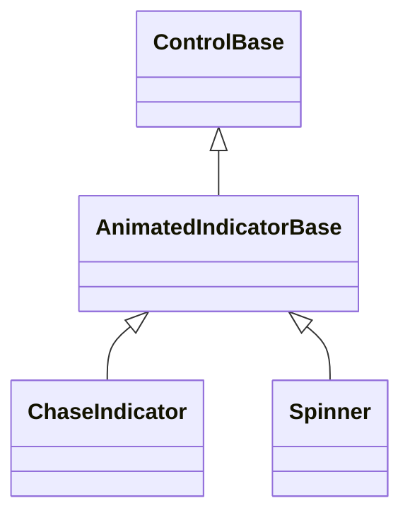

# AnimatedIndicatorBase

## Overview

`AnimatedIndicatorBase` is the authoring base for passive display indicators
whose visual frame advances on the dispatcher clock. It owns timer attachment,
play/pause state, cadence validation, effective-visibility suspension, pointer
exclusion, and content-box rendering so concrete indicators implement only their
frame state and drawing.

## Inheritance



## API

| Member                                              | Type       | Default                          | Description                                                                                            |
| --------------------------------------------------- | ---------- | -------------------------------- | ------------------------------------------------------------------------------------------------------ |
| `Interval`                                          | `TimeSpan` | `TimeSpan.FromMilliseconds(200)` | Semantic cadence; rejects unsupported dispatcher-timer intervals.                                      |
| `IsPlaying`                                         | `bool`     | `true`                           | Starts or pauses attached playback while retaining the current frame.                                  |
| `OnAnimationTick()`                                 | `void`     | —                                | Abstract; advances one semantic frame on the owning dispatcher.                                        |
| `OnRenderFrame(TerminalCanvas canvas, Rect bounds)` | `void`     | —                                | Abstract; draws the current frame inside the non-empty, enforced content clip.                         |
| `OnIntervalChanged()`                               | `void`     | —                                | Synchronizes derived timing after a cadence change; schedules `Interval` by default.                   |
| `ShouldSynchronizeIntervalBeforePublication()`      | `bool`     | —                                | Returns `true` by default; a derived compatibility contract may choose publish-then-synchronize order. |
| `OnPlaybackStarting()`                              | `void`     | —                                | Synchronizes derived clock state immediately before playback starts; no-op by default.                 |
| `ScheduleAnimation(TimeSpan interval)`              | `void`     | —                                | Schedules an intermediate callback without changing `Interval`.                                        |

The base installs a sealed content-rendering step. It resumes a visibility-
suspended timer, skips an empty content box, and passes `ContentBounds` to
`OnRenderFrame` through an enforced content clip; border and padding cells are
therefore never lent to a derived indicator. `ScheduleAnimation` exists for
indicators such as [`ChaseIndicator`](chase-indicator.md#overview), whose fading
trail needs visual refreshes between semantic movement intervals.

By default, an `Interval` change synchronizes derived timer state before
`PropertyChanged` publishes the new cadence. A derived indicator with an
established publish-then-synchronize observer contract may return `false` from
`ShouldSynchronizeIntervalBeforePublication`; its mandatory synchronization
still runs when a property observer throws.

## Keyboard

| Key | Behavior                                                      |
| --- | ------------------------------------------------------------- |
| —   | Animated indicators are passive and own no keyboard commands. |

## Example

```csharp
AnimatedIndicatorBase indicator = new Spinner
{
    Interval = TimeSpan.FromMilliseconds(100),
    IsPlaying = true,
};
```

## Expected behavior

| Scope               | Observable evidence                                                        |
| ------------------- | -------------------------------------------------------------------------- |
| Public API          | Validation, defaults, dispatcher affinity, and coherent state publication. |
| Integrated behavior | Timer lifecycle, visibility suspension, content-box rendering, and output. |

- Playback starts and stops with attachment and `IsPlaying`; a paused frame is
  retained and resumes after one complete scheduled interval.
- Unsupported timer intervals are rejected before state changes. Derived timing
  synchronization normally completes before observers see a changed property; an
  explicitly opted-in publish-first contract still completes mandatory
  synchronization after an observer failure.
- Effective invisibility suspends callbacks without discarding derived frame
  state; rendering restarts the attached timer when visibility returns.
- The base stays outside focus and pointer hit testing, and derived frames draw
  only within the content box left by intrinsic border and padding.
