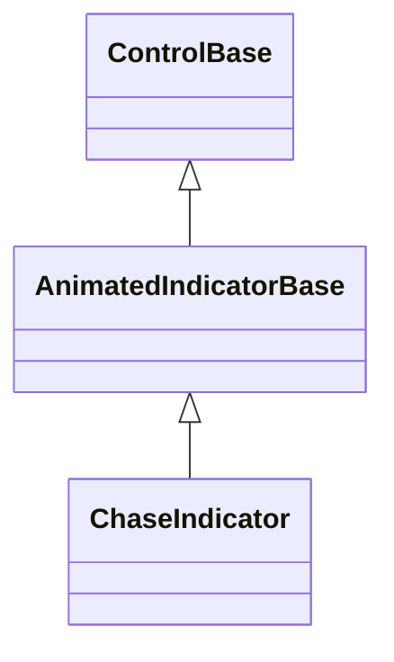
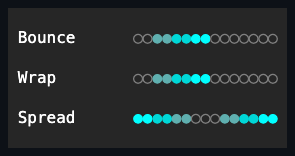

# ChaseIndicator

## Overview

`ChaseIndicator` animates one or two highlighted glyphs along a bounded
horizontal or vertical track, leaving a fading trail behind the head. It is a
pure display control: it owns no children and derives timer, play/pause,
visibility, and passive-input behavior from
[`AnimatedIndicatorBase`](animated-indicator-base.md#overview).

## Inheritance



## API

| Member         | Type                   | Default                          | Description                                                             |
| -------------- | ---------------------- | -------------------------------- | ----------------------------------------------------------------------- |
| `Movement`     | `ChaseMovement`        | `ChaseMovement.Bounce`           | Selects the bounce, wrapping, or center-spread position sequence.       |
| `Length`       | `int`                  | `5`                              | Track positions; rejects fewer than two or a spaced extent overflow.    |
| `Orientation`  | `Orientation`          | `Orientation.Horizontal`         | Draws the track horizontally or vertically.                             |
| `Spacing`      | `int`                  | `0`                              | Blank cells between adjacent positions; rejects a negative value.       |
| `TrailLength`  | `int`                  | `2`                              | Preceding frames shown as a fading trail; accepts zero through 4096.    |
| `FadeDuration` | `TimeSpan`             | `TimeSpan.FromMilliseconds(400)` | Duration for one abandoned head frame to reach the trail color.         |
| `Style`        | `ChaseIndicatorStyle?` | `null`                           | Optional complete developer-authored presentation.                      |
| `ActualStyle`  | `ChaseIndicatorStyle`  | Resolved                         | Read-only; the complete local, theme-owned, or code-owned presentation. |

`Interval` and `IsPlaying` follow the shared
[`AnimatedIndicatorBase` playback contract](animated-indicator-base.md#api).

Changing the effective glyph pair resets the animation phase, and so does
changing `Movement` or `Length`. Spacing, trail, timing, and color changes
preserve the current phase, and an appearance-only Theme change repaints without
losing it. The trail history never grows beyond
`min(TrailLength, Length - 1, 4096)` entries; larger authored trail lengths are
rejected before publication, so allocation and public state remain atomic.
`TrailLength`, `FadeDuration`, and `Interval` reconfigure retained trail storage
or timer scheduling after publication even when a `PropertyChanged` observer
throws; the observer failure is rethrown only after the committed timing state
is coherent.

Track positions begin at the origin of `ContentBounds`; intrinsic border and
padding reserve cells around both orientations instead of covering track
positions. `Interval` is the semantic movement cadence, while the base timer may
schedule intermediate callbacks to render a smooth fading trail.

## Keyboard

| Key | Behavior                                                |
| --- | ------------------------------------------------------- |
| —   | This control has no control-specific keyboard commands. |

## Presets and glyphs

`ChaseIndicatorStyle`, reached through `Style`/`ActualStyle`, owns the per-part
presentation on top of the inherited `Face`/`Border`/`Shadow`:

| Member                                  | Type                   | Description                                                      |
| --------------------------------------- | ---------------------- | ---------------------------------------------------------------- |
| `HeadColor`, `TrailColor`, `TrackColor` | `ControlColor`         | The required, non-transparent foreground for each rendered part. |
| `Glyphs`                                | `ChaseIndicatorGlyphs` | The validated one-cell `Active` and `Inactive` position glyphs.  |

Seven code-owned presets supply complete glyph pairs:

| Preset               | Active | Inactive |
| -------------------- | ------ | -------- |
| `Circle` (`Default`) | `●`    | `◯`      |
| `Diamond`            | `◆`    | `◇`      |
| `Square`             | `■`    | `□`      |
| `Up`                 | `▲`    | `△`      |
| `Down`               | `▼`    | `▽`      |
| `Left`               | `◀`    | `◁`      |
| `Right`              | `▶`    | `▷`      |

Each color accepts either a concrete `Color` or a `SemanticColor` role and
defaults to `Accent`, `Muted`, and `Muted` respectively when not overridden. A
`with` expression creates a validated member-wise copy of any preset. Without a
local `Style`, the resolved `Glyphs` come from the active theme's `glyphs`
family field (see [themes.md](../../concepts/themes.md#glyph-families)) rather
than a fixed code-owned pair. ChaseIndicator declares no `styles.*` theme key of
its own: it falls back to `control`'s role section for its inherited
`Face`/`Border`/`Shadow`, and its three colors stay code-owned, themeable only
through a local `Style`. Assigning `Style` replaces the entire Theme-owned
presentation, and assigning `null` restores it. If the active cell-width policy
is wide and a configured glyph becomes ambiguous, the control falls back to a
role-appropriate one-cell ASCII head and a `.` track glyph.

## Example



```csharp
var indicator = new ChaseIndicator
{
    Movement = ChaseMovement.Spread,
    Style = ChaseIndicatorStyle.Diamond with { HeadColor = Color.Rgb(90, 247, 142) },
    Length = 21,
    TrailLength = 5
};
```

## Expected behavior

| Scope      | Observable evidence                                            |
| ---------- | -------------------------------------------------------------- |
| Public API | Validation, defaults, state changes, and deterministic output. |

- Every movement sequence advances as described, and style values are validated
  and resolved with the documented local-over-Theme precedence; replacing the
  Theme takes effect immediately.
- The animation phase resets exactly when the glyph pair, movement, or length
  changes and survives appearance-only changes; trail history stays within its
  bound and fades by RGB interpolation, degrading correctly against
  terminal-default colors.
- Both orientations, spacing, and clipping render as specified, with the
  wide-policy ASCII fallback applied when needed.
- The animation timer starts and stops with attachment and playback, pauses
  while the control is not visible, and the rendered output matches exact
  consecutive screens.
