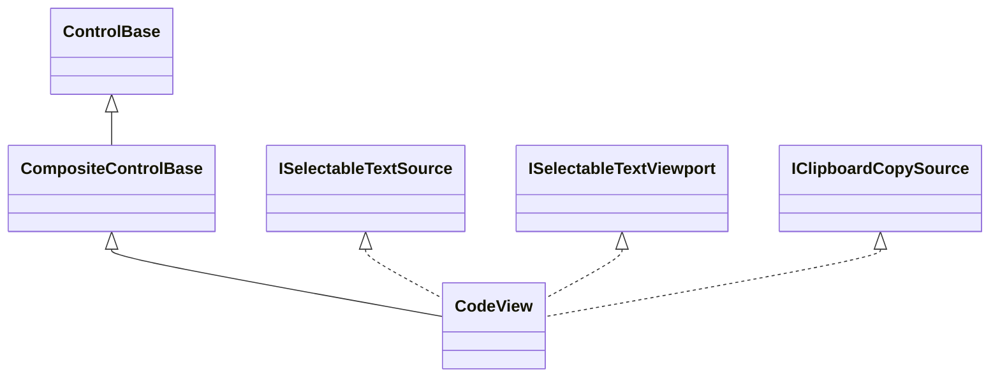
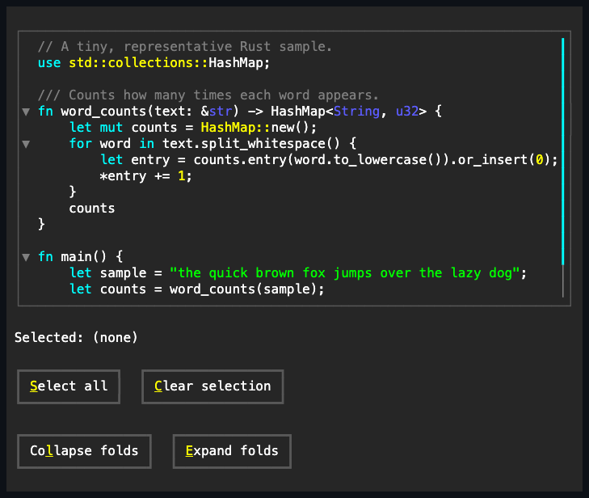

# CodeView

## Overview

`CodeView` is declared `public sealed class CodeView : CompositeControlBase` and
implements `IStyled<CodeViewStyle>`, `ISelectableTextSource`,
`ISelectableTextViewport`, and `IClipboardCopySource`. It displays a read-only,
syntax-colored source file with grapheme-safe selection, two-axis scrolling, and
collapsible fold ranges. There is no editing API: replacing `Code` replaces the
whole source.

Line endings normalize to LF before tokenization or selection. Offsets are
UTF-16 grapheme boundaries in that normalized string. Lines never wrap, and a
tab is one semantic character and exactly one displayed cell. The control owns
its normalized text and token projection; callers retain the assigned source
string and catalog.

## Inheritance



## API

| Member                                                       | Type                                   | Default                        | Description                                                                                                          |
| ------------------------------------------------------------ | -------------------------------------- | ------------------------------ | -------------------------------------------------------------------------------------------------------------------- |
| `Code`                                                       | `string`                               | `""`                           | Complete non-null source retained verbatim; tokenization and selection use a separately line-ending-normalized copy. |
| `Language`                                                   | `string?`                              | `null`                         | Exact `Catalog` language name, or null for plain text.                                                               |
| `Catalog`                                                    | `SyntaxDefinitionCatalog`              | `Default`                      | Catalog used to resolve `Language`.                                                                                  |
| `Style`                                                      | `CodeViewStyle?`                       | `null`                         | Complete local presentation, or null for theme ownership.                                                            |
| `ActualStyle`                                                | `CodeViewStyle`                        | Resolved                       | Read-only resolved presentation.                                                                                     |
| Inherited `ContextMenu`                                      | `ContextMenu?`                         | `CodeViewContextMenu` instance | Replaceable menu with copy, selection, and folding commands.                                                         |
| `ScrollBars`                                                 | `ScrollBars`                           | `Both`                         | Axes that may expose generated scrollbars.                                                                           |
| `ShowScrollBars`                                             | `ShowScrollBars`                       | `WhenNeeded`                   | Generated-scrollbar visibility policy.                                                                               |
| `ScrollBarStyle`                                             | `ScrollBarStyle?`                      | `null`                         | Complete local generated-scrollbar style.                                                                            |
| `ActualScrollBarStyle`                                       | `ScrollBarStyle`                       | Resolved                       | Read-only resolved generated-scrollbar style.                                                                        |
| `Extent`                                                     | `Size`                                 | Layout-dependent               | Read-only committed content extent in cells.                                                                         |
| `Viewport`                                                   | `Size`                                 | Layout-dependent               | Read-only committed visible extent in cells.                                                                         |
| `HorizontalOffset`, `VerticalOffset`                         | `int`                                  | `0`                            | Valid committed content offsets; reject values beyond the current extent.                                            |
| `LineSize`                                                   | `int`                                  | `1`                            | Non-negative wheel-scroll cell increment.                                                                            |
| `PageOverlap`                                                | `int`                                  | `0`                            | Non-negative cells retained between page commands.                                                                   |
| `Selection`                                                  | `Selection`                            | Empty at `0`                   | Read-only directional range over normalized `Code`.                                                                  |
| `SelectedText`                                               | `string`                               | `""`                           | Read-only owned selected substring.                                                                                  |
| `SelectableTextViewport`                                     | `Rect`                                 | Layout-dependent               | Read-only text viewport relative to the control, excluding gutter and chrome.                                        |
| `ClipboardWriter`                                            | `Action<string>?`                      | `null`                         | Optional detached/context-menu copy sink; attached Ctrl+C uses `Application`.                                        |
| `IsFoldingEnabled`                                           | `bool`                                 | `true`                         | Whether the fold gutter and collapsed-line projection are active.                                                    |
| `FoldRanges`                                                 | `IReadOnlyList<SyntaxFoldRange>`       | Empty                          | Detected fold ranges, outer ranges first.                                                                            |
| `ScrollBy(int x, int y, ScrollCause cause)`                  | `bool`                                 | —                              | Applies signed deltas with saturation and endpoint clamping.                                                         |
| `SetSelection(Selection selection)`                          | `void`                                 | —                              | Replaces the range after validating grapheme-boundary endpoints.                                                     |
| `SelectAll()`                                                | `void`                                 | —                              | Selects the complete normalized source.                                                                              |
| `ClearSelection()`                                           | `void`                                 | —                              | Collapses at the current directional caret.                                                                          |
| `CopySelection()`                                            | `string`                               | —                              | Pure owned copy of `SelectedText`; emits no clipboard protocol.                                                      |
| `RevealSelectableTextOffset(int offset)`                     | `bool`                                 | —                              | Validates and reveals one semantic offset, expanding containing folds.                                               |
| `ScrollSelectableTextViewport(int horizontal, int vertical)` | `bool`                                 | —                              | Pointer-scrolls the selectable viewport by signed cell deltas with clamping.                                         |
| `IsFoldStart(int line)`                                      | `bool`                                 | —                              | Reports whether a zero-based source line begins a fold.                                                              |
| `IsFolded(int line)`                                         | `bool`                                 | —                              | Reports the stored collapsed state for a fold-start line.                                                            |
| `SetFolded(int line, bool folded)`                           | `bool`                                 | —                              | Changes one fold and reports whether its state changed.                                                              |
| `ToggleFold(int line)`                                       | `bool`                                 | —                              | Toggles a fold-start line and reports success.                                                                       |
| `CollapseAll()`                                              | `void`                                 | —                              | Stores every detected range as collapsed.                                                                            |
| `ExpandAll()`                                                | `void`                                 | —                              | Expands every detected range.                                                                                        |
| `SelectionChanged`                                           | `EventHandler<EventArgs>`              | —                              | Raised after a different selection commits.                                                                          |
| `ScrollChanged`                                              | `EventHandler<ScrollChangedEventArgs>` | —                              | Raised after a settled offset, extent, or viewport transition.                                                       |

`Code` rejects null with `ArgumentNullException`. `Language` or a replacement
`Catalog` rejects an unavailable language with `KeyNotFoundException` before
mutation. `SetSelection` rejects an endpoint past normalized text with
`ArgumentOutOfRangeException` and an endpoint inside a grapheme with
`ArgumentException`. Public mutation is dispatcher-affine after attachment.

`CodeViewStyle` colors all `SyntaxDefaultStyle` roles, selected foreground and
background, the fold gutter, and its one-cell collapsed and expanded glyphs.
Transparent role colors and control or non-one-cell fold glyphs are rejected.

## Selection, viewport, and copying

Selection is a single directional range (`Selection.Anchor`/`Selection.Caret`)
over the _normalized_ `Code` text - line endings collapsed to `\n` - so
`SelectedText` and `CopySelection()` always return text with `\n` line endings
regardless of what the assigned `Code` string contained. Left/Right move the
caret by one grapheme cluster; Up/Down move to the same column on the nearest
visible line, remembering the column across repeated presses the way most
editors do; Home/End move to the start or end of the current line; Page Up/Page
Down move by one viewport height minus `PageOverlap`; holding Shift with any of
these extends the selection instead of moving the caret alone. Ctrl+A selects
everything. A primary click sets an empty selection at the clicked position and
requests focus; a drag while the primary button is held extends the selection
continuously; a double-click selects the word under the pointer, and a
triple-click selects the whole line. Holding the drag past the visible content's
edge - past the right edge of a line wider than the viewport, or past the
top/bottom edge of a buffer taller than the viewport - keeps auto-scrolling and
extending the selection on a short repeating interval for as long as the button
stays down, even without further pointer motion, until the drag returns inside
the viewport or the button is released. The gutter remains outside selectable
text geometry.

As an `ISelectableTextSource`, `CodeView` always contributes the complete
normalized source as authoritative semantic text. Its snapshot exposes geometry
only for complete graphemes currently visible through the clipped text viewport;
folded and scrolled-off lines remain semantic but have no stale rectangles. A
wide grapheme is mapped as one owner, and one-cell tabs preserve their source
offsets. Snapshot work is bounded to the projected viewport rows.

As an `ISelectableTextViewport`, the view can reveal one validated semantic
offset and scroll by requested cell deltas. Revealing an offset inside a
collapsed range expands every containing fold, waits for the new projection,
then scrolls vertically and horizontally to the final source cell. A callback
that changes code or makes the control unavailable cancels the stale reveal.

`CopySelection()` is pure. When an attached `CodeView` or one of its descendants
owns focus, Ctrl+C reaches the nearest `IClipboardCopySource` through
`Application` and publishes that result through
`Application.Terminal.Clipboard`. `ClipboardWriter` remains useful for a
detached view, manually routed Ctrl+C, or the default context menu's Copy item;
it is not required for ordinary attached clipboard routing. The application
still publishes an empty nearest result rather than falling through to an
ancestor.

When embedded through `DocumentBlockControl`, the owner depends on focus:

| Focus and action                                                 | Selection owner                                                                                  |
| ---------------------------------------------------------------- | ------------------------------------------------------------------------------------------------ |
| Focus inside `CodeView`, ordinary CodeView drag, or Ctrl+C       | `CodeView`; standalone source selection and copy semantics.                                      |
| Drag begins elsewhere in `Document` and crosses code by one cell | `Document`; child capture transfers and partial code joins the document range.                   |
| Document keyboard caret enters folded code                       | `Document`; `CodeView` expands/reveals the offset while the document retains the combined range. |

Scrolling a `CodeView` changes geometry only and preserves both its own and an
owning `Document`'s semantic ranges. Replacing `Code` retokenizes, expands
folds, and resets the view's own selection to offset zero; an enclosing document
also detects the changed source text and clears its stale combined selection.

## Folding

A fold range comes from a grammar's region markers or indentation folding.
Collapsing hides lines strictly inside the range while preserving `Code`, token
offsets, and `Selection`. The start line remains visible and displays a
collapsed indicator. Clicking its gutter glyph toggles the fold without moving
the caret.

Setting `IsFoldingEnabled` false removes the gutter and shows every line while
retaining stored fold states; restoring it resumes those states. Selection and
copy always use full normalized source text, including folded lines. Navigation
uses visible lines, while an explicit semantic reveal expands a containing fold
before positioning the viewport.

## Syntax definitions and catalogs

`Language` resolves a compiled grammar from `Catalog`, which defaults to the
embedded Kate/KSyntaxHighlighting-format definitions. A custom catalog may load
additional compatible definitions. An unresolved cross-definition reference
degrades only that reference to plain text. See
[Syntax highlighting](../../concepts/syntax-highlighting.md#overview) for the
grammar, catalog, and provenance contract.

## Example



```csharp
var view = new CodeView
{
    Language = "Rust",
    Code = """
        fn main() {
            println!("Hello, SharpVision!");
        }
        """,
};

view.SelectAll();
var copied = view.CopySelection();
```

## Expected behavior

| Scope               | Observable evidence                                                                                                |
| ------------------- | ------------------------------------------------------------------------------------------------------------------ |
| Public API          | Validation, normalized offsets, selection events, folding state, and pure copy output.                             |
| Integrated behavior | Keyboard/pointer selection, application clipboard routing, embedded Document ownership, and nested reveal.         |
| Surface             | Exact syntax roles, complete selected grapheme owners, clipped snapshots, fold projection, and viewport scrolling. |

- Every token is styled purely by its `SyntaxDefaultStyle` role; a syntax
  definition's own optional literal color hints are never read.
- Normalization uses LF, selection never splits a grapheme, tabs occupy one
  semantic character and one displayed cell, and long lines never wrap.
- Folded and offscreen source remains copyable while contributing no stale hit
  geometry.
- Selection reveal expands containing folds and stops safely across reentrant
  mutation or lifecycle changes.
- A cross-definition reference (embedding another language) that cannot be
  resolved degrades to no highlighting for that reference instead of failing the
  whole document.
- A primary click inside the fold gutter toggles that line's fold instead of
  moving the caret; `IsFoldingEnabled = false` reserves no gutter cells and
  shows every line while preserving each fold's recorded state for when it is
  re-enabled.
- An embedded drag transfers ownership only after the shared one-cell threshold;
  a stationary gutter click remains a fold action.
- Theme and local style changes repaint syntax, selection, and gutter roles
  without changing source, selection, folds, or offsets.
