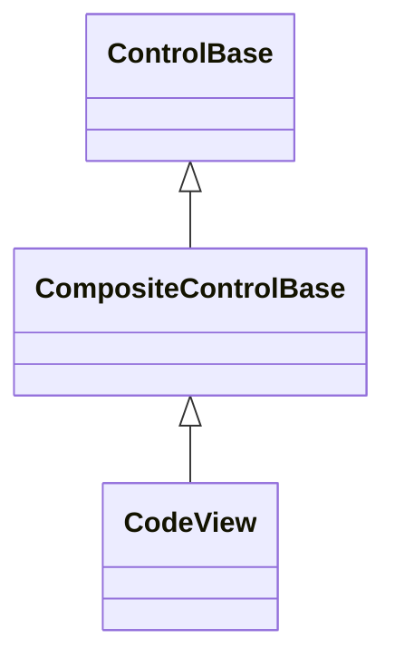

# CodeView

## Overview

`CodeView` is declared
`public sealed class CodeView : CompositeControlBase, IStyled<CodeViewStyle>`.
It displays a read-only block of source code, colored against a
[Kate/KSyntaxHighlighting-format](../../concepts/syntax-highlighting.md)
grammar, with mouse- and keyboard-driven text selection, a pure `CopySelection`
the host wires to a real clipboard, and collapsible fold ranges. There is no
editing API: `Code` is the only way to change its content, and setting it always
replaces the whole document.

## Inheritance



## API

| Member                    | Type                                   | Default                        | Description                                                                                                   |
| ------------------------- | -------------------------------------- | ------------------------------ | ------------------------------------------------------------------------------------------------------------- |
| `Code`                    | `string`                               | `""`                           | Complete non-null source text; line endings are normalized to `\n` before any observable state changes.       |
| `Language`                | `string?`                              | `null`                         | Exact `Catalog` language name to highlight against, or null for no coloring.                                  |
| `Catalog`                 | `SyntaxDefinitionCatalog`              | `Default`                      | The catalog `Language` resolves a grammar from.                                                               |
| `Style`                   | `CodeViewStyle?`                       | `null`                         | Gets or sets the complete local presentation.                                                                 |
| `ActualStyle`             | `CodeViewStyle`                        | Resolved                       | Read-only; the complete local, theme-owned, or code-owned presentation.                                       |
| Inherited `ContextMenu`   | `ContextMenu?`                         | `CodeViewContextMenu` instance | Provides Copy, Select All, and fold commands; replaceable through the inherited ownership contract.           |
| `ScrollBars`              | `ScrollBars`                           | `Both`                         | Axes that may expose generated scrollbars.                                                                    |
| `ShowScrollBars`          | `ShowScrollBars`                       | `WhenNeeded`                   | Visibility policy for generated scrollbars.                                                                   |
| `ScrollBarStyle`          | `ScrollBarStyle?`                      | `null`                         | Complete local style for generated scrollbars.                                                                |
| `ActualScrollBarStyle`    | `ScrollBarStyle`                       | Resolved                       | Read-only resolved generated-scrollbar style.                                                                 |
| `Extent`                  | `Size`                                 | Layout-dependent               | Read-only committed content extent.                                                                           |
| `Viewport`                | `Size`                                 | Layout-dependent               | Read-only committed visible extent.                                                                           |
| `HorizontalOffset`        | `int`                                  | `0`                            | Valid horizontal content offset; rejects a value outside the current extent.                                  |
| `VerticalOffset`          | `int`                                  | `0`                            | Valid vertical content offset; rejects a value outside the current extent.                                    |
| `LineSize`                | `int`                                  | `1`                            | Non-negative wheel-scroll cell increment.                                                                     |
| `PageOverlap`             | `int`                                  | `0`                            | Non-negative cells of context retained between page commands.                                                 |
| `ScrollBy(x, y, cause)`   | `bool`                                 | —                              | Applies signed cell deltas with saturation and endpoint clamping.                                             |
| `Selection`               | `Selection`                            | Empty at `0`                   | Read-only current directional selection over the normalized `Code` text.                                      |
| `SelectedText`            | `string`                               | `""`                           | Read-only selected substring, or empty.                                                                       |
| `ClipboardWriter`         | `Action<string>?`                      | `null`                         | Delegate Ctrl+C and the default context menu's Copy item invoke with `CopySelection()`'s result.              |
| `SetSelection(selection)` | `void`                                 | —                              | Replaces the selection with a validated grapheme-boundary range.                                              |
| `SelectAll()`             | `void`                                 | —                              | Selects the entire normalized text.                                                                           |
| `ClearSelection()`        | `void`                                 | —                              | Collapses the selection to an empty range at its current caret.                                               |
| `CopySelection()`         | `string`                               | —                              | Pure read of `SelectedText`; never touches a clipboard - see [Selection and copying](#selection-and-copying). |
| `SelectionChanged`        | `EventHandler<EventArgs>`              | No subscribers                 | Raised after the committed selection changes.                                                                 |
| `FoldRanges`              | `IReadOnlyList<SyntaxFoldRange>`       | —                              | Read-only; every fold range detected in the current `Code`, outer ranges first.                               |
| `IsFoldingEnabled`        | `bool`                                 | `true`                         | Whether the fold gutter is reserved and rendered, its arrows are clickable, and collapsed ranges hide lines.  |
| `IsFoldStart(line)`       | `bool`                                 | —                              | Whether a line begins any fold range at all.                                                                  |
| `IsFolded(line)`          | `bool`                                 | —                              | Whether a line begins a currently collapsed fold range.                                                       |
| `SetFolded(line, folded)` | `bool`                                 | —                              | Collapses or expands the fold range starting at one line; returns whether it changed.                         |
| `ToggleFold(line)`        | `bool`                                 | —                              | Toggles the fold range starting at one line.                                                                  |
| `CollapseAll()`           | `void`                                 | —                              | Collapses every fold range.                                                                                   |
| `ExpandAll()`             | `void`                                 | —                              | Expands every fold range.                                                                                     |
| `ScrollChanged`           | `EventHandler<ScrollChangedEventArgs>` | No subscribers                 | Reports the settled offset, extent, and viewport for one layout pass.                                         |

`CodeViewStyle`, reached through `Style`/`ActualStyle`, colors every Kate
default-style role (`NormalColor`, `KeywordColor`, `FunctionColor`,
`StringColor`, `CommentColor`, `DecimalValueColor`, `ErrorColor`, and 24 more,
one per `SyntaxDefaultStyle` member) plus `SelectedTextColor`,
`SelectedBackground`, `GutterColor`, and the `CollapsedGlyph`/`ExpandedGlyph`
fold arrows, all through `ControlColor`. Every default reuses one of the
library's existing `SemanticColor` roles rather than a new syntax-specific one,
so a theme swap always restyles consistently without requiring every built-in
theme to define new colors.

`Code` rejects null with `ArgumentNullException`. `Language` rejects a name
`Catalog` does not contain with `KeyNotFoundException`, preserving the previous
language. `SetSelection` rejects an endpoint past the normalized text or one
that splits a grapheme cluster. Replacing `Code` or `Language` retokenizes the
whole document, resets the selection to empty at offset zero, and expands every
fold range.

## Selection and copying

Selection is a single directional range (`Selection.Anchor`/`Selection.Caret`)
over the _normalized_ `Code` text - line endings collapsed to `\n` - so
`SelectedText` and `CopySelection()` always return text with `\n` line endings
regardless of what the assigned `Code` string contained. Left/Right move the
caret by one grapheme cluster; Up/Down move to the same column on the nearest
visible line, remembering the column across repeated presses the way most
editors do; Home/End move to the start or end of the current line; Page Up/Page
Down move by one viewport height minus `PageOverlap`; holding Shift with any of
these extends the selection instead of moving the caret alone. Ctrl+A selects
everything. A primary click sets an empty selection at the clicked position and
requests focus; a drag while the primary button is held extends the selection
continuously; a double-click selects the word under the pointer, and a
triple-click selects the whole line.

`CopySelection()` is a pure read with no side effect, the same contract
`TextInput.CopySelection` and `Table.CopySelection` use: this control never
writes to a real clipboard itself. Unlike `TextInput`, though, `CodeView`'s host
application is never automatically discovered by `Application` - that mechanism
is hard-typed to `TextInput` and cannot be extended from another assembly - so
wiring Ctrl+C and the default context menu's Copy item to a real clipboard
requires assigning `ClipboardWriter` explicitly, for example to
`view.ClipboardWriter = value => Application.Terminal.Clipboard.Write(value);`.
Left `null`, Ctrl+C and Copy still update the selection normally but write
nowhere. Construction installs one `CodeViewContextMenu`, a public specialized
`ContextMenu` reached through the inherited `ContextMenu` property, ordering
Copy, Select All, a separator, Collapse All Folds, and Expand All Folds; opening
it recomputes each item's enablement from the current selection, code length,
and fold state. Callers may replace or clear it through the ordinary
context-menu ownership contract.

## Folding

A fold range covers every `beginRegion`/`endRegion` pair a language's grammar
detects (braces, blocks, multi-line comments, and similar) or, for a language
whose grammar enables indentation-based folding, every run of more deeply
indented lines. `IsFoldStart` identifies the first line of such a range;
`SetFolded`/`ToggleFold` collapse or expand it, hiding or restoring every line
strictly between its start and end (the start line itself always stays visible,
showing a `(...)` indicator while collapsed). Folding never changes `Code`,
`Selection`, or tokenization - only which lines the current viewport projection
includes.

While `IsFoldingEnabled` is true (the default), a gutter column precedes each
line showing a clickable collapsed or expanded arrow on every fold-start line; a
primary click anywhere in that column on such a line toggles its fold the same
way calling `ToggleFold(line)` would, without moving the caret. Setting
`IsFoldingEnabled` to false stops reserving and rendering the gutter and stops
hiding any collapsed range's interior lines, but leaves every fold's recorded
collapsed/expanded state untouched - `IsFolded` keeps reporting it, and toggling
`IsFoldingEnabled` back to true resumes exactly where folding left off.

## Syntax definitions and catalogs

`Language` resolves a compiled grammar from `Catalog`, which defaults to
`SyntaxDefinitionCatalog.Default`: the embedded collection of 160 permissively
licensed syntax definitions documented in the `SharpVision.SyntaxHighlighting`
package's own `THIRD-PARTY-NOTICES.md` - 159 audited and redistributed from
upstream KDE, plus C#, a first-party definition original to SharpVision.
Assigning a different `SyntaxDefinitionCatalog` - for example one built with
`SyntaxDefinitionCatalog.FromDirectory` - lets an application highlight against
any other KDE-format definition, including one this package does not embed for
licensing reasons. See
[Syntax highlighting](../../concepts/syntax-highlighting.md) for the complete
engine architecture, the KDE format's supported surface, and the theming
rationale.

## Example


```csharp
var view = new CodeView
{
    Language = "Rust",
    Code = """
        fn main() {
            println!("Hello, SharpVision!");
        }
        """,
};

view.SelectAll();
var copied = view.CopySelection();
```

## Expected behavior

| Scope       | Observable evidence                                                                  |
| ----------- | ------------------------------------------------------------------------------------ |
| Public API  | Validation, retokenization, selection bounds, and fold-range visibility.             |
| Surface     | Exact per-role token colors, fold-collapsed line hiding, and selection highlighting. |
| Integration | Decoded keyboard and pointer input changes the mounted selection and fold state.     |

- Every token is styled purely by its `SyntaxDefaultStyle` role; a syntax
  definition's own optional literal color hints are never read.
- Rendering measures and clips using the active terminal cell policy; a tab
  character always measures and draws as exactly one cell.
- Long lines never wrap: horizontal scrolling reveals the rest of the line.
- A cross-definition reference (embedding another language) that cannot be
  resolved degrades to no highlighting for that reference instead of failing the
  whole document.
- A primary click inside the fold gutter toggles that line's fold instead of
  moving the caret; `IsFoldingEnabled = false` reserves no gutter cells and
  shows every line while preserving each fold's recorded state for when it is
  re-enabled.
- Ctrl+C and the default context menu's Copy item both forward
  `CopySelection()`'s result to `ClipboardWriter` when assigned, and do nothing
  observable to any real clipboard when it is left `null`.
