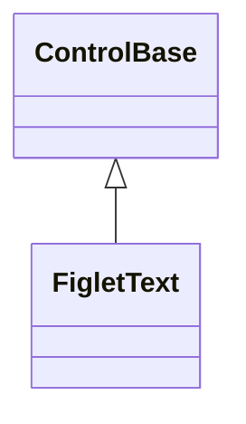
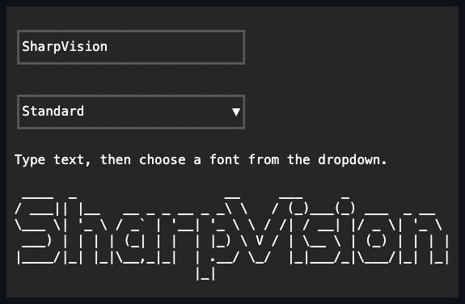

# FigletText

## Overview

`FigletText` renders Unicode source text as FIGlet art through an immutable
`FigletFont`, drawing to the semantic terminal canvas. The generated rows are
cached and only regenerated when `Content`, `Font`, or `Options` changes.

FIGlet glyphs are never scaled or wrapped. During measurement the control
reports the widest generated row in terminal cells and the number of generated
rows, both under the inherited application cell policy. For large fonts, rely on
parent clipping or place the control in an ancestor `Container`, whose intrinsic
`AutoScroll` provides bounded presentation.

Generated FIGlet cells keep the destination background, so the art blends into
whatever surface its parent painted. To draw on a solid background instead,
assign a complete local `Face` with an opaque background: the control fills its
ordinary border box first, and the transparent FIGlet cells draw on top.

## Inheritance



## API

| Member                        | Type            | Default                       | Description                                                                                  |
| ----------------------------- | --------------- | ----------------------------- | -------------------------------------------------------------------------------------------- |
| `FigletText(FigletFont font)` | —               | —                             | Initializes empty FIGlet text with the required non-null immutable font; rejects `null`.     |
| `Content`                     | `string`        | `string.Empty`                | Non-null source text rendered through the selected FIGfont; rejects `null`.                  |
| `Font`                        | `FigletFont`    | Required constructor argument | The non-null immutable parsed `FigletFont` to render with; also settable after construction. |
| `Options`                     | `FigletOptions` | `default`                     | Overrides the font's direction and its fitting or smushing layout bits.                      |
| Inherited `Face`              | `Face`          | Semantic normal face          | Complete local appearance authoring for generated cells.                                     |
| Inherited `ActualFace`        | `Face`          | Resolved                      | Read-only; the fully composed current face.                                                  |

## FigletCatalog

`FigletCatalog` and `FigletFontInfo` belong to the optional
`SharpVision.FigletFonts` package, not the core rendering library. The catalog
resolves a font name to a parsed `FigletFont`; `Default` contains 19 audited
fonts: the 18 official FIGlet fonts under BSD-3-Clause and `Classy` under MIT.
The package preserves both license texts, source commits, embedded notices, byte
lengths, and SHA-256 values.

Each font is a separate assembly resource. Constructing the catalog or reading
`Names` opens only the manifest; `Load` opens, validates, and parses only the
selected font. There is no catalog-wide ZIP. Applications can also source their
own fonts through the same lookup and `Load` surface:

| Member                                       | Source                                                          |
| -------------------------------------------- | --------------------------------------------------------------- |
| `FigletCatalog.Default`                      | The audited optional BSD/MIT resource collection.               |
| `FigletCatalog.FromDirectory(path, limits?)` | Every `.flf`/`.tlf` file directly inside a directory.           |
| `FigletCatalog.FromZip(stream, limits?)`     | Every `.flf`/`.tlf` entry in a caller-supplied Zip archive.     |
| `FigletCatalog.FromFonts(fonts)`             | Already-parsed `FigletFont` instances, keyed by their own name. |

Every parsing entry point — `Load(name)` and its `Load(name, limits)` overload
included — is bounded by a `FigletLimits` value, defaulting to
`FigletLimits.Default`. The record's six positive members cap parsing
(`MaxInputBytes` 16 MiB, `MaxGlyphs` 4096, `MaxHeight` 256, `MaxRowWidth` 16384,
`MaxComments` 4096) and rendered output (`MaxOutputChars` 16 MiB), each
rejecting a non-positive value with `ArgumentOutOfRangeException`, so untrusted
font files cannot exhaust memory during catalog construction or rendering.

```csharp
var catalog = FigletCatalog.FromDirectory("/opt/myapp/fonts");
var title = new FigletText(catalog.Load("banner")) { Content = "Hello" };
```

Fonts loaded through `FromDirectory` or `FromZip` are named after their file or
entry name, without extension. `GetInfo` still reports provenance metadata for
every entry regardless of source; entries from `FromFonts` report placeholder
`"unaudited"` metadata, since an already-parsed font carries no source file or
byte sequence to hash. `Names` is an immutable ordinally sorted inventory
snapshot for every catalog source.

Installing only `SharpVision` still provides `FigletText`, `FigletFont`, the
parser, renderer, layout values, and caller-supplied font loading. It embeds no
font collection and does not depend on `SharpVision.FigletFonts`.

## Example



Install the optional audited catalog when the application wants bundled fonts:

```bash
dotnet add package SharpVision.FigletFonts
```

```csharp
var title = new FigletText(FigletCatalog.Default.Load("standard"))
{
    Content = "SharpVision",
};
```

## Expected behavior

| Scope      | Observable evidence                                            |
| ---------- | -------------------------------------------------------------- |
| Public API | Validation, defaults, state changes, and deterministic output. |

- Null `Content` or `Font` is rejected, and the row cache is invalidated exactly
  when `Content`, `Font`, or `Options` changes.
- Every curated catalog font renders, including scalar fallback, hardblank
  handling, both directions, and the fitting and smushing layout modes.
- Oversized art clips and responds to resize as documented, style inheritance
  applies to generated cells, and wide output Runes occupy their correct cells.
- `FigletTextSurfaceTests` mounts the audited `small` font beneath a real
  application and demonstrates the exact terminal-visible art, style projection,
  clipping, resize exposure, content mutation, and clearing of stale cells.
