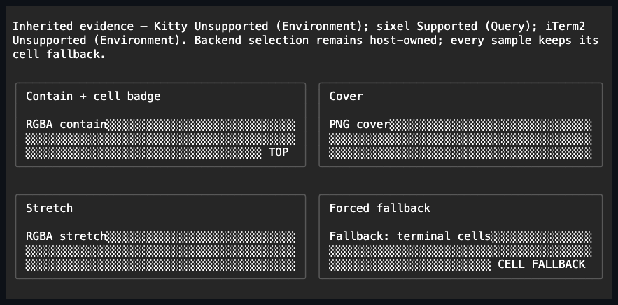

# Image

## Overview

`Image` is declared `public sealed class Image : Control`. It displays one
borrowed immutable
[`Terminal.Graphics.ImageSource`](../../concepts/images.md#overview) without
exposing any terminal graphics protocol to control code. The control is
passive: it cannot receive focus and raises no input events. The caller keeps
ownership of the source at all times — when it is assigned, replaced, cleared,
and when the control is disposed.

## API

| Property        | Type                    | Default   | Effect  |
| --------------- | ----------------------- | --------- | ------- |
| `Source`        | `Graphics.ImageSource?` | `null`    | Measure |
| `AlternateText` | `string`                | empty     | Measure |
| `Stretch`       | `ImageStretch`          | `Contain` | Render  |

`AlternateText` rejects null and any string containing a terminal control
character, before any state changes. `Stretch` accepts only `Contain`, `Cover`,
or `Stretch`; an unknown enum value is rejected before mutation. Property
changes follow the ordinary dispatcher-affinity, invalidation, and
`PropertyChanged` rules, and assigning an equivalent value is a no-op.

## Measurement

When a source is set and exact cell-pixel metrics are available, the desired
size is the smallest rectangle of cells that covers the full pixel source. For
terminals with uneven cell grids, the control uses cumulative integer division,
so a partial final cell is still counted without assuming uniform cell
dimensions. When metrics are unavailable, the control measures by
alternate-text width instead; a source with no alternate text still requests
one deterministic preview cell. A null source also measures by alternate-text
width, and a null source with empty alternate text requests `0x0`.

Inherited metrics are updated before resize layout and reach children added
later. When the metrics change, a source-backed Image is remeasured.

## Rendering and fallback

A source-backed Image renders in three steps: it fills its complete
`ContentBounds` with the semantic `Shade.Light` pattern, draws any nonempty
alternate text over it, and then records one backend-neutral `Canvas.DrawImage`
placement using the selected stretch mode. The control never writes CSI, OSC,
DCS, APC, or any other protocol bytes itself. Without a source, the control
draws only its alternate text, and with neither source nor alternate text it
paints nothing.

Each placement records the cell-paint revision at which it was added. If any
later cell paint intersects the placement's destination, the placement becomes
ineffective for that frame. This is how ordinary later siblings, Window
content, and the elevated Popup pass occlude an image without needing any
protocol knowledge. Clone and copy preserve this internal provenance, but
public placement equality, hashing, and encoded bytes do not expose it. On
backends with retained output (Kitty), a placement that becomes ineffective is
deleted; on non-retained backends (sixel and iTerm2), cells are repaired when
occlusion changes what is effectively visible.

If the terminal lacks supporting capability evidence, exact geometry is
unavailable, the multiplexer route is unauthorized, or the source/stretch
combination is unsupported, the already-painted cell fallback simply remains
visible.

## Example



```csharp
var preview = new Image
{
    Source = Graphics.ImageSource.FromRgba(pixelSize, rgbaBytes),
    AlternateText = "Photo preview",
    Stretch = ImageStretch.Contain,
};
```

The runnable showcase includes real RGBA and PNG sources, all three stretch
modes, a source-backed fallback deliberately suppressed by a later semantic
cell overlay, and a cell badge overlapping an image. Its live status reports
the inherited Kitty, sixel, and iTerm2 support state and where that evidence
came from; it does not guess which backend the host selected.

## Expected behavior

`ImageTests` demonstrates the defaults, atomic validation, precise
invalidation, dispatcher affinity, borrowed ownership, measurement over uniform
and uneven metrics, zero-size behavior, the complete fallback paint, placement
modes and provenance, and Window/Popup occlusion. `ImageSurfaceTests` shows the
mounted unsupported-terminal fallback. `ApplicationGraphicsTests` drives public
RGBA and PNG Images through exact resize metrics down to final cells, sixel,
Kitty, and explicit iTerm2 3.5 multipart bytes, demonstrating that the fallback
paints before graphics, that a paused Kitty flush commits before profile
revocation removes it, that a three-layer fallback blocks overlapping lower
Kitty output, and that delete/flush completes before the borrowed transport is
disposed even when cleanup fails. The Image showcase surface suite mounts
narrow, normal, and wide layouts, validates its real PNG chunk CRCs and zlib
scan stream, demonstrates that the source-backed forced fallback is occluded,
and keeps the live inherited evidence up to date.
