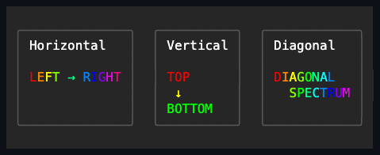

# Prism

## Overview

`Prism` is declared `public sealed class Prism : ContentControl`. It applies a
deterministic RGB hue cycle to the foreground of a single, replaceable content
control, which it hosts through the ordinary
[`ContentControl`](../content-control.md#overview) role. Prism adds no input,
focus, or activation behavior of its own, and its content keeps the usual
parentage, inherited context, routed ancestry, measurement, arrangement,
rendering, and disposal behavior of that single-content role.

Assigning or clearing `Content` goes through the complete `ContentControl`
ownership transaction. Replacing content returns the detached previous control
to the caller without disposing it; disposing the Prism disposes whatever
content it holds at that moment, exactly once. Content is measured and arranged
through the ordinary
[border-and-padding box model](../../concepts/layout.md#passes-and-rounding).

## API

| Property      | Default                   | Validation                                 | Coordinate |
| ------------- | ------------------------- | ------------------------------------------ | ---------- |
| `Phase`       | `0`                       | Finite and in the half-open range `[0, 1)` | Hue offset |
| `CycleLength` | `18` terminal cells       | Positive integer                           | Divisor    |
| `Direction`   | `PrismDirection.Diagonal` | Defined `PrismDirection` value             | Axis       |

`PrismDirection.Horizontal` derives the hue from the content-relative horizontal
coordinate `x`, `Vertical` from `y`, and `Diagonal` from the checked sum
`x + y`. All of these coordinates are relative to the Prism's `ContentBounds` —
not to the frame, and not to the child's own origin.

An invalid `Phase`, `CycleLength`, or `Direction` value throws
`ArgumentOutOfRangeException` before any state change, invalidation, or
notification. For a valid assignment, lifetime and attached-dispatcher access
are checked before the equivalence check. A changed value is committed, requests
render invalidation, and then raises `PropertyChanged` exactly once for that
property; an equivalent value is a no-op once the access checks pass. Effect
changes never request measure or arrange, so the existing desired size and
arranged bounds stay stable. Setting an effect property after disposal throws
`ObjectDisposedException`, and mutating an attached control from off the
dispatcher throws `InvalidOperationException`.

## Color calculation

For the lead cell of each selected stored owner, Prism computes:

```text
coordinate = Horizontal: x, Vertical: y, Diagonal: checked(x + y)
hue = Phase + (coordinate / CycleLength)
hue = hue - floor(hue)
scaled = hue * 6
sector = floor(scaled)
rising = round((scaled - sector) * 255, away from zero)
falling = 255 - rising
```

The half-open normalized hue always lands in one of six sectors:

| Sector | RGB result          |
| ------ | ------------------- |
| 0      | `(255, rising, 0)`  |
| 1      | `(falling, 255, 0)` |
| 2      | `(0, 255, rising)`  |
| 3      | `(0, falling, 255)` |
| 4      | `(rising, 0, 255)`  |
| 5      | `(255, 0, falling)` |

The calculation is culture-independent. Floor-based modulo-one normalization
wraps both negative and positive lead-relative coordinates, and the public
property validation keeps `Phase` itself normalized. An owner that straddles the
region boundary is always colored from its lead coordinate, even when that lead
lies outside the requested effect region.

## Rendering and write provenance

Prism follows the shared
[control rendering order](../../architecture/rendering-pipeline.md#control-rendering).
Its own standard body, border, and shadow chrome render first. During the
ordinary child pass, it synchronously captures the rendering of its retained
content. The effect region is `ContentBounds` intersected with the child's
arranged `Bounds`, and every cell in that region can discover its complete
stored owner. With no content, the pass is a no-op.

Which cells the effect recolors is decided by the frame's bounded internal write
provenance, not by comparing cell values before and after. A discovered stored
owner is eligible only when its latest mutation was performed by that
child-render callback. In practice this means:

- identical overwrites count as writes;
- stored spaces written by the callback participate;
- untouched blanks, pre-existing underlay, and Prism's own earlier chrome do
  not;
- nested ordinary descendants participate, because their writes happen inside
  the same synchronous child-render callback; and
- writes performed as a side effect of foreground selection fall after the
  closed draw window and are not picked up by that effect pass.

A cell inside the requested region is enough to discover its owner; the owner is
not clipped to the region. The selector uses the owner's absolute lead
coordinate for the hue calculation, so a selected wide owner is transformed
atomically across its complete span even when its lead or continuation crosses
the region boundary. The complete owner must lie inside the active canvas clip,
including every ancestor clip, or it is skipped. Prism never creates or recolors
half of a wide owner.

The transformation replaces the foreground only. The stored grapheme bytes,
background, attributes, hyperlink, underline kind, underline color, and
lead/continuation ownership are all preserved. These are semantic cell fields
under the
[rendering pipeline contract](../../architecture/rendering-pipeline.md#cell-and-frame-rules)
and the
[Unicode ownership rules](../../concepts/unicode-cell-geometry.md#cell-ownership).

Mutation revisions are frame-local, bounded, and internal. They never appear in
public cell values, semantic equality, hashing, damage detection, terminal
encoding, or terminal bytes. A normal capture starts and ends in constant time
without managed allocation. The complete provenance and failure rules are
defined by the
[`Canvas.DrawWithForeground` contract](../../architecture/rendering-pipeline.md#cell-and-frame-rules).

### Popup layer

Prism affects only the ordinary retained-child pass. An elevated `Popup`, or a
promoted popup descendant, is omitted from that pass and rendered later through
the root popup pass, above ordinary siblings — so its cells are never recolored
by an ancestor Prism. Ordinary nested descendants remain part of the effect. The
boundary is visual elevation, not ownership depth.

### Callback failures

The drawing and color callbacks are borrowed synchronously and never retained.
If content drawing throws, no foreground pass begins and the exception
propagates unchanged. If foreground selection throws, the row-major prefix that
was already transformed remains valid, while the failing owner and everything
after it stay unchanged. In either case, control rendering restores render
invalidation before propagating the exception, and capture cleanup still
completes.

## Animation and threading

Prism owns no timer and advances no state during rendering. To animate the
effect, update `Phase` yourself — typically from a dispatcher timer. The control
caches its drawing and selection delegates, so steady-state rendering does not
allocate a delegate per frame, and neither Prism nor the canvas keeps those
callbacks after the synchronous render call returns.

Detached construction and mutation follow the base control threading rules. Once
attached, content and effect mutation are dispatcher-affine. Rendering is
dispatcher-affine as well, rejects reentrancy, and uses only the semantic
canvas; the control never emits terminal protocol bytes.

## Example



```csharp
var title = new Prism
{
    Direction = PrismDirection.Diagonal,
    CycleLength = 18,
    Content = new FigletText(FigletCatalog.Default.Load("small"))
    {
        Content = "SNAKE",
    },
};

title.Phase = (title.Phase + (1d / 60d)) % 1d;
```

## Expected behavior

The automated evidence is split across focused Prism, canvas-primitive, and
shared base-control suites:

- The twelve `PrismTests` demonstrate the defaults; that non-finite,
  out-of-range, non-positive, and unknown-enum values are rejected without state
  or notification changes; ordered effect-property notifications, render-only
  invalidation, and stable layout; the exact sector colors, phase wrap, and all
  three directions; foreground-only preservation of rich cells alongside Prism
  chrome and outside-cell isolation; underlay preservation for null content and
  for a child covering only part of the region; wide-owner atomicity;
  stored-space versus untouched-blank behavior; empty, tiny, and border-consumed
  bounds; and ordinary `ContentControl` replacement, clearing, and parentage.
- `TerminalCanvasTests` demonstrate row-major once-per-lead selection,
  non-foreground preservation, exclusion of clipped wide owners, null-callback
  and selector-failure behavior, stored spaces versus blanks, and actual-write
  provenance for identical overwrites, underlay, selector-side writes to later
  or current owners, nesting, and mixed narrow and wide owners. They also
  demonstrate drawing-failure behavior and that provenance metadata stays out of
  semantic damage; `TerminalCanvasPerformanceTests` demonstrates the
  cached-callback allocation behavior.
- Shared base-control suites demonstrate general dispatcher affinity, disposal,
  the `ContentControl` lifecycle, and popup-layer routing. Those are
  infrastructure guarantees rather than focused Prism-specific assertions.

There is no focused Prism test attributed here for property dispatcher or
disposal paths, interior interpolation rounding, requested-region
boundary-straddling owners, promoted-popup exclusion, or disposal ordering.
