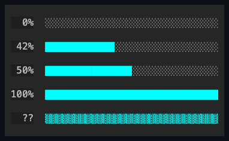

# ProgressBar

## Overview

`ProgressBar` shows progress as a non-interactive filled bar. It cannot receive
focus, is excluded from hit testing, and owns no children.

## API

| Property               | Default      | Purpose                                                                         |
| ---------------------- | ------------ | ------------------------------------------------------------------------------- |
| `Minimum`, `Maximum`   | `0`, `1`     | Define the finite, strictly increasing value range.                             |
| `Value`                | `0`          | Sets determinate progress; clamped into the current range.                      |
| `Indeterminate`        | `false`      | Switches from value-based fill to the deterministic unknown-duration animation. |
| `Orientation`          | `Horizontal` | Chooses left-to-right or bottom-to-top fill.                                    |
| `UseSubCellResolution` | `false`      | Uses code-owned fractional block levels for finer-than-cell progress.           |
| `Style`                | `null`       | Optional complete developer-authored `ProgressBarStyle`.                        |
| `ActualStyle`          | Theme        | The resolved style; always present.                                             |

`Style`/`ActualStyle` (`ProgressBarStyle`) own the per-part presentation, on top
of the inherited `Face`/`Border`/`Shadow`:

| Member                                          | Type                | Description                                                         |
| ----------------------------------------------- | ------------------- | ------------------------------------------------------------------- |
| `FillColor`, `TrackColor`, `IndeterminateColor` | `ControlColor`      | The foreground for each rendered part. Required, not nullable.      |
| `Glyphs`                                        | `ProgressBarGlyphs` | The validated one-cell `Fill`, `Track`, and `Indeterminate` glyphs. |

A `with` expression creates a validated member-wise copy of
`ProgressBarStyle.Default` or of any resolved style. Assigning `Style` replaces
the entire Theme-owned presentation, and assigning `null` restores it.

## Behavior

- `Minimum` and `Maximum` are finite `double` endpoints with
  `Minimum < Maximum`. They default to zero and one.
- `Value` must be finite and is clamped into the inclusive range. It defaults to
  zero.
- `Indeterminate` selects the deterministic unknown-duration presentation.
- `Orientation` chooses horizontal left-to-right or vertical bottom-to-top
  filling, defaulting to `Horizontal`.
- `UseSubCellResolution` enables the nine code-owned ordered fractional levels.
  It defaults to `false`.
- `Glyphs` carries the validated one-cell `Fill`, `Track`, and `Indeterminate`
  runes as one `ProgressBarGlyphs` value.
- A theme document may author a `styles.progressBar` section with
  `fillColor`/`trackColor`/`indeterminateColor` string members (accepting a
  `SemanticColor` name, a `#RGB`/`#RRGGBB` literal, a palette key, or
  `"transparent"`/`"default"`); an active theme's section supplies those colors
  ahead of the code-owned defaults whenever no local `Style` is assigned (see
  [themes.md](../../concepts/themes.md#style-types)).

`ValueChanged` fires for every committed `Value` transition, no matter which
public setter caused it — assigning `Value` directly, or a `Minimum`/`Maximum`
change that clamped it. `PropertyChanged(Value)` and `ValueChanged` always
agree: both observe the same history, and a clamp that leaves `Value` unchanged
raises neither. The event args expose the committed value as `Value`, matching
the other range controls.

A non-finite value throws `ArgumentOutOfRangeException`, and an endpoint that
would make the range empty or reversed throws `ArgumentException` — in both
cases before any mutation. Changing an endpoint clamps the current value in the
same transaction, before any notification fires, so every notification observes
coherent, already-clamped state: `PropertyChanged(Minimum)` or
`PropertyChanged(Maximum)` fires first, followed by `PropertyChanged(Value)` and
`ValueChanged` when the clamp actually changed the value.

Determinate rendering normalizes `(Value - Minimum) / (Maximum - Minimum)` and
fills `floor(normalized * axisCells)` complete cells; at the maximum, every cell
is filled. The remaining cells use the code-owned empty-progress glyph.
Horizontal fill grows from the left, vertical fill from the bottom.

Without a local `Style`, all progress cells resolve from the code-owned glyph
defaults, and a glyph that is unsuitable under the active width policy uses its
code-owned fallback. Replacing the Theme recolors an existing bar without
changing its glyphs. In indeterminate mode, the committed content bounds fill
with the resolved indeterminate glyph.

Without a theme section or a local `Style`, completed and indeterminate progress
use the theme's accent color (`SemanticColor.Accent`), and incomplete track
cells use the theme's muted color (`SemanticColor.Muted`). The style's per-part
colors override those fallbacks while preserving background and attributes.

The intrinsic desired size is ten cells on the main axis and one cell on the
cross axis, and both alignment axes default to `Stretch`. Rendering uses the
resolved visual-state style, draws inside `ContentBounds`, and participates in
shared intrinsic chrome. Zero content bounds draw nothing, and the control never
handles pointer or keyboard input.

## Example



```csharp
var bar = new ProgressBar
{
    Maximum = 100,
    Value = 42,
    Orientation = Orientation.Horizontal,
};
```

## Expected behavior

Callers can rely on the following: values and endpoints are validated as finite,
the range stays strictly increasing, and `Value` is always clamped into it;
endpoint changes surface through the documented notification order; horizontal
and vertical bars fill in the documented directions for empty, partial, and full
values, including sub-cell resolution; indeterminate rendering is deterministic;
zero and tiny bounds degrade safely; mutation, resize, and appearance
inheritance behave as documented; the control stays out of hit testing; and the
rendered output matches exact final cells. `ProgressBarSurfaceTests`
demonstrates the terminal-visible determinate and indeterminate states through a
mounted application.
