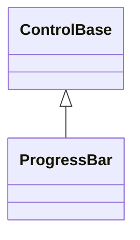

# ProgressBar

## Overview

`ProgressBar` shows progress as a non-interactive filled bar. It cannot receive
focus, is excluded from hit testing, and owns no children.

## Inheritance



## API

| Member                 | Type                                          | Default                  | Description                                                                                      |
| ---------------------- | --------------------------------------------- | ------------------------ | ------------------------------------------------------------------------------------------------ |
| `Minimum`              | `double`                                      | `0`                      | Finite lower bound; must stay below `Maximum`. Assigning it clamps `Value` into the new range.   |
| `Maximum`              | `double`                                      | `1`                      | Finite upper bound; must stay above `Minimum`. Assigning it clamps `Value` into the new range.   |
| `Value`                | `double`                                      | `0`                      | Determinate progress; only a non-finite value is rejected, an out-of-range value clamps instead. |
| `IsIndeterminate`      | `bool`                                        | `false`                  | Switches from value-based fill to a static unknown-duration glyph fill (no animation).           |
| `Orientation`          | `Orientation`                                 | `Orientation.Horizontal` | Chooses left-to-right or bottom-to-top fill; rejects an unknown value.                           |
| `UseSubCellResolution` | `bool`                                        | `false`                  | Uses the theme's eight fractional block levels for finer-than-cell progress.                     |
| `ValueChanged`         | `EventHandler<ProgressValueChangedEventArgs>` | —                        | Raised for every committed `Value` transition, however it was caused.                            |
| `Style`                | `ProgressBarStyle?`                           | `null`                   | Optional complete developer-authored presentation.                                               |
| `ActualStyle`          | `ProgressBarStyle`                            | Resolved                 | Read-only; the complete local, theme-owned, or code-owned presentation.                          |

A non-finite value throws `ArgumentOutOfRangeException`, and an endpoint that
would make the range empty or reversed throws `ArgumentException` — in both
cases before any mutation. Changing an endpoint clamps the current value in the
same transaction, before any notification fires, so every notification observes
coherent, already-clamped state: `PropertyChanged(Minimum)` or
`PropertyChanged(Maximum)` fires first, followed by `PropertyChanged(Value)` and
`ValueChanged` when the clamp actually changed the value.
`PropertyChanged(Value)` and `ValueChanged` always agree, observing the same
history; a clamp that leaves `Value` unchanged raises neither. The event args
expose the committed value as `Value`, matching the other range controls.

Determinate rendering normalizes `(Value - Minimum) / (Maximum - Minimum)` and
fills `floor(normalized * axisCells)` complete cells; at the maximum, every cell
is filled. The remaining cells use the code-owned empty-progress glyph.
Horizontal fill grows from the left, vertical fill from the bottom.

The intrinsic desired size is ten cells on the main axis and one cell on the
cross axis, and both alignment axes default to `Stretch`. Rendering uses the
resolved visual-state style, draws inside `ContentBounds`, and participates in
shared intrinsic chrome. Zero content bounds draw nothing, and the control never
handles pointer or keyboard input.

## Presentation and glyphs

`ProgressBarStyle`, reached through `Style`/`ActualStyle`, owns the per-part
presentation on top of the inherited `Face`/`Border`/`Shadow`:

| Member                                          | Type                | Description                                                         |
| ----------------------------------------------- | ------------------- | ------------------------------------------------------------------- |
| `FillColor`, `TrackColor`, `IndeterminateColor` | `ControlColor`      | The required, non-transparent foreground for each rendered part.    |
| `Glyphs`                                        | `ProgressBarGlyphs` | The validated one-cell `Fill`, `Track`, and `Indeterminate` glyphs. |

A `with` expression creates a validated member-wise copy of
`ProgressBarStyle.Default` or of any resolved style. Assigning `Style` replaces
the entire Theme-owned presentation, and assigning `null` restores it. Without a
local `Style`, all progress cells resolve from the code-owned glyph defaults -
themselves chosen by the active theme's `glyphs` field (see
[themes.md](../../concepts/themes.md#glyph-families)) - and a glyph that is
unsuitable under the active width policy uses its code-owned fallback. Replacing
the Theme recolors an existing bar without changing its glyphs. In indeterminate
mode, the committed content bounds fill with the resolved indeterminate glyph.

Without a local `Style`, completed progress uses the theme's accent color
(`SemanticColor.Accent`), incomplete track cells use the theme's muted color
(`SemanticColor.Muted`), and indeterminate progress uses the theme's info color
(`SemanticColor.Info`). These three colors are not part of a glyph family and
remain code-owned regardless of `glyphs`. ProgressBar declares no `styles.*`
theme key of its own, so a locally assigned style's per-part colors
(`FillColor`/`TrackColor`/`IndeterminateColor`) are the only way to move those
colors away from their code-owned defaults.

## Example


```csharp
var bar = new ProgressBar
{
    Maximum = 100,
    Value = 42,
    Orientation = Orientation.Horizontal,
};
```

## Expected behavior

| Scope      | Observable evidence                                            |
| ---------- | -------------------------------------------------------------- |
| Public API | Validation, defaults, state changes, and deterministic output. |

- Values and endpoints are validated as finite, the range stays strictly
  increasing, and `Value` is always clamped into it; endpoint changes surface
  through the documented notification order.
- Horizontal and vertical bars fill in the documented directions for empty,
  partial, and full values, including sub-cell resolution, and indeterminate
  rendering is deterministic.
- Zero and tiny bounds degrade safely; mutation, resize, and appearance
  inheritance behave as documented; the control stays out of hit testing; and
  the rendered output matches exact final cells.
- `ProgressBarSurfaceTests` demonstrates the terminal-visible determinate and
  indeterminate states through a mounted application.
