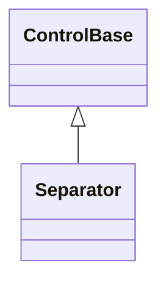

# Separator

## Overview

`Separator` draws a single non-interactive horizontal or vertical divider line.
It cannot receive focus, is excluded from hit testing, and owns no children.

## Inheritance



## API

| Member                                               | Type                                       | Default                  | Description                                                                                           |
| ---------------------------------------------------- | ------------------------------------------ | ------------------------ | ----------------------------------------------------------------------------------------------------- |
| `Orientation`                                        | `Orientation`                              | `Orientation.Horizontal` | Draws a line across the first content row or down the first content column; rejects an unknown value. |
| `Style`                                              | `SeparatorStyle?`                          | `null`                   | Optional complete developer-authored presentation.                                                    |
| `ActualStyle`                                        | `SeparatorStyle`                           | Resolved                 | Read-only; the complete local, theme-owned, or code-owned presentation.                               |
| Inherited `HorizontalAlignment`, `VerticalAlignment` | `HorizontalAlignment`, `VerticalAlignment` | `Stretch`, `Stretch`     | Lets the parent determine the final line length.                                                      |

The intrinsic desired size is one cell by one cell. Because both inherited
alignment axes default to `Stretch`, parent layout determines the final line
length: horizontal drawing fills the first content row and vertical drawing
fills the first content column. Either alignment can be replaced normally. Zero
content bounds draw nothing. Changing the orientation invalidates measure and
rendering — the active axis changes even though the intrinsic size stays one
cell by one cell.

By default the line uses the normal theme border color, combined with the
resolved visual-state style and the inherited semantic cell policy. Separator
participates in shared intrinsic chrome when border, body fill, or shadow
properties are set, and draws its line inside `ContentBounds`. It never handles
pointer or keyboard input.

## Glyphs

`SeparatorStyle`, reached through `Style`/`ActualStyle`, owns the required
validated one-cell `HorizontalGlyph` and `VerticalGlyph` for each orientation,
alongside the inherited `Face`/`Border`/`Shadow`:

| Member            | Type   | Default | Description                                        |
| ----------------- | ------ | ------- | -------------------------------------------------- |
| `HorizontalGlyph` | `Rune` | `─`     | Repeated left-to-right for a horizontal separator. |
| `VerticalGlyph`   | `Rune` | `│`     | Repeated top-to-bottom for a vertical separator.   |

Neither glyph lives on `Separator` itself: both are members of `SeparatorStyle`.
A `with` expression creates a validated member-wise copy of
`SeparatorStyle.Default`, and assigning `null` to `Style` restores the
Theme-owned presentation. Without a local `Style`, `Separator` resolves the
glyphs from the active theme, falling back to the code-owned defaults above; a
glyph unsuitable under the active width policy resolves to a portable one-cell
fallback (`-` horizontal, `|` vertical) instead. A theme document may author a
`styles.separator` section with `horizontalGlyph`/`verticalGlyph` string
members; an active theme's section supplies those glyphs ahead of the code-owned
defaults whenever no local `Style` is assigned (see
[themes.md](../../concepts/themes.md#style-types)).

## Example


```csharp
var separator = new Separator
{
    Orientation = Orientation.Horizontal,
};
```

## Expected behavior

| Scope      | Observable evidence                                            |
| ---------- | -------------------------------------------------------------- |
| Public API | Validation, defaults, state changes, and deterministic output. |

- Horizontal and vertical lines render as documented, and zero bounds draw
  nothing.
- Orientation changes, resize, and appearance inheritance behave as described;
  the control stays out of hit testing; and the rendered output matches exact
  final cells.
- `SeparatorSurfaceTests` drives pointer movement, dispatcher-affine mutation,
  and terminal resize through a mounted application while asserting exact
  terminal-visible rows and representative styles.
