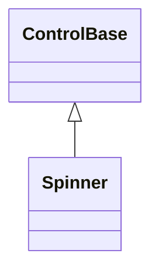

# Spinner

## Overview

`Spinner` displays a single glyph that advances automatically through an
animation sequence. It owns no children, cannot receive focus, and is excluded
from pointer hit testing.

## Inheritance



## API

| Member        | Type            | Default                          | Description                                                             |
| ------------- | --------------- | -------------------------------- | ----------------------------------------------------------------------- |
| `Interval`    | `TimeSpan`      | `TimeSpan.FromMilliseconds(200)` | Duration between frame advances.                                        |
| `IsPlaying`   | `bool`          | `true`                           | Enables playback while the control is attached.                         |
| `Style`       | `SpinnerStyle?` | `null`                           | Optional complete developer-authored presentation.                      |
| `ActualStyle` | `SpinnerStyle`  | Resolved                         | Read-only; the complete local, theme-owned, or code-owned presentation. |

Changing the effective frame sequence resets the animation to its first frame.
Appearance-only changes, local or through the Theme, repaint without losing the
current frame. Changing `Interval` restarts the timer but keeps the current
frame. The animation pauses while an ancestor is hidden or collapsed; disabling
the control does not pause it.

## Keyboard

| Key | Behavior                                                |
| --- | ------------------------------------------------------- |
| —   | This control has no control-specific keyboard commands. |

## Frame presets

`SpinnerStyle`, reached through `Style`/`ActualStyle`, holds a bounded immutable
frame sequence — between 1 and 256 printable one-cell frames — alongside the
inherited `Face`/`Border`/`Shadow`. Three code-owned presets are available:

| Preset                             | Frames                           | Description                                        |
| ---------------------------------- | -------------------------------- | -------------------------------------------------- |
| `SpinnerStyle.Braille` (`Default`) | Ten-frame                        | Light Braille orbit; the theme default.            |
| `SpinnerStyle.DenseBraille`        | Eight-frame                      | Dense Braille rotation.                            |
| `SpinnerStyle.Ascii`               | Four-frame (`\|`, `/`, `-`, `\`) | Portable bar, slash, dash, and backslash sequence. |

A `with` expression creates a validated member-wise copy of
`SpinnerStyle.Default`. Spinner declares no `styles.*` theme key of its own: its
code-owned frame sequence comes from the active theme's root-level `glyphs`
field whenever no local `Style` is assigned (see
[themes.md](../../concepts/themes.md#glyph-families)). Assigning `Style`
replaces the entire Theme-owned presentation, and assigning `null` restores it.

## Example


```csharp
var spinner = new Spinner
{
    Style = SpinnerStyle.DenseBraille,
    Interval = TimeSpan.FromMilliseconds(200)
};
```

## Expected behavior

| Scope      | Observable evidence                                            |
| ---------- | -------------------------------------------------------------- |
| Public API | Validation, defaults, state changes, and deterministic output. |

- Styles are validated and copied on assignment, and local styles take
  precedence over the Theme exactly as documented.
- The phase resets only when the frame sequence changes, while appearance-only
  changes repaint in place.
- The timer starts and stops with attachment and playback and pauses with
  visibility; mutation is dispatcher-affine.
- Unsuitable glyphs fall back under the active width policy; layout stays one
  cell; and the rendered output matches exact frames.
