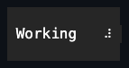

# Spinner

## Overview

`Spinner` displays a single glyph that advances automatically through an
animation sequence. It owns no children, cannot receive focus, and is excluded
from pointer hit testing.

## API

| Member                      | Default          | Description                                          |
| --------------------------- | ---------------- | ---------------------------------------------------- |
| `Style`                     | `null`           | Optional complete developer-authored `SpinnerStyle`. |
| `ActualStyle`               | Theme spinner    | The resolved style; always present.                  |
| `SpinnerStyle.Braille`      | Theme default    | Ten-frame light Braille orbit.                       |
| `SpinnerStyle.DenseBraille` | Preset           | Eight-frame dense rotation.                          |
| `SpinnerStyle.Ascii`        | Preset           | Portable bar, slash, dash, and backslash sequence.   |
| `Interval`                  | 200 milliseconds | Duration between frame advances.                     |
| `IsPlaying`                 | `true`           | Enables playback while the control is attached.      |

A `SpinnerStyle` holds a bounded immutable frame sequence and a complete
appearance profile. `SpinnerStyle.With(...)` copies frames and may overlay an
`AppearanceProfileSet`. A theme document may additionally author a
`styles.spinner` section with a `frames` array of one-character strings; an
active theme's section supplies the frame sequence ahead of the code-owned
default whenever no local `Style` is assigned (see
[themes.md](../../concepts/themes.md#semantic-profiles)). Assigning `Style`
replaces the entire Theme-owned presentation, and assigning `null` restores it.
A style must provide between 1 and 256 printable one-cell frames.

Changing the effective frame sequence resets the animation to its first frame.
Appearance-only changes, local or through the Theme, repaint without losing the
current frame. Changing `Interval` restarts the timer but keeps the current
frame. The animation pauses while an ancestor is hidden or collapsed; disabling
the control does not pause it.

## Example



```csharp
var spinner = new Spinner
{
    Style = SpinnerStyle.DenseBraille,
    Interval = TimeSpan.FromMilliseconds(200)
};
```

## Expected behavior

Callers can rely on the following: styles are validated and copied on
assignment; local styles take precedence over the Theme exactly as documented;
the phase resets only when the frame sequence changes, while appearance-only
changes repaint in place; the timer starts and stops with attachment and
playback and pauses with visibility; mutation is dispatcher-affine; unsuitable
glyphs fall back under the active width policy; layout stays one cell; and the
rendered output matches exact frames.
