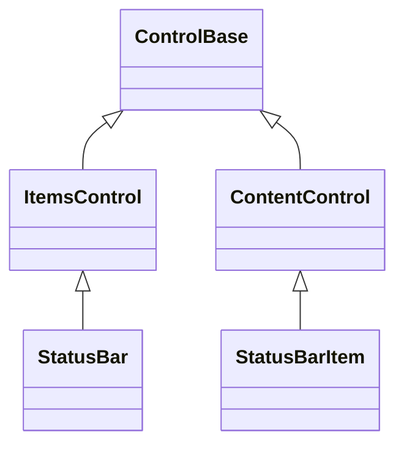
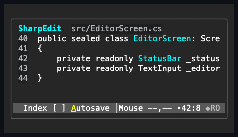

# StatusBar and StatusBarItem

## Overview

`StatusBar` is a persistent horizontal strip for useful, non-critical state
about the current application context. Applications conventionally place it at
the bottom edge of a primary screen with
`Dock.SetSide(statusBar, DockSide.Bottom)`. It is not a second menu or command
bar, and it must not be the only place an application communicates an error or
an action that requires attention.

`Spacing` intentionally remains an owner-authored synchronization transaction
rather than a retained-part forwarding bridge: it invalidates measure and
updates the private host before the still-current owner notification, while the
host never originates an independent spacing change.

The design follows the established desktop status-bar model: a horizontal area
split into multiple status parts, showing concise current-window and contextual
information. The
[Windows status-bar control](https://learn.microsoft.com/en-us/windows/win32/controls/status-bars)
defines the conventional bottom-edge, multi-part surface, while the
[Windows status-bar design guidance](https://learn.microsoft.com/en-us/windows/win32/uxguide/ctrl-status-bars)
distinguishes useful background context from critical notifications and
toolbars. For a terminal-specific point of comparison,
[Terminal.Gui StatusBar](https://gui-cs.github.io/Terminal.Gui/api/Terminal.Gui.Views.StatusBar.html)
also models a context-sensitive bottom bar.

`StatusBar` holds a typed `StatusBarItemCollection` of `StatusBarItem` values
through `Items`; `StatusBarItem` hosts one caller-supplied `Content` control
through the ordinary [`ContentControl`](../content-control.md#overview) role.
Neither type draws terminal protocol bytes, and neither participates in Tab
navigation by default.

## Inheritance



## API

### StatusBar

`StatusBar` has no `Style`/`ActualStyle` and no dedicated style record: it draws
no chrome of its own beyond what `ControlBase` already provides, so every
per-part presentation lives on `StatusBarItem` instead.

| Member    | Type                      | Default | Description                                                                                                                                                                                   |
| --------- | ------------------------- | ------- | --------------------------------------------------------------------------------------------------------------------------------------------------------------------------------------------- |
| `Items`   | `StatusBarItemCollection` | Empty   | Typed collection accepting only detached `StatusBarItem` instances; rejects duplicates, cycles, and cross-parent insertion.                                                                   |
| `Spacing` | `int`                     | `1`     | Non-negative terminal cells between adjacent visible items; rejects a negative value. The retained host is synchronized before the property publishes, and a reentrant newer value owns both. |

`Items` supports `Add`, `Insert`, `Remove`, `RemoveAt`, `Move`, `IndexOf`,
`Clear`, a settable indexer, and enumeration. Removing, clearing, or replacing
an item detaches it without disposing it; disposing the bar disposes any items
it still owns. `Move` preserves continuous ownership and attachment of the same
item identity; it does not synthesize parent or focus lifecycle changes.

### StatusBarItem

| Member                                        | Type                     | Default                       | Description                                                                                                                               |
| --------------------------------------------- | ------------------------ | ----------------------------- | ----------------------------------------------------------------------------------------------------------------------------------------- |
| `Alignment`                                   | `StatusBarItemAlignment` | `StatusBarItemAlignment.Left` | The physical edge group that owns this item during horizontal layout; rejects an unknown value.                                           |
| `ShowLeftSeparator`, `ShowRightSeparator`     | `bool`                   | `false`                       | Whether a separator is drawn on that side. Reserves exactly one cell in measure and arrange when `true`.                                  |
| `LeftSeparator`, `RightSeparator`             | `Rune?`                  | `null`                        | Optional per-item glyph override for that side; ignored unless the matching `Show*Separator` is `true`.                                   |
| `ActualLeftSeparator`, `ActualRightSeparator` | `Rune`                   | —                             | Read-only; the glyph actually drawn — the override above when assigned, otherwise `ActualStyle.LeftSeparatorGlyph`/`RightSeparatorGlyph`. |
| `Style`                                       | `StatusBarItemStyle?`    | `null`                        | Optional complete developer-authored presentation.                                                                                        |
| `ActualStyle`                                 | `StatusBarItemStyle`     | Resolved                      | Read-only; the complete local, theme-owned, or code-owned presentation.                                                                   |

A non-null `LeftSeparator` or `RightSeparator` value must be printable and
exactly one cell wide under the default Unicode width policy; a control or wide
glyph throws `ArgumentException` before any state changes, whether or not the
matching `Show*Separator` is set. Under a negotiated wide ambiguous-width
policy, fixed separator chrome that no longer occupies one cell renders with the
portable `|` fallback rather than overwriting an adjacent cell.

Presence and appearance of each separator are separate, independently settable
facts: whether a separator exists reserves a cell and is layout, which the item
owns; which glyph it draws is presentation, which the theme owns.

## Keyboard

| Key | Behavior                                                |
| --- | ------------------------------------------------------- |
| —   | This control has no control-specific keyboard commands. |

## Separator presentation

`StatusBarItemStyle`, reached through `Style`/`ActualStyle`, owns the required
validated one-cell `LeftSeparatorGlyph` and `RightSeparatorGlyph`, alongside the
inherited `Face`/`Border`/`Shadow`. Both default to
`StatusBarSeparatorGlyphs.Bar`. `StatusBarSeparatorGlyphs` supplies these
predefined values:

| Member       | Glyph | Intended use                                   |
| ------------ | ----- | ---------------------------------------------- |
| `Whitespace` | ` `   | Quiet separation without visible ink           |
| `Bar`        | `│`   | Strong boundary between status parts (default) |
| `Bullet`     | `•`   | Compact contextual grouping                    |
| `Chevron`    | `›`   | Directional or hierarchical context            |
| `Diamond`    | `◆`   | Distinct mode or environment marker            |

An application whose visual language needs a different one-cell separator can
assign any other `Rune` that passes the same validation. StatusBarItem declares
no `styles.*` theme key of its own, so a locally assigned `Style`'s
`LeftSeparatorGlyph`/`RightSeparatorGlyph` is the only way to move these away
from their code-owned defaults.

## Defaults and appearance

`StatusBar` defaults to a one-cell fixed height, stretched horizontal alignment,
the theme's `SemanticColor.Bar` background, and one cell of inter-item spacing.
It stays hit-testable so ordinary routed pointer events can be observed, but it
is not focusable and is not a Tab stop. `StatusBarItem` is also non-focusable by
default. Interactive retained content keeps its own normal input and focus
behavior.

The inherited `Face` remains theme-owned: Bar supplies the one continuous
background plane, while the shared control appearance supplies foreground and
state overlays. Framework-owned backgrounds on `StatusBarItem` and all retained
descendants become transparent inside that plane, so nested layouts, passive
content, a playing `Spinner`, and an interactive `CheckBox` do not create
control-colored rectangles. Physical hover and disablement change ink and
decorations without replacing the Bar fill.

A locally assigned complete `Face` or `Style`, or a local state overlay that
authors a background, remains authoritative for that control. This lets an
application deliberately place a contrasting badge or input surface in a status
item without losing it to ambient composition. Descendants without such local
background authoring continue to reveal the nearest painted surface.

Applications may change the inherited control appearance, height, padding,
border, and shadow properties. Multi-line or taller retained content is clipped
by the one-cell bar unless the application explicitly requests a taller
`Height`. Built-in interactive content owns its theme-safe state presentation,
so a retained `CheckBox` or other standard control needs no child appearance
configuration. Custom controls remain responsible for the shared
[visual-state contrast contract](../../concepts/styling.md#visual-states).

## Layout and clipping

Visible left-aligned items keep their collection order from the leading edge,
and visible right-aligned items keep their collection order as a group at the
trailing edge. Alignment does not partition the public collection, so
application code can update or enumerate status items in one semantic order.

The trailing group reserves its natural width before the leading group is
arranged. When width is constrained, the rightmost trailing items keep their
space first; earlier trailing items receive partial or zero-width slots, and
leading items get only whatever cells remain. All child bounds stay contained by
the bar. This keeps compact mode and position indicators stable while a longer
descriptive message yields first. Collapsed items consume neither width nor
spacing, and the shared arrange pipeline clears their previously committed
bounds; hidden items retain their layout space under the shared visibility
contract.

Within one item, the left separator receives the first available cell, the right
separator receives the last distinct available cell, and retained content uses
the cells between them. At a one-cell width with both `Show*Separator` flags
set, only the left separator renders; content and the right separator receive
zero width.

Measure returns the sum of visible item outer widths plus spacing, with the
maximum visible outer height; the arithmetic saturates at `int.MaxValue`.
Arrangement responds to item content, margin, visibility, alignment, spacing,
and viewport changes through the normal measure/arrange invalidation path.

## Example



```csharp
var status = new StatusBar();
status.Items.Add(new StatusBarItem
{
    Content = new Text("Ready")
});
status.Items.Add(new StatusBarItem
{
    Alignment = StatusBarItemAlignment.Right,
    ShowLeftSeparator = true,
    Content = new Text("UTF-8")
});
status.Items.Add(new StatusBarItem
{
    Alignment = StatusBarItemAlignment.Right,
    ShowLeftSeparator = true,
    LeftSeparator = StatusBarSeparatorGlyphs.Bullet,
    Content = new Text("Ln 12, Col 8")
});
status.Items.Add(new StatusBarItem
{
    Alignment = StatusBarItemAlignment.Right,
    Content = new CheckBox { Text = "Autosave" }
});
status.Items.Add(new StatusBarItem
{
    Alignment = StatusBarItemAlignment.Right,
    IsEnabled = false,
    Content = new Text("RO")
});

Dock.SetSide(status, DockSide.Bottom);
```

## Expected behavior

| Scope      | Observable evidence                                            |
| ---------- | -------------------------------------------------------------- |
| Public API | Validation, defaults, state changes, and deterministic output. |

- Defaults, validation before mutation, typed ownership, and detached reuse
  behave as documented; the collection accepts only detached `StatusBarItem`
  instances.
- Mixed collection order, left and right edge anchoring, spacing, alignment
  mutation, zero and tiny widths, and trailing-item priority all resolve as
  described, down to exact mounted cells.
- The separator presets and their validation, separator measurement, and
  clipping behave as documented; the item stays out of focus and Tab order while
  still observing pointer events, and interactive retained content keeps its own
  input and focus behavior.
- The showcase includes ordinary document status, right-aligned mode and
  position parts, a disabled read-only indicator, a playing activity spinner, a
  live pointer-coordinate item, and a retained CheckBox inside a full editor
  workspace. Its surface tests show that nested default content keeps one
  continuous Bar background through normal, hover, focus, checked, and disabled
  states, that a locally authored child background still wins, and that
  transient activity copy preserves the adjacent branch geometry.
